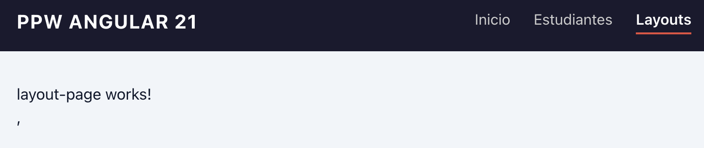
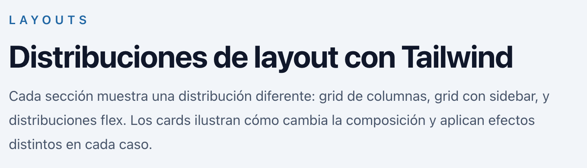
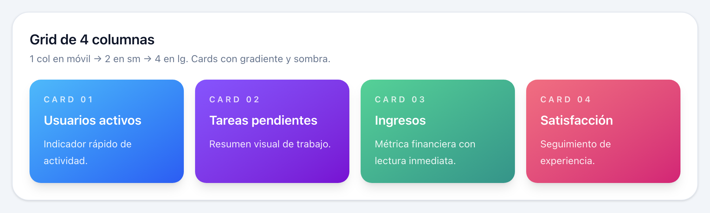
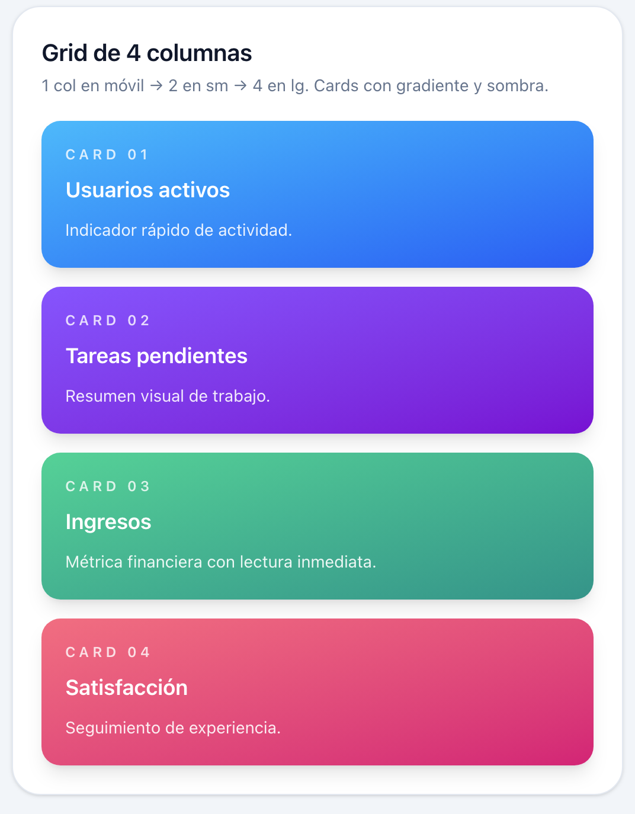
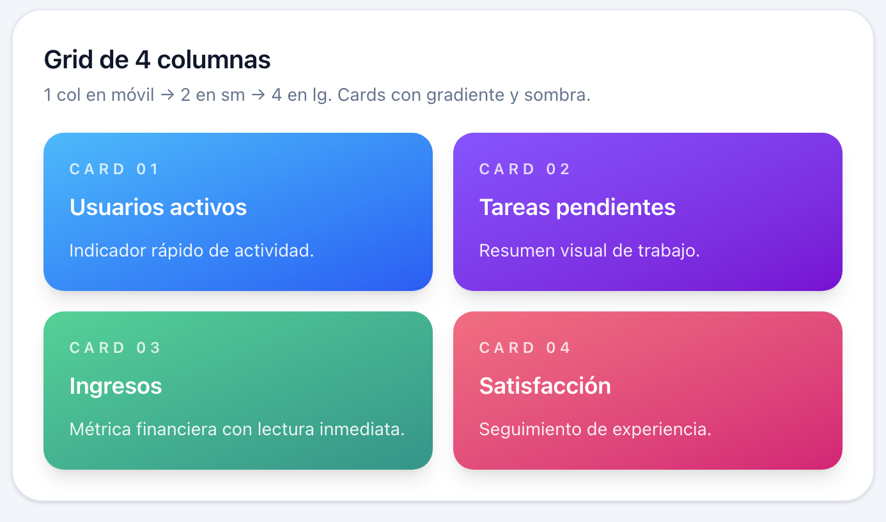
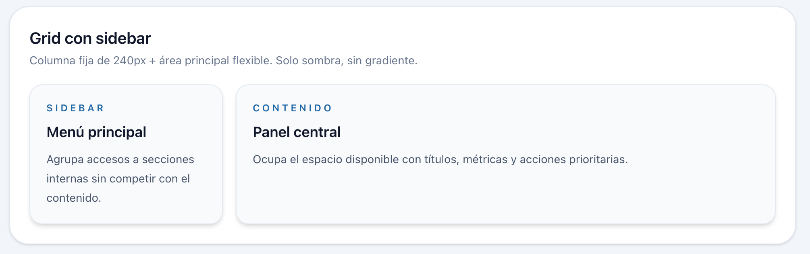
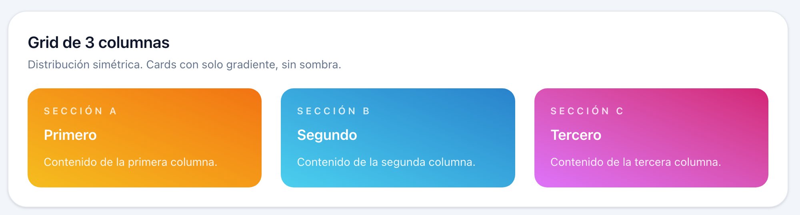
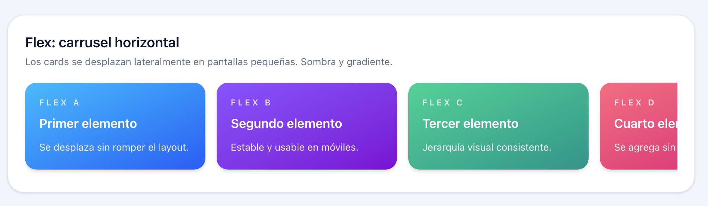
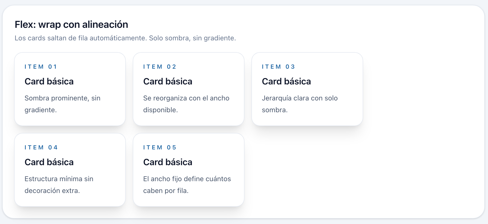

# Programación y Plataformas Web

# Frameworks Web: Angular 21 + TailwindCSS

<div align="center">
  
  <span style="font-size: 80px; color: black; margin: 20px 20px;">+</span>
  
</div>

## 04. Estilos y Layout con Tailwind - Práctica

### Autor

**Pablo Torres**  
📧 [ptorresp@ups.edu.ec](mailto:ptorresp@ups.edu.ec)  
💻 GitHub: [PabloT18](https://github.com/PabloT18)

---

## 1. Objetivo

Aplicar estilos con TailwindCSS en las páginas que ya existen en el proyecto — `HomePage`, `StudentsPage` y `StudentDetailPage` — reemplazando las clases CSS propias por utilidades Tailwind. Además, se crea una nueva página `LayoutsPage` para explorar diferentes distribuciones de layout (grid y flex) usando cards estilizadas con efectos de sombra y gradiente.

---

## 2. Páginas que se trabajan

- `HomePage` — ya existe, se le aplican estilos Tailwind.
- `StudentsPage` — ya existe, se le aplican estilos Tailwind.
- `StudentDetailPage` — ya existe, se le aplican estilos Tailwind.
- `LayoutsPage` — se crea en esta práctica para explorar distribuciones de layout.

---

## 3. Archivos que se crean o modifican

**Base global:**

- `src/styles.css` — configuración global de Tailwind
- `src/app/app.html` — shell principal: se reemplaza la clase `.app-shell` por utilidades Tailwind
- `src/app/app.css` — se simplifica: ya no contiene la regla `.app-shell`
- `src/app/app.routes.ts` — se agrega la ruta `layouts`

**Feature layouts (nueva):**

- `src/app/features/layouts/pages/layouts-page.ts`
- `src/app/features/layouts/pages/layouts-page.html`

**Páginas existentes (solo HTML):**

- `src/app/features/home/pages/home-page.html`
- `src/app/features/home/pages/home-page.css` — se vacía
- `src/app/features/students/pages/students-page.html`
- `src/app/features/students/pages/students-page.css` — se vacía
- `src/app/features/students/pages/student-detail-page.html`
- `src/app/features/students/pages/student-detail-page.css` — se vacía

---

## 4. Base global Tailwind

### 4.1 `styles.css`

> Ver referencia completa: [files/styles.css](files/styles.css)

Este archivo importa Tailwind, define los tokens de color de la marca y establece los estilos base del proyecto:

- **`@import "tailwindcss"`** — habilita todas las utilidades, variantes responsive y estados de interacción.
- **`@theme`** — centraliza los tokens de color del proyecto (`--color-brand`, `--color-brand-strong`) para usarlos como clases (`bg-brand`, `text-brand`, etc.) y evitar valores hardcodeados repetidos.
- **`@layer base`** — aplica estilos globales al `body` usando `@apply` con utilidades Tailwind: fondo, color de texto y suavizado de fuentes.

> El código completo ya está en el archivo referenciado. No es necesario repetirlo aquí.

---

## 5. Shell principal: `app.html` y `app.css`

El shell raíz del módulo anterior usaba la clase `.app-shell` definida en `app.css`. Ahora esa clase se elimina y sus propiedades se expresan directamente como utilidades Tailwind sobre el elemento `<main>`.

### Estado original

**`app.html`:**

```html
<app-header />

<main class="app-shell">
  <router-outlet />
</main>

<app-footer />
```

**`app.css`** (se borra todo el contenido del css):

```css
.app-shell {
  flex: 1;
  width: 100%;
  max-width: 900px;
  margin: 0 auto;
  padding: 1.5rem 1rem;
}
```

### `app.html` con utilidades Tailwind

Cada propiedad CSS de `.app-shell` se convierte en una clase de utilidad directamente en el elemento:

```html
<!--
  flex            → display: flex
  min-h-screen    → min-height: 100vh
  flex-col        → flex-direction: column
  bg-slate-100    → fondo gris claro usando la paleta slate de Tailwind

  Este contenedor principal permite:
  - mantener el footer abajo cuando hay poco contenido
  - hacer crecer el main automáticamente
  - distribuir header, contenido y footer verticalmente
-->
<div class="flex min-h-screen flex-col bg-slate-100">

  <app-header />

  <!--
    flex-1       → flex: 1 (ocupa el espacio restante entre header y footer)
    mx-auto      → margin-left/right: auto (centra horizontalmente)
    w-full       → width: 100%
    max-w-5xl    → ancho máximo responsive (~1024px)
    px-6         → padding horizontal: 1.5rem
    py-8         → padding vertical: 2rem

    Este main contiene el router-outlet y limita el ancho del contenido
    para mejorar la legibilidad en pantallas grandes.
  -->
  <main class="flex-1 mx-auto w-full max-w-5xl px-6 py-8">
    <router-outlet />
  </main>

  <app-footer />

</div>
```

### Clases aplicadas y su equivalente CSS

| Clase Tailwind | CSS equivalente | Descripción |
|---|---|---|
| `flex` | `display: flex` | Convierte el contenedor principal en un contenedor flexible. |
| `min-h-screen` | `min-height: 100vh` | Hace que el layout ocupe como mínimo toda la altura de la pantalla. |
| `flex-col` | `flex-direction: column` | Organiza el header, main y footer en columna. |
| `bg-slate-100` | `background-color: ...` | Aplica un fondo gris claro usando la paleta `slate` de Tailwind. |
| `flex-1` | `flex: 1 1 0%` | Hace que el `<main>` crezca para ocupar el espacio disponible entre header y footer. |
| `mx-auto` | `margin-left: auto; margin-right: auto` | Centra el `<main>` horizontalmente. |
| `w-full` | `width: 100%` | Hace que el `<main>` ocupe todo el ancho disponible del contenedor padre. |
| `max-w-5xl` | `max-width: 64rem` | Limita el ancho máximo del contenido. |
| `px-6` | `padding-left: 1.5rem; padding-right: 1.5rem` | Agrega padding horizontal. |
| `py-8` | `padding-top: 2rem; padding-bottom: 2rem` | Agrega padding vertical. |


---

## 6. `HomePage`

La `HomePage` tenía una sección con clase `.home-page` y un contenedor de acciones `.home-page__actions`. Se reemplaza toda esa estructura con utilidades Tailwind. El botón original con `btn-primary` se conserva; se agrega un segundo botón completamente en Tailwind para comparar ambos enfoques.

### Estado original

**`home-page.html`:**

```html
<section class="home-page">

  <!-- Componente hero reutilizado del módulo 02 -->
  <app-hero />

  <!-- Contenedor de acciones de la página -->
  <div class="home-page__actions">
    <button class="btn-primary" (click)="goToStudentsPage()">
      Ver Estudiantes →
    </button>
  </div>

</section>
```

**`home-page.css`:**

```css
/* Apila el hero y el botón verticalmente con espacio entre ellos */
.home-page {
  display: flex;
  flex-direction: column;
  gap: 2rem;
}

/* Centra el botón horizontalmente */
.home-page__actions {
  display: flex;
  justify-content: center;
  padding: 1rem 0;
}
```

### Cambios a aplicar

La clase `.home-page` se reemplaza por `space-y-8` en el `<section>`. La clase `.home-page__actions` se reemplaza por utilidades en el `<div>`. Se conserva el botón con `btn-primary` y se agrega un segundo botón con clases Tailwind para contrastar los dos enfoques.

### `home-page.html` con Tailwind

```html
<!--
  space-y-8: aplica margin-top: 2rem a cada hijo directo (excepto el primero).
  Crea ritmo vertical entre el hero y la sección de acciones.
  Reemplaza: display:flex; flex-direction:column; gap:2rem
-->
<section class="space-y-8">

  <app-hero />

  <!--
    flex: activa Flexbox en el contenedor de botones.
    justify-center: centra los botones horizontalmente.
    gap-4: espacio de 1rem entre los dos botones.
    py-4: padding vertical de 1rem (reemplaza padding: 1rem 0).
  -->
  <div class="flex justify-center gap-4 py-4">

    <!-- Botón original con clase CSS propia (se conserva sin cambios) -->
    <button class="btn-primary" (click)="goToStudentsPage()">
      Ver Estudiantes →
    </button>

             <!--
        rounded-md     → border-radius cercano a 6px
        border-2       → border: 2px
        border-brand   → border-color: #0f4c81
        bg-transparent → background: transparent
        text-brand     → color: #0f4c81
        px-5           → padding horizontal: 1.25rem
        py-2.5         → padding vertical: 0.625rem
        font-medium    → font-weight: 500
        w-fit          → width: fit-content
        duration-200   → transition: 200ms
        hover:bg-brand → fondo azul al pasar el cursor
        hover:text-white → texto blanco al pasar el cursor
        -->
        <button
            type="button"
            class="w-fit rounded-md border-2 border-brand bg-transparent px-5 py-2.5 font-medium text-brand transition-colors duration-200 hover:bg-brand hover:text-white cursor-pointer"

        >
            Ver Estudiantes →
        </button>

  </div>

</section>
```

> Ambos botones producen el mismo resultado funcional. El botón con `btn-primary` depende de una clase en `styles.css`; el botón Tailwind lleva toda su presentación en el HTML.

### Clases nuevas en esta sección

| Clase | Descripción |
|---|---|
| `space-y-8` | Margen superior de 2rem entre hijos directos. Ritmo vertical sin flex manual. |
| `flex` | Activa Flexbox en el contenedor. |
| `justify-center` | Centra los items en el eje principal (horizontal). |
| `gap-4` | Espacio de 1rem entre los items del flex. |
| `py-4` | Padding vertical de 1rem. |
| `rounded-lg` | Border-radius de 0.5rem. |
| `bg-brand` | Fondo con el token de color de marca (`#0f4c81`). |
| `text-white` | Color de texto blanco. |
| `px-5` | Padding horizontal de 1.25rem. |
| `py-2.5` | Padding vertical de 0.625rem. |
| `font-medium` | Font-weight 500. |
| `shadow-md` | Sombra mediana. |
| `transition-colors` | Anima solo los cambios de color. |
| `hover:bg-brand-strong` | Fondo más oscuro al pasar el cursor. |
| `cursor-pointer` | Muestra el cursor de mano. |

### CSS que ya no es necesario

Las reglas `.home-page` y `.home-page__actions` en `home-page.css` quedan reemplazadas. El archivo se puede vaciar. La clase `btn-primary` se conserva porque el primer botón aún la usa.

---

## 7. `StudentsPage`

La `StudentsPage` tenía una lista `<ul>` con clases CSS para el contenedor, los ítems y los estados hover. Se convierte a cards con utilidades Tailwind.

### Estado original


### `students-page.html` con Tailwind

```html
<!--
  space-y-4: ritmo vertical de 1rem entre los elementos de la sección.
-->
<section class="space-y-4">

  <!--
    text-3xl       → font-size: 1.875rem
    font-bold      → font-weight: 700
    tracking-tight → letter-spacing ligeramente negativo (mejora legibilidad en títulos grandes)
    text-slate-900 → color casi negro (#0f172a)
  -->
  <h1 class="text-3xl font-bold tracking-tight text-slate-900">Estudiantes</h1>

  <!--
    text-slate-600: gris medio con contraste suficiente sin competir con el título.
  -->
  <p class="text-slate-600">Selecciona un estudiante para ver su detalle.</p>

  <!--
    flex flex-col gap-3: apila los ítems verticalmente con 0.75rem de separación.
    list-none p-0: elimina bullets y padding por defecto del <ul>.
  -->
  <ul class="flex flex-col gap-3 list-none p-0">

    @for (student of students(); track student.id) {
      <li>
        <!--
          block          → toda el área del ítem es zona de clic
          px-4 py-3      → padding horizontal 1rem, vertical 0.75rem
          bg-white       → fondo blanco
          border border-slate-200 → borde 1px sólido gris claro
          rounded-lg     → border-radius: 0.5rem
          text-brand     → color del token de marca (azul)
          no-underline   → quita el subrayado por defecto del enlace
          transition     → activa animación en todas las propiedades que cambian
          hover:bg-slate-50  → fondo muy claro al pasar el cursor
          hover:border-brand → borde en color de marca en hover
        -->
        <a
          class="block px-4 py-3 bg-white border border-slate-200 rounded-lg text-brand no-underline font-medium transition hover:bg-slate-50 hover:border-brand"
          [routerLink]="['/students', student.id]"
        >
          {{ student.name }}
        </a>
      </li>
    } @empty {
      <!--
        italic text-slate-500: distingue el estado vacío del contenido real.
      -->
      <li class="italic text-slate-500">No hay estudiantes disponibles.</li>
    }

  </ul>
</section>
```

### Clases nuevas en esta sección

| Clase | Descripción |
|---|---|
| `space-y-4` | Margen superior de 1rem entre hijos directos. |
| `text-3xl` | Font-size: 1.875rem. |
| `font-bold` | Font-weight: 700. |
| `tracking-tight` | Letter-spacing negativo leve, mejora legibilidad en títulos. |
| `text-slate-900` | Color casi negro (#0f172a). |
| `text-slate-600` | Gris medio para textos secundarios. |
| `flex-col` | Dirección de flex: columna. |
| `gap-3` | Espacio de 0.75rem entre items. |
| `list-none p-0` | Quita bullets y padding del `<ul>`. |
| `block` | Display block: toda el área del ítem es clickeable. |
| `px-4 py-3` | Padding horizontal 1rem, vertical 0.75rem. |
| `bg-white` | Fondo blanco. |
| `border border-slate-200` | Borde 1px sólido gris claro. |
| `text-brand` | Color del token de marca. |
| `no-underline` | Quita el subrayado por defecto del enlace. |
| `transition` | Anima todas las propiedades que cambian. |
| `hover:bg-slate-50` | Fondo muy claro en hover. |
| `hover:border-brand` | Borde en color de marca en hover. |
| `italic text-slate-500` | Estilo del estado vacío. |

### CSS que ya no es necesario

Todas las reglas de `students-page.css` quedan reemplazadas. El archivo se puede vaciar.

---

## 8. `StudentDetailPage`

La `StudentDetailPage` mostraba el ID del estudiante en una caja con acento izquierdo y un botón de retorno tipo outline. Se aplican los mismos efectos visuales con utilidades Tailwind.

### `student-detail-page.html` con Tailwind

```html
<!--
  flex flex-col: disposición vertical.
  gap-5: espacio de 1.25rem entre los elementos (reemplaza gap: 1.25rem).
-->
<section class="flex flex-col gap-5">

  <h1 class="text-3xl font-bold tracking-tight text-slate-900">Detalle del estudiante</h1>

  <!--
    bg-white          → fondo blanco de la caja
    px-4 py-3         → padding interno
    rounded-lg        → bordes redondeados
    border border-slate-200 → borde exterior sutil
    border-l-4        → borde izquierdo de 4px (el acento visual)
    border-l-brand    → color del acento = token de marca
    text-slate-900    → texto oscuro
  -->
  <p class="bg-white px-4 py-3 rounded-lg border border-slate-200 border-l-4 border-l-brand text-slate-900">
    ID recibido por la ruta: <strong>{{ id }}</strong>
  </p>

  <!--
    inline-block w-fit → el enlace no ocupa todo el ancho (reemplaza width:fit-content)
    border-2 border-brand → borde outline de 2px con color de marca
    text-brand        → texto del mismo color que el borde
    px-5 py-2         → padding interno del botón
    rounded-md        → border-radius de 0.375rem
    no-underline      → quita el subrayado del <a>
    hover:bg-brand hover:text-white → "fill effect": el fondo se rellena al hacer hover
  -->
  <a
    class="inline-block w-fit border-2 border-brand text-brand px-5 py-2 rounded-md no-underline font-medium transition hover:bg-brand hover:text-white"
    routerLink="/students"
  >
    ← Volver al listado
  </a>

</section>
```

### Clases nuevas en esta sección

| Clase | Descripción |
|---|---|
| `gap-5` | Espacio de 1.25rem entre elementos de un flex o grid. |
| `border-l-4` | Borde izquierdo de 4px (el acento visual característico). |
| `border-l-brand` | Color del borde izquierdo usando el token de marca. |
| `inline-block w-fit` | El elemento solo ocupa el ancho de su contenido. |
| `border-2 border-brand` | Borde outline de 2px en color de marca. |
| `rounded-md` | Border-radius de 0.375rem. |
| `hover:bg-brand hover:text-white` | "Fill effect": fondo y texto invierten al hover. |

### CSS que ya no es necesario

Todas las reglas de `student-detail-page.css` quedan reemplazadas. El archivo se puede vaciar.

---

## 9. `LayoutsPage`

Esta página se crea en esta práctica. Su propósito es mostrar en acción diferentes distribuciones de layout con Tailwind, usando cards como unidad visual. Cada sección usa una distribución distinta y aplica efectos diferentes disponibles.

### 9.1 Crear el componente

**`layouts-page.ts`:**

> Ver referencia: [files/layouts-page.ts](files/layouts-page.ts)


### 9.2 Registrar la ruta

En `app.routes.ts`, agregar la importación y la ruta `layouts`

Agregar en navbar el enlace en `header.html`:



### 9.3 Estructura base de la página (`layouts-page.html`)

```html
<!--
  space-y-10: ritmo vertical generoso (2.5rem) entre secciones.
-->
<section class="space-y-10">

  <!-- Encabezado de la página -->
  <header class="space-y-3">
    <!--
      text-sm        → font-size: 0.875rem
      font-semibold  → font-weight: 600
      uppercase      → text-transform: uppercase
      tracking-[0.3em] → letter-spacing arbitrario (0.3em)
      text-sky-700   → azul intenso para etiqueta de categoría
    -->
    <p class="text-sm font-semibold uppercase tracking-[0.3em] text-sky-700">Layouts</p>

    <!--
      md:text-4xl: escala tipográfica en pantallas medianas (≥768px).
    -->
    <h1 class="text-3xl font-bold tracking-tight text-slate-900 md:text-4xl">
      Distribuciones de layout con Tailwind
    </h1>

    <!--
      max-w-2xl: limita el ancho del párrafo para mejor legibilidad.
      leading-7: line-height: 1.75rem.
    -->
    <p class="max-w-2xl leading-7 text-slate-600">
      Cada sección muestra una distribución diferente: grid de columnas, grid con sidebar,
      y distribuciones flex. Los cards ilustran cómo cambia la composición y aplican
      efectos distintos en cada caso.
    </p>
  </header>

  <!-- Las secciones de grid y flex se agregan aquí -->

</section>
```

**Clases nuevas en esta sección:**

| Clase | Descripción |
|---|---|
| `space-y-10` | Margen superior de 2.5rem entre hijos directos. |
| `space-y-3` | Margen superior de 0.75rem entre hijos directos. |
| `text-sm` | Font-size: 0.875rem. |
| `font-semibold` | Font-weight: 600. |
| `uppercase` | Transforma el texto a mayúsculas. |
| `tracking-[0.3em]` | Letter-spacing arbitrario de 0.3em. |
| `text-sky-700` | Azul intenso para etiquetas de categoría. |
| `md:text-4xl` | Font-size 2.25rem en pantallas ≥ 768px. |
| `max-w-2xl` | Ancho máximo de 42rem para el párrafo. |
| `leading-7` | Line-height: 1.75rem. |




---

### 9.4 Grid de 4 columnas: sombra y gradiente

La primera distribución es un grid responsivo de hasta 4 columnas. Los cards combinan gradiente de fondo y sombra para mayor profundidad visual.

```html
<!--
  rounded-3xl border border-slate-200 bg-white p-6 shadow-sm:
  contenedor de sección con fondo blanco, borde sutil y sombra ligera.
-->
<article class="rounded-3xl border border-slate-200 bg-white p-6 shadow-sm">
  <h2 class="mb-1 text-xl font-semibold text-slate-900">Grid de 4 columnas</h2>
  <p class="mb-5 text-sm text-slate-500">1 col en móvil → 2 en sm → 4 en lg. Cards con gradiente y sombra.</p>

  <!--
    grid      → activa CSS Grid
    gap-4     → espacio de 1rem entre celdas
    sm:grid-cols-2  → 2 columnas en pantallas ≥ 640px
    lg:grid-cols-4  → 4 columnas en pantallas ≥ 1024px
  -->
  <div class="grid gap-4 sm:grid-cols-2 lg:grid-cols-4">

    <!--
      bg-gradient-to-br  → gradiente diagonal (arriba-izquierda → abajo-derecha)
      from-sky-400 to-blue-600 → de celeste a azul
      shadow-lg  → sombra grande con mayor difuminado
      text-white → texto blanco sobre el gradiente oscuro
      p-5        → padding interno de 1.25rem
      rounded-2xl → border-radius: 1rem
    -->
    <article class="rounded-2xl bg-gradient-to-br from-sky-400 to-blue-600 p-5 shadow-lg text-white">
      <!--
        opacity-80: opacidad del 80% sobre el texto de etiqueta.
      -->
      <p class="text-xs font-semibold uppercase tracking-[0.25em] opacity-80">Card 01</p>
      <h3 class="mt-2 text-lg font-semibold">Usuarios activos</h3>
      <p class="mt-2 text-sm leading-6 opacity-90">Indicador rápido de actividad.</p>
    </article>

    <!-- from-violet-500 to-purple-700: gradiente de violeta a morado -->
    <article class="rounded-2xl bg-gradient-to-br from-violet-500 to-purple-700 p-5 shadow-lg text-white">
      <p class="text-xs font-semibold uppercase tracking-[0.25em] opacity-80">Card 02</p>
      <h3 class="mt-2 text-lg font-semibold">Tareas pendientes</h3>
      <p class="mt-2 text-sm leading-6 opacity-90">Resumen visual de trabajo.</p>
    </article>

    <!-- from-emerald-400 to-teal-600: gradiente verde esmeralda a teal -->
    <article class="rounded-2xl bg-gradient-to-br from-emerald-400 to-teal-600 p-5 shadow-lg text-white">
      <p class="text-xs font-semibold uppercase tracking-[0.25em] opacity-80">Card 03</p>
      <h3 class="mt-2 text-lg font-semibold">Ingresos</h3>
      <p class="mt-2 text-sm leading-6 opacity-90">Métrica financiera con lectura inmediata.</p>
    </article>

    <!-- from-rose-400 to-pink-600: gradiente rosado -->
    <article class="rounded-2xl bg-gradient-to-br from-rose-400 to-pink-600 p-5 shadow-lg text-white">
      <p class="text-xs font-semibold uppercase tracking-[0.25em] opacity-80">Card 04</p>
      <h3 class="mt-2 text-lg font-semibold">Satisfacción</h3>
      <p class="mt-2 text-sm leading-6 opacity-90">Seguimiento de experiencia.</p>
    </article>

  </div>
</article>
```

**Clases nuevas en esta sección:**

| Clase | Descripción |
|---|---|
| `rounded-3xl` | Border-radius: 1.5rem (esquinas muy redondeadas). |
| `border border-slate-200` | Borde 1px sólido gris claro. |
| `shadow-sm` | Sombra muy ligera (contenedor de sección). |
| `text-xl` | Font-size: 1.25rem. |
| `mb-1` / `mb-5` | Margin-bottom de 0.25rem / 1.25rem. |
| `text-slate-500` | Gris para subtítulos secundarios. |
| `grid` | Activa CSS Grid. |
| `gap-4` | Espacio de 1rem entre celdas del grid. |
| `sm:grid-cols-2` | 2 columnas en pantallas ≥ 640px. |
| `lg:grid-cols-4` | 4 columnas en pantallas ≥ 1024px. |
| `bg-gradient-to-br` | Gradiente diagonal de arriba-izquierda a abajo-derecha. |
| `from-sky-400 to-blue-600` | Color inicial y final del gradiente. |
| `shadow-lg` | Sombra grande con mayor difuminado. |
| `rounded-2xl` | Border-radius: 1rem. |
| `p-5` | Padding interno de 1.25rem. |
| `text-xs` | Font-size: 0.75rem. |
| `tracking-[0.25em]` | Letter-spacing arbitrario de 0.25em. |
| `opacity-80` | Opacidad del 80%. |
| `mt-2` | Margin-top de 0.5rem. |
| `text-lg` | Font-size: 1.125rem. |
| `leading-6` | Line-height: 1.5rem. |
| `opacity-90` | Opacidad del 90%. |







---

### 9.5 Grid con sidebar: solo sombra, sin gradiente

Layout clásico de panel administrativo: columna fija de 240px + área principal flexible. Esta sección usa solo sombra para contrastar con la anterior.

```html
<article class="rounded-3xl border border-slate-200 bg-white p-6 shadow-sm">
  <h2 class="mb-1 text-xl font-semibold text-slate-900">Grid con sidebar</h2>
  <p class="mb-5 text-sm text-slate-500">Columna fija de 240px + área principal flexible. Solo sombra, sin gradiente.</p>

  <!--
    lg:grid-cols-[240px_minmax(0,1fr)]:
    Valor arbitrario para grid-template-columns.
    240px: columna fija para el sidebar.
    minmax(0,1fr): columna flexible que ocupa el resto disponible.
  -->
  <div class="grid gap-4 lg:grid-cols-[240px_minmax(0,1fr)]">

    <!--
      shadow-md  → sombra mediana (menor que shadow-lg)
      bg-slate-50 → fondo gris muy claro
    -->
    <aside class="rounded-2xl bg-slate-50 border border-slate-200 p-5 shadow-md">
      <p class="text-xs font-semibold uppercase tracking-[0.25em] text-sky-700">Sidebar</p>
      <h3 class="mt-2 text-lg font-semibold text-slate-900">Menú principal</h3>
      <p class="mt-2 text-sm leading-6 text-slate-600">Agrupa accesos a secciones internas sin competir con el contenido.</p>
    </aside>

    <div class="rounded-2xl bg-slate-50 border border-slate-200 p-5 shadow-md">
      <p class="text-xs font-semibold uppercase tracking-[0.25em] text-sky-700">Contenido</p>
      <h3 class="mt-2 text-lg font-semibold text-slate-900">Panel central</h3>
      <p class="mt-2 text-sm leading-6 text-slate-600">Ocupa el espacio disponible con títulos, métricas y acciones prioritarias.</p>
    </div>

  </div>
</article>
```

**Clases nuevas en esta sección:**

| Clase | Descripción |
|---|---|
| `lg:grid-cols-[240px_minmax(0,1fr)]` | Valor arbitrario: columna fija de 240px + columna flexible. |
| `shadow-md` | Sombra mediana. |
| `bg-slate-50` | Fondo gris muy claro, levemente más oscuro que `bg-white`. |
| `text-slate-600` | Gris para texto descriptivo. |



---

### 9.6 Grid de 3 columnas: solo gradiente, sin sombra

Distribución simétrica en 3 columnas. Esta sección usa solo gradiente (sin sombra) para contrastar con la sección anterior.

```html
<article class="rounded-3xl border border-slate-200 bg-white p-6 shadow-sm">
  <h2 class="mb-1 text-xl font-semibold text-slate-900">Grid de 3 columnas</h2>
  <p class="mb-5 text-sm text-slate-500">Distribución simétrica. Cards con solo gradiente, sin sombra.</p>

  <!--
    md:grid-cols-3 → 3 columnas en pantallas ≥ 768px
    gap-6          → espacio mayor entre celdas (1.5rem)
  -->
  <div class="grid gap-6 md:grid-cols-3">

    <!--
      bg-gradient-to-tr: gradiente de abajo-izquierda a arriba-derecha.
      from-amber-400 to-orange-500: gradiente cálido amarillo-naranja.
      Sin shadow: se omite la sombra para diferenciarse de los ejemplos anteriores.
    -->
    <article class="rounded-2xl bg-gradient-to-tr from-amber-400 to-orange-500 p-5 text-white">
      <p class="text-xs font-semibold uppercase tracking-[0.25em] opacity-80">Sección A</p>
      <h3 class="mt-2 text-lg font-semibold">Primero</h3>
      <p class="mt-2 text-sm leading-6 opacity-90">Contenido de la primera columna.</p>
    </article>

    <article class="rounded-2xl bg-gradient-to-tr from-cyan-400 to-sky-600 p-5 text-white">
      <p class="text-xs font-semibold uppercase tracking-[0.25em] opacity-80">Sección B</p>
      <h3 class="mt-2 text-lg font-semibold">Segundo</h3>
      <p class="mt-2 text-sm leading-6 opacity-90">Contenido de la segunda columna.</p>
    </article>

    <article class="rounded-2xl bg-gradient-to-tr from-fuchsia-400 to-pink-600 p-5 text-white">
      <p class="text-xs font-semibold uppercase tracking-[0.25em] opacity-80">Sección C</p>
      <h3 class="mt-2 text-lg font-semibold">Tercero</h3>
      <p class="mt-2 text-sm leading-6 opacity-90">Contenido de la tercera columna.</p>
    </article>

  </div>
</article>
```

**Clases nuevas en esta sección:**

| Clase | Descripción |
|---|---|
| `md:grid-cols-3` | 3 columnas en pantallas ≥ 768px. |
| `gap-6` | Espacio de 1.5rem entre celdas. |
| `bg-gradient-to-tr` | Gradiente de abajo-izquierda hacia arriba-derecha. |


---

### 9.7 Flex: carrusel horizontal con scroll

Las distribuciones flex permiten organizar items en una fila. Con `overflow-x-auto` se crea un carrusel horizontal que no rompe el layout en pantallas pequeñas. Los cards usan sombra y gradiente.

```html
<article class="rounded-3xl border border-slate-200 bg-white p-6 shadow-sm">
  <h2 class="mb-1 text-xl font-semibold text-slate-900">Flex: carrusel horizontal</h2>
  <p class="mb-5 text-sm text-slate-500">Los cards se desplazan lateralmente en pantallas pequeñas. Sombra y gradiente.</p>

  <!--
    flex            → activa Flexbox (fila por defecto)
    gap-4           → espacio entre cards
    overflow-x-auto → scroll horizontal cuando el contenido excede el ancho
    pb-2            → padding inferior para que la scrollbar no tape el contenido
  -->
  <div class="flex gap-4 overflow-x-auto pb-2">

    <!--
      min-w-[16rem] → ancho mínimo fijo (valor arbitrario) para que el card no se comprima
      shrink-0      → impide que el card se encoja dentro del flex container
    -->
    <article class="min-w-[16rem] shrink-0 rounded-2xl bg-gradient-to-br from-sky-400 to-blue-600 p-5 shadow-md text-white">
      <p class="text-xs font-semibold uppercase tracking-[0.25em] opacity-80">Flex A</p>
      <h3 class="mt-2 text-lg font-semibold">Primer elemento</h3>
      <p class="mt-2 text-sm leading-6 opacity-90">Se desplaza sin romper el layout.</p>
    </article>

    <article class="min-w-[16rem] shrink-0 rounded-2xl bg-gradient-to-br from-violet-500 to-purple-700 p-5 shadow-md text-white">
      <p class="text-xs font-semibold uppercase tracking-[0.25em] opacity-80">Flex B</p>
      <h3 class="mt-2 text-lg font-semibold">Segundo elemento</h3>
      <p class="mt-2 text-sm leading-6 opacity-90">Estable y usable en móviles.</p>
    </article>

    <article class="min-w-[16rem] shrink-0 rounded-2xl bg-gradient-to-br from-emerald-400 to-teal-600 p-5 shadow-md text-white">
      <p class="text-xs font-semibold uppercase tracking-[0.25em] opacity-80">Flex C</p>
      <h3 class="mt-2 text-lg font-semibold">Tercer elemento</h3>
      <p class="mt-2 text-sm leading-6 opacity-90">Jerarquía visual consistente.</p>
    </article>

    <article class="min-w-[16rem] shrink-0 rounded-2xl bg-gradient-to-br from-rose-400 to-pink-600 p-5 shadow-md text-white">
      <p class="text-xs font-semibold uppercase tracking-[0.25em] opacity-80">Flex D</p>
      <h3 class="mt-2 text-lg font-semibold">Cuarto elemento</h3>
      <p class="mt-2 text-sm leading-6 opacity-90">Se agrega sin cambiar el layout.</p>
    </article>

  </div>
</article>
```

**Clases nuevas en esta sección:**

| Clase | Descripción |
|---|---|
| `overflow-x-auto` | Activa scroll horizontal cuando el contenido excede el ancho. |
| `pb-2` | Padding inferior de 0.5rem (espacio para la scrollbar). |
| `min-w-[16rem]` | Ancho mínimo de 16rem (256px) para cada card (valor arbitrario). |
| `shrink-0` | Impide que el card se encoja dentro del flex container. |


---


### 9.8 Flex: wrap con alineación

`flex-wrap` permite que los cards salten a la siguiente fila cuando no hay espacio. Esta sección usa solo sombra (sin gradiente) para contrastar con el carrusel.

```html
<article class="rounded-3xl border border-slate-200 bg-white p-6 shadow-sm">
  <h2 class="mb-1 text-xl font-semibold text-slate-900">Flex: wrap con alineación</h2>
  <p class="mb-5 text-sm text-slate-500">Los cards saltan de fila automáticamente. Solo sombra, sin gradiente.</p>

  <!--
    flex-wrap   → los items pasan a la siguiente línea cuando no caben
    items-start → alinea los cards al inicio del eje cruzado (no se estiran en altura)
  -->
  <div class="flex flex-wrap gap-4 items-start">

    <!--
      w-56       → ancho fijo de 14rem (224px) — define cuántos cards caben por fila
      shadow-xl  → sombra extra grande, la más prominente de las predefinidas
      ring-1 ring-slate-200 → borde sutil alternativo a border
    -->
    <article class="w-56 rounded-2xl bg-white p-5 shadow-xl ring-1 ring-slate-200">
      <p class="text-xs font-semibold uppercase tracking-[0.25em] text-sky-700">Item 01</p>
      <h3 class="mt-2 text-lg font-semibold text-slate-900">Card básica</h3>
      <p class="mt-2 text-sm leading-6 text-slate-600">Sombra prominente, sin gradiente.</p>
    </article>

    <article class="w-56 rounded-2xl bg-white p-5 shadow-xl ring-1 ring-slate-200">
      <p class="text-xs font-semibold uppercase tracking-[0.25em] text-sky-700">Item 02</p>
      <h3 class="mt-2 text-lg font-semibold text-slate-900">Card básica</h3>
      <p class="mt-2 text-sm leading-6 text-slate-600">Se reorganiza con el ancho disponible.</p>
    </article>

    <article class="w-56 rounded-2xl bg-white p-5 shadow-xl ring-1 ring-slate-200">
      <p class="text-xs font-semibold uppercase tracking-[0.25em] text-sky-700">Item 03</p>
      <h3 class="mt-2 text-lg font-semibold text-slate-900">Card básica</h3>
      <p class="mt-2 text-sm leading-6 text-slate-600">Jerarquía clara con solo sombra.</p>
    </article>

    <article class="w-56 rounded-2xl bg-white p-5 shadow-xl ring-1 ring-slate-200">
      <p class="text-xs font-semibold uppercase tracking-[0.25em] text-sky-700">Item 04</p>
      <h3 class="mt-2 text-lg font-semibold text-slate-900">Card básica</h3>
      <p class="mt-2 text-sm leading-6 text-slate-600">Estructura mínima sin decoración extra.</p>
    </article>

    <article class="w-56 rounded-2xl bg-white p-5 shadow-xl ring-1 ring-slate-200">
      <p class="text-xs font-semibold uppercase tracking-[0.25em] text-sky-700">Item 05</p>
      <h3 class="mt-2 text-lg font-semibold text-slate-900">Card básica</h3>
      <p class="mt-2 text-sm leading-6 text-slate-600">El ancho fijo define cuántos caben por fila.</p>
    </article>

  </div>
</article>
```

**Clases nuevas en esta sección:**

| Clase | Descripción |
|---|---|
| `flex-wrap` | Los items pasan a la siguiente fila cuando no hay espacio. |
| `items-start` | Alinea los items al inicio del eje cruzado (no los estira en altura). |
| `w-56` | Ancho fijo de 14rem (224px). |
| `shadow-xl` | Sombra extra grande, la más prominente de las predefinidas. |
| `ring-1 ring-slate-200` | Borde sutil usando ring (alternativa a border, más flexible en Tailwind). |

---

### 9.9 Práctica adicional: tus propios layouts

Explora la documentación oficial de Tailwind y agrega **cuatro distribuciones adicionales** a esta página. Puedes buscar en:

- [tailwindcss.com/docs/grid-template-columns](https://tailwindcss.com/docs/grid-template-columns)
- [tailwindcss.com/docs/grid-template-rows](https://tailwindcss.com/docs/grid-template-rows)
- [tailwindcss.com/docs/flex-direction](https://tailwindcss.com/docs/flex-direction)

Para cada distribución que agregues:

1. Agrega un `<article>` nuevo al final de `layouts-page.html`.
2. Elige un tipo de layout o flex diferente a los ya mostrados.
3. Usa cards con el estilo que prefieras (gradiente, sombra, o ambos).
4. Explica brevemente en un comentario HTML qué hace el layout elegido.
5. Pner capturas de cada uno de estos con su explicación en el README del poryecto. 


---

## 10. Entregables

1. `app.html` con `<main>` usando utilidades Tailwind en lugar de la clase `.app-shell`.
2. `app.css` simplificado: solo conserva el bloque `:host`.
3. `home-page.html` con `space-y-8` y los dos botones: el original con `btn-primary` y el nuevo con clases Tailwind.
4. `students-page.html` con la lista convertida a cards con utilidades Tailwind.
5. `student-detail-page.html` con la caja de ID y el botón de retorno en Tailwind.
6. `LayoutsPage` creada y registrada con las cuatro secciones de distribución (grid 4 col, sidebar, grid 3 col, flex carrusel, flex wrap).
7. *(Práctica adicional)* Dos distribuciones adicionales en `layouts-page.html` tomadas de la documentación oficial de Tailwind.

---

## 11. Commits sugeridos

```bash
git add .
git commit -m "END: Practica 04 - Estilos y Layout con Tailwind completada"
```
