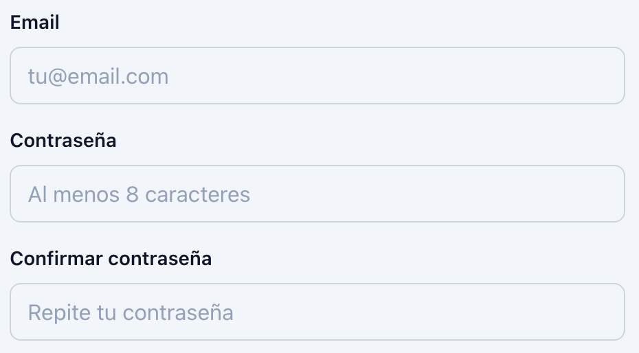
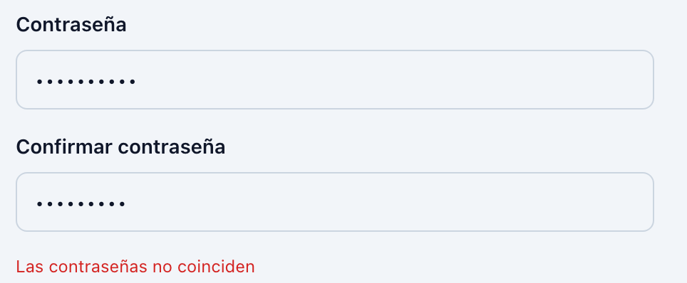
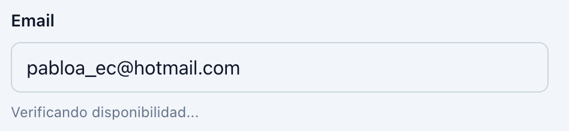
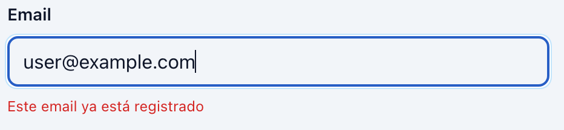

# Programación y Plataformas Web

# Frameworks Web: Angular 21 — Formularios Reactivos - Práctica

<div align="center">
  
</div>

## 05. Formularios Reactivos - Práctica

### Autor

**Pablo Torres**  
📧 [ptorresp@ups.edu.ec](mailto:ptorresp@ups.edu.ec)  
💻 GitHub: [PabloT18](https://github.com/PabloT18)

---

## 1. Objetivo

Construir una página de sign-up con formulario reactivo que demuestre validación built-in, custom (confirmación de contraseña), y async (verificación de email). Integrar el formulario con el router y mostrar cómo crece de complejidad de forma controlada.

---

## 2. Contexto de la práctica

El proyecto ya tiene rutas, layout con Tailwind y páginas funcionales. Ahora necesita un formulario **reactivo** que capture datos de usuario, valide en tiempo real y proporcione feedback claro sin CSS adicional (solo utilidades Tailwind).

La idea central: separar la **lógica del formulario** (TypeScript, validadores) de la **presentación** (template con Tailwind). El formulario vive en el código; el template solo lo refleja.

---

## 3. Archivos que se van a crear o modificar

**Nuevo módulo (signup):**
- `src/app/features/signup/pages/signup-page.ts`
- `src/app/features/signup/pages/signup-page.html`
- `src/app/app.routes.ts` — agregar ruta `signup`

**Validadores compartidos:**
- `src/app/features/signup/validators/password-match.validator.ts` — custom validator
- `src/app/features/signup/validators/email-unique.validator.ts` — async validator (opcional)

**Componentes:**
- `src/app/components/header/header.html` — agregar link a signup

---

## 4. Archivos base desde `files`

La carpeta [files/README.md](files/README.md) contiene fragmentos que vale la pena separar:

- `password-match.validator.ts` — validador custom
- `email-unique.validator.ts` — validador async
- `form-field.component.ts` — componente reutilizable para campos

---

## 5. Pasos incrementales


### Paso 1. Crear `SignupPage` con un `FormControl` simple

Crea `src/app/features/signup/pages/signup-page.ts` con un único campo email.

**Objetivo:** mostrar el bloque más pequeño: un `FormControl` con validación `required` + `email`.

#### `signup-page.ts`

Dentro de la clase:

```ts
import { FormBuilder, ReactiveFormsModule } from '@angular/forms';

// ....
// ....
@Component({
  // ....
  imports: [ReactiveFormsModule],
  // ....
})
// ....
// ....


private fb = inject(FormBuilder);

emailControl = new FormControl('', [
  Validators.required,
  Validators.email,
]);

get email() {
  return this.emailControl;
}
```

#### `signup-page.html`

```html
<section class="space-y-10">
  <header class="space-y-3">
      <p class="text-sm font-semibold uppercase tracking-[0.3em] text-sky-700">Sign Up</p>
      <h1 class="text-3xl font-bold tracking-tight text-slate-900 md:text-4xl">Crear cuenta</h1>
  </header>

  <form class="max-w-md space-y-4">
    <div class="space-y-2">
      <label for="email" class="block text-sm font-semibold text-slate-900">Email</label>
      <input
        id="email"
        type="email"
        class="w-full rounded-lg border border-slate-300 px-3 py-2 text-slate-900 placeholder-slate-400 focus:border-sky-500 focus:ring-2 focus:ring-sky-200"
        placeholder="tu@email.com"
        [formControl]="emailControl"
      />
      @if (email.touched && email.hasError('required')) {
        <p class="text-xs text-red-600">Email es requerido</p>
      }
      @if (email.touched && email.hasError('email')) {
        <p class="text-xs text-red-600">Email inválido</p>
      }
    </div>

    <button
      type="submit"
      class="w-full rounded-lg bg-sky-700 px-4 py-2 text-white font-semibold transition hover:bg-sky-800 disabled:opacity-50"
      [disabled]="emailControl.invalid"
    >
      Continuar
    </button>
  </form>
</section>
```

**Explicación de clases Tailwind:**
- `space-y-10, space-y-4, space-y-2` — espaciado vertical entre elementos
- `rounded-lg, border` — bordes redondeados y borde
- `px-3 py-2` — padding horizontal y vertical
- `focus:border-sky-500` — color del borde al hacer focus
- `disabled:opacity-50` — opacidad reducida cuando el botón está deshabilitado

#### Integrar signup en el router y agregar navegación

Crear la ruta en `app.routes.ts`:

```ts
{ path: 'signup', component: SignupPage }
```

Agregar un link en `src/app/components/header/header.html` para navegar a signup (donde haya un menú de navegación o un botón de call-to-action).

Validar que al llenar el formulario y presionar "Crear cuenta", se navega a home.

---

### Paso 2. Agregar campos con `FormGroup`

Upgrade Paso 1: en lugar de un solo `FormControl`, usar un `FormGroup` con email + password + confirmPassword.

**Objetivo:** mostrar cómo un formulario crece de complejidad cuando tienes múltiples campos relacionados.


#### Paso 2.1 Agregar `FormGroup` al `<Form>` 

`signup-page.ts`

```html
<form [formGroup]="form" class="max-w-md space-y-4">
```

#### Paso 2.2 En `ts` reemplazar `emailControl` y su getter con:

```ts
form = this.fb.group({
  email: ['', [Validators.required, Validators.email]],
  password: ['', [Validators.required, Validators.minLength(8)]],
  confirmPassword: ['', Validators.required],
});

get email() { return this.form.get('email')!; }
get password() { return this.form.get('password')!; }
get confirmPassword() { return this.form.get('confirmPassword')!; }
```


#### Paso 2.3: Editar el input de email:

`signup-page.html`

Cambiar el `[formControl]` por `formControlName` y ahora usar el getter de `email`.

el getter obtine el formControl del formGroup.

```html
      formControlName="email"
```

#### Paso 2.4: Agregar los otros inputs para `password` y `confirm-pasword`.


En `signup-page.html`, agregar dos nuevos inputs dentro del formulario:

- Un campo `password`
- Un campo `confirmPassword`

Ambos deben integrarse al `FormGroup` usando `formControlName`.



##### Campo `password`

Debe:

- usar `type="password"`
- enlazarse con:
  
```html
formControlName="password"
````

* mostrar placeholder indicando que requiere mínimo 8 caracteres
* reutilizar las mismas clases Tailwind usadas en el input de email
* mostrar errores cuando:

  * el campo sea requerido
  * el campo tenga menos de 8 caracteres

##### Campo `confirmPassword`

Debe:

* usar `type="password"`
* enlazarse con:

```html
formControlName="confirmPassword"
```

* reutilizar las mismas clases Tailwind del resto de inputs
* mostrar placeholder para repetir la contraseña

##### Botón submit

Actualizar el botón para que se deshabilite cuando el formulario sea inválido:

```html
[disabled]="form.invalid"
```

Resultado esperado:

* El formulario ahora contiene:

  * email
  * password
  * confirmPassword
* Los errores se muestran dinámicamente según el estado del formulario
* El botón permanece deshabilitado mientras existan validaciones inválidas

```
```


---

### Paso 3. Agregar validador custom (confirmación de contraseña)

Las contraseñas deben coincidir. Este es un validador de **nivel de formulario** (no de control individual).

**Objetivo:** mostrar cómo un validador custom valida relaciones entre controles.

#### Usar validador desde `files`

> Ver archivo: [files/password-match.validator.ts](files/password-match.validator.ts)

Copiar a: `src/app/features/signup/validators/password-match.validator.ts`

#### `signup-page.ts`

Importar y aplicar el validador al `FormGroup`:

```ts
import { passwordMatchValidator } from '../validators/password-match.validator';

form = this.fb.group(
  {
    email: ['', [Validators.required, Validators.email]],
    password: ['', [Validators.required, Validators.minLength(8)]],
    confirmPassword: ['', Validators.required],
  },
  { validators: passwordMatchValidator }
);
```

#### `signup-page.html`

Agregar después del campo confirmPassword:

```html
@if (form.hasError('passwordMismatch') && confirmPassword.touched) {
  <p class="text-xs text-red-600">Las contraseñas no coinciden</p>
}
```



---

### Paso 4. Integrar con Router (onSubmit)

Cuando el usuario presiona "Crear cuenta", el formulario se valida y navega.

**Objetivo:** mostrar cómo un formulario reactivo actúa: verifica validez, maneja el envío, navega.

#### `signup-page.ts`

Agregar dentro de la clase:

```ts
private router = inject(Router);

onSubmit() {
  if (this.form.invalid) {
    // Marcar todos los campos como touched para mostrar errores
    this.form.markAllAsTouched();

    return;
  }

  console.log('Datos del formulario:', this.form.value);
  
  // Por ahora, navegar a home
  this.router.navigate(['/']);
}
```

#### `signup-page.html`

Actualizar `<form>` para que use `(ngSubmit)`:

```html
<form [formGroup]="form" (ngSubmit)="onSubmit()" class="max-w-md space-y-4">
  <!-- campos aquí -->
</form>
```

---

### Paso 5. Agregar validador async (verificación de email)

Los validadores async permiten hacer llamadas HTTP dentro de la validación (ej: comprobar si un email ya está registrado).

**Objetivo:** mostrar que los validadores async son más complejos pero reales.

#### Usar validador desde `files`

> Ver archivo: [files/email-unique.validator.ts](files/email-unique.validator.ts)

Copiar a: `src/app/features/signup/validators/email-unique.validator.ts`


#### `signup-page.ts`

Importar y pasar el async validator:

```ts
import { emailUniqueValidator } from '../validators/email-unique.validator';

form = this.fb.group(
  {
    email: ['', [Validators.required, Validators.email], [emailUniqueValidator()]],
    password: ['', [Validators.required, Validators.minLength(8)]],
    confirmPassword: ['', Validators.required],
  },
  { validators: passwordMatchValidator }
);
```


La configuración del control `email` ahora tiene tres partes:

```ts
email: ['', [Validators.required, Validators.email], [emailUniqueValidator()]]
````

1. Primer valor: estado inicial del control

```ts
''
```

Representa el valor inicial del input.
En este caso, el campo empieza vacío.

2. Segundo arreglo: validadores síncronos

```ts
[Validators.required, Validators.email]
```

Son validaciones que Angular ejecuta inmediatamente en memoria:

* `required` → el campo es obligatorio
* `email` → el valor debe tener formato válido de correo

Estas validaciones son rápidas y no requieren llamadas externas.

3. Tercer arreglo: validadores async

```ts
[emailUniqueValidator()]
```

Son validaciones asíncronas.
Angular las ejecuta después de que las validaciones síncronas son válidas.

Este tipo de validador normalmente se usa para:

* verificar si un email ya existe
* validar usernames únicos
* consultar APIs externas
* realizar validaciones en servidor

Mientras el async validator se ejecuta, el control entra en estado:

```ts
PENDING
```

Por eso puede mostrarse un mensaje como:

```html
Verificando disponibilidad...
```

y deshabilitar temporalmente el botón submit.


#### `signup-page.html`

Agregar después del bloque de errores de email:

```html
@if (email.status === 'PENDING') {
  <p class="text-xs text-slate-500">Verificando disponibilidad...</p>
}
@if (email.touched && email.hasError('emailTaken')) {
  <p class="text-xs text-red-600">Este email ya está registrado</p>
}
```

También actualizar el botón para esperar a que async termine:

```html
<button
  type="submit"
  [disabled]="form.invalid || form.status === 'PENDING'"
>
  Crear cuenta
</button>
```




Resultado de correo ya tomado.



#### Explicacción del codigo

Un validador asíncrono en Angular debe tener el tipo:

```ts
AsyncValidatorFn
```

Esto significa que no devuelve directamente `null` o un objeto de error, sino un resultado futuro. Por eso su retorno debe ser un:

```ts
Observable<ValidationErrors | null>
```

o una `Promise`.

En este caso, la función:

```ts
emailUniqueValidator()
```

devuelve otra función validadora:

```ts
(control: AbstractControl) => Observable<ValidationErrors | null>
```

Angular ejecuta esa función y le entrega el control que se está validando, en este caso el campo `email`.

El retorno sigue la misma lógica que un validador normal:

```ts
null
```

significa que el email es válido, mientras que:

```ts
{ emailTaken: true }
```

significa que existe un error de validación. Ese nombre luego se usa en el template:

```html
email.hasError('emailTaken')
```

#### Qué hace `of`

`of` es una función de RxJS que convierte un valor normal en un `Observable`.

Por ejemplo:

```ts
of(null)
```

crea un observable que emite `null`.

```ts
of(control.value)
```

crea un observable que emite el valor actual del input.

Esto se usa porque Angular espera un resultado asíncrono. Aunque aquí no hay una API real, se simula el comportamiento de una llamada HTTP.

#### Qué hace `pipe`

`pipe` permite encadenar operaciones sobre el observable.

En este caso:

```ts
of(control.value).pipe(
  delay(500),
  map(...)
)
```

significa:

1. tomar el valor actual del email
2. esperar 500 ms
3. transformar ese email en un resultado de validación

#### Qué hace `delay`

```ts
delay(500)
```

simula el tiempo de respuesta de una API.

Durante ese tiempo, Angular coloca el control en estado:

```ts
PENDING
```

Por eso en el HTML se puede mostrar:

```html
@if (email.status === 'PENDING') {
  <p class="text-xs text-slate-500">Verificando disponibilidad...</p>
}
```

#### Qué hace `map`

`map` transforma el valor emitido por el observable.

Recibe el email:

```ts
map((email: string) => {
```

y devuelve:

```ts
{ emailTaken: true }
```

si el email ya existe, o:

```ts
null
```

si el email está disponible.

#### Resumen 

Un validador async se usa cuando la validación depende de una operación que puede tardar, como consultar una API. Por eso Angular no recibe el resultado inmediatamente, sino mediante un `Observable`. Mientras espera la respuesta, el control queda en estado `PENDING`. Cuando el observable responde, Angular actualiza el estado del formulario como válido o inválido.

---

## 6. Validaciones esperadas

- El formulario inicia con estado `INVALID` (todos los campos son required).
- Cada campo muestra errores solo después de que el usuario hace `blur` (touched).
- El validador custom `passwordMismatch` previene submit si las contraseñas no coinciden.
- El validador async muestra "Verificando..." mientras valida.
- Si un email está tomado, muestra error y el botón se deshabilita.
- Al submit válido, se navega a home.
- Los estilos Tailwind hacen que el formulario sea responsive y visualmente consistente.

---

## 7. Entregables

- Captura del formulario donde se muestre todos los errores
- Captura del input email con el error de la valicación asincrona

---

## 8. Commit sugeridos

```bash

git commit -m "feat: formulario signup"

```
