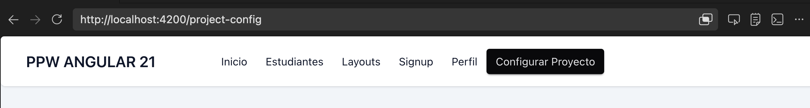
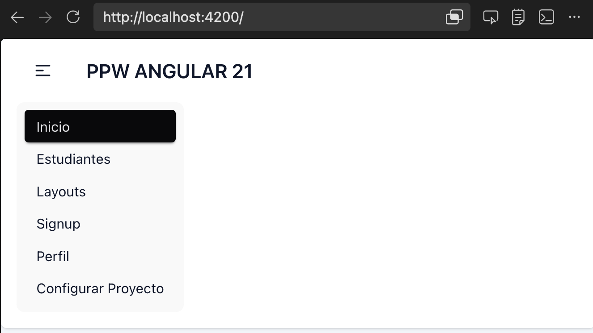

# Programación y Plataformas Web

# Frameworks Web: Angular 21 + TailwindCSS

<div align="center">
  
  <span style="font-size: 80px; color: black; margin: 20px 20px;">+</span>
  
</div>

## 06. Temas y Componentes UI - Práctica

### Autor

**Pablo Torres**  
📧 [ptorresp@ups.edu.ec](mailto:ptorresp@ups.edu.ec)  
💻 GitHub: [PabloT18](https://github.com/PabloT18)

---

## 1. Objetivo

Construir un mini design-system en el proyecto Angular: actualizar componentes existentes (header/navbar/footer), crear componentes visuales modernos (glass y gradient) y añadir una página de catálogo de componentes con distribuciones responsive variadas.

---

## 2. Contexto de la práctica

Ya existe base de layout y navegación. Ahora vamos a transformar la interfaz en un sistema visual coherente, reutilizable y listo para los módulos que vienen (HTTP, auth, guards).

Meta del módulo: que la app no sea solo funcional, sino consistente a nivel de experiencia visual.

---

## 3. Archivos que se van a crear o modificar

**Configuración:**
- `src/styles.css`
- `src/index.html`

**Shell y navegación:**
- `src/app/app.ts`
- `src/app/app.routes.ts`
- `src/app/components/header/header.html` (si ya existe)
- `src/app/components/navbar/navbar.html` (si ya existe)
- `src/app/components/footer/footer.html` (si ya existe)

**Nueva página del módulo:**
- `src/app/features/ui-components/pages/ui-components-page.ts`
- `src/app/features/ui-components/pages/ui-components-page.html`

**Nuevos componentes UI:**
- `src/app/components/ui/glass-stat-card/glass-stat-card.ts`
- `src/app/components/ui/gradient-cta-banner/gradient-cta-banner.ts`
- `src/app/components/ui/feature-chip-list/feature-chip-list.ts`

---

## 4. Archivos base desde files

Usa la carpeta [files/README.md](files/README.md):

- `styles.css` (tema base + ajustes visuales)
- `app-navbar.html` (navbar responsive)
- `app-footer.html` (footer con bloques)
- `ui-components-page.ts`
- `ui-components-page.html` (sección extensa con varias distribuciones)
- `glass-stat-card.ts`
- `gradient-cta-banner.ts`
- `feature-chip-list.ts`

---

## 5. Pasos incrementales

### Paso 1. Activar DaisyUI y definir tema base

Instala DaisyUI:

```bash
pnpm add -D daisyui@latest
```

Actualiza `src/styles.css`:

```css
@import "tailwindcss";
@plugin "daisyui";
```

Actualiza `src/index.html`:

```html
<html lang="es" data-theme="cupcake">
```

Objetivo: activar sistema de componentes y tema global.

---

### Paso 2. Modernizar componentes existentes (header/navbar/footer)

En este paso no creamos desde cero: **modificamos los componentes existentes**.

#### 2.1 Header + Navbar existentes

En este proyecto el `header` actual ya contiene la marca y la navegación en un solo bloque. Por eso, en lugar de separar `header` y `navbar`, conviene **tomar como referencia los ejemplos del componente Navbar de DaisyUI** y adaptar esa idea al marcado que ya existe:

https://daisyui.com/components/navbar/

La idea no es copiar un ejemplo completo, sino combinar:

- la marca actual (`brand()` en mayúsculas)
- los enlaces existentes con `routerLink` y `routerLinkActive`
- una versión responsive con menú colapsable en móvil
- el estilo visual de DaisyUI, pero **sin el campo de búsqueda**

El resultado esperado es un `header` que siga siendo el contenedor principal, pero internamente funcione como una navbar responsive:

```html
<header class="max-lg:collapse bg-base-100 shadow-sm w-full rounded-md">
  <input
    id="navbar-toggle"
    class="peer hidden"
    type="checkbox"
  />

  <label
    for="navbar-toggle"
    class="fixed inset-0 hidden max-lg:peer-checked:block"
  ></label>

  <div class="collapse-title navbar px-4">
    <div class="navbar-start">
      <label
        for="navbar-toggle"
        class="btn btn-ghost lg:hidden"
      >
        <svg
          xmlns="http://www.w3.org/2000/svg"
          class="h-5 w-5"
          fill="none"
          viewBox="0 0 24 24"
          stroke="currentColor"
        >
          <path
            stroke-linecap="round"
            stroke-linejoin="round"
            stroke-width="2"
            d="M4 6h16M4 12h8m-8 6h16"
          />
        </svg>
      </label>

      <a
        class="btn btn-ghost text-xl"
        routerLink="/"
      >
        {{ brand() | uppercase }}
      </a>
    </div>

    <div class="navbar-center hidden lg:flex">
      <ul class="menu menu-horizontal px-1">
        <li>
          <a
            routerLink="/"
            routerLinkActive="menu-active"
            [routerLinkActiveOptions]="{ exact: true }"
          >
            Inicio
          </a>
        </li>
      </ul>
    </div>

    <div class="navbar-end"></div>
  </div>

  <div class="collapse-content lg:hidden z-10">
    <ul class="menu rounded-box bg-base-200">
      <li>
        <a
          routerLink="/"
          routerLinkActive="menu-active"
          [routerLinkActiveOptions]="{ exact: true }"
        >
          Inicio
        </a>
      </li>
    </ul>
  </div>
</header>
```

Después de comprobar que esta base funciona, agrega el resto de enlaces que ya tenías en tu header actual: `Estudiantes`, `Layouts`, `Signup`, `Perfil` y `Configurar Proyecto`.



Vista movil 



##### 2.1.2 Submenu para Formularios

Luego, refactoriza la navegación para convertir `Signup`, `Perfil` y `Configurar Proyecto` en un solo submenú llamado `Formularios`.

Submenú para desktop:

```html
<li>
  <details>
    <summary>Formularios</summary>

    <ul class="p-2 bg-base-100 rounded-box shadow">
      <li>
        <a routerLink="/forms" routerLinkActive="menu-active">
          Signup
        </a>
      </li>

      <li>
        <a routerLink="/profile" routerLinkActive="menu-active">
          Perfil
        </a>
      </li>

      <li>
        <a routerLink="/project-config" routerLinkActive="menu-active">
          Configurar Proyecto
        </a>
      </li>
    </ul>
  </details>
</li>
```

La navbar desktop quedaría así:

```html
<ul class="menu menu-horizontal px-1">

  <!-- ..OTROS ENLACES.. -->

  <li>
    <details>
      <summary>Formularios</summary>

      <ul class="p-2 bg-base-100 rounded-box shadow">
        <li>
          <a routerLink="/forms" routerLinkActive="menu-active">
            Signup
          </a>
        </li>

        <li>
          <a routerLink="/profile" routerLinkActive="menu-active">
            Perfil
          </a>
        </li>

        <li>
          <a routerLink="/project-config" routerLinkActive="menu-active">
            Configurar Proyecto
          </a>
        </li>
      </ul>
    </details>
  </li>
</ul>
```

En móvil puedes dejar el mismo patrón, pero agrupado dentro de `details`:

```html
<li>
  <details>
    <summary>Formularios</summary>

    <ul>
      <li>
        <a routerLink="/forms" routerLinkActive="menu-active">
          Signup
        </a>
      </li>

      <li>
        <a routerLink="/profile" routerLinkActive="menu-active">
          Perfil
        </a>
      </li>

      <li>
        <a routerLink="/project-config" routerLinkActive="menu-active">
          Configurar Proyecto
        </a>
      </li>
    </ul>
  </details>
</li>
```

Si quieres ver el resultado final completo antes de implementarlo, puedes tomar como referencia el archivo `files/app-header-fina.html`.


#### 2.2 Footer existente

Para el footer, toma como referencia los ejemplos del componente Footer de DaisyUI:

https://daisyui.com/components/footer/

La meta tampoco es copiarlo literal, sino combinar esa estructura por bloques con la información del curso y enlaces útiles de la aplicación o del módulo.

Puedes partir de una versión como esta:

```html
<footer class="footer sm:footer-horizontal mt-10 border border-base-200 bg-base-300 p-10 text-base-content shadow-sm">
  <nav>
    <h6 class="footer-title">PPW</h6>
    <a class="link link-hover">Angular 21</a>
    <a class="link link-hover">TailwindCSS</a>
    <a class="link link-hover">DaisyUI</a>
  </nav>

  <nav>
    <h6 class="footer-title">Navegación</h6>
    <a class="link link-hover" routerLink="/">Inicio</a>
    <a class="link link-hover" routerLink="/students">Estudiantes</a>
    <a class="link link-hover" routerLink="/ui-components">Componentes</a>
  </nav>

  <nav>
    <h6 class="footer-title">Curso</h6>
    <a class="link link-hover">Layouts responsive</a>
    <a class="link link-hover">Formularios</a>
    <a class="link link-hover">Servicios HTTP</a>
  </nav>
</footer>
```

Objetivo: elevar la UI sin romper la estructura previa y dejando el shell listo para los siguientes módulos.


### Paso 3. Crear página de componentes

Crear `ui-components-page` y registrar su ruta:

```ts
{ path: 'ui-components', component: UiComponentsPage }
```

Agregar el siguiente codigo:

```ts
 readonly quickChips = [
    'Glass Surface',
    'Gradient CTA',
    'Responsive Grid',
    'Standalone Components',
    'Tailwind + DaisyUI',
  ];
```

y como componente incial 

```html
<section class="space-y-10">
  <header class="space-y-3">
        <p class="text-sm font-semibold uppercase tracking-[0.3em] text-sky-700">UI Components Page</p>
        <h1 class="text-3xl font-bold tracking-tight text-slate-900 md:text-4xl">Catalogo de Componentes</h1>
        <p class="mt-3 max-w-2xl text-sm text-slate-600">
            Pagina de prueba para validar componentes visuales reutilizables con distintas distribuciones de
            pantalla.
        </p>
    </header>
 
    <div class="rounded-3xl border border-base-200 bg-base-100 p-6 shadow-sm">
      <p class="text-xs font-semibold uppercase tracking-[0.3em] text-sky-700">UI Components Page</p>
      <h1 class="mt-2 text-3xl font-black tracking-tight text-slate-900">Catalogo de Componentes</h1>
      <p class="mt-3 max-w-2xl text-sm text-slate-600">
        Pagina de prueba para validar componentes visuales reutilizables con distintas distribuciones de pantalla.
      </p>
    </div>

</section>
```

---

### Paso 4. Crear componentes visuales reutilizables


Crear estos componentes standalone, en la carpeta `ui-components-page` crear un folder `components` y en esta crear los siguientes componentes:

- `glass-stat-card`

Componente HTML 

```html
   <article class="glass-surface rounded-2xl p-5">
      <p class="text-xs font-semibold uppercase tracking-[0.22em] text-slate-700">{{ label() }}</p>
      <p class="mt-3 text-3xl font-black tracking-tight text-slate-900">{{ value() }}</p>
      <p class="mt-2 text-xs text-slate-600">{{ helper() }}</p>
    </article>
```

Codigo TS

```ts
 label = input.required<string>();
  value = input.required<string>();
  helper = input<string>('Actualizado recientemente');
```

- `gradient-cta-banner`


Componente HTML 

```html
 <section class="gradient-surface rounded-3xl p-6 shadow-xl">
      <p class="text-xs font-bold uppercase tracking-[0.3em] text-white/90">{{ eyebrow() }}</p>
      <h3 class="mt-2 text-2xl font-black tracking-tight">{{ title() }}</h3>
      <p class="mt-2 max-w-xl text-sm text-white/90">{{ description() }}</p>
      <button class="btn btn-sm mt-4 border-none bg-white text-slate-900 hover:bg-slate-100">
        {{ actionLabel() }}
      </button>
    </section>
```

Codigo TS

```ts
 eyebrow = input<string>('Componente destacado');
  title = input.required<string>();
  description = input.required<string>();
  actionLabel = input<string>('Ver mas');
```

- `feature-chip-list`

Componente HTML 

```html
 <div class="rounded-2xl border border-base-200 bg-base-100 p-4 shadow-sm">
      <p class="text-sm font-bold text-slate-800">{{ title() }}</p>
      <div class="mt-3 flex flex-wrap gap-2">
        @for (item of chips(); track item) {
          <span class="badge badge-outline px-3 py-3 text-xs font-semibold">{{ item }}</span>
        }
      </div>
    </div>
```

Codigo TS

```ts
  title = input<string>('Características');
  chips = input<string[]>([]);
```

---


### Paso 5. Aplicar componentes a la página


Ejemplo breve:

```html
 <app-gradient-cta-banner
        title="Construccion visual consistente"
        description="Componentes reutilizables para acelerar desarrollo en modulos de negocio."
        actionLabel="Explorar"
    />

    <section class="grid gap-4 md:grid-cols-2 xl:grid-cols-4">
        <app-glass-stat-card
            label="Pantallas"
            value="12"
            helper="Modulos con layout base"
        />
        <app-glass-stat-card
            label="Componentes"
            value="9"
            helper="Piezas reutilizables activas"
        />
        <app-glass-stat-card
            label="Rutas"
            value="15"
            helper="Navegacion del proyecto"
        />
        <app-glass-stat-card
            label="UI Score"
            value="A"
            helper="Consistencia visual"
        />
    </section>

    <section class="grid gap-4 lg:grid-cols-[2fr_1fr]">
        <article class="rounded-3xl border border-base-200 bg-base-100 p-6 shadow-sm">
            <h2 class="text-xl font-black tracking-tight text-slate-900">Distribucion Asimetrica</h2>
            <p class="mt-2 text-sm text-slate-600">
                En desktop, esta zona usa 2 columnas desiguales para contenido principal y panel lateral.
            </p>

            <div class="mt-4 grid gap-4 sm:grid-cols-2">
                <div class="rounded-2xl border border-base-200 bg-sky-50/80 p-4">
                    <p class="text-sm font-bold text-slate-800">Bloque 1</p>
                    <p class="mt-1 text-xs text-slate-600">Resumen de actividad visual.</p>
                </div>
                <div class="rounded-2xl border border-base-200 bg-cyan-50/80 p-4">
                    <p class="text-sm font-bold text-slate-800">Bloque 2</p>
                    <p class="mt-1 text-xs text-slate-600">Pruebas de componentes por breakpoints.</p>
                </div>
            </div>
        </article>

        <app-feature-chip-list
            [chips]="quickChips"
            title="UI Features"
        />
    </section>
```

Objetivo: validar reutilización real fuera de la página catálogo.


## 5. Práctica adicional: tus propios layouts

Explora la documentación oficial de Daisy UI y agrega **5 componentes adicionales** a esta página.
 

Para cada distribución que agregues:

1. Crea un componente separado, e imlementalo en la página.
2. Captura/s de los componentes implementados 
3. Colocar capturas en README.md

---


---

## 8. Commits sugeridos

```bash
git add .
git commit -m "feat: agregar componentes glass y gradient reutilizables"
```
