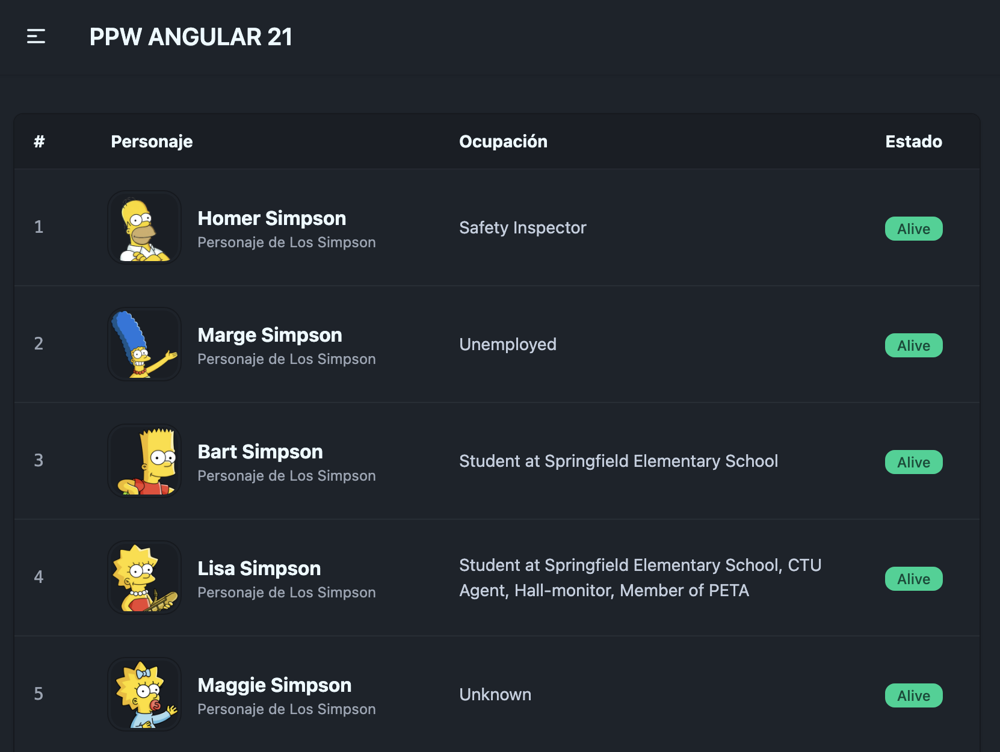
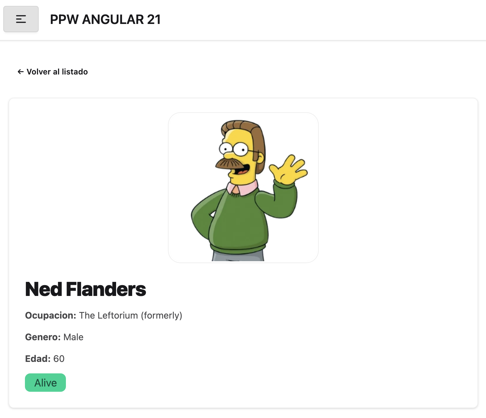

# Programación y Plataformas Web

# Frameworks Web: Angular 21 + HTTP

<div align="center">
  
</div>

## 07-A. Consumo de Servicios HTTP — Servicio base y primer consumo

### Autor

**Pablo Torres**  
📧 [ptorresp@ups.edu.ec](mailto:ptorresp@ups.edu.ec)  
💻 GitHub: [PabloT18](https://github.com/PabloT18)

---

## Objetivo

Crear una feature completa que consuma una API real: configurar `HttpClient`, definir interfaces, crear un servicio HTTP con manejo de errores y consumirlo desde un componente usando `rxResource`.

---

## API que se va a consumir

Se utilizará la misma API de The Simpsons usada en el curso de JavaScript:

```
https://thesimpsonsapi.com/api
```

Endpoints principales:

| Endpoint | Descripción |
|---|---|
| `GET /characters?page=1` | Lista paginada de personajes |
| `GET /characters/:id` | Detalle de un personaje |

---

## Archivos involucrados

- `src/app/app.config.ts` — registrar `HttpClient`
- `src/app/app.routes.ts` — agregar ruta `simpsons`
- `src/app/features/simpsons/models/simpsons.interface.ts` — interfaces
- `src/app/features/simpsons/services/simpsons.service.ts` — servicio HTTP
- `src/app/features/simpsons/pages/simpsons-page/` — página de listado

Archivos de referencia en [`files/`](files/README.md):
- `simpsons.interface.ts`
- `simpsons.service.ts`
- `simpsons-page.ts`
- `simpsons-page.html`

---

## Paso 1. Registrar `HttpClient` en la aplicación

Abrir `src/app/app.config.ts` y agregar `provideHttpClient(withFetch())` al array de providers:

```ts
import { provideHttpClient, withFetch } from '@angular/common/http';

export const appConfig: ApplicationConfig = {
  providers: [
    provideRouter(routes),
    provideHttpClient(withFetch()),
  ],
};
```

> Solo se hace una vez para toda la aplicación. A partir de aquí, cualquier servicio puede inyectar `HttpClient`.

---

## Paso 2. Crear la feature `simpsons`

Crear la estructura de carpetas:

```
src/app/features/simpsons/
├── models/
│   └── simpsons.interface.ts
├── services/
│   └── simpsons.service.ts
└── pages/
    └── simpsons-page/
        ├── simpsons-page.ts
        └── simpsons-page.html
```

Generar la página con CLI:

```bash
ng g c features/simpsons/pages/simpsons-page --skip-tests
```

> La carpeta `models/` y `services/` se crean manualmente. Angular CLI no genera servicios dentro de subdirectorios sin especificar la ruta completa.

---

## Paso 3. Definir las interfaces

Crear `src/app/features/simpsons/models/simpsons.interface.ts`.  
Ver contenido completo: [files/simpsons.interface.ts](files/simpsons.interface.ts)

Las interfaces principales que se necesitan:

```ts
export interface SimpsonsResponse {
  count: number;
  next: string | null;
  prev: string | null;
  pages: number;
  results: SimpsonsCharacter[];
}

// ________

export interface SimpsonsCharacter {
  id: number;
  age: number | null;
  birthdate: string | null;
  gender: string;
  name: string;
  occupation: string;
  portrait_path: string;
  phrases: string[];
  status: string;
}

```

> Herramienta para generar interfaces desde JSON: [https://app.quicktype.io](https://app.quicktype.io)

---

## Paso 4. Crear el servicio HTTP

Crear `src/app/features/simpsons/services/simpsons.service.ts`.  
Ver contenido completo: [files/simpsons.service.ts](files/simpsons.service.ts)

Estructura del servicio:

```ts
@Injectable({ providedIn: 'root' })
export class SimpsonsService {
  private http = inject(HttpClient);
  private readonly baseUrl = 'https://thesimpsonsapi.com/api';

 // Devuelve un Observable tipado; no hace la llamada hasta que alguien se suscribe.
  getCharacters(page: number = 1): Observable<SimpsonsResponse> {
    return this.http
      // <SimpsonsResponse> le dice a TypeScript que esperamos ese shape de datos.
      // Es tipado estatico (compile-time), no transforma el JSON en runtime.
      .get<SimpsonsResponse>(`${this.baseUrl}/characters?page=${page}`)
      .pipe(
        // tap permite inspeccionar/loggear la respuesta sin modificarla.
        tap((response) => {
          console.log('Simpsons API response:', response);
        }),
        // Si la peticion falla, convertimos el error en uno mas legible para la UI.
        catchError(err =>
          throwError(() => new Error('No se pudieron cargar los personajes'))
        )
      );
  }
}
```

Lo que hace el servicio:
- Inyecta `HttpClient` con `inject()`
- Define la URL base como constante privada
- Tipa la respuesta con la interface `SimpsonsResponse`
- Captura errores con `catchError` y los propaga con un mensaje legible

### ¿Como funciona `pipe()` en este servicio?

`pipe()` encadena operadores de RxJS sobre el flujo que devuelve `HttpClient`.

Piensalo como una linea de procesamiento:

1. `get<SimpsonsResponse>(...)` emite la respuesta HTTP.
2. `tap(...)` observa la respuesta (por ejemplo, para log), pero no la cambia.
3. `catchError(...)` intercepta errores y devuelve otro Observable de error con un mensaje mas claro.

En otras palabras, `pipe()` no ejecuta nada por si solo: solo define que transformaciones y efectos se aplicaran cuando alguien se suscriba al Observable.

### ¿Que hace `tap`?

- Sirve para efectos secundarios: log, metricas, debug, trazas.
- No modifica el dato que sigue en el flujo.
- Es util para inspeccionar respuestas sin romper el tipado.

Ejemplo mental: llega `SimpsonsResponse` y sale el mismo `SimpsonsResponse`, solo que ademas se imprime en consola.

### ¿Que hace `catchError`?

- Captura cualquier error que ocurra antes en el flujo.
- Permite mapear un error tecnico a uno mas entendible para la UI.
- Debe retornar un Observable (en este caso, uno que falla con `throwError`).

Asi el componente puede mostrar mensajes de error consistentes sin depender del formato interno del backend.

### ¿Que otros operadores podrias usar aqui?

- `map`: transformar la respuesta (por ejemplo, ordenar `results` o quedarte solo con un subconjunto).
- `retry`: reintentar automaticamente la peticion si falla por un error temporal.
- `finalize`: ejecutar logica al terminar (ocultar spinner manual, logging final, etc.).
- `timeout`: cortar una peticion que tarda demasiado.
- `shareReplay(1)`: reutilizar la ultima respuesta para evitar llamadas duplicadas en la misma sesion.

Ejemplo breve con `map`:

```ts
.pipe(
  map((response) => ({
    ...response,
    results: response.results.filter((c) => c.status === 'Alive'),
  }))
)
```

> Regla practica: usa `tap` para observar, `map` para transformar y `catchError` para controlar fallos.

---

## Paso 5. Consumir el servicio con `rxResource`

En `simpsons-page.ts`, inyectar el servicio y definir el resource:

```ts
import { inject } from '@angular/core';
import { rxResource } from '@angular/core/rxjs-interop';

export class SimpsonsPageComponent {
  // Inyectamos el servicio una sola vez en el componente.
  private simpsonsService = inject(SimpsonsService);

  // rxResource conecta Observable -> estado reactivo (loading, error, value).
  simpsonsResource = rxResource({
    // stream ejecuta la consulta de personajes de la pagina 1.
    stream: () => this.simpsonsService.getCharacters(1),
  });
}
```

Explicacion corta del paso 5:
- `rxResource` evita manejar manualmente `subscribe` y `unsubscribe`.
- Angular expone estados listos para template: `isLoading()`, `error()`, `hasValue()`.
- Cuando el stream emite datos, `value()` queda disponible para renderizar.


---

## Paso 6. Renderizar estados en el template

Crear `simpsons-page.html`. Ver contenido completo: [files/simpsons-page.html](files/simpsons-page.html)

Los tres estados que siempre se deben manejar:

```html
<!-- Estado de carga -->
@if (simpsonsResource.isLoading()) {
<div class="flex justify-center items-center h-64">
    <span class="loading loading-spinner loading-lg text-primary"></span>
</div>
}

<!-- Estado de error -->
@if (simpsonsResource.error()) {
<div class="alert alert-error max-w-lg mx-auto mt-8">
    <span>Error al cargar los personajes. Intenta de nuevo.</span>
</div>
}

<!-- Estado de datos -->
@if (simpsonsResource.hasValue()) {
<div class="overflow-x-auto rounded-box border border-base-300 bg-base-100 shadow-sm">
    <table class="table w-full">
        <thead class="bg-base-200 text-base-content">
            <tr>
                <th class="w-16">#</th>
                <th>Personaje</th>
                <th>Ocupación</th>
                <th class="text-center">Estado</th>
            </tr>
        </thead>

        <tbody>
            @for (char of simpsonsResource.value()!.results; track char.id) {
            <tr class="hover:bg-base-200/60 transition-colors">
                <td class="font-mono text-sm text-base-content/60">
                    {{ char.id }}
                </td>

                <td>
                    <div class="flex items-center gap-4 py-2">
                        <div class="avatar">
                            <div
                                class="w-14 h-14 rounded-xl bg-base-200 ring ring-base-300 ring-offset-base-100 ring-offset-2">
                                
                            </div>
                        </div>

                        <div class="min-w-0">
                            <div class="font-bold text-base">
                                {{ char.name }}
                            </div>

                            <div class="text-xs text-base-content/60">
                                Personaje de Los Simpson
                            </div>
                        </div>
                    </div>
                </td>

                <td>
                    <span class="text-sm text-base-content/80">
                        {{ char.occupation || 'Sin ocupación registrada' }}
                    </span>
                </td>

                <td class="text-center">
                    <span
                        class="badge badge-sm font-medium"
                        [class.badge-success]="char.status === 'Alive'"
                        [class.badge-error]="char.status === 'Deceased'"
                        [class.badge-warning]="char.status !== 'Alive' && char.status !== 'Dead'"
                    >
                        {{ char.status || 'Desconocido' }}
                    </span>
                </td>
            </tr>
            }
        </tbody>
    </table>
</div>
}
```

---

## Paso 7. Registrar la ruta y agregar al navbar

En `app.routes.ts`:

```ts
{
  path: 'simpsons',
  component: SimpsonsPageComponent,
},
```

En el navbar (`app-navbar.html` o el componente de navegación del proyecto), agregar el enlace:

```html
<li><a routerLink="/simpsons" routerLinkActive="active">Simpsons</a></li>
```

> Analiza el codigo de la respuesta del servicio y resuelve el probelma de la visualización de la imagen.



---

## Paso 8. Crear pagina de personaje (detalle)

Crear una pagina para mostrar la informacion de un personaje por id:

```bash
ng g c features/simpsons/pages/simpson-detail-page --skip-tests
```

Agregar la ruta dinamica en `app.routes.ts`:

```ts
{
  path: 'simpsons/:id',
  component: SimpsonDetailPageComponent,
},
```

Objetivo: tener una pagina dedicada para detalle, por ejemplo `/simpsons/5`.

---

## Paso 9. Navegar desde el listado al detalle

En el listado (`simpsons-page.html`), tanto la imagen como el nombre deben ser clickeables y navegar al detalle.

Ejemplo:

```html
<a [routerLink]="['/simpsons', char.id]" class="avatar">
  <div class="w-14 h-14 rounded-xl bg-base-200 ring ring-base-300 ring-offset-base-100 ring-offset-2">
    
  </div>
</a>

<a [routerLink]="['/simpsons', char.id]" class="font-bold text-base link link-hover">
  {{ char.name }}
</a>
```

Objetivo: pasar del listado al detalle con una accion natural de UI.

---

## Paso 10. Agregar metodo para consumir un personaje por codigo

En `simpsons.service.ts`, agregar un segundo metodo para consultar un personaje individual:

Imports recomendados para este metodo:

```ts
import {
  Observable,
  catchError,
  delay,
  map,
  tap,
  throwError,
  timeout,
} from 'rxjs';
```

```ts
getCharacterById(id: number): Observable<SimpsonsCharacter> {
  return this.http
    .get<SimpsonsCharacter>(`${this.baseUrl}/characters/${id}`)
    .pipe(
      // delay permite simular latencia para ver mejor estados de carga en clase.
      delay(300),
      // timeout evita que la peticion quede colgada indefinidamente.
      timeout(5000),
      // tap para diagnostico sin alterar el dato.
      tap((character) => {
        console.log('Character loaded:', character.name);
      }),
      // map opcional para normalizar campos antes de llegar al componente.
      map((character) => ({
        ...character,
        occupation: character.occupation || 'Sin ocupacion registrada',
      })),
      catchError(() =>
        throwError(() => new Error('No se pudo cargar el personaje'))
      )
    );
}
```

Endpoint de referencia:

```text
https://thesimpsonsapi.com/api/characters/5
```

Objetivo: separar claramente el consumo de listado paginado y el consumo de detalle individual.

---

## Paso 11. Crear servicio de localStorage para cache de personajes

Crear un servicio, por ejemplo `simpsons-cache.service.ts`, para guardar y leer personajes consultados por id.

Regla del modulo:
- **NO** guardar en `localStorage` el resultado de `getCharacters(page)`.
- Guardar solo cuando se consulte un personaje individual con `getCharacterById(id)`.

Estructura sugerida:

```ts
@Injectable({ providedIn: 'root' })
export class SimpsonsCacheService {
  private readonly key = 'simpsons-character-cache';

  getById(id: number): SimpsonsCharacter | null {
    const map = this.readMap();
    return map[id] ?? null;
  }

  save(character: SimpsonsCharacter): void {
    const map = this.readMap();
    map[character.id] = character;
    localStorage.setItem(this.key, JSON.stringify(map));
  }

  private readMap(): Record<number, SimpsonsCharacter> {
    const raw = localStorage.getItem(this.key);
    return raw ? JSON.parse(raw) : {};
  }
}
```

Objetivo: tener un cache local simple para mejorar tiempo de respuesta en la pagina de detalle.

---

## Paso 12. Aplicar estrategia cache-first en detalle

En la pagina de detalle:

1. Leer `id` desde la ruta (`ActivatedRoute`).
2. Buscar primero en `SimpsonsCacheService.getById(id)`.
3. Si existe en cache, mostrarlo inmediatamente.
4. Si no existe, consumir API con `getCharacterById(id)`.
5. Cuando llegue la respuesta, guardar con `cacheService.save(character)`.

Con esta estrategia, si vuelves a entrar a un personaje ya visitado, se muestra al instante desde `localStorage`; si no existe, se consulta al backend.

Implementacion recomendada de `simpson-detail-page.ts`:

Agrega dependencias:
```ts

  // Dependencias del componente.
  private route = inject(ActivatedRoute);
  private simpsonsService = inject(SimpsonsService);
  private cacheService = inject(SimpsonsCacheService);

```

Leemos el parametro de la ruta:

```ts
  // Convertimos el parametro de ruta a numero.
  private characterId = Number(this.route.snapshot.paramMap.get('id'));
  
```

Metodo Observable para consumu de servicio

```ts
  // Resource reactivo: expone isLoading, error y value para el template.
  characterResource = rxResource({
    stream: () => {
      // Paso A: buscar primero en cache local.
      const cached = this.cacheService.getById(this.characterId);
      if (cached) {
        // Si existe en localStorage, devolvemos el dato al instante.
        return of(cached);
      }

      // Paso B: si no existe en cache, consultar API.
      return this.simpsonsService.getCharacterById(this.characterId).pipe(
        // Guardamos la respuesta para visitas futuras.
        tap((character) => this.cacheService.save(character))
      );
    },
  });

```

Explicacion corta del flujo TS:
- Primero intenta resolver el personaje desde `localStorage`.
- Si existe, no hace request HTTP y renderiza inmediato.
- Si no existe, consume API y guarda el resultado para proximas visitas.

Implementacion recomendada de `simpson-detail-page.html`:

```html
<section class="mx-auto max-w-4xl space-y-6">
  <a routerLink="/simpsons" class="btn btn-ghost btn-sm">← Volver al listado</a>

  @if (characterResource.isLoading()) {
    <div class="flex h-56 items-center justify-center">
      <span class="loading loading-spinner loading-lg text-primary"></span>
    </div>
  }

  @if (characterResource.error()) {
    <div class="alert alert-error">
      <span>No se pudo cargar el personaje.</span>
    </div>
  }

  @if (characterResource.hasValue()) {
    <article class="card border border-base-300 bg-base-100 shadow-sm">
      <div class="card-body gap-6 md:flex-row">
        <div class="mx-auto md:mx-0">
          
        </div>

        <div class="space-y-3">
          <h2 class="text-3xl font-black tracking-tight">
            {{ characterResource.value()!.name }}
          </h2>

          <p class="text-base-content/80">
            <strong>Ocupacion:</strong>
            {{ characterResource.value()!.occupation || 'Sin ocupacion registrada' }}
          </p>

          <p class="text-base-content/80">
            <strong>Genero:</strong>
            {{ characterResource.value()!.gender || 'No registrado' }}
          </p>

          <p class="text-base-content/80">
            <strong>Edad:</strong>
            {{ characterResource.value()!.age ?? 'No registrada' }}
          </p>

          <span
            class="badge badge-lg"
            [class.badge-success]="characterResource.value()!.status === 'Alive'"
            [class.badge-error]="characterResource.value()!.status === 'Deceased'"
            [class.badge-warning]="characterResource.value()!.status !== 'Alive' && characterResource.value()!.status !== 'Deceased'"
          >
            {{ characterResource.value()!.status || 'Desconocido' }}
          </span>
        </div>
      </div>
    </article>
  }
</section>
```

---



## Commits sugeridos

```bash
git commit -m "end: 05 http service and local storage "
```
