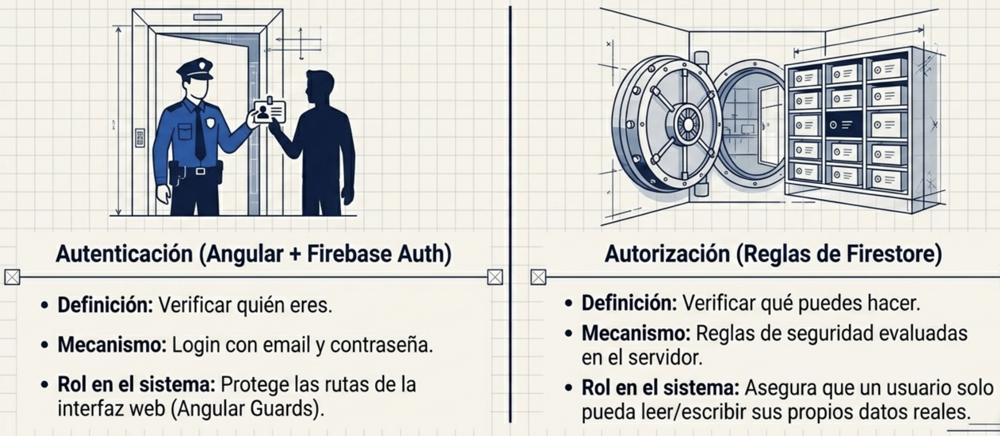
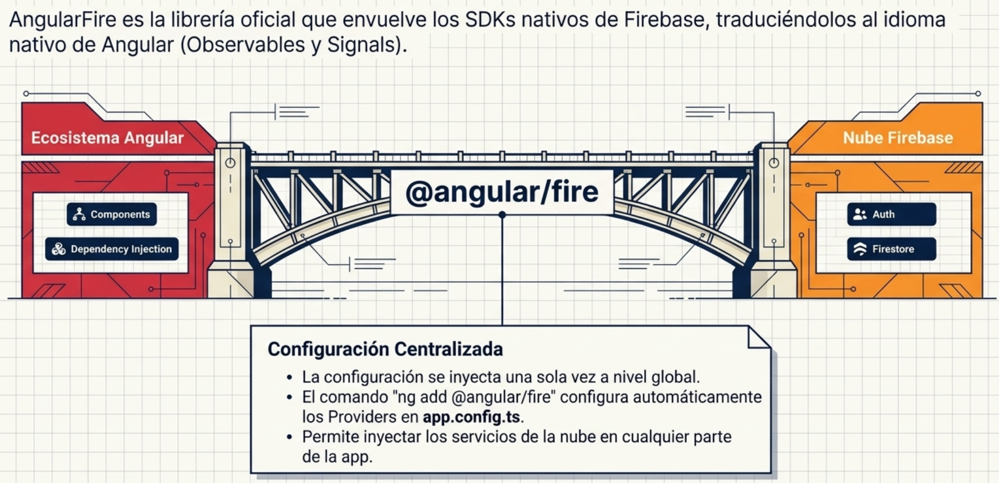
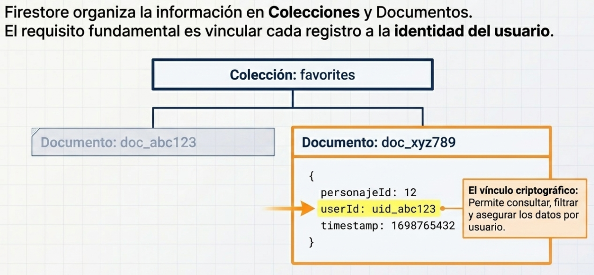
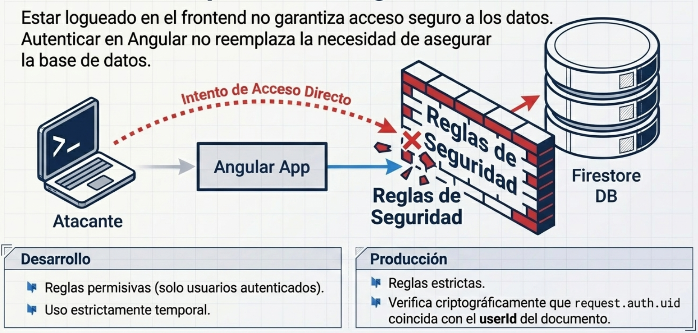
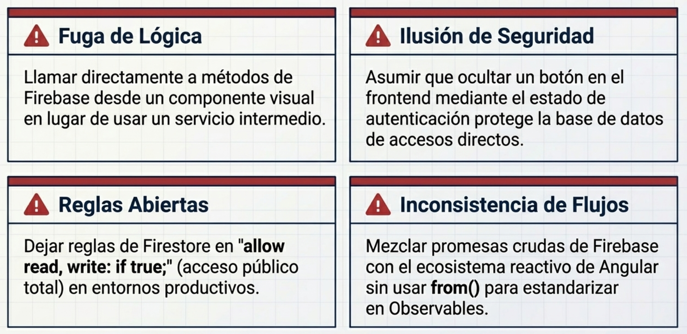

# Programación y Plataformas Web

# Frameworks Web: Angular 21 + Firebase

<div align="center">
  
  <span style="font-size: 80px; color: black; margin: 20px 20px;">+</span>
  
</div>

## 08. Firebase y Autenticación

### Autor

**Pablo Torres**  
📧 [ptorresp@ups.edu.ec](mailto:ptorresp@ups.edu.ec)  
💻 GitHub: [PabloT18](https://github.com/PabloT18)

---

## 1. Objetivo del tema

Incorporar autenticación y persistencia básica en la nube al proyecto incremental usando Firebase, de modo que el proyecto disponga de sesión real antes de implementar guards y despliegue.

---

## 2. ¿Que es Firebase?

Firebase es una plataforma de Google que ofrece servicios backend listos para usar sin construir un servidor propio. En este modulo interesan dos:

| Servicio | Rol en este modulo |
|---|---|
| **Firebase Authentication** | Gestiona registro, login y sesion de usuarios |
| **Cloud Firestore** | Base de datos NoSQL en la nube para persistir datos por usuario |

Comparacion entre el proyecto antes y despues de este modulo:

| Sin autenticacion | Con Firebase |
|---|---|
| Todas las acciones son anonimas | Existe un usuario autenticado con uid unico |
| No hay persistencia por usuario | Se pueden guardar favoritos asociados al uid |
| Guards solo simulados | Guards se apoyan en sesion real de Firebase |

---

## 3. Autenticacion vs Autorizacion

| Concepto | Definicion | Ejemplo en este proyecto |
|---|---|---|
| **Autenticacion** | Verificar quien eres | Login con email y password |
| **Autorizacion** | Verificar que puedes hacer | Solo el dueno puede ver sus favoritos |

Angular se ocupa de autenticacion (guards de rutas). Firestore se ocupa de autorizacion (reglas de seguridad).




---

## 4. Fundamento tecnico

### 4.1 AngularFire

AngularFire es la libreria oficial de Firebase para Angular. Expone servicios reactivos basados en Observables y signals.

```bash
pnpm add @angular/fire firebase
pnpm ng add @angular/fire
```

`pnpm ng add @angular/fire` ejecuta un asistente que:
- pide autenticacion con Google
- pregunta que servicios habilitar (Authentication, Firestore, etc.)
- modifica `app.config.ts` automaticamente con los providers correctos



### 4.2 Providers en `app.config.ts`

Despues del asistente, `app.config.ts` incluye los providers de Firebase:

```ts
import { provideFirebaseApp, initializeApp } from '@angular/fire/app';
import { provideAuth, getAuth } from '@angular/fire/auth';
import { provideFirestore, getFirestore } from '@angular/fire/firestore';

export const appConfig: ApplicationConfig = {
  providers: [
    // Firebase: inicializa la app con la configuracion del proyecto.
    provideFirebaseApp(() => initializeApp(firebaseConfig)),
    // Auth: expone el servicio de autenticacion para inyectar en servicios.
    provideAuth(() => getAuth()),
    // Firestore: expone la base de datos para leer y escribir documentos.
    provideFirestore(() => getFirestore()),
  ],
};
```


### 4.3 Estructura de Firestore

Firestore organiza los datos en colecciones y documentos:

```
coleccion: favorites
  └── documento: {uid}-{characterId}
        ├── userId: "uid-abc123"
        ├── characterId: 5
        └── addedAt: Timestamp
```

Cada usuario solo deberia leer y escribir documentos donde `userId === uid autenticado`. Eso se controla con reglas de seguridad.


### 4.4 Estado de sesion reactivo

Firebase emite el usuario autenticado como un stream. En Angular se puede exponer como signal:

```ts
import { inject, signal } from '@angular/core';
import { Auth, authState } from '@angular/fire/auth';
import { toSignal } from '@angular/core/rxjs-interop';

// authState emite null cuando no hay sesion, o el objeto User cuando hay sesion activa.
private auth = inject(Auth);
currentUser = toSignal(authState(this.auth));
```

Con esto, el template puede reaccionar al estado de sesion sin suscripciones manuales.


---

## 5. AuthService: encapsular la logica de autenticacion

La regla del modulo es clara: ningun componente llama directamente a Firebase. Todo pasa por un servicio.

```ts
import { Injectable, inject } from '@angular/core';
import { Auth, signInWithEmailAndPassword, signOut, createUserWithEmailAndPassword } from '@angular/fire/auth';
import { authState } from '@angular/fire/auth';
import { toSignal } from '@angular/core/rxjs-interop';
import { from } from 'rxjs';

@Injectable({ providedIn: 'root' })
export class AuthService {
  private auth = inject(Auth);

  // Signal reactivo con el usuario actual (null = no autenticado).
  currentUser = toSignal(authState(this.auth));

  // Devuelve un Observable porque signInWithEmailAndPassword es una Promise.
  // from() convierte la Promise en Observable para poder usar rxResource o subscribe.
  login(email: string, password: string) {
    return from(signInWithEmailAndPassword(this.auth, email, password));
  }

  register(email: string, password: string) {
    return from(createUserWithEmailAndPassword(this.auth, email, password));
  }

  // signOut tambien es Promise; se convierte igual.
  logout() {
    return from(signOut(this.auth));
  }
}
```

---

## 6. FavoritesService: persistencia por usuario en Firestore

```ts
import { Injectable, inject } from '@angular/core';
import {
  Firestore,
  collection,
  doc,
  setDoc,
  deleteDoc,
  collectionData,
  query,
  where,
} from '@angular/fire/firestore';

@Injectable({ providedIn: 'root' })
export class FavoritesService {
  private firestore = inject(Firestore);

  // Guarda un personaje favorito asociado al uid del usuario.
  // El id del documento combina uid + characterId para que sea unico por usuario.
  addFavorite(userId: string, characterId: number) {
    const ref = doc(this.firestore, `favorites/${userId}-${characterId}`);
    return setDoc(ref, { userId, characterId, addedAt: new Date() });
  }

  // Elimina el favorito del usuario.
  removeFavorite(userId: string, characterId: number) {
    const ref = doc(this.firestore, `favorites/${userId}-${characterId}`);
    return deleteDoc(ref);
  }

  // Devuelve un Observable con todos los favoritos del usuario autenticado.
  // collectionData convierte el query en un stream reactivo.
  getFavoritesByUser(userId: string) {
    const favRef = collection(this.firestore, 'favorites');
    const q = query(favRef, where('userId', '==', userId));
    return collectionData(q) as Observable<{ userId: string; characterId: number }[]>;
  }
}
```




---

## 7. Reglas de Firestore

Las reglas controlan quien puede leer o escribir en la base de datos, independientemente del frontend.

Reglas para desarrollo (permisivas, marcar como temporales):

```javascript
rules_version = '2';
service cloud.firestore {
  match /databases/{database}/documents {
    // DESARROLLO: cualquier usuario autenticado puede leer y escribir.
    match /{document=**} {
      allow read, write: if request.auth != null;
    }
  }
}
```

Regla mas estricta para el path de favoritos (produccion):

```javascript
match /favorites/{docId} {
  // Solo el dueno del documento puede leer o escribir.
  allow read, write: if request.auth != null && request.auth.uid == resource.data.userId;
}
```

> Importante: autenticar en Angular no reemplaza las reglas de Firestore. Son dos capas independientes.



---

## 8. Buenas practicas

- Configura Firebase una sola vez en `app.config.ts`.
- Encapsula auth y Firestore en servicios, no en componentes.
- Usa `toSignal(authState(...))` para exponer el usuario de forma reactiva.
- Modela los documentos de Firestore con `userId` para poder filtrar por usuario.
- Marca explicitamente las reglas de desarrollo como temporales.
- Convierte Promises de Firebase con `from()` para mantener el codigo RxJS consistente.

---

## 9. Errores comunes

- Llamar directamente a Firebase desde un componente sin servicio.
- Asumir que estar logueado en el frontend garantiza acceso a los datos.
- Dejar reglas abiertas (`allow read, write: if true`) sin advertencia.
- No separar los documentos de Firestore por usuario.
- Olvidar agregar los providers de Firebase en `app.config.ts`.



---

## 10. Relacion con el proyecto incremental

El proyecto ya tiene rutas, HTTP y LocalStorage. Este modulo agrega:
- identidad de usuario (uid unico por cuenta)
- sesion persistente entre recargas (Firebase recuerda la sesion)
- persistencia de datos en la nube (favoritos en Firestore)
- base para que los guards del modulo siguiente tengan sesion real sobre la que operar

---

## 11. Referencias

- Firebase Auth: https://firebase.google.com/docs/auth/web/start
- Firestore: https://firebase.google.com/docs/firestore/quickstart
- AngularFire: https://github.com/angular/angularfire
