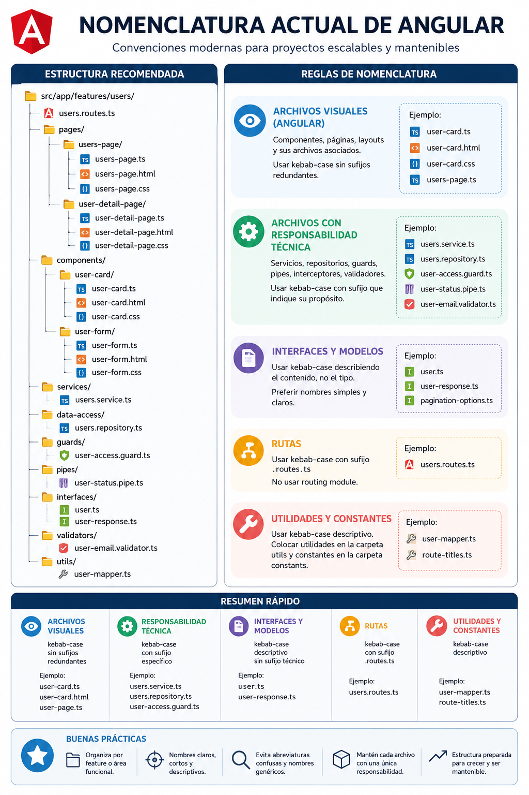

# Programación y Plataformas Web

# Frameworks Web: Angular 21

<div align="center">
  
</div>

## 03. Nomenclatura y Organización Moderna en Angular

### Autor

**Pablo Torres**
📧 [ptorresp@ups.edu.ec](mailto:ptorresp@ups.edu.ec)
💻 GitHub: [PabloT18](https://github.com/PabloT18)

---

# 1. Objetivo del tema

Comprender las convenciones modernas de nomenclatura y organización de proyectos en Angular 21, utilizando una estructura basada en features, componentes standalone y separación clara de responsabilidades.

---

# 2. Introducción

Angular ha evolucionado significativamente desde las arquitecturas tradicionales basadas en `NgModules` y estructuras globales por tipo de archivo.

En versiones anteriores era común encontrar proyectos organizados con carpetas globales como:

```txt
components/
services/
models/
```

y archivos con sufijos repetitivos:

```txt
user-profile.component.ts
user-profile.component.html
user-profile.component.css
```

Angular moderno prioriza:

* organización por feature o dominio funcional
* componentes standalone
* nombres más simples y descriptivos
* estructuras escalables
* separación clara entre UI, acceso a datos y lógica técnica

---

# 3. Antes y ahora

| Angular clásico                                         | Angular moderno                          |
| ------------------------------------------------------- | ---------------------------------------- |
| `user-profile.component.ts`                             | `user-profile.ts`                        |
| `AppModule` como pieza central                          | standalone + `app.routes.ts`             |
| estructura global por tipo                              | estructura por feature                   |
| `*ngIf` y `*ngFor`                                      | `@if` y `@for`                           |
| servicios para toda la lógica                           | separación entre services y repositories |
| carpetas `components/`, `services/`, `models/` globales | carpetas internas por feature            |

---

# 4. Organización moderna recomendada

## Ejemplo de estructura actual

```txt
src/app/features/users/
│
├── users.routes.ts
│
├── pages/
│   ├── users-page/
│   │   ├── users-page.ts
│   │   ├── users-page.html
│   │   └── users-page.css
│   │
│   └── user-detail-page/
│       ├── user-detail-page.ts
│       ├── user-detail-page.html
│       └── user-detail-page.css
│
├── components/
│   └── user-card/
│       ├── user-card.ts
│       ├── user-card.html
│       └── user-card.css
│
├── services/
│   └── users.service.ts
│
├── data-access/
│   └── users.repository.ts
│
├── guards/
│   └── user-access.guard.ts
│
├── pipes/
│   └── user-status.pipe.ts
│
├── interfaces/
│   ├── user.ts
│   └── user-response.ts
│
├── validators/
│   └── user-email.validator.ts
│
└── utils/
    └── user-mapper.ts
```

---

# 5. Reglas modernas de nomenclatura

## 5.1 Archivos visuales

Los componentes, páginas y layouts usan nombres simples sin sufijos redundantes.

### Correcto

```txt
user-card.ts
user-card.html
user-card.css

users-page.ts
admin-layout.ts
```

### Evitar

```txt
user-card.component.ts
users-page.component.ts
admin-layout.component.ts
```

---

## 5.2 Servicios

Los servicios mantienen el sufijo `.service.ts` porque representan una responsabilidad técnica específica.

### Correcto

```txt
users.service.ts
auth.service.ts
storage.service.ts
```

---

## 5.3 Repositories

Los repositories encapsulan acceso a datos, APIs y transformaciones.

### Correcto

```txt
users.repository.ts
products.repository.ts
auth.repository.ts
```

---

## 5.4 Guards

Los guards protegen rutas o controlan acceso.

### Correcto

```txt
auth.guard.ts
admin-access.guard.ts
not-authenticated.guard.ts
```

---

## 5.5 Pipes

Los pipes transforman datos para la vista.

### Correcto

```txt
user-status.pipe.ts
currency.pipe.ts
image.pipe.ts
```

---

## 5.6 Interfaces y modelos

Angular moderno recomienda nombres simples basados en el contenido y no en el tipo técnico.

### Correcto

```txt
user.ts
user-response.ts
pagination-options.ts
```

### Evitar

```txt
user.interface.ts
user.model.ts
```

---

## 5.7 Validators

Los validators deben describir claramente la validación que realizan.

### Correcto

```txt
user-email.validator.ts
password-match.validator.ts
fecha-fin.validator.ts
```

---

## 5.8 Rutas

Angular moderno reemplaza los antiguos routing modules.

### Correcto

```txt
app.routes.ts
users.routes.ts
auth.routes.ts
```

### Evitar

```txt
app-routing.module.ts
users-routing.module.ts
```

---

# 6. Convenciones importantes

## Kebab-case

Todos los archivos y carpetas deben usar kebab-case.

### Correcto

```txt
user-card.ts
home-page.ts
form-utils.ts
```

### Evitar

```txt
UserCard.ts
homePage.ts
formUtils.ts
```

---

## Organización por feature

Angular moderno recomienda agrupar por dominio funcional.

### Correcto

```txt
features/users/
features/auth/
features/dashboard/
```

### Evitar

```txt
components/
services/
models/
```

como carpetas globales principales.

---

# 7. Diferencias clave de arquitectura

| Antes                 | Ahora                    |
| --------------------- | ------------------------ |
| `NgModule`            | standalone               |
| `AppModule`           | `app.config.ts`          |
| routing modules       | `*.routes.ts`            |
| arquitectura por tipo | arquitectura por feature |
| `.component.ts`       | `.ts`                    |
| RxJS más pesado       | signals                  |
| SharedModule          | imports directos         |

---

# 8. Buenas prácticas

* Organizar por feature y no por tipo global.
* Mantener nombres cortos, claros y consistentes.
* Usar kebab-case en carpetas y archivos.
* Mantener una responsabilidad clara por archivo.
* Evitar nombres genéricos como `utils.ts`, `common.ts` o `helpers.ts`.
* Mantener juntos el `.ts`, `.html` y `.css` de cada componente.
* Separar lógica visual de acceso a datos.

---

# 9. Errores comunes

* Mezclar nomenclatura legacy y moderna.
* Usar PascalCase en archivos.
* Crear carpetas globales enormes con cientos de componentes.
* Mantener `routing.module.ts` en proyectos standalone.
* Usar `.component.ts` y `.ts` mezclados sin consistencia.
* Crear archivos genéricos difíciles de mantener.

---

# 10. Relación con el proyecto incremental

Esta estructura será utilizada progresivamente durante el desarrollo del proyecto incremental en Angular 21.

Las futuras prácticas reutilizarán:

* organización por feature
* pages y components
* routes standalone
* separación entre UI y acceso a datos
* nomenclatura moderna y consistente

---

# 11. Referencias recomendadas

* Guía oficial Angular Style Guide
  https://angular.dev/style-guide

* Documentación oficial Angular
  https://angular.dev

* Signals
  https://angular.dev/guide/signals
