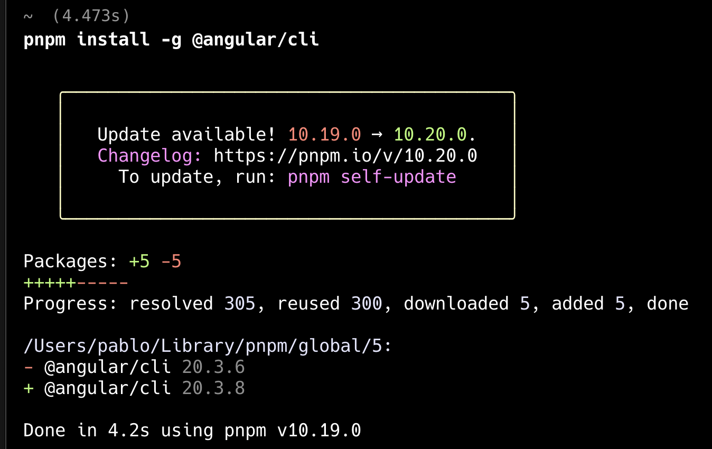
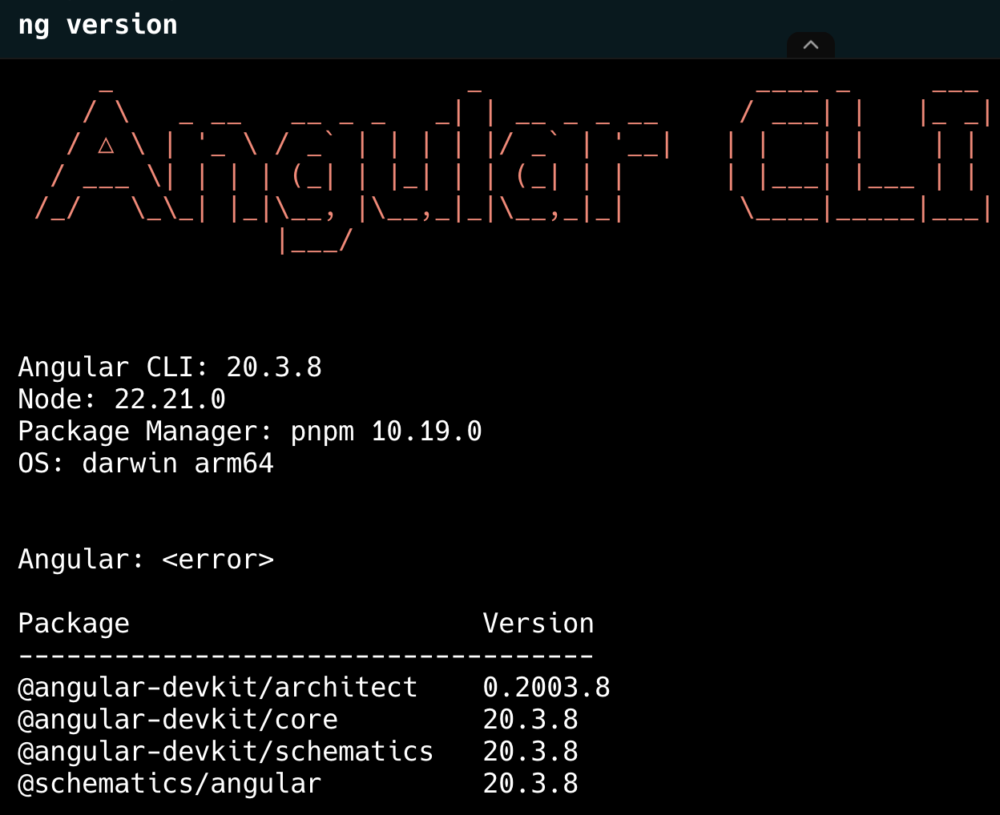
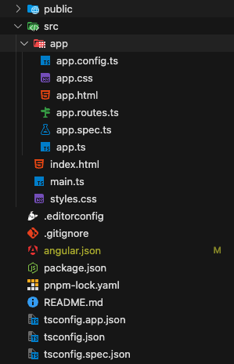

# Programación y Plataformas Web 

# Frameworks Web: Angular

<div align="center">
  

</div>


## Practica 1: Instalación y Configuración de Angular

### Autores

**Pablo Torres**  
📧 ptorersp@ups.edu.ec  
💻 GitHub: [PabloT18](https://github.com/PabloT18)


## Instalación de Angular CLI

Primero instala el **Angular CLI** globalmente:

```bash
pnpm install -g @angular/cli
```

Crear un nuevo proyecto Angular:

```bash
ng new my-app
```

Ejecutar la aplicación en modo desarrollo:

```bash
ng serve -o
```


Ejecutar la aplicación para que sea accesible desde otras máquinas en la red local:
```bash
ng serve --host 0.0.0.0 --port 4200
```


---

## Extensiones recomendadas para VSCode (Angular)

Estas extensiones potencian el desarrollo con Angular:

* **[Angular Language Service](https://marketplace.visualstudio.com/items?itemName=Angular.ng-template)** – Autocompletado, IntelliSense y diagnósticos para Angular.
* **[Angular Snippets](https://marketplace.visualstudio.com/items?itemName=johnpapa.Angular2)** – Fragmentos de código para Angular (componentes, servicios, etc.).
* **[NX Console](https://marketplace.visualstudio.com/items?itemName=nrwl.angular-console)** – Interfaz gráfica para ejecutar comandos de Angular y Nx.
* **[Material Icon Theme](https://marketplace.visualstudio.com/items?itemName=PKief.material-icon-theme)** – Iconos personalizados para archivos Angular.
* **[Prettier - Code Formatter](https://marketplace.visualstudio.com/items?itemName=esbenp.prettier-vscode)** – Formato automático del código.
* **[ESLint](https://marketplace.visualstudio.com/items?itemName=dbaeumer.vscode-eslint)** – Estilo de código consistente con Angular.

* **[Auto Close Tag](https://marketplace.visualstudio.com/items?itemName=formulahendry.auto-close-tag)** - Cierre automático de etiquetas HTML.

* **[Auto Rename Tag](https://marketplace.visualstudio.com/items?itemName=formulahendry.auto-rename-tag)** - Renombrado automático de etiquetas en pares.

* **[Paste JSON as Code](https://marketplace.visualstudio.com/items?itemName=quicktype.quicktype)** - Convierte JSON en interfaces TypeScript.

* **[TypeScript importer (opcional)](https://marketplace.visualstudio.com/items?itemName=pmneo.tsimporter)** - Importación automática de módulos.

* **[DotENV](https://marketplace.visualstudio.com/items?itemName=mikestead.dotenv)** - Soporte para archivos `.env`.

* **[Tailwind CSS IntelliSense](https://marketplace.visualstudio.com/items?itemName=bradlc.vscode-tailwindcss)** - Autocompletado y soporte para Tailwind.


---

## Hoja de Atajos – Angular CLI

###  Comandos básicos

 Atajo corto: `ng g c` = `ng generate component`

```bash
ng help # Ayuda general
ng new app-name   # Crear un nuevo proyecto
ng serve -o       # Iniciar servidor y abrir en navegador
ng build          # Compilar para producción
```

**Parámetros útiles:**

- `--style=scss` → Establece SCSS como preprocesador de estilos.
- `--routing` → Incluye configuración de rutas desde el inicio.
- `--skip-tests` → Omite la creación de archivos de prueba.


####  Estructura creada automáticamente

- `src/app` → Carpeta principal del proyecto Angular.
- `app.module.ts` → Módulo raíz.
- `app.component.*` → Componente raíz (HTML, CSS, TS, etc.).
- `angular.json` → Configuración del workspace.
- `tsconfig.json` → Configuración del compilador TypeScript.

###  Generación de elementos

```bash
ng g c my-component       # Crear componente
ng g s my-service         # Crear servicio
ng g m my-module          # Crear módulo
ng g d my-directive       # Crear directiva
ng g p my-pipe            # Crear pipe
ng g g my-guard           # Crear guard
ng g interceptor my-int   # Crear interceptor
```


### Entornos 
Crea archivos de configuración para diferentes entornos (dev, prod, etc.) Defealult: `environment.ts` y `environment.development.ts`

```bash
ng g environments 
```


### Ayuda y documentación

```bash
ng g --help 
```

---
Capturas de pantalla como evidencia del proceso de instalación y configuración de Angular, así como explicaciones detalladas de los componentes y formularios utilizados en la práctica.

## Resultados:

Capturas de pantalla como evidencia del proceso de instalación y configuración de Angular, así como explicaciones detalladas de los componentes y formularios utilizados en la práctica.

### 1. Instalación de Angular CLI y creación del proyecto:



**Descripción de la imagen:**

En esta captura se muestra el proceso de instalación de Angular CLI versión 20.3.67 mediante el gestor de paquetes ppnpm (Node Package Manager). Los pasos realizados fueron:

- **Comando ejecutado:** `pnpm install -g @angular/cli@20.3.67`
  - El flag `-g` indica una instalación global, permitiendo usar Angular CLI desde cualquier ubicación del sistema.
  - Se especifica la versión exacta `@20.3.67` para garantizar compatibilidad y reproducibilidad del entorno.

- **Proceso de instalación:** Se observa la descarga de dependencias necesarias y la configuración del paquete en el sistema.

- **Verificación:** Una vez completada la instalación, se puede verificar ejecutando:
  ```bash
  ng version
  ```
  Este comando muestra la versión instalada de Angular CLI y las dependencias del proyecto.


### 2. Revision de configuracion de angular: 



<!-- uso comando ng version -->
**Descripción de la imagen:**
En esta captura se muestra la salida del comando `ng version`, que proporciona información detallada sobre la configuración del entorno Angular. 

```bash

Angular CLI: 20.3.8
Node: 22.21.0
Package Manager: pnpm 10.19.0
OS: darwin arm64
```

### 3. Creación del proyecto Angular:


Se crea un nuevo proyecto Angular llamado `01-fundamentos` utilizando el comando `ng new 01-fundamentos`. y lo levantamos con `ng serve -o`

```bash
ng new 01-fundamentos

```

 Configuración inicial del proyecto:

* Escojer CSS como preprocesador de estilos.

* Escojemos que no use Server Side Rendering (SSR). 
* En la pregunta si queremos usar `zoneless` respondemos que si, ya que Angular recomienda usar `zoneless` para mejorar el rendimiento en aplicaciones modernas y trabaja con señales asincrónicas de manera más eficiente.


### 4. Proyecto corriendo en el navegador:


###  5. Explicación de la estructura del proyecto:




##### Carpetas y archivos principales:

- `public`: Contiene archivos estáticos accesibles públicamente.
- `src`: Carpeta que contiene el código fuente de la aplicación.
- `node_modules`: Carpeta que contiene las dependencias del proyecto.
- `pnpm-lock.yaml`: Archivo de bloqueo de versiones para pnpm.
- `angular.json`: Archivo de configuración de Angular.
- `package.json`: Archivo de configuración de npm.
- `tsconfig.json`: Archivo de configuración de TypeScript.
- `tsconfig.app.json`: Archivo de configuración de TypeScript para la aplicación.
- `tsconfig.spec.json`: Archivo de configuración de TypeScript para las pruebas.

### Carpeta de código SRC

Dentro de la carpeta `src`, encontramos las siguientes subcarpetas y archivos importantes:

- `app`: Contiene el código principal de la aplicación, incluyendo componentes, servicios y módulos.
- `index.html`: Archivo HTML principal de la aplicación.
- `main.ts`: Punto de entrada de la aplicación.
- `styles.css`: Archivo de estilos globales.

### Carpeta APP

Dentro de la carpeta `app`, encontramos la siguiente estructura de archivos:

- `app.config.ts`: Archivo de configuración de la aplicación.
- `app.css`: Archivo de estilos específicos de la aplicación.
- `app.html`: Archivo HTML principal de la aplicación.
- `app.routes.ts`: Archivo de definición de rutas de la aplicación.
- `app.spec.ts`: Archivo de pruebas unitarias de la aplicación.
- `app.ts`: Archivo principal de la aplicación.
