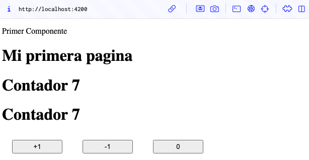

# Programación y Plataformas Web 

# Frameworks Web: Angular

<div align="center">
  

</div>


## Practica 2: Fundamentos 

### Autores

**Pablo Torres**  
 📧 ptorersp@ups.edu.ec  
 💻 GitHub: [PabloT18](https://github.com/PabloT18)


## Fudamentos de Angular

## ¿Qué es Angular?

Angular es un framework de desarrollo web de código abierto mantenido por Google. Está diseñado para crear aplicaciones web dinámicas y de una sola página (SPA) utilizando TypeScript como lenguaje principal. Angular proporciona una estructura robusta y herramientas integradas para facilitar el desarrollo, la prueba y el mantenimiento de aplicaciones web complejas.

## Características principales de Angular

1. **Componentes**: Angular utiliza una arquitectura basada en componentes, donde cada componente representa una parte reutilizable de la interfaz de usuario con su propia lógica y estilo.

2. **Data Binding**: Angular ofrece un sistema de enlace de datos bidireccional que sincroniza automáticamente los datos entre el modelo y la vista, facilitando la actualización de la interfaz de usuario.

3. **Directivas**: Las directivas son atributos especiales que permiten manipular el DOM de manera declarativa, facilitando la creación de comportamientos personalizados en los elementos HTML.

4. **Inyección de Dependencias**: Angular tiene un sistema de inyección de dependencias que facilita la gestión y reutilización de servicios y componentes en toda la aplicación.

5. **Ruteo**: Angular incluye un sistema de enrutamiento que permite la navegación entre diferentes vistas y componentes dentro de una aplicación de una sola página.

6. **Herramientas de Desarrollo**: Angular CLI (Command Line Interface) es una herramienta poderosa que facilita la creación, construcción y mantenimiento de proyectos Angular.

## Rutas

Angular utiliza un sistema de enrutamiento para gestionar la navegación entre diferentes vistas y componentes. Las rutas se definen en el módulo de enrutamiento de la aplicación y permiten cargar componentes específicos en función de la URL solicitada.


## Directivas

Las directivas en Angular son atributos o elementos especiales que permiten manipular el DOM de manera declarativa. Existen tres tipos principales de directivas:

## Servicios
Los servicios en Angular son clases que proporcionan funcionalidades específicas y se utilizan para compartir datos y lógica entre diferentes componentes. Los servicios se inyectan en los componentes mediante el sistema de inyección de dependencias de Angular.

## Pipes

Los pipes en Angular son funciones que transforman los datos antes de mostrarlos en la vista. Se utilizan para formatear, filtrar o transformar valores en plantillas HTML de manera sencilla y reutilizable.

* Modificar el texto a mayúsculas:
```html
{{ 'texto de ejemplo' | uppercase }}
```
 * Ordena y filtra:
```html
<li *ngFor="let item of items | orderBy: 'name' | filter: 'active'">
  {{ item.name }}
</li>
```

## Componentes de Angular

Los componentes son la piedra angular de cualquier aplicación Angular. Cada componente consta de tres partes principales:

1. **Clase del Componente**: Define la lógica y el comportamiento del componente utilizando TypeScript.

2. **Plantilla HTML**: Define la estructura y el diseño de la interfaz de usuario del componente.

3. **Estilos CSS**: Define la apariencia visual del componente, peude ser SCSS o cualquier otro preprocesador compatible.


## Resultados

### Creacion de un componente

Uso el comando `ng generate component` para crear un nuevo componente en Angular. Este comando genera automáticamente los archivos necesarios y actualiza el módulo correspondiente.

Componentes generados: HomePage, el cual le coloco en la carpeta `src/app/home/pages/homePage`.



### Resolucion tarea

Seguir las instrucciones del siguiente GIST: [GIST](https://gist.github.com/PabloT18/f15f92224806731541d48027df336497)


1. Captura de `app.routes.ts`
2. Captura de `perfilPage.ts`
3. Captura de `perfilPage.html`
4. Captura de la pagina desplegada
5. Enlace a la pagina de githubPages
6. Enlace la repositorio de github del proyecto.

Paso 5 y 6 debe estar subido al AVAC. 

