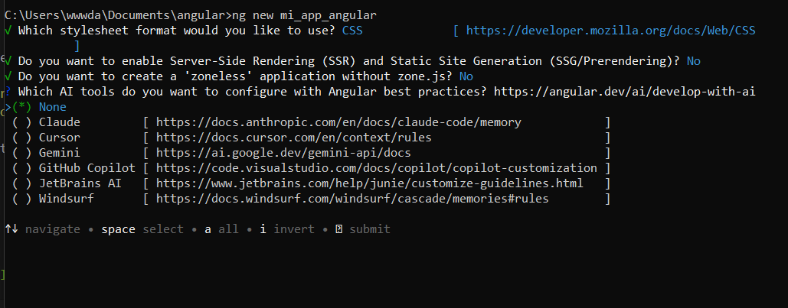
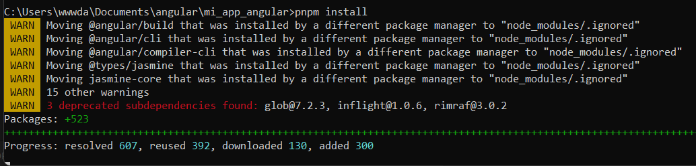
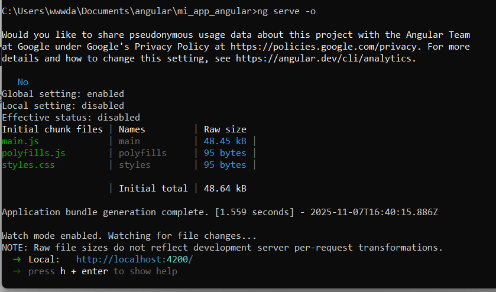
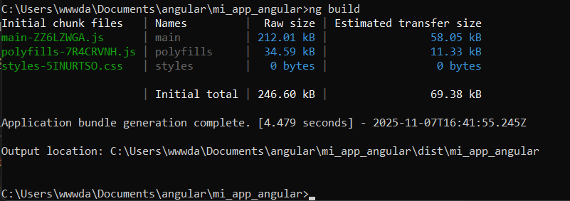

# Programación y Plataformas Web
## Frameworks Web: Angular

<div align="center">
  
</div>

# Práctica 1: Instalación y Configuración de Angular
## Autores 

**Alex Guaman**
**Daniel Guanga**

# Instalación de Angular CLI

La forma recomendada para iniciar proyectos en Angular es usando **Angular CLI**.

## Crear un nuevo proyecto Angular

```bash
npm install -g @angular/cli
ng new mi-app-angular
```

Durante la creación del proyecto, selecciona las siguientes opciones:

- **CSS**: o el preprocesador de tu preferencia (SCSS recomendado)
- **SSR**: Colcar no (n)
- **zoneless**: Colocar no (n)
- **AI tools**: No usar ninugno (none)


Luego entra al proyecto e instala dependencias (si no lo hizo automáticamente):

```bash
cd mi-app-angular
pnpm install
```


## Correr en desarrollo

```bash
ng serve -o
```

## Servir en la red local

```bash
ng serve --host 0.0.0.0 --port 4200
```


## Compilar para producción

```bash
ng build
```


# Extensiones recomendadas para VS Code (Angular)

Estas extensiones potencian el desarrollo con Angular:

- [**Angular Language Service**](https://marketplace.visualstudio.com/items?itemName=Angular.ng-template)
  — IntelliSense y autocompletado para Angular.

- [**Angular Snippets (Version 16)**](https://marketplace.visualstudio.com/items?itemName=johnpapa.Angular2)
  — Fragmentos de código para componentes, módulos, servicios, etc.

- [**ESLint**](https://marketplace.visualstudio.com/items?itemName=dbaeumer.vscode-eslint)
  — Linter para mantener un código limpio y consistente.

- [**Prettier - Code Formatter**](https://marketplace.visualstudio.com/items?itemName=esbenp.prettier-vscode)
  — Formateo automático de código.

- [**Material Icon Theme**](https://marketplace.visualstudio.com/items?itemName=PKief.material-icon-theme)
  — Iconos visuales para los archivos Angular.

- [**Auto Import**](https://marketplace.visualstudio.com/items?itemName=steoates.autoimport)
  — Importación automática de módulos y componentes.

# Hoja de atajos — Angular CLI

## Comandos básicos

```bash
ng new mi-app-angular         # Crear un nuevo proyecto Angular
ng serve -o                   # Iniciar servidor y abrir navegador
ng build                      # Compilar para producción
ng generate component nombre  # Crear un nuevo componente
ng generate service nombre    # Crear un nuevo servicio
ng test                       # Ejecutar pruebas unitarias
```

## Parámetros útiles

- `--routing` → Incluye el módulo de enrutamiento.
- `--style=scss` → Usa SCSS como preprocesador.
- `--standalone` → Crea componentes independientes (Angular moderno).

## Estructura creada automáticamente (Angular CLI)

- `src/` → Código fuente.
- `src/app/` → Componentes, módulos, servicios, rutas.
- `src/main.ts` → Punto de entrada.
- `src/index.html` → HTML principal.
- `angular.json` → Configuración del proyecto Angular.
- `package.json` → Dependencias y scripts.
- `tsconfig.json` → Configuración de TypeScript.

---

📄 **Autor:** Guaman Guanga  
📅 **Framework documentado:** Angular  
🔧 **Propósito:** Documentación de instalación, configuración y estructura del framework Angular.
