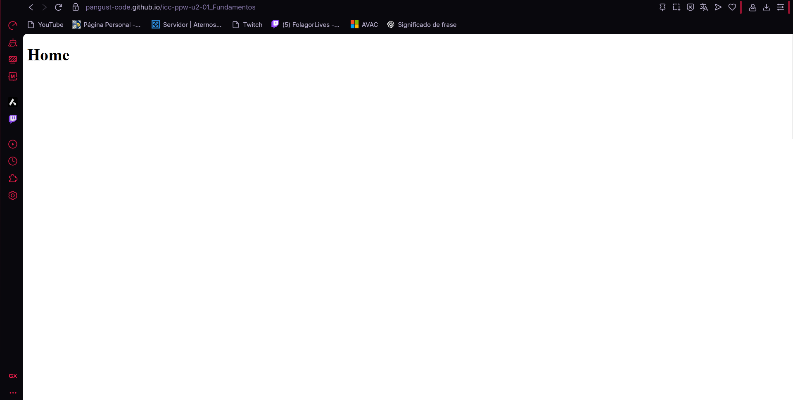
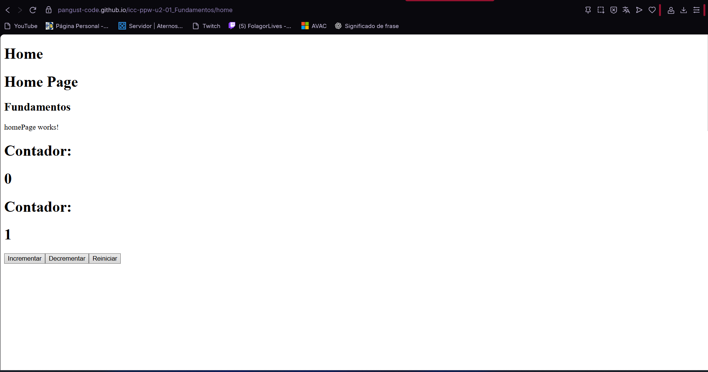

# Programación y Plataformas Web · Práctica 2: Fundamentos (Angular)

<div align="center">
  
</div>

# 👨‍💻 Autores 

**Alex Guaman**  

**Daniel Guanga**

# 🎯 Objetivos de esta práctica

1. Crear un proyecto **Angular** funcional con rutas básicas.
2. Implementar componentes con **signals** y **ChangeDetectionStrategy.OnPush**.
3. Crear un **HomePage** con dos contadores (manual y automático).
4. Implementar un **PerfilPage** con señales reactivas para nombre, apellido y edad.
5. Utilizar el **Router de Angular** para navegar entre Home y Perfil.

---

# 💡 Qué hicimos y por qué

- Usamos **standalone components** en lugar de módulos (Angular moderno).
- Utilizamos **signals** para manejar estado reactivo.
- Añadimos un contador automático mediante `setInterval()`.
- Aplicamos **ChangeDetectionStrategy.OnPush** para optimizar el rendimiento.
- Implementamos rutas con `@angular/router` para Home y Perfil.

---

# 🧩 Estructura mínima

```bash
src/
  app/
    features/
      homePage/
        homePage.ts
        homePage.html
      perfilPage/
        perfilPage.ts
        perfilPage.html
    app.routes.ts
  main.ts
  styles.css
```

---

# ⚙️ Código principal

## 🏠 HomePage

**homePage.html**
```html
<h1>Home Page</h1>
<h2>Fundamentos</h2>
<p>homePage works!</p>
<h1>Contador:</h1> <h1>{{ counter }}</h1>
<h1>Contador Signal:</h1> <h1>{{ counterSignal() }}</h1>
<button (click)="changeValue(1)">Incrementar</button>
<button (click)="changeValue(-1)">Decrementar</button>
<button (click)="resetValue(0)">Reiniciar</button>
```

**homePage.ts**
```typescript
import { ChangeDetectionStrategy, Component, signal } from '@angular/core';

@Component({
  selector: 'app-home-page',
  standalone: true,
  imports: [],
  templateUrl: './homePage.html',
  changeDetection: ChangeDetectionStrategy.OnPush,
})
export class HomePage {
  constructor() {
    setInterval(() => {
      this.counterSignal.update((v) => v + 1);
    }, 1000);
  }

  counter = 0;
  counterSignal = signal(0);

  changeValue(value: number) {
    this.counter += value;
    this.counterSignal.update((current) => current + value);
  }

  resetValue(value: number) {
    this.counter = value;
    this.counterSignal.set(value);
  }
}
```

---

## 👤 PerfilPage

**perfilPage.html**
```html
<h1>{{ name() }}</h1>

<dl>
  <td>Nombre:</td>
  <dd>{{ name() }}</dd>

  <td>Apellido:</td>
  <dd>{{ lastName() }}</dd>

  <td>Edad:</td>
  <dd>{{ age() }}</dd>

  <td>Nombre Completo:</td>
  <dd>{{ getFullName() }}</dd>

  <td>Nombre y Apellido (Mayúsculas):</td>
  <dd>{{ (name() + ' ' + lastName()).toUpperCase() }}</dd>
</dl>

<button (click)="changeData()">Cambiar datos</button>
<button (click)="changeAge()">Cambiar edad</button>
<button (click)="resetData()">Reset</button>
```

**perfilPage.ts**
```typescript
import { ChangeDetectionStrategy, Component, signal } from '@angular/core';

@Component({
  selector: 'app-perfil-page',
  standalone: true,
  templateUrl: './perfilPage.html',
  changeDetection: ChangeDetectionStrategy.OnPush
})
export class PerfilPage {
  name = signal('Juan');
  lastName = signal('Pérez');
  age = signal(30);

  getFullName(): string {
    return `${this.name()} ${this.lastName()} con edad ${this.age()} años`;
  }

  changeData(): void {
    this.name.set('Ana');
    this.lastName.set('Gonzales');
    this.age.set(25);
  }

  changeAge(): void {
    this.age.set(18);
  }

  resetData(): void {
    this.name.set('Juan');
    this.lastName.set('Pérez');
    this.age.set(30);
  }
}
```

---

# 🌐 Rutas

**app.routes.ts**
```typescript
import { Routes } from '@angular/router';
import { HomePage } from './features/homePage/homePage';
import { PerfilPage } from './features/perfilPage/perfilPage';

export const routes: Routes = [
  { path: 'home', component: HomePage },
  { path: 'perfil', component: PerfilPage },
  { path: '', redirectTo: 'home', pathMatch: 'full' }
];
```

---

# 🧠 Comprobaciones realizadas

- La navegación entre **Home** y **Perfil** funciona correctamente.
- Los botones de **HomePage** modifican el contador manual y automático.
- El `setInterval` incrementa el contador automáticamente.
- En **PerfilPage**, los botones modifican y resetean correctamente las señales.
- Las señales reaccionan automáticamente a los cambios en la UI.

---

# 🚀 Despliegue

Para ejecutar el proyecto:

```bash
npm install
ng serve
```

Para compilar para producción:

```bash
ng build
```

---

# 🧾 Criterios de evaluación

- Uso correcto de **signals**.
- Implementación funcional de los componentes `HomePage` y `PerfilPage`.
- Uso de `ChangeDetectionStrategy.OnPush`.
- Ruteo entre páginas funcional.
- Buenas prácticas en estructura y código limpio.

# Resultados






---

📄 **Autor:** Guaman Guanga  
📅 **Framework:** Angular  
🔧 **Práctica:** Fundamentos y Signals
