# Programación y Plataformas Web

# Frameworks Web: Angular

<div align="center">
  
</div>

## Práctica 3: Navegación en Angular

### Autores

**Alex Guaman**
**Daniel Guanga**

---

## 🧭 Navegación en Angular

La navegación en Angular es fundamentalmente diferente a la navegación tradicional en HTML. Mientras que en HTML usamos etiquetas `<a href="">`, en Angular utilizamos la directiva `routerLink` para crear aplicaciones de una sola página (SPA) que no requieren recargar la página completa.

## 🔄 ¿Por qué NO usar `href` tradicional?

### ❌ Navegación Tradicional con `href`:

```html
<!-- Esto RECARGA toda la página -->
<a href="/perfil">Ir al Perfil</a>
<a href="/productos">Ver Productos</a>
```

**Problemas:**

* ✗ Recarga completa de la página
* ✗ Pérdida del estado de la aplicación
* ✗ Mayor tiempo de carga
* ✗ Experiencia de usuario interrumpida

### ✅ Navegación con `routerLink`:

```html
<!-- Esto SOLO cambia el contenido, sin recargar -->
<a routerLink="/perfil">Ir al Perfil</a>
<a routerLink="/productos">Ver Productos</a>
```

**Ventajas:**

* ✓ Navegación instantánea
* ✓ Preserva el estado de la aplicación
* ✓ Mejor experiencia de usuario
* ✓ Aplicación de una sola página (SPA)

## 📚 ¿Qué son las Directivas?

Las **directivas** son instrucciones especiales que le dicen a Angular cómo modificar el DOM (Document Object Model). En Angular existen tres tipos:

### 1. **Directivas de Componente**

```typescript
@Component({
  selector: 'app-home'  // Esta es una directiva de componente
})
```

### 2. **Directivas Estructurales** (Angular 20+)

```html
<!-- Control para ingresar una listas de proyectos -->
  @for (proyecto of proyectos(); track proyecto.id) {
    <li>{{proyecto.name}} - {{proyecto.description}}</li>
  }
```
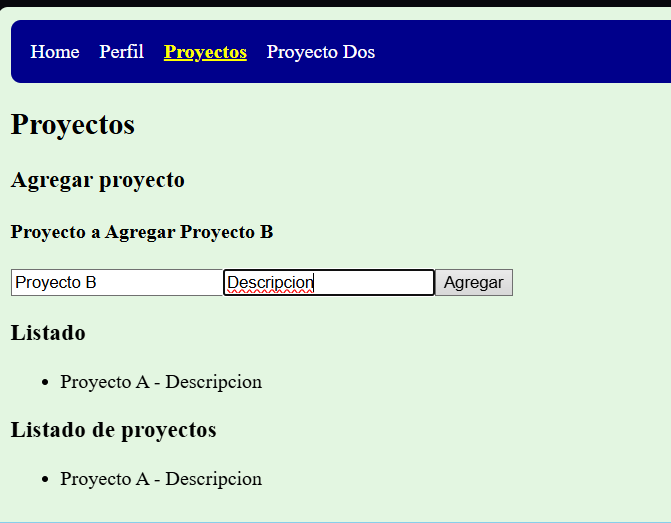
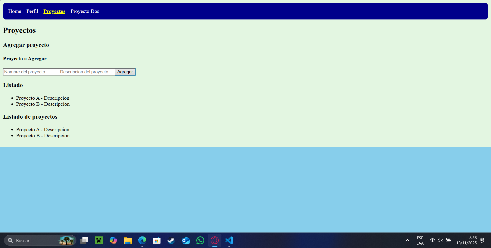

### 3. **Directivas de Atributo**

```html
<!-- routerLink es una directiva de atributo -->
<nav>

  <a routerLink="/home" routerLinkActive="active" [routerLinkActiveOptions]="{ exact: true }">Home</a>
  <a [routerLink]="['/perfil']" routerLinkActive="active">Perfil</a>
  <a routerLink="/proyectos" routerLinkActive="active">Proyectos</a>
  <a routerLink="/proyecto-dos" routerLinkActive="active">Proyecto Dos</a>

</nav>
```

## 🔗 RouterLink: Tipos de Sintaxis

Angular ofrece dos formas principales de usar `routerLink`:

### 1. **Sintaxis de String Simple**

```html
<a routerLink="/">Home</a>
<a routerLink="/productos">Productos</a>
<a routerLink="/contacto">Contacto</a>
```

**Características:**

* ✓ Sintaxis más simple
* ✓ Ideal para rutas estáticas
* ✓ Fácil de leer y escribir

### 2. **Sintaxis de Array (Binding)**

```html
<a [routerLink]="['/perfil']">Perfil</a>
<a [routerLink]="['/usuario', usuarioId]">Ver Usuario</a>
<a [routerLink]="['/productos', 'categoria', categoriaId]">Categoría</a>
```

**Características:**

* ✓ Permite pasar parámetros dinámicos
* ✓ Más flexible para rutas complejas
* ✓ Ideal para rutas con variables

## 💡 Ejemplos Prácticos

### Ejemplo 1: Navegación Básica

```typescript
// app.component.ts
import { Component } from '@angular/core';
import { RouterModule } from '@angular/router';
import { CommonModule } from '@angular/common';

@Component({
  selector: 'app-root',
  standalone: true,
  imports: [RouterModule, CommonModule],
  template: `
    <nav>
      <h2>Mi Aplicación Angular</h2>
      <ul>
        <li><a routerLink="/">🏠 Inicio</a></li>
        <li><a routerLink="/productos">📦 Productos</a></li>
        <li><a routerLink="/contacto">📞 Contacto</a></li>
      </ul>
    </nav>
    
    <!-- Aquí se renderizan los componentes según la ruta -->
    <router-outlet></router-outlet>
  `,
  styles: `
    nav { background: #f0f0f0; padding: 1rem; margin-bottom: 2rem; }
    ul { list-style: none; display: flex; gap: 1rem; }
    a { text-decoration: none; color: #007bff; padding: 0.5rem 1rem; border-radius: 4px; }
    a:hover { background: #e9ecef; }
  `
})
export class AppComponent {
  title = 'navegacion-ejemplo';
}
```

### Ejemplo 2: Navegación con Parámetros

```typescript
// productos.component.ts
import { Component, signal } from '@angular/core';
import { RouterModule } from '@angular/router';
import { CommonModule } from '@angular/common';

@Component({
  selector: 'app-productos',
  standalone: true,
  imports: [RouterModule, CommonModule],
  template: `
    <h2>Lista de Productos</h2>
    
    @for (producto of productos(); track producto.id) {
      <div class="producto-card">
        <h3>{{ producto.nombre }}</h3>
        <p>{{ producto.descripcion }}</p>
        <p><strong>Precio: ${{ producto.precio }}</strong></p>
        
        <!-- Navegación con parámetros usando sintaxis de array -->
        <a [routerLink]="['/producto', producto.id]">
          👁️ Ver Detalles
        </a>
      </div>
    }
  `,
  styles: `
    .producto-card { border: 1px solid #dee2e6; padding: 1rem; margin: 1rem 0; border-radius: 8px; }
    .producto-card a { background: #007bff; color: white; padding: 0.5rem 1rem; text-decoration: none; border-radius: 4px; display: inline-block; margin-top: 0.5rem; }
    .producto-card a:hover { background: #0056b3; }
  `
})
export class ProductosComponent {
  productos = signal([
    { id: 1, nombre: 'Laptop', descripcion: 'Laptop Gaming', precio: 1200 },
    { id: 2, nombre: 'Mouse', descripcion: 'Mouse Inalámbrico', precio: 25 },
    { id: 3, nombre: 'Teclado', descripcion: 'Teclado Mecánico', precio: 80 }
  ]);
}
```

## 🎯 Diferencias Clave: String vs Array

| Aspecto         | Sintaxis String      | Sintaxis Array             |
| --------------- | -------------------- | -------------------------- |
| **Formato**     | `routerLink="/ruta"` | `[routerLink]="['/ruta']"` |
| **Parámetros**  | ❌ No soporta         | ✅ `['/ruta', parametro]`   |
| **Variables**   | ❌ Solo texto fijo    | ✅ Puede usar variables     |
| **Complejidad** | Simple               | Más flexible               |

### Ejemplos Comparativos:

```html
<!-- ✅ String: Ideal para rutas fijas -->
<a routerLink="/">Inicio</a>
<a routerLink="/productos">Productos</a>
<a routerLink="/contacto">Contacto</a>

<!-- ✅ Array: Ideal para rutas dinámicas -->
<a [routerLink]="['/perfil']">Mi Perfil</a>
<a [routerLink]="['/usuario', usuario.id]">Ver Usuario: {{ usuario.nombre }}</a>
<a [routerLink]="['/producto', producto.id, 'reviews']">Reviews del Producto</a>

<!-- 🔍 Ejemplo con múltiples parámetros -->
<a [routerLink]="['/categoria', categoria.id, 'producto', producto.id]">
  Ver Producto en Categoría
</a>
```

## 🚀 RouterLink Activo

Para destacar el enlace activo, Angular proporciona `routerLinkActive`:

```html
<nav>
  <a routerLink="/" 
     routerLinkActive="active" 
     [routerLinkActiveOptions]="{exact: true}">
    Inicio
  </a>
  
  <a routerLink="/productos" 
     routerLinkActive="active">
    Productos
  </a>
  
  <a routerLink="/contacto" 
     routerLinkActive="active">
    Contacto
  </a>
<nav>

<style>
.active {
  background-color: #007bff;
  color: white;
  font-weight: bold;
}
</style>
```

## 📱 Navegación Programática

También podemos navegar desde el código TypeScript:

```typescript
import { Component, inject } from '@angular/core';
import { Router } from '@angular/router';

@Component({
  selector: 'app-ejemplo',
  template: `
    <button (click)="irAProductos()">Ver Productos</button>
    <button (click)="irAProducto(123)">Ver Producto 123</button>
  `
})
export class EjemploComponent {
  private router = inject(Router);
  
  irAProductos() {
    this.router.navigate(['/productos']);
  }
  
  irAProducto(id: number) {
    this.router.navigate(['/producto', id]);
  }
}
```

## 🎓 Resumen

1. **RouterLink** es una directiva de Angular que permite navegación SPA
2. **No usar `href`** porque recarga la página completa
3. **Sintaxis String**: Simple, para rutas fijas (`routerLink="/inicio"`)
4. **Sintaxis Array**: Flexible, para rutas con parámetros (`[routerLink]="['/perfil']"`)
5. **RouterLinkActive**: Para destacar enlaces activos
6. **navegacion/Navegación programática**: Usando el servicio Router

La navegación en Angular es mucho más eficiente y proporciona una mejor experiencia de usuario comparada con la navegación tradicional HTML.

## 🛠️ Implementación Práctica

### Paso 1: Crear las Páginas Principales

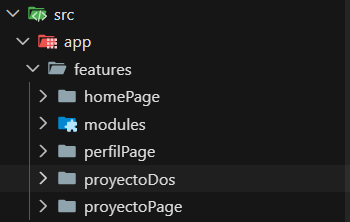

#### 1.1 Crear ProyectosPage

```ts

import { ChangeDetectionStrategy, Component, signal } from '@angular/core';
import { ListadoProyectos } from './components/listado-proyectos/listado-proyectos';

@Component({
  selector: 'app-proyecto-page',
  imports: [ListadoProyectos],
  templateUrl: './proyectoPage.html',
  changeDetection: ChangeDetectionStrategy.OnPush,
})
export class ProyectoPage {
  name = signal('');
  description = signal('');

  proyectos = signal<Proyecto[]>([{ id: 1, name: 'Proyecto A', description: 'Descripcion' }]);

  changeName(value: string) {
    this.name.set(value);
  }
  changeDescription(value: string) {
    this.description.set(value);
  }
  addProyecto() {
    const newProyecto: Proyecto = {
      id: this.proyectos().length + 1,
      name: this.name(),
      description: this.description()
    };
    this.proyectos.set([...this.proyectos(), newProyecto]);
    this.name.set('');
    this.description.set('');
  }
}

```

```html
<h1>Proyectos</h1>

<section>
  <div>
    <h3>Agregar proyecto</h3>
    <h4>Proyecto a Agregar {{name()}}</h4>
    <input
      type="text"
      placeholder="Nombre del proyecto"
      [value]="name()"
      (change)="changeName(txtName.value)"
      #txtName
    >
    <input
      type="text"
      placeholder="Descripcion del proyecto"
      [value]="description()"
      (change)="changeDescription(txtDescription.value)"
      #txtDescription
    >
    <button (click)="addProyecto()">Agregar</button>
  </div>

  <div>
    <h3>Listado</h3>
    <!-- <ul>
      <li>Proyecto 1</li>
      <li>Proyecto 2</li>
    </ul> -->
    <ul>
      @for (proyecto of proyectos(); track proyecto.id) {
        <li>{{proyecto.name}} - {{proyecto.description}}</li>
      }
    </ul>
  </div>
  <listado-proyectos [listName]="'Listado de proyectos'" [proyectos]="proyectos()"></listado-proyectos>
</section>
```
**Creacion de una carpeta de interfaces**
Esta carpeta sirve para organizar y tipar tus datos de forma clara, reutilizable y profesional.

```ts
interface Proyecto {
  id: number;
  name: string;
  description: string;
}
```
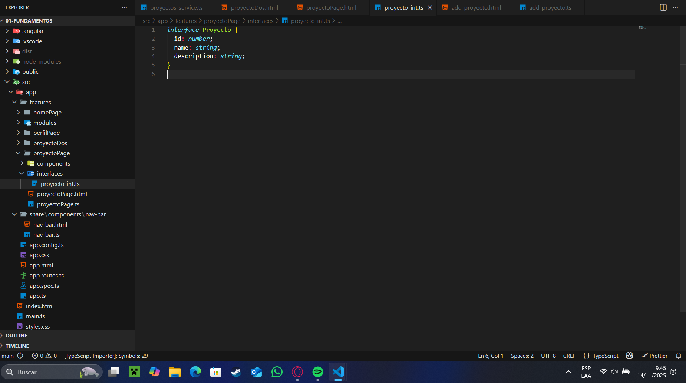

#### 1.2 Crear ProyectosDosPage

```html
<listado-proyectos [listName]="'Listado de proyectos desde Servicio'" [proyectos]="proyectosService.proyectos()"></listado-proyectos>
<p>Aqui deberia estar un componente que agregue al servicio</p>
<add-proyecto (newProyecto)="proyectosService.addProyecto($event)"
             (removeProyecto)="proyectosService.deleteProyecto()"></add-proyecto>
```

```ts
import { ChangeDetectionStrategy, Component, inject } from '@angular/core';
import { ProyectosService } from './services/proyectos-service';
import { ListadoProyectos } from '../proyectoPage/components/listado-proyectos/listado-proyectos';
import { AddProyecto } from '../proyectoPage/components/add-proyecto/add-proyecto';

@Component({
  selector: 'app-proyecto-dos',
  imports: [ListadoProyectos, AddProyecto],
  templateUrl: './proyectoDos.html',
  changeDetection: ChangeDetectionStrategy.OnPush,
})
export class ProyectoDos {

  proyectosService = inject(ProyectosService);

 }
```


### Paso 2: Configurar las Rutas

```ts
import { Component } from '@angular/core';
import { Routes } from '@angular/router';
import { HomePage } from './features/homePage/homePage';
import { PerfilPage } from './features/perfilPage/perfilPage';
import { ProyectoPage } from './features/proyectoPage/proyectoPage';
import { ProyectoDos } from './features/proyectoDos/proyectoDos';

export const routes: Routes = [
  {
    path: 'home',
    component: HomePage
  },
  {
    path: 'perfil',
    component: PerfilPage
  },
  {
    path: 'proyectos',
    component: ProyectoPage
  },
  {
    path: 'proyecto-dos',
    component: ProyectoDos
  },
];
```
### Paso 3: Agregar al Navbar

```html
<nav>
  <!-- <a href="/home">Home</a>
  <a href="/perfil">Perfil</a> -->

  <a routerLink="/home" routerLinkActive="active" [routerLinkActiveOptions]="{ exact: true }">Home</a>
  <a [routerLink]="['/perfil']" routerLinkActive="active">Perfil</a>
  <a routerLink="/proyectos" routerLinkActive="active">Proyectos</a>
  <a routerLink="/proyecto-dos" routerLinkActive="active">Proyecto Dos</a>

</nav>
```

```ts
import { ChangeDetectionStrategy, Component } from '@angular/core';
import { RouterLink, RouterLinkActive } from "@angular/router";

@Component({
  selector: 'app-nav-bar',
  imports: [RouterLink, RouterLinkActive],
  templateUrl: './nav-bar.html',
  styles: [`
    nav {
      background-color: darkblue;
      padding: 1rem;
      border-radius: 8px;
    }
    a {
      color: white;
      margin-right: 1rem;
      text-decoration: none;
    }
    a.active {
      color: yellow;
      font-weight: bold;
      text-decoration: underline;
    }
    a:hover {
      text-decoration: underline;
    }
  `],
  changeDetection: ChangeDetectionStrategy.OnPush,
})
export class NavBar { }
```

### Paso 4: Crear Componentes para Proyectos y separarlos en componentes individuales

**Creacion de la carpeta components**

Es un directorio donde guardas todos los componentes reutilizables o partes visuales de tu proyecto.

Ejemplos de componentes:

encabezado (header)

barra lateral

formulario

tabla

tarjeta de proyecto

lista de tareas

botones personalizados

modales

etc.

Codigo de los archivos de add-proyecto:

```html
<div>
<h3>Agregar proyecto</h3>
<h4>Proyecto a Agregar {{name()}}</h4>
<input type="text" placeholder="Nombre del proyecto" [value]="name()" (change)="changeName(txtName.value)" #txtName>
<input type="text" placeholder="Descripcion del proyecto" [value]="description()"
  (change)="changeDescription(txtDescription.value)" #txtDescription>
<button (click)="addProyecto()" >Agregar</button>
<button (click)="deleteProyecto(1)" >Eliminar</button>
</div>
```

```ts
import { ChangeDetectionStrategy, Component, output, signal } from '@angular/core';

@Component({
  selector: 'add-proyecto',
  imports: [],
  templateUrl: './add-proyecto.html',
  styles: [
    `
    button {
      margin: 5px;
    }
    `
  ],
  changeDetection: ChangeDetectionStrategy.OnPush,
})
export class AddProyecto {


  name = signal('');
  description = signal('');
  //input
  newProyecto = output<Proyecto>();
  removeProyecto = output<number>();

  changeName(value: string) {
    this.name.set(value);
  }

  changeDescription(value: string) {
    this.description.set(value);
  }

  addProyecto() {
    const newProyecto: Proyecto = {
      id: Math.floor(Math.random() * 1000),
      name: this.name(),
      description: this.description()
    };

    this.newProyecto.emit(newProyecto);
    this.name.set('');
    this.description.set('');

  }

  deleteProyecto(id: number) {
    this.removeProyecto.emit(id);
  }

 }
```

Codigo de los archivos de listado-proyectos

```html
<h1>{{listName()}}</h1>
<ul>
  @for (proyecto of proyectos(); track proyecto.id) {
    <li>{{proyecto.name}} - {{proyecto.description}}</li>
  }
</ul>
```

```ts
import { ChangeDetectionStrategy, Component, input } from '@angular/core';

@Component({
  selector: 'listado-proyectos',
  imports: [],
  templateUrl: './listado-proyectos.html',
  changeDetection: ChangeDetectionStrategy.OnPush,
})
export class ListadoProyectos {

  listName = input.required<string>();
  proyectos = input.required<Array<Proyecto>>();

 }
```

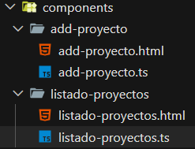


## 📸 Capturas de Implementación

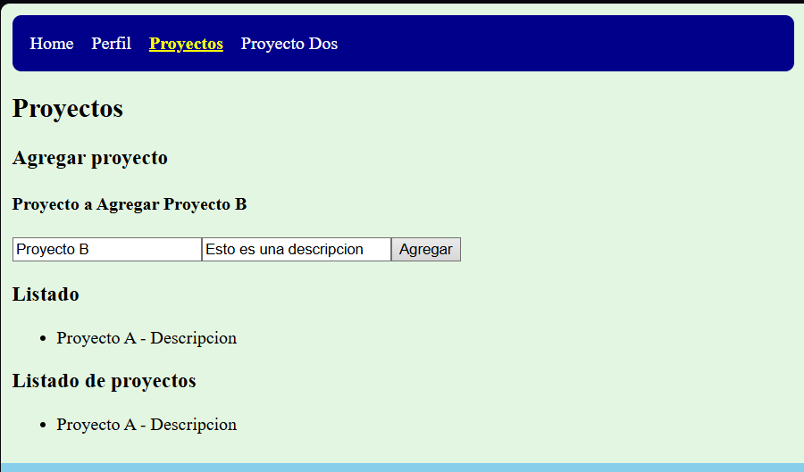
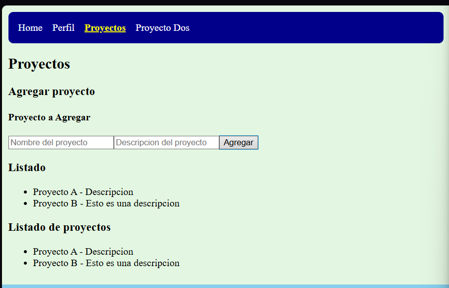
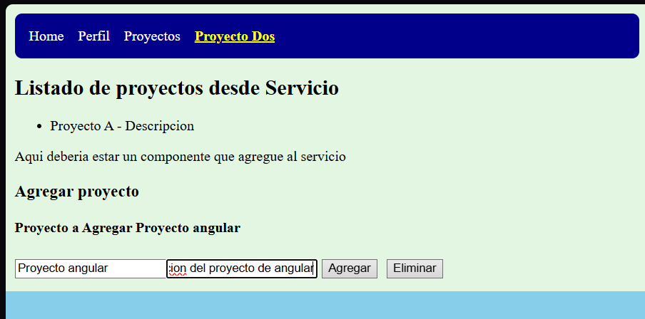
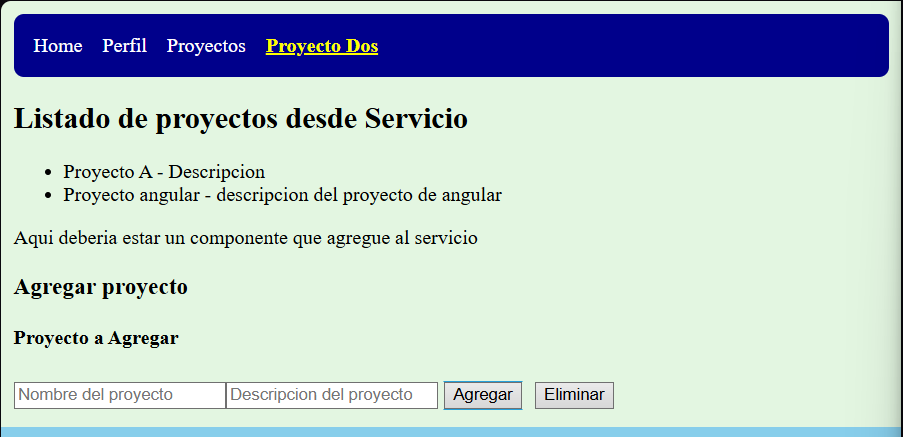
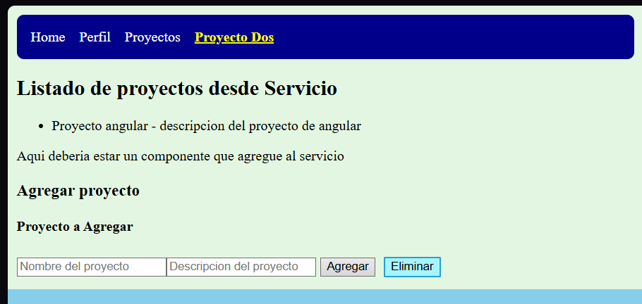

### 1. Configuración de Rutas (app.routes.ts)

```typescript
import { Routes } from '@angular/router';
import { HomePage } from './features/homePage/homePage';
import { PerfilPage } from './features/perfilPage/perfilPage';
import { ProyectosPages } from './features/ProyectosPages/ProyectosPages';
import { ProyectosDosPages } from './features/ProyectosDosPages/ProyectosDosPages';

export const routes: Routes = [
  { path: '', component: HomePage },
  { path: 'perfil', component: PerfilPage },
  { path: 'proyectos', component: ProyectosPages },
  { path: 'proyectos-dos', component: ProyectosDosPages },
];
```

### 2. Navegación con RouterLink

```html
<nav>
  <a
    routerLink=""
    routerLinkActive="active"
    [routerLinkActiveOptions]="{ exact: true }"
  >Home</a>

  <a
    routerLink="/perfil"
    routerLinkActive="active"
    [routerLinkActiveOptions]="{ exact: true }"
  >Perfil</a>

  <a
    routerLink="/proyectos"
    routerLinkActive="active"
    [routerLinkActiveOptions]="{ exact: true }"
  >Proyectos</a>

  <a
    routerLink="/proyectos-dos"
    routerLinkActive="active"
    [routerLinkActiveOptions]="{ exact: true }"
  >Proyectos Dos</a>
<nav>
```
### 3. Componente con Navegación

```typescript
import { ChangeDetectionStrategy, Component } from '@angular/core';
import { RouterLink, RouterLinkActive } from '@angular/router';

@Component({
  selector: 'app-nav-bar',
  standalone: true,
  imports: [RouterLink, RouterLinkActive],
  templateUrl: '.nav-bar.html',
  styles: [`
    nav { background-color: skyblue; margin-right: 1rem; padding: 1rem; }
    a { color: white; margin-right: 1rem; text-decoration: none; }
    a:hover { color: yellow; font-weight: bold; text-decoration: underline; }
    .active { font-weight: bold; text-decoration: underline; }
  `],
  changeDetection: ChangeDetectionStrategy.OnPush,
})
export class NavBar {}
```
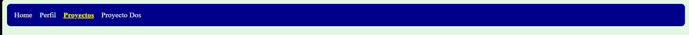 

### 4. Aplicación Funcionando

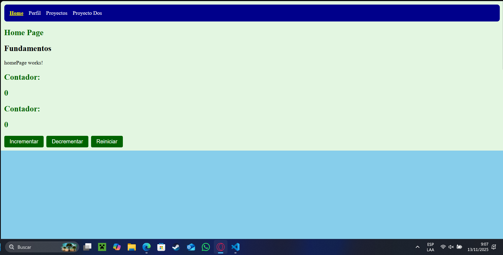
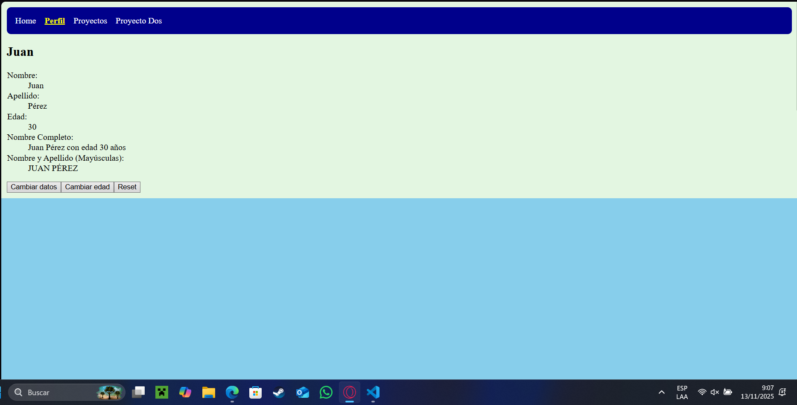
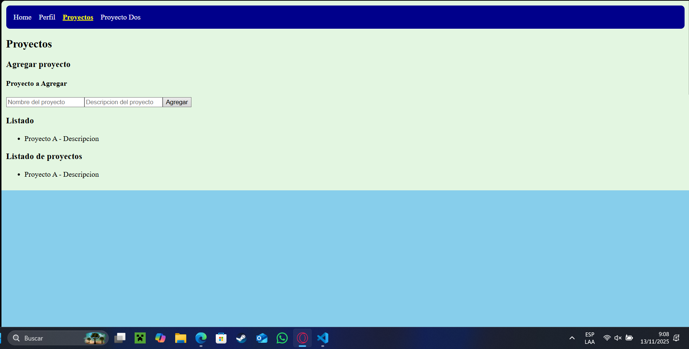
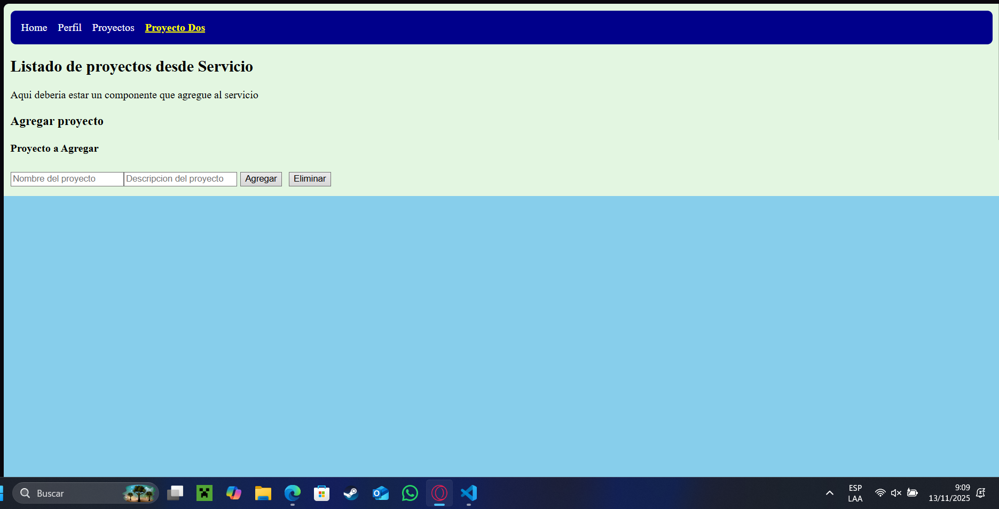

## 🔗 Enlaces del Proyecto

* **Repositorio GitHub**: [Enlace al repositorio]
* **GitHub Pages**: [Enlace a la aplicación desplegada]

## 📝 Notas de Implementación

* Usé Angular 20+ con sintaxis moderna
* Implementé tanto navegación estática como dinámica
* Agregué estilos para mejorar la experiencia de usuario
* Utilicé signals para el manejo de estado moderno
* Apliqué las mejores prácticas de navegación SPA
