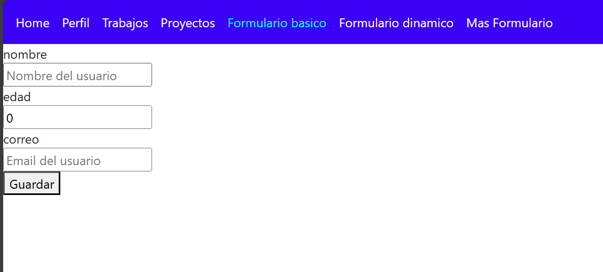
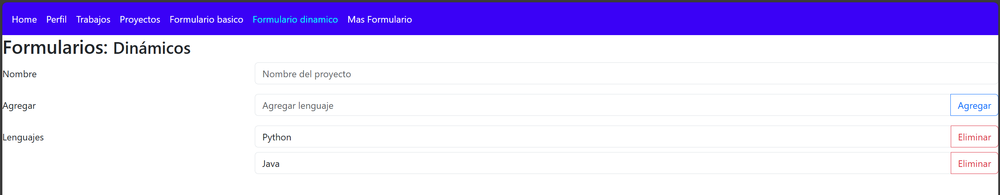
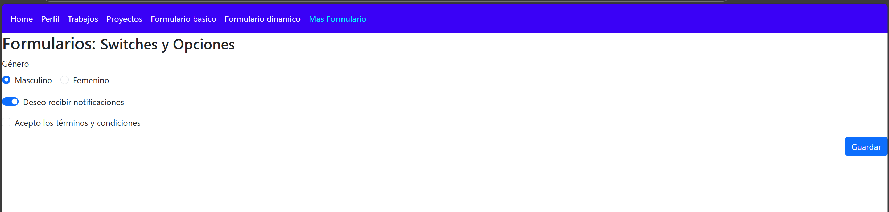
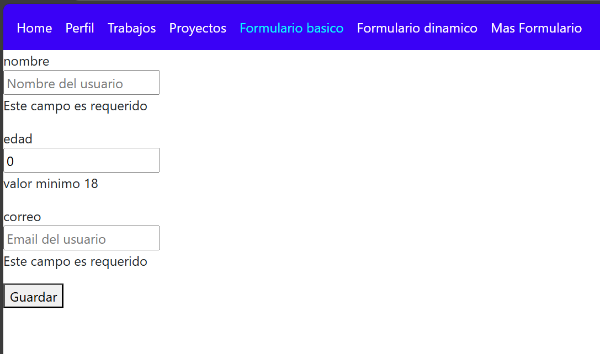
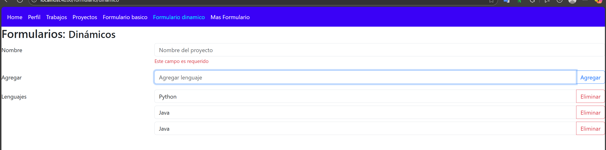
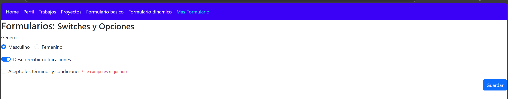
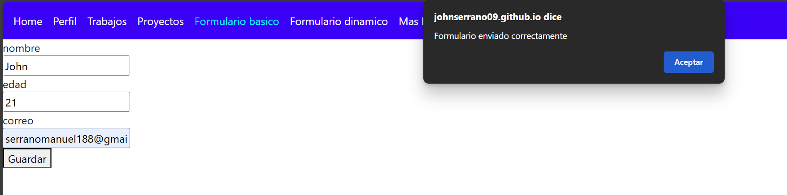
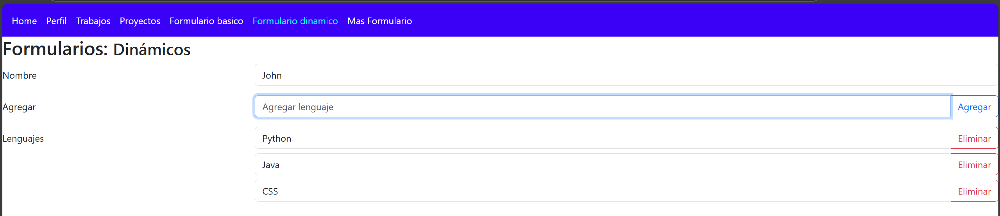
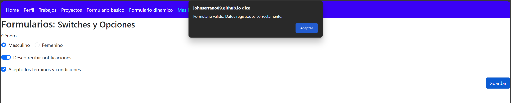

# Programación y Plataformas Web

## Frameworks Web: Angular

  

## Práctica 4: Formularios Reactivos en Angular

# Resultados 

1. Tres capturas por cada pagina con los formularios  
  * Pagina formulario vacio
  
  
  

  * Pagina fomrualurio mostrar todos los errores
  
  
  
  * Página formulario enviado correctamente y muestra en listado
  
  
  

