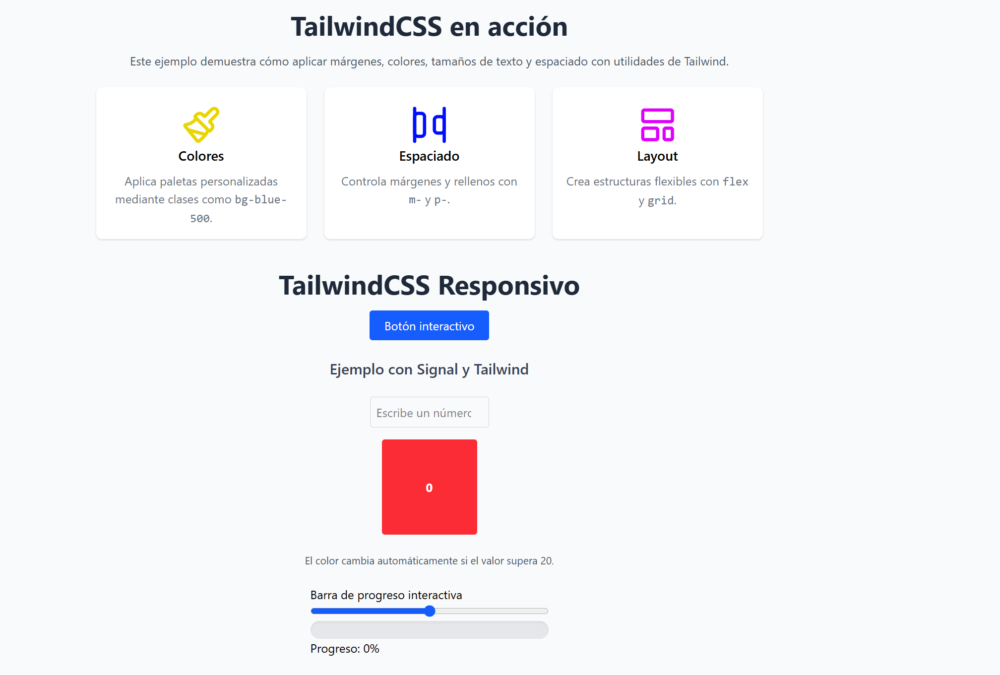
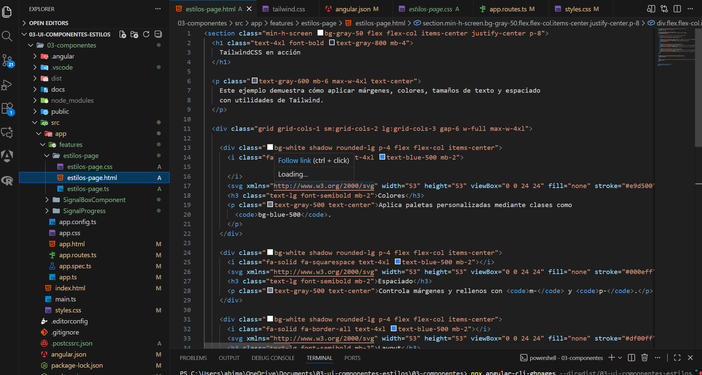

# Programación y Plataformas Web

## Frameworks Web: Angular + TailwindCSS

# Resultado esperado de la práctica

1. Enlace a pagina desplegada: https://johnserrano09.github.io/03-Estilos/
2. Captura de pagina con estilos aplicados 

3. Captura de estilos-page.html

