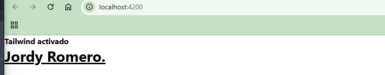
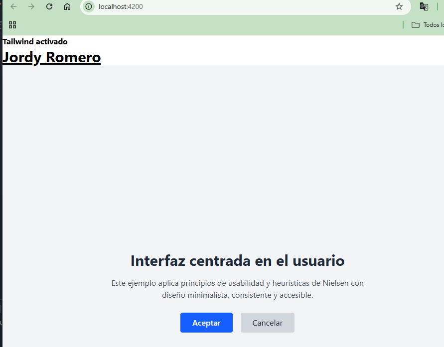
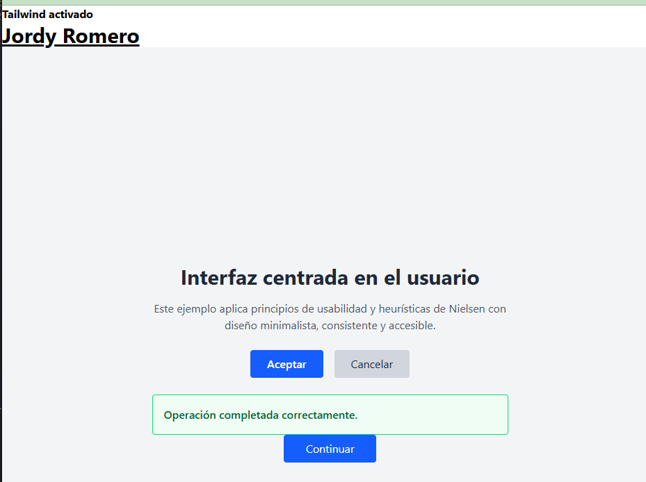
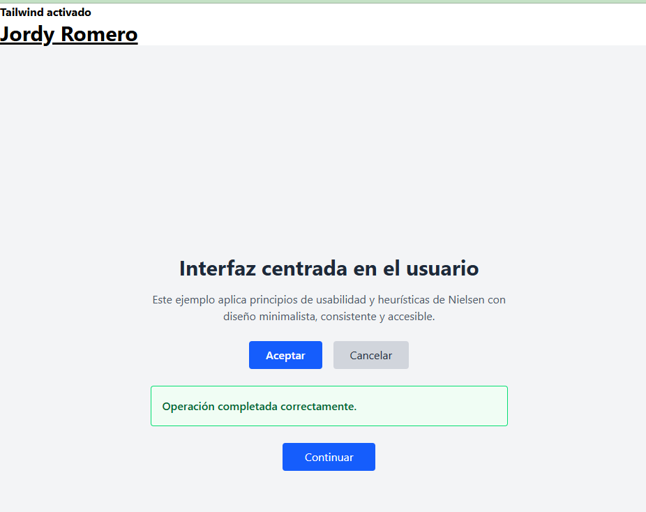

# Programación y Plataformas Web

## Frameworks Web: Angular + TailwindCSS

<div align="center">
  
  <span style="font-size: 80px; color: black; margin: 20px 20px;">+</span>
  
</div>

## Práctica 5: Interfaz, Heurísticas y Usabilidad

### Autor

### Autor

**Nayeli Barbecho**  

**Jordy Romero**  

---

# Introducción a la Interfaz Gráfica

Una **interfaz gráfica de usuario (GUI)** es el medio visual y funcional mediante el cual una persona interactúa con un sistema informático.
Su diseño influye directamente en la **experiencia del usuario (UX)**, la **eficiencia de las tareas** y la **accesibilidad** del software.

Una interfaz bien construida debe:

* Comunicar con claridad el propósito de cada elemento.
* Ser coherente visualmente.
* Permitir la interacción sin esfuerzo cognitivo excesivo.
* Adaptarse a distintos dispositivos y contextos de uso.

El diseño de la interfaz es tanto **técnico** como **humano**: combina la programación con principios de psicología cognitiva, percepción visual y comportamiento del usuario.

---

## Interacción Humano–Máquina (IHM)

La **interacción humano–máquina (HCI)** estudia la forma en que las personas se comunican con los sistemas computacionales.
Su objetivo principal es **mejorar la eficiencia, seguridad y satisfacción** durante el uso del software.

Algunos principios clave:

1. **Aprendizaje y memoria:** los usuarios deben comprender e interiorizar el funcionamiento de la interfaz sin esfuerzo.
2. **Retroalimentación inmediata:** toda acción debe generar una respuesta clara (mensaje, animación, cambio visual).
3. **Control y libertad:** el usuario debe poder deshacer o cancelar acciones fácilmente.
4. **Consistencia:** los mismos elementos deben comportarse de la misma manera en todo el sistema.
5. **Compatibilidad:** el diseño debe alinearse con las expectativas y conocimientos previos del usuario.

---

## Usabilidad

La **usabilidad** mide la facilidad con que los usuarios pueden utilizar un producto digital para lograr sus objetivos.
No se trata solo de estética, sino de **eficiencia, efectividad y satisfacción**.

### Componentes de la usabilidad

* **Aprendizaje:** qué tan rápido una persona puede comenzar a usar la aplicación.
* **Eficiencia:** rapidez con que se completan las tareas.
* **Memorabilidad:** facilidad para recordar cómo usar el sistema después de un tiempo sin usarlo.
* **Errores:** frecuencia y gravedad de los errores del usuario.
* **Satisfacción:** nivel de comodidad o agrado que produce la experiencia.

---

## Heurísticas de Usabilidad

Las **10 heurísticas de Nielsen (1994)** siguen siendo la base del diseño centrado en el usuario.
Son principios generales para evaluar la calidad de una interfaz.

| Nº | Heurística                                               | Descripción                                                  |
| -- | -------------------------------------------------------- | ------------------------------------------------------------ |
| 1  | **Visibilidad del estado del sistema**                   | El usuario debe saber en todo momento qué está ocurriendo.   |
| 2  | **Correspondencia con el mundo real**                    | Usar un lenguaje y metáforas que el usuario entienda.        |
| 3  | **Control y libertad del usuario**                       | Permitir deshacer y rehacer fácilmente.                      |
| 4  | **Consistencia y estándares**                            | Mantener comportamientos uniformes en todo el sistema.       |
| 5  | **Prevención de errores**                                | Evitar que ocurran errores antes que solo reportarlos.       |
| 6  | **Reconocimiento antes que recuerdo**                    | Minimizar la carga de memoria del usuario.                   |
| 7  | **Flexibilidad y eficiencia de uso**                     | Ofrecer atajos y optimizaciones para usuarios expertos.      |
| 8  | **Diseño estético y minimalista**                        | Mostrar solo la información necesaria.                       |
| 9  | **Ayudar a reconocer, diagnosticar y recuperar errores** | Mensajes claros y constructivos ante errores.                |
| 10 | **Ayuda y documentación**                                | Proveer orientación accesible cuando el usuario la necesite. |

---

## Buenas Prácticas de Diseño de Interfaces

1. **Jerarquía visual clara:** tamaños, colores y posiciones que guíen la atención.
2. **Uso coherente de la tipografía y color:** mantener un estilo visual unificado.
3. **Retroalimentación visual y auditiva:** resaltar cambios de estado.
4. **Diseño adaptable (responsive):** correcto funcionamiento en distintas pantallas.
5. **Simplicidad:** cada elemento debe cumplir una función concreta.
6. **Accesibilidad:** considerar contrastes, textos alternativos y navegación con teclado.
7. **Prototipado iterativo:** probar y mejorar con base en retroalimentación real.

---

## TailwindCSS: Diseño moderno y eficiente

**TailwindCSS** es un framework de utilidades CSS que permite construir interfaces rápidamente sin necesidad de escribir hojas de estilo personalizadas.

A diferencia de frameworks tradicionales como Bootstrap, Tailwind se centra en **clases atómicas** que aplican estilos directamente sobre los elementos HTML.

Ejemplo:

```html
<button class="bg-blue-600 text-white px-4 py-2 rounded hover:bg-blue-700">
  Guardar
</button>
```

Cada clase (`bg-blue-600`, `text-white`, `px-4`, `rounded`) aplica una única propiedad CSS.
Esto permite construir interfaces **consistentes, rápidas y mantenibles**.

---

### Ventajas de usar TailwindCSS

* **Alta productividad:** no se repite código CSS.
* **Diseño coherente:** las clases son reutilizables y predecibles.
* **Independencia del framework:** se puede usar con Angular, React, Vue, Svelte o proyectos estáticos.
* **Rendimiento optimizado:** elimina clases no utilizadas al compilar el proyecto.
* **Fácil personalización:** permite definir colores, tamaños o tipografías propias en el archivo `tailwind.config.js`.

---

# PARTE PRÁCTICA

A continuación se aplican los conceptos vistos, desarrollando una interfaz con **Angular 20+ y TailwindCSS** para comprender cómo estos principios influyen en el desarrollo web moderno.

---

## PASO 1. Crear un nuevo proyecto Angular con TailwindCSS

1. Crear el proyecto con PNPM (recomendado por velocidad y administración eficiente de dependencias):

   ```bash
   ng new 02-ui-componentes
   cd 02-ui-componentes
   ```

2. Instalar TailwindCSS y sus dependencias:

   ```bash
   pnpm install tailwindcss @tailwindcss/postcss postcss --force
   ```

3. Crear archivo de configuración de PostCSS

    En la raíz del proyecto, crea un archivo llamado `.postcssrc.json` con el siguiente contenido:

    ```json
    {
      "plugins": {
        "@tailwindcss/postcss": {}
      }
    }
    ```

4. Importar Tailwind CSS y DaisyUI en tu archivo de estilos globales

    Edita el archivo `src/styles.css` y agrega las siguientes líneas:

    ```css
    @import "tailwindcss";
    ```

5. Configuracion adicional 

    Pack de iconos

    Iconos de FontAwesome, desde cdnjs cloudflare:

    ```html
    <link
        rel="stylesheet"
        href="https://cdnjs.cloudflare.com/ajax/libs/font-awesome/6.5.1/css/all.min.css"
      />
    ```

    agrega esta línea en el archivo `src/index.html`, dentro de la etiqueta `<head>`.

6. Ejecutar el proyecto para comprobar la integración:

   ```bash
   pnpm ng serve
   ```

   Si todo está configurado correctamente, ya puedes usar clases de Tailwind en los templates HTML.

7. Prboar estilos adicionando la sigueinte entiqueda en el App

    ```html
    <h1 class="text-1xl font-bold"> Tailwind activado</h1>
    <h1 class="text-3xl font-bold underline">
    Aquí ponen su nombre y apellido 
    </h1>

    ```

Resultado PASO 1 (Debera estar en la sección de resultados su captura)


---

## PASO 2. Estructura base de la interfaz

Crear un componente principal de demostración (por ejemplo, `InterfazPage`) con algunos elementos representativos de los principios de usabilidad:

```bash
ng g c features/interfaz-page --standalone --skip-tests
```
O puden usar el Angular Schematics

### Código del componente

```typescript
import { ChangeDetectionStrategy, Component } from '@angular/core';

@Component({
  selector: 'app-interfaz-page',
  standalone: true,
  templateUrl: './interfaz-page.html',
  changeDetection: ChangeDetectionStrategy.OnPush,
})
export class InterfazPage {}
```

### Código del HTML

```html
<section class="min-h-screen bg-gray-100 flex flex-col items-center justify-center p-8">

  <h1 class="text-3xl font-bold text-gray-800 mb-4">
    Interfaz centrada en el usuario
  </h1>

  <p class="text-gray-600 mb-6 max-w-lg text-center">
    Este ejemplo aplica principios de usabilidad y heurísticas de Nielsen con diseño minimalista, consistente y accesible.
  </p>

  <div class="flex gap-4">
    <button class="bg-blue-600 text-white font-semibold px-6 py-2 rounded hover:bg-blue-700 transition">
      Aceptar
    </button>
    <button class="bg-gray-300 text-gray-800 px-6 py-2 rounded hover:bg-gray-400 transition">
      Cancelar
    </button>
  </div>

</section>
```

#### Explicación

* Se usan clases utilitarias para el diseño (`flex`, `gap-4`, `p-8`, `bg-gray-100`).
* Se aplican principios de jerarquía visual, contraste y simplicidad.
* La combinación de colores claros y tipografía consistente mejora la legibilidad.


Resultado PASO 2 (Debera estar en la sección de resultados su captura)


---

## PASO 3. Aplicar principios heurísticos en la interfaz

1. **Visibilidad del estado del sistema:** usar cambios de color y animaciones al interactuar.
2. **Consistencia:** mantener los mismos estilos en botones y fuentes.
3. **Prevención de errores:** colocar confirmaciones y mensajes claros.
4. **Diseño minimalista:** evitar elementos innecesarios.
5. **Ayuda contextual:** incluir textos descriptivos cerca de cada acción.

Ejemplo con mensajes de retroalimentación:

```html
<div class="bg-green-50 border border-green-400 text-green-800 p-4 rounded mt-6 w-full max-w-lg">
  <p class="font-medium">Operación completada correctamente.</p>
</div>
```

---

## PASO 4. Conexión con la heurística de usabilidad y accesibilidad

TailwindCSS permite implementar rápidamente principios de accesibilidad:

* **Contraste adecuado:** mediante combinaciones `bg-gray-800 text-white`.
* **Focus visible:** Tailwind resalta elementos activos con `focus:outline-none focus:ring-2 focus:ring-blue-500`.
* **Diseño adaptable:** sus clases `sm:`, `md:`, `lg:` permiten crear interfaces responsive sin CSS adicional.

Ejemplo:

```html
<button
  class="bg-blue-600 text-white px-4 py-2 rounded hover:bg-blue-700 sm:px-6 md:px-8 focus:outline-none focus:ring-2 focus:ring-blue-500">
  Continuar
</button>
```

Resultado PASO 3 y 4 (Debera estar en la sección de resultados su captura)


---

## PASO 5. Revisión de buenas prácticas de diseño

Para evaluar la interfaz desarrollada:

| Principio             | Aplicación                                          |
| --------------------- | --------------------------------------------------- |
| Visibilidad           | Los botones cambian de color al interactuar.        |
| Consistencia          | Mismo estilo en toda la página.                     |
| Control               | Botones claros para aceptar o cancelar.             |
| Prevención de errores | Retroalimentación con mensajes de confirmación.     |
| Minimalismo           | Diseño limpio con foco en las acciones principales. |
| Accesibilidad         | Colores con contraste y foco visual al tabular.     |

---

## Resultado esperado
1. Página inicial con Tailwind configurado y funcionando. PASO 1




2. Interfaz limpia, centrada en el usuario y con retroalimentación visual. PASO 2




3. Código con ejemplos aplicados. PASO 3 y 4

### Paso 3


### Paso 4

