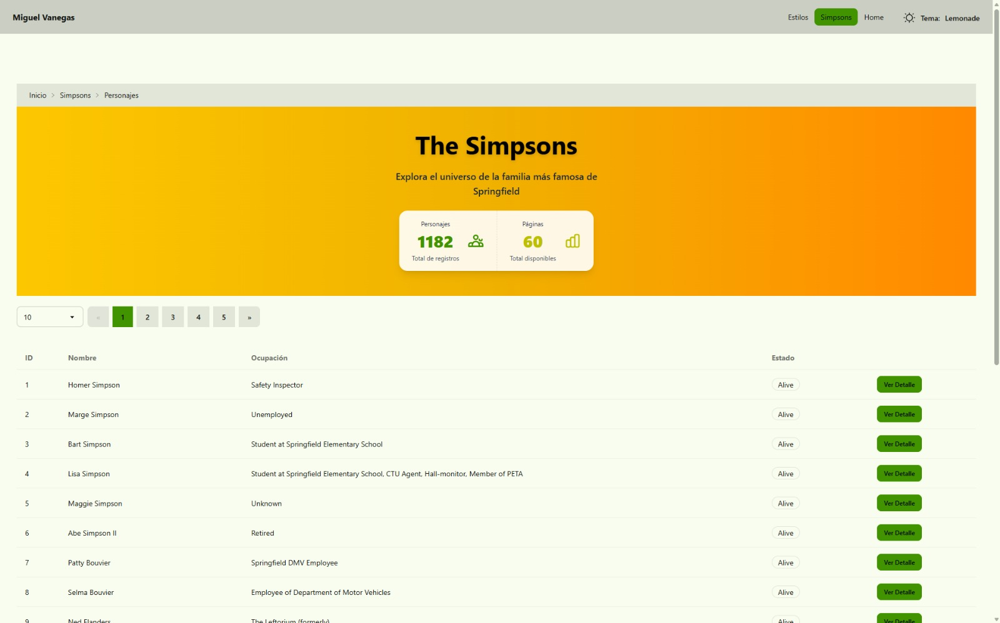
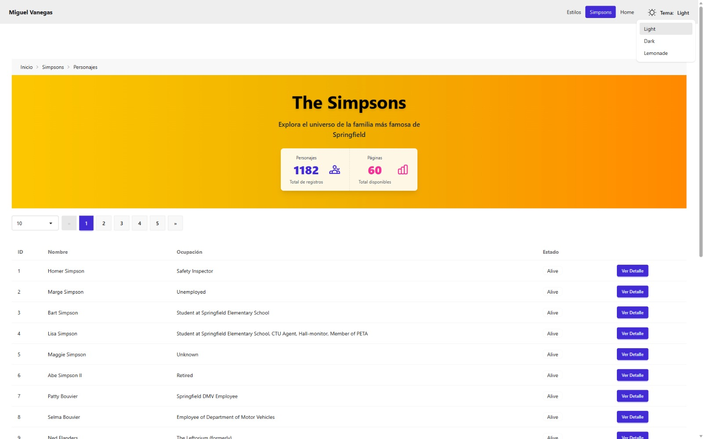
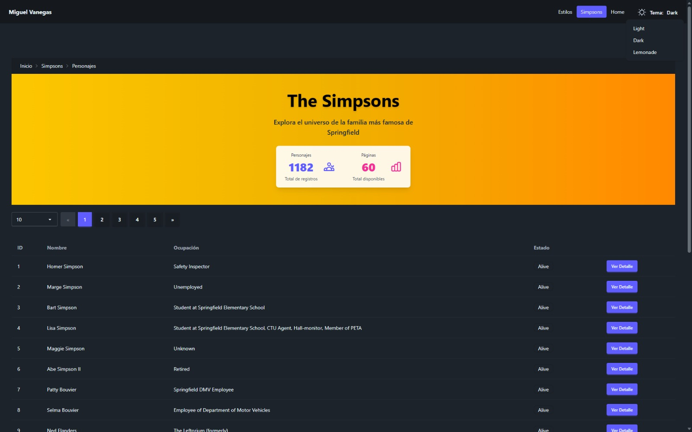
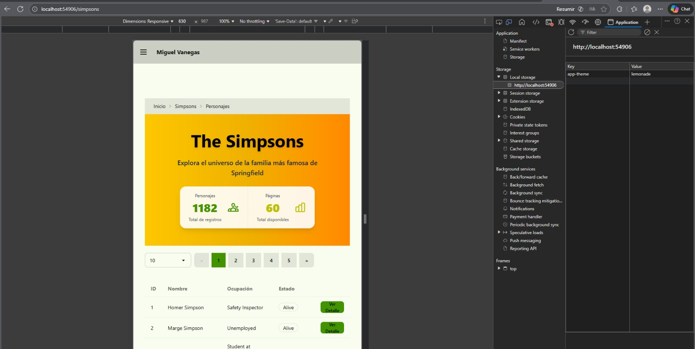

# Programación y Plataformas Web

## Frameworks Web: Angular + TailwindCSS

<div align="center">
  
  <span style="font-size: 80px; color: black; margin: 20px 20px;">+</span>
  
</div>

## Práctica 10: Mejoras Visuales en la Interfaz de Navegación

### Autor
*Miguel Ángel Vanegas*   
📧 mvanegasp@est.ups.edu.ec  
💻 GitHub: [MiguelV145](https://github.com/MiguelV145)  
*Jose Vanegas*  
📧 jvanegasp1@est.ups.edu.ec   
💻 GitHub: [josevac1](https://github.com/josevac1)
---

# Introducción

En esta práctica se busca optimizar la experiencia visual y la navegación general del proyecto Angular mediante el uso de **DaisyUI** y **Angular Router**, garantizando coherencia entre las rutas, el menú lateral (drawer), la barra de navegación (navbar) y el pie de página (footer).

El objetivo principal es proporcionar una estructura visual uniforme y mejorar la usabilidad en todas las pantallas de la aplicación.

---

## 1. Prerrequisitos

Antes de aplicar los ajustes visuales, se requiere:

* Contar con un **header** (navbar) y un **footer** funcional.
* Tener definidos los componentes principales: **Home**, **Estilos**, y **Simpsons**.
* Disponer del componente `navbar-drawer` con las opciones de navegación principales.
* Estructurar el archivo `app.component.html` de la siguiente forma:

```html
<app-navbar-drawer></app-navbar-drawer>
<router-outlet></router-outlet>
<app-footer></app-footer>
```

De este modo, tanto el encabezado como el pie de página estarán visibles en todas las pantallas.

---


## 2. Ajuste del componente `navbar-drawer`

Esta modificación tiene como propósito **mejorar la experiencia de navegación**, garantizando una **interacción más fluida y visualmente clara** entre las rutas de la aplicación.
El cambio principal consiste en reemplazar los enlaces tradicionales (`href`) por directivas de Angular (`routerLink` y `routerLinkActive`), lo cual permite aplicar **estilos dinámicos** según la ruta activa y **navegación sin recargas de página**.

### Ejemplo de modificación en `navbar-drawer.html`

```html
<li>
  <a
    routerLink="/estilos"
    routerLinkActive="bg-primary text-primary-content"
  >
    Estilos
  </a>
</li>
```

---

### Explicación

Al usar `routerLink` y `routerLinkActive`, se transforma la navegación en un proceso **reactivo**, gestionado completamente por Angular Router.
Esto evita recargas completas de página (propias de `href`), mejora el rendimiento y mantiene la interfaz visualmente consistente.

#### Motivos de la mejora:

1. **Evitar recargas innecesarias:**
   Angular intercepta los clics y actualiza solo el contenido del `router-outlet`.
2. **Indicador visual inmediato:**
   `routerLinkActive` aplica clases automáticamente al enlace de la ruta actual, mostrando al usuario en qué parte de la aplicación se encuentra.
3. **Mayor coherencia visual:**
   Las clases de DaisyUI (`bg-primary`, `text-primary-content`) permiten resaltar la opción activa, reforzando la identidad visual del proyecto.
4. **Compatibilidad responsive:**
   La misma lógica se aplica tanto al menú horizontal (desktop) como al drawer lateral (móvil).

---

### 2.1. Explicación técnica

#### En el componente TypeScript (`navbar-drawer.ts`)

1. **Dependencias necesarias:**

   * `Router` para obtener información sobre la ruta actual.
   * `RouterLink` y `RouterLinkActive` para habilitar navegación reactiva.
   * `toSignal` para convertir observables en señales (`signals`).
   * Operadores de `rxjs` para reaccionar ante eventos de navegación.

2. **Seguimiento de la URL actual:**

   * Se implementa una `signal` llamada `currentUrl` que se actualiza automáticamente cada vez que cambia la ruta.
   * El método `isActiveRoute()` permite verificar si una ruta está activa, útil si se requiere lógica adicional de estilo o comportamiento.

#### En el componente HTML

* Se reemplazan las etiquetas `<a href="...">` por `routerLink` para permitir navegación sin recarga.
* Se adiciona `routerLinkActive` para aplicar estilos automáticos al enlace activo.
* Las clases (`bg-primary`, `text-primary-content`) mejoran la visibilidad del enlace seleccionado.
* Se aplica `[routerLinkActiveOptions]="{ exact: true }"` para evitar falsos positivos en la ruta raíz `/`.

---

### 2.2. Comportamiento final esperado

| Aspecto                      | Descripción                                                          |
| ---------------------------- | -------------------------------------------------------------------- |
| **Navegación SPA**           | Las rutas cambian sin recargar la página completa.                   |
| **Resaltado visual activo**  | Los botones de la ruta actual muestran fondo azul y texto blanco.    |
| **Actualización automática** | Las clases activas cambian dinámicamente al navegar entre secciones. |
| **Coherencia responsive**    | Funciona tanto en la versión de escritorio como en la versión móvil. |

---

### 2.3. Resultado visual

En **escritorio**:

* El menú superior muestra los botones **Home**, **Estilos** y **Simpsons**.
* El botón correspondiente a la ruta activa se resalta con fondo azul (`bg-primary`) y texto blanco (`text-primary-content`).
* La navegación es instantánea, sin recargar la página.

En **dispositivos móviles**:

* El botón de menú tipo hamburguesa abre el **drawer lateral**.
* Las mismas opciones aparecen con idéntico estilo activo.
* El diseño conserva la coherencia visual entre secciones.


Vista Desktop


Vista Móvil


## 3. Componente de paginación para actualizar tabla

El siguiente componente permite controlar la paginación de datos dentro de una tabla o listado, integrándose de manera directa con el servicio de paginación y los recursos de Angular.
Este componente es reutilizable y se adapta automáticamente al número total de páginas devuelto por la API.

---

### 3.1 Pasos 
#### 1 Código base del componente `PaginationComponent`

Crea el componente `PaginationComponent` en `shared/components/pagination`.


```typescript
export class PaginationComponent {
  pages = input(0);
  currentPage = input<number>(1);

  activePage = linkedSignal(this.currentPage);

  getPagesList = computed(() => {
    return Array.from({ length: this.pages() }, (_, i) => i + 1);
  });
}
```

##### HTML asociado

```html
<div class="join flex justify-center items-center">
  @for (page of getPagesList(); track page) {
  <button
    class="join-item btn"
    [class.btn-primary]="page === activePage()"
    [routerLink]="[]"
    [queryParams]="{ page: page }"
    (click)="activePage.set(page)"
  >
    {{ page }}
  </button>

  }
  @empty {
  <!-- <p>No hay páginas</p> -->
  }
</div>
```

---

##### Explicación del funcionamiento

1. **`pages` y `currentPage`:**
   Son valores de entrada (`input()`) que se reciben desde el componente padre, indicando el número total de páginas y la página activa.

2. **`linkedSignal`:**
   Sincroniza la señal `activePage` con la señal `currentPage`, asegurando que los cambios se reflejen automáticamente tanto en la vista como en la URL (si se usa con `queryParams`).

3. **`getPagesList`:**
   Genera dinámicamente una lista de páginas con base en el total recibido (`pages`).
   Por ejemplo, si hay 3 páginas, se crea el arreglo `[1, 2, 3]`.

4. **HTML con `@for`:**
   Usa el bucle estructural de Angular 20+ para generar botones de paginación.
   El botón activo recibe la clase `btn-primary`, destacando visualmente la página actual.

5. **`routerLink` + `queryParams`:**
   Permiten navegar actualizando la URL (por ejemplo, `?page=3`) sin recargar la página completa.

---

#### 2. Agregar el componente en la página `SimpsonsPage`

En la página principal donde se listan los personajes, se debe incluir el componente recién creado:

```html
<!-- Paginación y controles -->
@if (simpsonsResource.hasValue()) {
  <div class="flex gap-2 items-center h-20 mb-4">
    <!-- Select desactivado (la API de los Simpsons no permite limitar resultados) -->
    <!--
    <select
        class="select select-bordered w-32"
        (change)="charactersPerPage.set(+selectPerPage.value)"
        #selectPerPage
    >
        <option value="10">10</option>
        <option value="20">20</option>
        <option value="50">50</option>
        <option value="100">100</option>
    </select>
    -->
    <app-pagination
      [pages]="simpsonsResource.hasValue()? simpsonsResource.value().pages : 0"
      [currentPage]="paginationService.currentPage()"
    />

    <div class="flex flex-1"></div>
  </div>
}
```

##### Explicación

* El componente `<app-pagination>` recibe el número total de páginas desde `simpsonsResource`.
* La señal `currentPage` del servicio de paginación permite mantener la sincronización con la URL.
* El bloque del `<select>` está **comentado**, ya que la API de *The Simpsons* **no soporta límites personalizados de resultados**, pero se deja como referencia para futuras APIs.


---

#### 3. Mejora del componente de paginación

El siguiente código amplía la funcionalidad, limitando la cantidad de botones visibles (máximo 5) y adicionando flechas de navegación para avanzar o retroceder entre bloques de páginas.

##### Código TypeScript

```typescript
import { Component, computed, input, linkedSignal } from '@angular/core';

@Component({
  selector: 'app-pagination',
  standalone: true,
  templateUrl: './pagination.component.html',
})
export class PaginationComponent {
  pages = input(0);
  currentPage = input<number>(1);
  activePage = linkedSignal(this.currentPage);

  getPagesList = computed(() => {
    const totalPages = this.pages();
    const current = this.activePage();

    if (totalPages <= 5) {
      return Array.from({ length: totalPages }, (_, i) => i + 1);
    }

    const start = Math.max(1, current - 2);
    const end = Math.min(totalPages, start + 4);

    return Array.from({ length: end - start + 1 }, (_, i) => start + i);
  });

 previousPage() {
    if (this.activePage() > 1) this.activePage.update((n) => n - 1);
  }

  nextPage() {
    if (this.activePage() < this.pages()) this.activePage.update((n) => n + 1);
  }
}
```

##### HTML mejorado

```html
<div class="join flex justify-center items-center gap-2">
  <button
    class="join-item btn"
    (click)="previousPage()"
    [routerLink]="[]"
    [queryParams]="{ page: activePage() - 1 }"
    [disabled]="activePage() === 1"
  >«</button>

  @for (page of getPagesList(); track page) {
  <button
    class="join-item btn"
    [class.btn-primary]="page === activePage()"
    [routerLink]="[]"
    [queryParams]="{ page: page }"
    (click)="activePage.set(page)"
  >
    {{ page }}
  </button>
  }

  <button
    class="join-item btn"
    [routerLink]="[]"
    [queryParams]="{ page: activePage() + 1 }"
    (click)="nextPage()"
    [disabled]="activePage() === pages()"
  >»</button>
</div>
```


#### 4 Paginación sin parpadeo con dato de paginas persistente

Mientras se carga la nueva consulta ya uqe las paginas depende de la respuesta. guardarmos las paginas en una señal para que no exista un parpadeo visual.

Al pasar el parametro no mandamos las paignas de las respuesta 
```html
 <app-pagination
      [pages]="simpsonsResource.hasValue()? simpsonsResource.value().pages : 0"
      [currentPage]="paginationService.currentPage()"
    />
```

Si no que mandaramos una nueva señal, `SimpsonsPage` creamos
```
// Signal que mantiene el número total de páginas
  totalPages = signal(0);

  constructor() {
    // Effect que actualiza el número de páginas cuando hay datos válidos
    effect(() => {
      if (this.simpsonsResource.hasValue()) {
        this.totalPages.set(this.simpsonsResource.value().pages);
      }
    });
  }
``` 

Usando el componennte como 

```html
  <app-pagination
            [pages]="totalPages()"
            [currentPage]="paginationService.currentPage()"
        />
```

Qudando `SimpsonsPage` **modo refencial**


```html
 <section class="p-8">
    <h1 class="text-3xl font-bold mb-2 text-center">The Simpsons API</h1>
    <h2 class="text-lg text-center mb-6">Listado de personajes</h2>
     <!-- Paginación y controles - Visible cuando hay páginas -->
    @if (totalPages() > 0) {
    <div class="flex gap-2 items-center h-20 mb-4">
        <!-- <select
            class="select select-bordered w-32"
            (change)="charactersPerPage.set(+selectPerPage.value)"
            #selectPerPage
        >
            <option value="10">10</option>
            <option value="20">20</option>
            <option value="50">50</option>
            <option value="100">100</option>
        </select> -->
        <app-pagination
            [pages]="totalPages()"
            [currentPage]="paginationService.currentPage()"
        />

        <div class="flex flex-1"></div>
    </div>
    <!-- Spinner de carga --
    <!-- Tabla de personajes -->

```

Resutlado:


##### Explicación del funcionamiento

| Elemento / Método               | Descripción                                                               |
| ------------------------------- | ------------------------------------------------------------------------- |
| `getPagesList()`                | Genera un rango dinámico con un máximo de 5 páginas visibles.             |
| `previousPage()` / `nextPage()` | Controlan el desplazamiento entre bloques de páginas.                     |
| `btn-primary`                   | Clase visual que resalta la página actual.                                |
| `disabled`                      | Desactiva los botones cuando se alcanza el inicio o final de las páginas. |
| `join` + `gap-2`                | Alinean y distribuyen los botones en una fila centrada.                   |

El componente es completamente **reactivo**: cuando el usuario cambia de página, el valor del parámetro `page` se actualiza en la URL y el **resource** que consume la API se vuelve a ejecutar automáticamente, recargando los datos correspondientes sin necesidad de intervención manual.


---

### 3.2 Explicación técnica

* La integración entre el componente y el **`PaginationService`** se basa en Signals y Query Params.
* El servicio gestiona el estado actual (`page`) y lo expone como una Signal accesible.
* Cuando el usuario cambia de página, el `resource` definido en el componente principal detecta el nuevo valor y ejecuta el `loader` correspondiente, actualizando la tabla o listado visible.

---

### 3.3 Comportamiento final esperado

| Aspecto                     | Descripción                                                        |
| --------------------------- | ------------------------------------------------------------------ |
| **Actualización dinámica**  | Cambiar de página actualiza los datos sin recargar la vista.       |
| **Sincronización URL**      | El número de página se refleja en el parámetro `?page=` de la URL. |
| **Rango visible adaptable** | Solo se muestran cinco páginas por bloque.                         |
| **Botones de navegación**   | Permiten avanzar o retroceder por grupos de páginas.               |
| **Diseño coherente**        | La interfaz mantiene una apariencia uniforme con DaisyUI.          |

---

#### 3.4 Resultado visual

**Ejemplo de visualización esperada:**

| Página actual | Páginas mostradas |
| ------------- | ----------------- |
| 1             | 1S 2 3 4 5        |
| 2             | 1 2S 3 4 5        |
| 3             | 1 2 3S 4 5        |
| 4             | 1 2 3 4S 5        |
| 5             | 1 2 3 4 5S        |
| 6             | 6S 7 8 9 10       |

* El botón activo se muestra con fondo primario (`btn-primary`).
* Los botones de desplazamiento se desactivan automáticamente al llegar al inicio o al final del rango de páginas.
* El diseño mantiene proporción y centrado en todas las resoluciones.


## 4. Arreglo de pantalla y estructura visual

Durante la carga de datos, especialmente en tablas con `rxResource` o `resource`, puede ocurrir que el contenedor ocupe menos espacio del esperado, provocando que el **footer** se desplace hacia arriba antes de que la información termine de cargarse.
Para garantizar que el pie de página se mantenga en la parte inferior y que el área de contenido ocupe toda la altura disponible de la ventana, se puede realizar un pequeño ajuste estructural en el archivo `app.component.html`.

---

### 4.1 Ejemplo de estructura inicial

```html
<app-drawer></app-drawer>
<main>
  <router-outlet></router-outlet>
</main>
<app-footer></app-footer>
```

#### Problema observado

* Cuando la tabla aún no carga, el espacio ocupado por el **spinner** o por el contenido vacío es menor.
* El **footer** asciende visualmente y deja un espacio vacío entre el contenido y el borde inferior.
* En pantallas grandes, este efecto se percibe con mayor notoriedad.


Ejemplo visual referencial:


---

### 4.2 Solución aplicada

El ajuste consiste en transformar el contenedor `<main>` para que ocupe siempre el alto completo de la pantalla y mantenga el footer fijo al final.
Se logra utilizando clases de **TailwindCSS** que controlan el flujo y el crecimiento flexible de los elementos.

```html
<app-drawer></app-drawer>
<main class="m-auto grow flex flex-col min-h-screen pt-16">
  <router-outlet></router-outlet>
</main>
<app-footer></app-footer>
```

---

### 4.3 Explicación técnica

| Clase           | Función                         | Descripción                                                                                                            |
| --------------- | ------------------------------- | ---------------------------------------------------------------------------------------------------------------------- |
| `m-auto`        | Centrado automático             | Mantiene el contenido del `<main>` alineado de forma centrada en el eje principal.                                     |
| `grow`          | Crecimiento flexible            | Permite que el `<main>` se expanda para ocupar todo el espacio vertical disponible entre el header y el footer.        |
| `flex flex-col` | Disposición vertical            | Convierte el contenedor principal en un layout vertical, asegurando que los elementos se apilen de arriba hacia abajo. |
| `min-h-screen`  | Altura mínima igual al viewport | Obliga al contenedor a tener al menos la altura completa de la pantalla (`100vh`).                                     |
| `pt-16`         | Espaciado superior              | Genera un margen superior suficiente para evitar que el contenido quede cubierto por el header o drawer fijo.          |

---

### 4.4 Comportamiento final esperado

| Estado de la aplicación             | Descripción                                                             |
| ----------------------------------- | ----------------------------------------------------------------------- |
| **Durante carga (spinner)**         | El contenido ocupa toda la pantalla, el footer permanece fijo al final. |
| **Después de cargar los datos**     | La tabla se muestra correctamente y el footer conserva su posición.     |
| **En pantallas grandes o pequeñas** | La estructura mantiene la coherencia visual en cualquier resolución.    |

---

### 4.5 Resultado visual

El resultado final es una disposición más equilibrada y profesional:

* El **footer** permanece en la parte inferior en todo momento.
* El contenido central mantiene una proporción uniforme incluso mientras los datos se cargan.
* La navegación con el **drawer** y los **componentes DaisyUI** conserva su alineación y espacio adecuado.


## 5. Componente **Hero** para la página de los Simpsons

El objetivo de este apartado es incorporar un encabezado visual destacado (Hero Section) que funcione como portada dentro de la página principal de los Simpsons.
Este componente presentará información general de la API, incluyendo el número total de personajes y el total de páginas disponibles, ofreciendo una introducción atractiva y coherente con el estilo visual del proyecto.

---

### 5.1. Creación del componente

Ubicación sugerida del componente:
`/src/app/features/simpsons/components/hero-simpsons/`

Comando de generación:

```bash
ng g c features/simpsons/components/hero-simpsons --standalone --skip-tests
```

### 5.2. Código base del componente

#### **TypeScript** adiccionar las variables que recibe el componennte

```typescript
simpsonsCount = input.required<number>();
  totalPages = input.required<number>();
```

#### **HTML**

```html
<!-- Hero Section -->
<div
  class="hero bg-linear-to-r from-yellow-400 via-yellow-500 to-orange-400 text-base-content"
  role="banner"
>
  <div class="hero-content text-center py-12">
    <div class="max-w-md">
      <h1 class="text-5xl font-bold text-black drop-shadow-md">The Simpsons</h1>
      <p class="py-6 text-lg text-gray-800 font-medium">
        Explora el universo de la familia más famosa de Springfield
      </p>

      <!-- Stats -->
      <div class="stats stats-horizontal shadow-lg bg-white/90">
        <!-- Total de personajes -->
        <div class="stat">
          <div class="stat-figure text-primary">
            <svg
              xmlns="http://www.w3.org/2000/svg"
              fill="none"
              viewBox="0 0 24 24"
              class="inline-block w-8 h-8 stroke-current"
            >
              <path
                stroke-linecap="round"
                stroke-linejoin="round"
                stroke-width="2"
                d="M17 20h5v-2a3 3 0 00-5.356-1.857M17 20H7m10 0v-2c0-.656-.126-1.283-.356-1.857M7 20H2v-2a3 3 0 015.356-1.857M7 20v-2c0-.656.126-1.283.356-1.857m0 0a5.002 5.002 0 019.288 0M15 7a3 3 0 11-6 0 3 3 0 016 0zm6 3a2 2 0 11-4 0 2 2 0zM7 10a2 2 0 11-4 0 2 2 0z"
              ></path>
            </svg>
          </div>
          <div class="stat-title text-gray-700">Personajes</div>
          <div class="stat-value text-primary">
                                    {{ simpsonsCount() }}

          </div>
          <div class="stat-desc text-gray-600">Total de registros</div>
        </div>

        <!-- Total de páginas -->
        <div class="stat">
          <div class="stat-figure text-secondary">
            <svg
              xmlns="http://www.w3.org/2000/svg"
              fill="none"
              viewBox="0 0 24 24"
              class="inline-block w-8 h-8 stroke-current"
            >
              <path
                stroke-linecap="round"
                stroke-linejoin="round"
                stroke-width="2"
                d="M9 19v-6a2 2 0 00-2-2H5a2 2 0 00-2 2v6a2 2 0 002 2h2a2 2 0 002-2zm0 0V9a2 2 0 012-2h2a2 2 0 012 2v10m-6 0a2 2 0 002 2h2a2 2 0 002-2m0 0V5a2 2 0 012-2h2a2 2 0 012 2v14a2 2 0 01-2 2h-2a2 2 0 01-2-2z"
              ></path>
            </svg>
          </div>
          <div class="stat-title text-gray-700">Páginas</div>
          <div class="stat-value text-secondary">{{ totalPages() }}</div>
          <div class="stat-desc text-gray-600">Total disponibles</div>
        </div>
      </div>
    </div>
  </div>
</div>
```

---

### 5.3. Integración en la página principal

Dentro del archivo `simpsons-page.component.html`, se puede ubicar el componente `app-hero-simpsons` en la parte superior, antes del listado o tabla:

```html
<section class="p-6">
<app-hero-simpsons
    [simpsonsCount]=" simpsonsResource.value()?.count ?? 0"
    [totalPages]="totalPages()"
></app-hero-simpsons>

  <!-- Tabla y paginación -->
  <div class="mt-8">
    <!-- ... contenido existente ... -->
  </div>
</section>
```

---

### 5.4. Explicación técnica

| Elemento / Clase            | Descripción                                                                                                                 |
| --------------------------- | --------------------------------------------------------------------------------------------------------------------------- |
| `.hero`                     | Componente visual principal de DaisyUI para encabezados con gran impacto.                                                   |
| `.bg-linear-to-r`           | Gradiente lineal horizontal de colores cálidos (amarillos y naranjas) para mantener coherencia con la estética de la serie. |
| `.stats`                    | Contenedor DaisyUI para mostrar métricas o valores destacados.                                                              |
| `simpsonsResource()?.count` | Muestra el número total de personajes obtenidos del recurso API.                                                            |
| `totalPages()`              | Indica la cantidad total de páginas calculadas previamente mediante Signals.                                                |

---

### 5.5. Comportamiento final esperado

| Aspecto                  | Descripción                                                                                               |
| ------------------------ | --------------------------------------------------------------------------------------------------------- |
| **Carga dinámica**       | Los valores se actualizan automáticamente cuando se obtiene una nueva respuesta del `simpsonsResource`.   |
| **Diseño responsive**    | El hero se adapta visualmente tanto en pantallas pequeñas como grandes.                                   |
| **Integración visual**   | Combina los colores temáticos del proyecto (amarillo, naranja, blanco) con elementos DaisyUI.             |
| **Coherencia funcional** | Presenta la información general antes del listado, orientando al usuario sobre el contenido de la página. |

---

### 5.6. Resultado visual esperado

El resultado es una sección de portada visualmente atractiva con información destacada:

* Fondo degradado cálido (de amarillo a naranja).
* Título principal con sombra y texto negro.
* Contadores de personajes y páginas en tarjetas (`stats`).
* Alineación central y espaciado coherente con el resto de la aplicación.

Ejemplo referencial:


## 6. Componente Breadcrumbs (Rutas de navegación)

Los **breadcrumbs** o “migas de pan” son un elemento esencial en las interfaces web modernas.
Permiten al usuario conocer su ubicación actual dentro del sistema, facilitando el retorno a secciones anteriores sin perder el contexto.
Su inclusión mejora la **usabilidad, orientación y accesibilidad**, especialmente en proyectos con múltiples niveles de navegación o vistas detalladas (como el listado y detalle de personajes en la aplicación de *The Simpsons*).

---

### 6.1. Creación del componente

Ubicación sugerida:
`/src/app/shared/components/breadcrumbs/`

Comando de generación:

```bash
ng g c shared/components/breadcrumbs --standalone --skip-tests
```

---

### 6.2. Código del componente

#### **TypeScript** agrega en el achivo correspondiente. 

```typescript
  items = input<{ label: string; link?: string }[]>([]);
```

#### **HTML**

```html
<!-- Breadcrumbs -->
<div class="breadcrumbs text-sm px-6 py-3 bg-base-200 ">
    <ul>
        @for (item of items(); track item.label) {
        <li>
            @if (item.link) {
            <a
                [href]="item.link"
                class="link link-hover"
            >{{ item.label }}</a>
            } @else {
            <span>{{ item.label }}</span>
            }
        </li>
        }
    </ul>
</div>
```

---

### 6.3. Integración en una página (ejemplo en `SimpsonsPage`)

```html
<app-breadcrumbs
  [items]="[
    { label: 'Inicio', link: '/' },
    { label: 'Simpsons', link: '/simpsons' },
    { label: 'Personajes' }
  ]"
/>

<section class="p-6">
<app-hero-simpsons
    [simpsonsCount]=" simpsonsResource.value()?.count ?? 0"
    [totalPages]="totalPages()"
></app-hero-simpsons>

  <!-- Tabla y paginación -->
  <div class="mt-8">
    <!-- ... contenido existente ... -->
  </div>
</section>
```

---

### 6.4. Explicación técnica

| Elemento / Clase   | Descripción                                                                                                |
| ------------------ | ---------------------------------------------------------------------------------------------------------- |
| `.breadcrumbs`     | Clase de DaisyUI que proporciona el formato visual característico de rutas jerárquicas.                    |
| `.link.link-hover` | Aplica un estilo visual interactivo para enlaces navegables.                                               |
| `items`            | Es un arreglo recibido desde el componente padre con el nombre (`label`) y la ruta (`link`) de cada nivel. |
| `@if` / `@else`    | Permiten diferenciar entre elementos con enlace activo y el elemento actual sin navegación.                |
| `text-sm.mb-6`     | Ajustan el tamaño del texto y separan visualmente el breadcrumb del contenido siguiente.                   |

---

### 6.5. Importancia del componente Breadcrumbs

1. **Mejora la orientación del usuario:**
   Indica de forma clara el lugar actual dentro de la jerarquía del sistema (por ejemplo: *Inicio → Simpsons → Personajes*).

2. **Reduce la carga cognitiva:**
   Permite desplazarse hacia atrás sin necesidad de usar botones del navegador o menús laterales.

3. **Aumenta la usabilidad y accesibilidad:**
   Es un patrón visual reconocido por los usuarios, especialmente útil en sitios con múltiples niveles de navegación.

4. **Optimiza la experiencia móvil:**
   Las rutas jerárquicas simplifican el flujo de navegación en pantallas pequeñas, evitando confusión en vistas anidadas.

---

### 6.6. Comportamiento final esperado

| Aspecto                         | Descripción                                                                               |
| ------------------------------- | ----------------------------------------------------------------------------------------- |
| **Navegación jerárquica clara** | Cada nivel de la ruta se muestra de izquierda a derecha, separando secciones del sistema. |
| **Accesibilidad visual**        | El elemento actual no tiene enlace, evitando confusiones sobre la ubicación activa.       |
| **Diseño coherente**            | El estilo se mantiene uniforme con los colores y tipografía definidos en DaisyUI.         |
| **Reutilización**               | Puede incluirse en cualquier módulo o página con solo pasar un arreglo de rutas.          |

---

### 6.7. Resultado visual esperado

El resultado final presenta una barra superior discreta, alineada con la identidad visual de la aplicación:

```
Inicio / Simpsons / Personajes
```

* Los enlaces “Inicio” y “Simpsons” son interactivos (`link-hover`), mientras que “Personajes” aparece como texto plano al representar la página actual.
* Se integra visualmente con el resto de componentes (Hero, Tabla, Paginación, Footer).

Ejemplo visual referencial:


## 7. Componente “Back to Top” (Botón flotante de retorno)

El botón flotante **“Back to Top”** o **“Volver arriba”** mejora la experiencia de navegación en páginas largas al permitir que el usuario regrese rápidamente al inicio con un solo clic.
Este patrón es especialmente útil cuando el contenido incluye listas extensas, tablas o secciones informativas (como el listado de personajes de *The Simpsons*).

---

### 7.1. Creación del componente

Ubicación sugerida:
`/src/app/shared/components/back-to-top/`

Comando de generación:

```bash
ng g c shared/components/back-to-top --standalone --skip-tests
```

---

### 7.2. Código del componente

#### **TypeScript**, adicionar en archivo correspondiente,

```typescript

  // Signal que controla la visibilidad del botón
  isVisible = signal(false);

  // Detecta el desplazamiento vertical para mostrar el botón
  @HostListener('window:scroll', [])
  onScroll(): void {
    this.isVisible.set(window.scrollY > 300);
  }

  // Acción para volver al inicio suavemente
  scrollToTop(): void {
    window.scrollTo({ top: 0, behavior: 'smooth' });
  }

```

---

#### **HTML**

```html
<!-- Back to Top FAB -->
@if (isVisible()) {
  <div class="fixed bottom-6 right-6 z-50">
    <button
      class="btn btn-circle btn-primary shadow-lg"
      (click)="scrollToTop()"
      aria-label="Volver arriba"
    >
      <svg
        xmlns="http://www.w3.org/2000/svg"
        class="h-6 w-6"
        fill="none"
        viewBox="0 0 24 24"
        stroke="currentColor"
      >
        <path
          stroke-linecap="round"
          stroke-linejoin="round"
          stroke-width="2"
          d="M5 10l7-7m0 0l7 7m-7-7v18"
        />
      </svg>
    </button>
  </div>
}
```

---

### 7.3. Integración en el proyecto

El componente puede añadirse `SimpsonsPage`

```html
<app-breadcrumbs
  [items]="[
    { label: 'Inicio', link: '/' },
    { label: 'Simpsons', link: '/simpsons' },
    { label: 'Personajes' }
  ]"
/>

<section class="p-6">
<app-hero-simpsons
    [simpsonsCount]=" simpsonsResource.value()?.count ?? 0"
    [totalPages]="totalPages()"
></app-hero-simpsons>

  <!-- Tabla y paginación -->
  <div class="mt-8">
    <!-- ... contenido existente ... -->
  </div>
</section>
<!-- Botón flotante global -->
<app-back-to-top></app-back-to-top>
```

O directamente dentro del archivo `app.component.html`, asegurando que esté disponible en todas las vistas:

```html
<app-drawer></app-drawer>
<main class="m-auto grow flex flex-col min-h-screen pt-16">
  <router-outlet></router-outlet>
</main>
<app-footer></app-footer>

<!-- Botón flotante global -->
<app-back-to-top></app-back-to-top>
```


---

### 7.4. Explicación técnica

| Elemento / Método                | Descripción                                                                              |
| -------------------------------- | ---------------------------------------------------------------------------------------- |
| `@HostListener('window:scroll')` | Escucha el evento de desplazamiento del navegador para detectar cuándo mostrar el botón. |
| `signal(false)`                  | Define el estado reactivo que controla si el botón está visible o no.                    |
| `window.scrollY > 300`           | Umbral que determina la aparición del botón después de desplazarse 300 píxeles.          |
| `window.scrollTo()`              | Desplaza suavemente la vista hacia la parte superior del documento.                      |
| `.btn-circle.btn-primary`        | Estilo de DaisyUI que crea un botón circular con color primario.                         |
| `.fixed.bottom-6.right-6`        | Posiciona el botón flotante en la esquina inferior derecha.                              |

---

### 7.5. Importancia del componente

1. **Mejora la accesibilidad:**
   Facilita la navegación para usuarios que consumen contenido extenso, evitando el desplazamiento manual prolongado.

2. **Optimiza la experiencia móvil:**
   En pantallas táctiles, permite regresar al inicio con un solo toque, ahorrando esfuerzo y tiempo.

3. **Diseño familiar:**
   Es un patrón visual común en aplicaciones web modernas y reconocido por la mayoría de usuarios.

4. **Integración no intrusiva:**
   Se mantiene visible solo cuando es necesario (tras hacer scroll), sin obstruir el contenido principal.

---

### 7.6. Comportamiento final esperado

| Aspecto                  | Descripción                                                            |
| ------------------------ | ---------------------------------------------------------------------- |
| **Visibilidad dinámica** | El botón aparece solo al desplazarse más de 300px.                     |
| **Interacción fluida**   | Al hacer clic, el scroll regresa suavemente al inicio de la página.    |
| **Estilo coherente**     | Mantiene la estética visual definida por DaisyUI.                      |
| **Compatibilidad total** | Funciona correctamente en navegadores modernos y dispositivos móviles. |

---

### 7.7. Resultado visual esperado

* El botón aparece en la esquina inferior derecha al desplazarse hacia abajo.
* Tiene un diseño circular, con sombra y color primario.
* Al hacer clic, realiza una animación de desplazamiento suave hasta la parte superior.

Ejemplo referencial:


-----

## 8. Componente de Cambio de Tema (Theme Switcher)

Este componente permite alternar entre los diferentes temas visuales definidos en DaisyUI, integrándose de manera coherente con la barra de navegación (Navbar) y el menú lateral (Drawer).
En este caso, se disponen **tres temas configurados en TailwindCSS y DaisyUI**: `light`, `dark` y `abyss`.

---

### 8.1. Configuración previa en `styles.css`

En el archivo global de estilos se definen los temas disponibles:

```css
@import "tailwindcss";

@plugin "daisyui" {
    themes: light --default, dark --prefersdark, abyss;
}
```

El tema activo se controla a través del atributo `data-theme` en la etiqueta `<html>` del archivo `index.html`:

```html
<html lang="en" data-theme="light">
```

El valor de `data-theme` cambiará dinámicamente según la selección del usuario.

---

### 8.2. Creación del componente

Ubicación sugerida:
`/src/app/shared/components/theme-switcher/`

Comando de generación:

```bash
ng g c shared/components/theme-switcher --standalone --skip-tests
```

---

### 8.3. Código del componente

#### **TypeScript**

```typescript
import { Component, signal } from '@angular/core';

@Component({
  selector: 'app-theme-switcher',
  standalone: true,
  templateUrl: './theme-switcher.component.html',
})
export class ThemeSwitcherComponent {
  // Temas disponibles
  themes = ['light', 'dark', 'abyss'];

  // Tema actual reactivo
  currentTheme = signal<string>(this.getCurrentTheme());

  // Obtiene el tema actual desde el atributo HTML
  private getCurrentTheme(): string {
    return document.documentElement.getAttribute('data-theme') ?? 'light';
  }

  // Cambia el tema y actualiza el atributo global
  setTheme(theme: string): void {
    document.documentElement.setAttribute('data-theme', theme);
    this.currentTheme.set(theme);
  }
}
```

---

#### **HTML**

```html
<!-- Botón desplegable de cambio de tema -->
<div class="dropdown dropdown-end">
  <button tabindex="0" class="btn btn-ghost">
    <svg
      xmlns="http://www.w3.org/2000/svg"
      fill="none"
      viewBox="0 0 24 24"
      stroke-width="1.5"
      stroke="currentColor"
      class="w-6 h-6 mr-1"
    >
      <path
        stroke-linecap="round"
        stroke-linejoin="round"
        d="M12 3v1.5M12 19.5V21M4.22 4.22l1.06 1.06M18.72 18.72l1.06 1.06M1.5 12H3m18 0h1.5M4.22 19.78l1.06-1.06M18.72 5.28l1.06-1.06M12 6a6 6 0 000 12a6 6 0 000-12z"
      />
    </svg>
    Tema: <span class="ml-1 capitalize">{{ currentTheme() }}</span>
  </button>

  <ul
    tabindex="0"
    class="dropdown-content menu bg-base-100 rounded-box w-40 shadow"
  >
    @for (theme of themes; track theme) {
      <li>
        <button
          (click)="setTheme(theme)"
          [class.active]="currentTheme() === theme"
        >
          {{ theme | titlecase }}
        </button>
      </li>
    }
  </ul>
</div>
```

---

### 8.4. Explicación técnica

| Elemento / Método                         | Descripción                                                                                        |
| ----------------------------------------- | -------------------------------------------------------------------------------------------------- |
| `document.documentElement.setAttribute()` | Actualiza dinámicamente el tema activo modificando el atributo `data-theme` del elemento `<html>`. |
| `signal()`                                | Mantiene el estado del tema actual de forma reactiva, actualizando la vista cuando cambia.         |
| `.dropdown.dropdown-end`                  | Clase DaisyUI que crea un menú desplegable alineado al extremo derecho.                            |
| `.btn-ghost`                              | Estilo visual minimalista que mantiene coherencia con el diseño del Navbar.                        |
| `titlecase`                               | Pipe de Angular que convierte el nombre del tema en formato legible (“Light”, “Dark”, “Abyss”).    |

---

### 8.5. Integración en el Navbar y Drawer

#### En el archivo `navbar-drawer.html`:

**En el Navbar (versión escritorio):**

```html
<div class="hidden flex-none lg:block">
  <ul class="menu menu-horizontal">
    <li><a routerLink="/estilos" routerLinkActive="bg-primary text-primary-content">Estilos</a></li>
    <li><a routerLink="/simpsons" routerLinkActive="bg-primary text-primary-content">Simpsons</a></li>
    <li><a routerLink="/" routerLinkActive="bg-primary text-primary-content" [routerLinkActiveOptions]="{ exact: true }">Home</a></li>
  </ul>
  <!-- Botón de cambio de tema -->
  <app-theme-switcher></app-theme-switcher>
</div>
```

**En el Drawer (versión móvil):**

```html
<div class="drawer-side flex flex-col justify-between">
  <label for="my-drawer-2" aria-label="close sidebar" class="drawer-overlay"></label>

  <ul class="menu bg-base-200 min-h-full w-80 p-4">
    <li><a routerLink="/estilos" routerLinkActive="bg-primary text-primary-content">Estilos</a></li>
    <li><a routerLink="/simpsons" routerLinkActive="bg-primary text-primary-content">Simpsons</a></li>
    <li><a routerLink="/" routerLinkActive="bg-primary text-primary-content" [routerLinkActiveOptions]="{ exact: true }">Home</a></li>
  </ul>

  <!-- Theme switcher al pie del menú -->
  <div class="p-4 border-t border-base-300">
    <app-theme-switcher></app-theme-switcher>
  </div>
</div>
```

---

### 8.6. Comportamiento final esperado

| Aspecto                   | Descripción                                                                                    |
| ------------------------- | ---------------------------------------------------------------------------------------------- |
| **Selección interactiva** | El usuario puede alternar entre los temas `light`, `dark` y `abyss` desde el menú desplegable. |
| **Cambio dinámico**       | La interfaz completa cambia de tema instantáneamente sin recargar la página.                   |
| **Persistencia visual**   | El cambio se aplica globalmente al modificar el atributo `data-theme` del documento.           |
| **Compatibilidad total**  | Funciona tanto en escritorio como en móvil, manteniendo el mismo estilo DaisyUI.               |

---

### 8.7. Resultado visual esperado

* En el **Navbar**, el botón muestra el tema actual con un ícono de sol/luna y un menú desplegable.
* En el **Drawer**, el selector aparece en la parte inferior, accesible desde dispositivos móviles.
* El cambio de tema afecta todos los componentes con clases DaisyUI (`bg-base-`, `text-base-`, `btn-`, `card-`, etc.).

Ejemplo referencial:


---


## 9. Persistencia del tema seleccionado

Para complementar el **componente de cambio de tema**, se propone crear un **servicio dedicado a almacenar y recuperar el tema seleccionado** por el usuario, garantizando que su preferencia se mantenga al recargar la aplicación o al abrirla nuevamente.

---

### Objetivo

Permitir que el tema elegido (por ejemplo, *light*, *dark* o *abyss*) se conserve automáticamente mediante el uso de **Local Storage**, manteniendo una experiencia personalizada y coherente entre sesiones.

---

### Pasos a realizar

1. **Crear un servicio dedicado**

   * Generar un nuevo servicio llamado `ThemeService` dentro del directorio `shared/services/`.
   * Este servicio será responsable de administrar la lógica de persistencia del tema.

2. **Definir una clave de almacenamiento**

   * Declarar una constante (por ejemplo, `THEME_KEY = 'app-theme'`) para identificar el valor guardado en `localStorage`.
   * Esto permitirá leer y escribir de forma segura sin colisiones con otras claves.

3. **Implementar métodos principales**

   * Crear un método para **guardar** el tema actual en `localStorage`.
   * Implementar otro método para **recuperar** el tema guardado, retornando un valor por defecto si no existe.
   * Adicionar un método que **aplique el tema** al atributo `data-theme` de `<html>`.

4. **Integrar el servicio con el componente `ThemeSwitcher`**

   * Inyectar el `ThemeService` en el componente del selector de temas.
   * Al cambiar el tema, invocar el método del servicio para guardar el valor.
   * En el constructor o en el ciclo de vida del componente, aplicar el tema almacenado si existe.

5. **Validar persistencia al reiniciar la aplicación**

   * Comprobar que, al recargar la página, el tema previo se restaure automáticamente.
   * Verificar que el atributo `data-theme` en `<html>` refleje el valor guardado.

6. **Buenas prácticas**

   * Centralizar la lógica de almacenamiento en el servicio para evitar duplicación de código.
   * Manejar errores en caso de que el almacenamiento local no esté disponible (modo privado o restricción del navegador).
   * Mantener la responsabilidad del cambio visual en el componente y la persistencia en el servicio.

---

### Resultado esperado

* El tema elegido por el usuario permanece activo incluso después de recargar el navegador.
* El cambio de tema se aplica de forma inmediata y se guarda de manera automática.
* La experiencia del usuario es consistente, sin necesidad de seleccionar nuevamente la apariencia en cada sesión.


# Resultados de la practica 

1. Captura con todos los componentes con el tema escogido


2. Captura con todos los componentes con el tema ligth


3. Captura con todos los componentes con el tema dark


4. Captura del tema guardo en localStora (Inspector)



