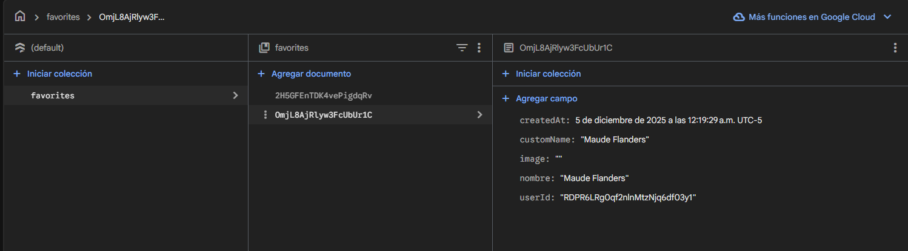
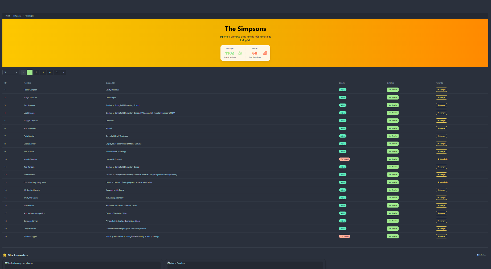

# Programación y Plataformas Web

## Frameworks Web: Angular + Firebase

<div align="center">
  
   <span style="font-size: 80px; color: black; margin: 20px 20px;">+</span>
  
 
</div>

## Práctica 11: Autenticación y Persistencia de Datos en la Nube con Firebase

### Autor

### Autor
*Miguel Ángel Vanegas*   
📧 mvanegasp@est.ups.edu.ec  
💻 GitHub: [MiguelV145](https://github.com/MiguelV145)  
*Jose Vanegas*  
📧 jvanegasp1@est.ups.edu.ec   
💻 GitHub: [josevac1](https://github.com/josevac1)

---

## Introducción

En esta práctica se implementará un sistema completo de **autenticación** y **persistencia de datos en la nube** utilizando **Firebase** como backend. El objetivo es agregar funcionalidades de login, gestión de favoritos en la aplicación de Simpsons, y protección de rutas mediante guards de Angular.

Firebase proporciona una plataforma completa que incluye:
- **Firebase Authentication**: Sistema de autenticación con múltiples proveedores
- **Cloud Firestore**: Base de datos NoSQL en tiempo real
- **Reglas de seguridad**: Control de acceso a nivel de base de datos

---

## Conceptos Fundamentales

### 1. ¿Qué es Firebase?

Firebase es una plataforma de desarrollo de aplicaciones móviles y web desarrollada por Google. Proporciona servicios backend como:

- **Authentication**: Sistema de autenticación con Email/Password, Google, Facebook, etc.
- **Firestore**: Base de datos NoSQL en tiempo real
- **Storage**: Almacenamiento de archivos
- **Hosting**: Hosting de aplicaciones web
- **Cloud Functions**: Funciones serverless

### 2. Autenticación vs Autorización

| Concepto | Definición | Ejemplo |
|----------|------------|---------|
| **Autenticación** | Verificar la identidad del usuario | Login con email y password |
| **Autorización** | Verificar los permisos del usuario | Solo administradores pueden eliminar |

### 3. Guards en Angular

Los **Guards** son servicios que controlan la navegación entre rutas. Tipos principales:

- **CanActivate**: Controla si una ruta puede ser activada
- **CanActivateChild**: Controla rutas hijas
- **CanDeactivate**: Controla si se puede salir de una ruta
- **CanLoad**: Controla la carga de módulos lazy-loaded

### 4. Firestore: Base de Datos NoSQL

**Estructura de Firestore:**

```
Colección: favoritos
  ├── Documento: abc123 (ID autogenerado)
  │   ├── nombre: "Homer Simpson"
  │   ├── customName: "Mi personaje favorito"
  │   ├── image: "https://..."
  │   ├── userId: "user123"
  │   └── createdAt: timestamp
  │
  └── Documento: def456
      ├── nombre: "Bart Simpson"
      └── ...
```

**Características:**
- **Colecciones**: Agrupan documentos (similar a tablas)
- **Documentos**: Objetos JSON con campos (similar a registros)
- **Referencias**: Enlaces entre documentos
- **Queries**: Filtrado y ordenamiento de datos

---

## Parte 1: Prerrequisitos

Antes de comenzar, se debe verificar:

 Proyecto Angular funcional con las prácticas 09 y 10 completadas  
 TailwindCSS y DaisyUI configurados  
 Página de Simpsons funcionando con consumo de API  
 Cuenta de Google activa  

---

## Parte 2: Configuración de Firebase

### Paso 1: Crear Proyecto en Firebase

1. Acceder a [Firebase Console](https://console.firebase.google.com/)

2. Click en **"Agregar proyecto"** o **"Add project"**
3. Configurar el proyecto:
   - **Nombre**: `angular-icc-ppw` (o el nombre que prefieras)
   - **Google Analytics**: Puedes habilitarlo o deshabilitarlo según preferencia
4. Click en **"Crear proyecto"**

### Paso 2: Registrar Aplicación Web

1. En el dashboard del proyecto, click en el ícono **Web** (`</>`)
2. Registrar la app:
   - **Nombre**: `03-ui-componentes`
   - **Firebase Hosting**: No seleccionar por ahora
3. Click en **"Registrar app"**
4. **Copiar la configuración** que aparece (la necesitaremos después)

Ejemplo de configuración:

```typescript
const firebaseConfig = {
  apiKey: "AIzaSyXXXXXXXXXXXXXXXXXXXXXXXX",
  authDomain: "tu-proyecto.firebaseapp.com",
  projectId: "tu-proyecto",
  storageBucket: "tu-proyecto.appspot.com",
  messagingSenderId: "123456789",
  appId: "1:123456789:web:xxxxxxxxxxxxx"
};
```

### Paso 3: Habilitar Firebase Authentication

1. En el menú lateral, ir a **"Build"** → **"Authentication"**
2. Click en **"Get started"** o **"Comenzar"**
3. En la pestaña **"Sign-in method"**, habilitar:

   **a) Email/Password:**
   - Click en "Email/Password"
   - Habilitar el toggle
   - Guardar

   **b) Google (opcional pero recomendado):**
   - Click en "Google"
   - Habilitar el toggle
   - Seleccionar un email de soporte
   - Guardar

### Paso 4: Crear Cloud Firestore

1. En el menú lateral, ir a **"Build"** → **"Firestore Database"**
2. Click en **"Create database"** o **"Crear base de datos"**
3. Seleccionar modo:
   - **Modo de prueba** (Test mode): Para desarrollo
   - **Modo de producción**: Para producción (requiere reglas personalizadas)
4. Seleccionar ubicación: `us-central1` o la más cercana
5. Click en **"Habilitar"**

### Paso 5: Configurar Reglas de Seguridad (Modo Desarrollo)

Por ahora, usaremos reglas permisivas para desarrollo. En la pestaña **"Rules"** de Firestore:

```javascript
rules_version = '2';
service cloud.firestore {
  match /databases/{database}/documents {
    // Permite lectura y escritura a usuarios autenticados
    match /{document=**} {
      allow read, write: if request.auth != null;
    }
  }
}
```

**⚠️ Importante**: Estas reglas son solo para desarrollo. En producción, se deben implementar reglas más restrictivas.

---

## Parte 3: Instalación de AngularFire

### Paso 1: Instalar AngularFire

En la terminal del proyecto Angular:

```bash
pnpm add @angular/fire firebase
```

Si tienen una salida tipo
```bash
pablo@CV1PTORRESP 03-ui-componentes-estilos % pnpm add @angular/fire firebase
Downloading firebase@12.6.0: 6.06 MB/6.06 MB, done
Downloading @firebase/firestore@4.9.2: 5.84 MB/5.84 MB, done
 WARN  3 deprecated subdependencies found: glob@7.2.3, inflight@1.0.6, rimraf@3.0.2
Packages: +36
++++++++++++++++++++++++++++++++++++
Progress: resolved 746, reused 607, downloaded 33, added 36, done
 WARN  Issues with peer dependencies found
.
└─┬ @angular/platform-browser-dynamic 20.3.15
  ├── ✕ unmet peer @angular/core@20.3.15: found 20.3.13
  ├── ✕ unmet peer @angular/common@20.3.15: found 20.3.13
  ├── ✕ unmet peer @angular/compiler@20.3.15: found 20.3.13
  └── ✕ unmet peer @angular/platform-browser@20.3.15: found 20.3.13

dependencies:
+ firebase 12.6.0

╭ Warning ────────────────────────────────────────────────────────────────────────────────╮
│                                                                                         │
│   Ignored build scripts: @firebase/util.                                                │
│   Run "pnpm approve-builds" to pick which dependencies should be allowed to run         │
│   scripts.                                                                              │
│                                                                                         │
╰─────────────────────────────────────────────────────────────────────────────────────────╯

Done in 7.4s using pnpm v10.19.0
```

Deberemos aprobar la instalación de los paquetes necesarios.

```bash
ablo@CV1PTORRESP 03-ui-componentes-estilos % pnpm approve-builds
✔ Choose which packages to build (Press <space> to select, <a> to toggle all, <i> to invert selection) · @firebase/util

✔ The next packages will now be built: @firebase/util.
Do you approve? (y/N) · true
enode_modules/.pnpm/@firebase+util@1.13.0/node_modules/@firebase/util: Running postinstall script...
nnode_modules/.pnpm/@firebase+util@1.13.0/node_modules/@firebase/util: Running postinstall node_modules/.pnpm/@firebase+util@1.12.1/node_modules/@firebase/util: Running postinstall script, done in 211ms
```


```bash
pnpm ng add @angular/fire
```

Durante la instalación:
1. Seleccionar las características a instalar:
   - ✅ **Authentication**
   - ✅ **Firestore**
   - (Deseleccionar las demás por ahora)


2. Te pedirá autenticarte con Google


3. Seleccionar el proyecto Firebase creado

4. Seleccionar la app web registrada


### Paso 2: Verificar la Configuración

El comando anterior habrá modificado automáticamente:

**`src/app/app.config.ts`:**

```typescript
import { ApplicationConfig, provideZoneChangeDetection } from '@angular/core';
import { provideRouter } from '@angular/router';
import { provideHttpClient } from '@angular/common/http';
import { initializeApp, provideFirebaseApp } from '@angular/fire/app';
import { getAuth, provideAuth } from '@angular/fire/auth';
import { getFirestore, provideFirestore } from '@angular/fire/firestore';

import { routes } from './app.routes';

const firebaseConfig = {
  apiKey: "TU_API_KEY",
  authDomain: "tu-proyecto.firebaseapp.com",
  projectId: "tu-proyecto",
  storageBucket: "tu-proyecto.appspot.com",
  messagingSenderId: "123456789",
  appId: "1:123456789:web:xxxxxxxxxxxxx"
};

export const appConfig: ApplicationConfig = {
  providers: [
    provideZoneChangeDetection({ eventCoalescing: true }),
    provideRouter(routes),
    provideHttpClient(),
    provideFirebaseApp(() => initializeApp(firebaseConfig)),
    provideAuth(() => getAuth()),
    provideFirestore(() => getFirestore())
  ]
};
```

**Verificación**: Si el archivo contiene los `providers` de Firebase, la instalación fue exitosa.

---

## Parte 4: Creación del Servicio de Autenticación

### Paso 1: Generar el Servicio

```bash
ng generate service core/services/firebase/auth
```

### Paso 2: Implementar `auth.service.ts`

**`src/app/core/services/firebase/auth.service.ts`:**

```typescript
// .... Resto de la clase
export class AuthService {
  private auth: Auth = inject(Auth);
  
  // Signal para el usuario actual
  currentUser = signal<User | null>(null);
  
  // Observable del estado de autenticación
  user$ = user(this.auth);

  constructor() {
    // Suscribirse a cambios en el estado de autenticación
    this.user$.subscribe(user => {
      this.currentUser.set(user);
    });
  }

  /**
   * Registrar nuevo usuario con email y password
   */
  register(email: string, password: string): Observable<any> {
    const promise = createUserWithEmailAndPassword(this.auth, email, password);
    return from(promise);
  }

  /**
   * Login con email y password
   */
  login(email: string, password: string): Observable<any> {
    const promise = signInWithEmailAndPassword(this.auth, email, password);
    return from(promise);
  }

  /**
   * Login con Google
   */
//   loginWithGoogle(): Observable<any> {
//     const provider = new GoogleAuthProvider();
//     const promise = signInWithPopup(this.auth, provider);
//     return from(promise);
//   }

  /**
   * Cerrar sesión
   */
  logout(): Observable<void> {
    const promise = signOut(this.auth);
    return from(promise);
  }

  /**
   * Verificar si hay un usuario autenticado
   */
  isAuthenticated(): boolean {
    return this.currentUser() !== null;
  }
}
```

**Explicación del código:**

- **`inject(Auth)`**: Inyección de dependencias moderna de Angular
- **`signal<User | null>(null)`**: Estado reactivo del usuario
- **`user$`**: Observable que emite cuando cambia el estado de autenticación
- **`from(promise)`**: Convierte Promises de Firebase en Observables de RxJS
- **`GoogleAuthProvider`**: Proveedor de autenticación con Google

---

## Parte 5: Crear Páginas de Autenticación

### Prerequisitos 

Cambiar las rutas y navegar directamente a las páginas de autenticación.
```typescript
export const routes: Routes = [
    {
        path: '',
        component: DaisyuiPage
    },
    {
        path: '/login',
        component: LoginPage
    },
    {
        path: '/register',
        component: RegisterPage
    },
    {
        path: 'estilos',
        component: EstilosPage
    },
    {
        path: 'simpsons',
        component: SimpsonsPage
    },
    {
        path: 'simpsons/:id',
        component: PersonajePage
    },
];
```

En nov-bar, cambiar el nomobre por un botono de Iniciar Sesión
```html

```

este boton navegara a LoginPage
```html
<div class="mx-2 flex-1 ">
                <div class="flex justify-start">
                    <a
                        routerLink="/login"
                        class="btn btn-primary"
                    >
                        Iniciar Sesión
                    </a>
                </div>
            </div>
```


### Paso 1: Generar Componentes

```bash
ng generate component features/auth/pages/login-page
ng generate component features/auth/pages/register-page
```

### Paso 2: Implementar Login Page

#### Análisis de la Estructura HTML

El template del login utiliza componentes de DaisyUI con una arquitectura centrada en la experiencia de usuario:

**Layout Principal:**
```html
<div class="min-h-screen flex items-center justify-center bg-gradient-to-br from-primary to-secondary p-4">
```
- `min-h-screen`: Ocupa altura completa del viewport
- `flex items-center justify-center`: Centra el formulario vertical y horizontalmente
- `bg-gradient-to-br`: Gradiente diagonal adaptable al tema
- `p-4`: Padding para evitar que el card toque los bordes en móviles

**Card Container:**
```html
<div class="card w-full max-w-md bg-base-100 shadow-2xl">
  <div class="card-body">
```
- `card`: Componente DaisyUI con padding y estructura predefinida
- `max-w-md`: Ancho máximo de 448px (ideal para formularios)
- `card-body`: Maneja el espaciado interno automáticamente

**Form Controls:**
```html
<div class="form-control mb-6">
  <label class="label">
    <span class="label-text">Correo electrónico</span>
  </label>
  <input class="input input-bordered w-full" />
</div>
```

**Anatomía del Form Control:**
- `form-control`: Contenedor que agrupa label, input y mensajes de error
- `label`: Componente DaisyUI que maneja el espaciado automático con el input (no requiere `mb-2` o `mt-4`)
- `label-text`: Clase para el texto del label con tamaño y color apropiados
- `input input-bordered`: Clase base de DaisyUI con borde visible
- `w-full`: Asegura que el input ocupe todo el ancho del contenedor
- `mb-6`: Separación de 1.5rem entre campos (el espaciado va en `form-control`, no en el input)

**Por qué no agregar más espacios:**
DaisyUI ya optimizó el espaciado entre label e input. Agregar clases como `mb-2` al label o `mt-4` al input rompe el diseño consistente del framework y puede causar espaciados irregulares entre diferentes formularios.

**Buenas Prácticas de Diseño:**

1. **Mobile First:**
   - `w-full`: Los inputs ocupan todo el ancho disponible, adaptándose naturalmente a pantallas pequeñas
   - `p-4`: Padding en el contenedor principal para evitar que los elementos toquen los bordes en móviles
   - `max-w-md`: En desktop, limita el ancho a 448px para mantener legibilidad

2. **Consistencia Dimensional:**
   - Todos los inputs usan `w-full`: Mismo ancho visual
   - Botón también usa `w-full`: Alineación perfecta con los inputs
   - Altura consistente: DaisyUI establece la misma altura base para `input` y `btn`
   - Esta uniformidad mejora la escaneabilidad y reduce la carga cognitiva

**Estados Visuales:**
- `[class.input-error]`: Aplica estilo de error solo cuando el campo es inválido Y ha sido tocado
- `loading()`: Signal que controla el estado del botón durante el proceso de autenticación
- Mensajes de error condicionales con `@if`

**Heurísticas Aplicadas:**
1. **Visibilidad del estado del sistema**: Loading spinner durante autenticación
2. **Prevención de errores**: Botón deshabilitado durante procesamiento
3. **Reconocimiento sobre memorización**: Placeholders descriptivos
4. **Ayuda con errores**: Mensajes claros y específicos

**`src/app/pages/auth/login/login-page.ts`:**

```typescript
import { Component, effect, inject, signal } from '@angular/core';
import { CommonModule } from '@angular/common';
import { FormBuilder, FormGroup, ReactiveFormsModule, Validators } from '@angular/forms';
import { Router, RouterModule } from '@angular/router';
import { rxResource } from '@angular/core/rxjs-interop';
import { AuthService } from '../../../core/services/firebase/auth.service';
import { of } from 'rxjs';
import { FormUtils } from '../../../shared/utils/form-utils';

@Component({
  selector: 'app-login-page',
  standalone: true,
  imports: [CommonModule, ReactiveFormsModule, RouterModule],
  templateUrl: './login-page.html',
  styleUrls: ['./login-page.css']
})
export class LoginPage {
  private fb = inject(FormBuilder);
  private authService = inject(AuthService);
  private router = inject(Router);

  loginForm: FormGroup;

  // Signal para disparar el login
  private loginTrigger = signal<{ email: string; password: string } | null>(null);

  // rxResource para manejar el proceso de login (Angular 20+)
  loginResource = rxResource({
    params: () => this.loginTrigger(),
    stream: ({ params }) => {
      if (!params) return of(null);
      return this.authService.login(params.email, params.password);
    }
  });

  formUtils = FormUtils;

  constructor() {
    this.loginForm = this.fb.group({
      email: ['', [Validators.required, Validators.email]],
      password: ['', [Validators.required, Validators.minLength(6)]]
    });

    // Effect para navegar cuando el login sea exitoso
    effect(() => {
      if (this.loginResource.hasValue() && this.loginResource.value()) {
        console.log('Login exitoso, navegando a /simpsons');
        this.router.navigate(['/simpsons']);
      }
    });
  }

  onSubmit() {
    if (this.loginForm.invalid) {
      this.loginForm.markAllAsTouched();
      return;
    }

    const { email, password } = this.loginForm.value;

    // Disparar el login actualizando el signal
    this.loginTrigger.set({ email, password });
  }

  // Computed signal para el estado de carga
  loading = this.loginResource.isLoading;

  // Computed signal para el mensaje de error
  errorMessage = () => {
    const error = this.loginResource.error();
    if (!error) return '';

    const code = (error as any).code || '';
    const errorMessages: { [key: string]: string } = {
      'auth/invalid-email': 'El correo electrónico no es válido',
      'auth/user-disabled': 'El usuario ha sido deshabilitado',
      'auth/user-not-found': 'No existe un usuario con este correo',
      'auth/wrong-password': 'Contraseña incorrecta',
      'auth/invalid-credential': 'Credenciales inválidas'
    };
    return errorMessages[code] || 'Error al iniciar sesión';
  }

  // Getters para validación en el template
  get email() {
    return this.loginForm.get('email');
  }

  get password() {
    return this.loginForm.get('password');
  }
}

```


**`src/app/pages/auth/login/login-page.html`:**

```html
<div class="min-h-screen flex items-center justify-center bg-gradient-to-br from-primary to-secondary p-4">
    <div class="card w-full max-w-md bg-base-100 shadow-2xl">
        <div class="card-body">
            <!-- Header -->
            <div class="text-center mb-6">
                <h1 class="text-3xl font-bold text-primary mb-2">¡Bienvenido!</h1>
                <p class="text-base-content/70">Inicia sesión para continuar</p>
            </div>

            <!-- Mensajes de error -->
            @if (loginResource.error()) {
            <div class="alert alert-error mb-4">
                <svg
                    xmlns="http://www.w3.org/2000/svg"
                    class="h-6 w-6 shrink-0 stroke-current"
                    fill="none"
                    viewBox="0 0 24 24"
                >
                    <path
                        stroke-linecap="round"
                        stroke-linejoin="round"
                        stroke-width="2"
                        d="M10 14l2-2m0 0l2-2m-2 2l-2-2m2 2l2 2m7-2a9 9 0 11-18 0 9 9 0 0118 0z"
                    />
                </svg>
                <span>{{ errorMessage() }}</span>
            </div>
            }

            <!-- Formulario -->
            <form
                [formGroup]="loginForm"
                (ngSubmit)="onSubmit()"
            >
                <!-- Email -->
                <div class="form-control mb-6">
                    <label class="label">
                        <span class="label-text">Correo electrónico</span>
                    </label>
                    <input
                        type="email"
                        formControlName="email"
                        placeholder="ejemplo@correo.com"
                        class="input input-bordered w-full placeholder:opacity-25"
                        [class.input-error]="email?.invalid && email?.touched"
                    />
                    @if (loginForm.get('email')?.invalid && loginForm.get('email')?.touched) {
                    <span class="block text-red-500 text-sm mt-1">{{formUtils.getFieldError(loginForm,'email')}}</span>
                    }
                </div>

                <!-- Password -->
                <div class="form-control mb-6">
                    <label class="label">
                        <span class="label-text">Contraseña</span>
                    </label>
                    <input
                        type="password"
                        formControlName="password"
                        placeholder="••••••••"
                        class="input input-bordered w-full placeholder:opacity-25"
                        [class.input-error]="password?.invalid && password?.touched"
                    />
                    @if (loginForm.get('password')?.invalid && loginForm.get('password')?.touched) {
                    <span
                        class="block text-red-500 text-sm mt-1">{{formUtils.getFieldError(loginForm,'password')}}</span>

                    }
                </div>

                <!-- Botón Login -->
                <div class="form-control mt-6">
                    <button
                        type="submit"
                        class="btn btn-primary w-full"
                        [disabled]="loading() || loginForm.invalid"
                    >
                        @if (loading()) {
                        <span class="loading loading-spinner loading-sm"></span>
                        Iniciando sesión...
                        } @else {
                        Iniciar Sesión
                        }
                    </button>
                </div>
            </form>
            
            <!-- Divider -->
            <div class="divider">O</div>

            <!-- Google Login -->
            <!-- <button
                type="button"
                (click)="loginWithGoogle()"
                class="btn btn-outline w-full"
                [disabled]="loading()"
            >
                <svg
                    class="w-5 h-5"
                    viewBox="0 0 24 24"
                >
                    <path
                        fill="currentColor"
                        d="M22.56 12.25c0-.78-.07-1.53-.2-2.25H12v4.26h5.92c-.26 1.37-1.04 2.53-2.21 3.31v2.77h3.57c2.08-1.92 3.28-4.74 3.28-8.09z"
                    />
                    <path
                        fill="currentColor"
                        d="M12 23c2.97 0 5.46-.98 7.28-2.66l-3.57-2.77c-.98.66-2.23 1.06-3.71 1.06-2.86 0-5.29-1.93-6.16-4.53H2.18v2.84C3.99 20.53 7.7 23 12 23z"
                    />
                    <path
                        fill="currentColor"
                        d="M5.84 14.09c-.22-.66-.35-1.36-.35-2.09s.13-1.43.35-2.09V7.07H2.18C1.43 8.55 1 10.22 1 12s.43 3.45 1.18 4.93l2.85-2.22.81-.62z"
                    />
                    <path
                        fill="currentColor"
                        d="M12 5.38c1.62 0 3.06.56 4.21 1.64l3.15-3.15C17.45 2.09 14.97 1 12 1 7.7 1 3.99 3.47 2.18 7.07l3.66 2.84c.87-2.6 3.3-4.53 6.16-4.53z"
                    />
                </svg>
                Continuar con Google
            </button> -->

            <!-- Link a Registro -->
            <div class="text-center mt-4">
                <p class="text-sm text-base-content/70">
                    ¿No tienes cuenta?
                    <a
                        routerLink="/register"
                        class="link link-primary font-semibold"
                    >
                        Regístrate aquí
                    </a>
                </p>
            </div>
        </div>
    </div>
</div>
```
### Paso 3: Implementar Register Page

**`src/app/pages/auth/register/register-page.ts`:**

```typescript
import { Component, effect, inject, signal } from '@angular/core';
import { CommonModule } from '@angular/common';
import { FormBuilder, FormGroup, ReactiveFormsModule, Validators } from '@angular/forms';
import { Router, RouterModule } from '@angular/router';
import { rxResource } from '@angular/core/rxjs-interop';
import { AuthService } from '../../../core/services/firebase/auth.service';
import { of } from 'rxjs';
import { FormUtils } from '../../../shared/utils/form-utils';

@Component({
  selector: 'app-register-page',
  standalone: true,
  imports: [CommonModule, ReactiveFormsModule, RouterModule],
  templateUrl: './register-page.html',
  styleUrls: ['./register-page.css']
})
export class RegisterPage {
  private fb = inject(FormBuilder);
  private authService = inject(AuthService);
  private router = inject(Router);

  registerForm: FormGroup;

  // Signal para disparar el registro
  private registerTrigger = signal<{ email: string; password: string } | null>(null);

  // rxResource para manejar el proceso de registro (Angular 20+)
  registerResource = rxResource({
    params: () => this.registerTrigger(),
    stream: ({ params }) => {
      if (!params) return of(null);
      return this.authService.register(params.email, params.password);
    }
  });

  formUtils = FormUtils;

  constructor() {
    this.registerForm = this.fb.group({
      email: ['', [Validators.required, Validators.email]],
      password: ['', [Validators.required, Validators.minLength(6)]],
      confirmPassword: ['', [Validators.required]]
    }, {
      validators: this.passwordMatchValidator
    });

    // Effect para navegar cuando el registro sea exitoso
    effect(() => {
      if (this.registerResource.hasValue() && this.registerResource.value()) {
        console.log('Registro exitoso, navegando a /simpsons');
        this.router.navigate(['/simpsons']);
      }
    });
  }

  passwordMatchValidator(form: FormGroup) {
    const password = form.get('password');
    const confirmPassword = form.get('confirmPassword');

    if (password && confirmPassword && password.value !== confirmPassword.value) {
      confirmPassword.setErrors({ passwordMismatch: true });
      return { passwordMismatch: true };
    }
    return null;
  }

  onSubmit() {
    if (this.registerForm.invalid) {
      this.registerForm.markAllAsTouched();
      return;
    }

    const { email, password } = this.registerForm.value;

    // Disparar el registro actualizando el signal
    this.registerTrigger.set({ email, password });
  }

  // Computed signal para el estado de carga
  loading = this.registerResource.isLoading;

  // Computed signal para el mensaje de error
  errorMessage = () => {
    const error = this.registerResource.error();
    if (!error) return '';

    const code = (error as any).code || '';
    const errorMessages: { [key: string]: string } = {
      'auth/email-already-in-use': 'Este correo ya está registrado',
      'auth/invalid-email': 'El correo electrónico no es válido',
      'auth/operation-not-allowed': 'Operación no permitida',
      'auth/weak-password': 'La contraseña es muy débil'
    };
    return errorMessages[code] || 'Error al registrar usuario';
  }

  get email() {
    return this.registerForm.get('email');
  }

  get password() {
    return this.registerForm.get('password');
  }

  get confirmPassword() {
    return this.registerForm.get('confirmPassword');
  }
}
```


**`src/app/pages/auth/register/register-page.html`:**

```html
<div class="min-h-screen flex items-center justify-center bg-gradient-to-br from-secondary to-accent p-4">
    <div class="card w-full max-w-md bg-base-100 shadow-2xl">
        <div class="card-body">
            <!-- Header -->
            <div class="text-center mb-6">
                <h1 class="text-3xl font-bold text-secondary mb-2">Crear Cuenta</h1>
                <p class="text-base-content/70">Regístrate para comenzar</p>
            </div>

            <!-- Mensajes de error -->
            @if (registerResource.error()) {
            <div class="alert alert-error mb-4">
                <svg
                    xmlns="http://www.w3.org/2000/svg"
                    class="stroke-current shrink-0 h-6 w-6"
                    fill="none"
                    viewBox="0 0 24 24"
                >
                    <path
                        stroke-linecap="round"
                        stroke-linejoin="round"
                        stroke-width="2"
                        d="M10 14l2-2m0 0l2-2m-2 2l-2-2m2 2l2 2m7-2a9 9 0 11-18 0 9 9 0 0118 0z"
                    />
                </svg>
                <span>{{ errorMessage() }}</span>
            </div>
            }

            <!-- Formulario -->
            <form
                [formGroup]="registerForm"
                (ngSubmit)="onSubmit()"
            >
                <!-- Email -->
                <div class="form-control">
                    <label class="label">
                        <span class="label-text">Correo electrónico</span>
                    </label>
                    <input
                        type="email"
                        formControlName="email"
                        placeholder="ejemplo@correo.com"
                        class="input input-bordered w-full"
                        [class.input-error]="email?.invalid && email?.touched"
                    />
                    @if (registerForm.get('email')?.invalid && registerForm.get('email')?.touched) {
                    <span
                        class="block text-red-500 text-sm mt-1">{{formUtils.getFieldError(registerForm,'email')}}</span>
                    }

                </div>

                <!-- Password -->
                <div class="form-control mt-4">
                    <label class="label">
                        <span class="label-text">Contraseña</span>
                    </label>
                    <input
                        type="password"
                        formControlName="password"
                        placeholder="••••••••"
                        class="input input-bordered w-full"
                        [class.input-error]="password?.invalid && password?.touched"
                    />
                    @if (registerForm.get('password')?.invalid && registerForm.get('password')?.touched) {
                    <span
                        class="block text-red-500 text-sm mt-1">{{formUtils.getFieldError(registerForm,'password')}}</span>
                    }


                </div>

                <!-- Confirm Password -->
                <div class="form-control mt-4">
                    <label class="label">
                        <span class="label-text">Confirmar Contraseña</span>
                    </label>
                    <input
                        type="password"
                        formControlName="confirmPassword"
                        placeholder="••••••••"
                        class="input input-bordered w-full"
                        [class.input-error]="confirmPassword?.invalid && confirmPassword?.touched"
                    />
                    @if (registerForm.get('confirmPassword')?.invalid && registerForm.get('confirmPassword')?.touched) {
                    <span
                        class="block text-red-500 text-sm mt-1">{{formUtils.getFieldError(registerForm,'confirmPassword')}}</span>
                    }


                </div>

                <!-- Botón Registro -->
                <div class="form-control mt-6">
                    <button
                        type="submit"
                        class="btn btn-secondary w-full"
                        [disabled]="loading() || registerForm.invalid"
                    >
                        @if (loading()) {
                        <span class="loading loading-spinner loading-sm"></span>
                        Creando cuenta...
                        } @else {
                        Crear Cuenta
                        }
                    </button>
                </div>
            </form>

            <!-- Link a Login -->
            <div class="text-center mt-4">
                <p class="text-sm text-base-content/70">
                    ¿Ya tienes cuenta?
                    <a
                        routerLink="/auth/login"
                        routerLink="/auth/login"

                        class="link link-secondary font-semibold"
                    >
                        Inicia sesión aquí
                    </a>
                </p>
            </div>
        </div>a
    </div>
</div>

```


### Comparación: Subscribe vs rxResource

#### ❌ Patrón Antiguo con `subscribe()`:

```typescript
export class LoginPage {
  loading = signal(false);
  errorMessage = signal<string | null>(null);

  onSubmit() {
    this.loading.set(true);
    this.errorMessage.set(null);

    this.authService.login(email, password).subscribe({
      next: () => {
        this.loading.set(false);
        this.router.navigate(['/simpsons']);
      },
      error: (error) => {
        this.loading.set(false);
        this.errorMessage.set(this.getErrorMessage(error.code));
      }
    });
  }
}
```

**Problemas:**
- 🔴 Manejo manual de `loading` y `errorMessage`
- 🔴 Código duplicado en cada componente que hace login/register
- 🔴 Si el usuario hace submit múltiples veces, puede enviar peticiones duplicadas
- 🔴 Necesitas `unsubscribe` manualmente (aunque en este caso se completa automáticamente)

####  Patrón Moderno con `rxResource` (Angular 20+):

```typescript
export class LoginPage {
  private loginTrigger = signal<{ email: string; password: string } | null>(null);
  
  // Angular 20 usa params y stream (NO request y loader)
  loginResource = rxResource({
    params: () => this.loginTrigger(),
    stream: ({ params }) => {
      if (!params) return of(null);
      return this.authService.login(params.email, params.password);
    }
  });

  // Navigation con effect en lugar de subscribe
  constructor() {
    effect(() => {
      if (this.loginResource.hasValue() && this.loginResource.value()) {
        this.router.navigate(['/simpsons']);
      }
    });
  }

  // Computed signals para UI
  loading = this.loginResource.isLoading;
  errorMessage = () => {
    const error = this.loginResource.error();
    if (!error) return '';
    // ... mapeo de errores
  }

  onSubmit() {
    const { email, password } = this.loginForm.value;
    this.loginTrigger.set({ email, password });
  }
}
```

**Ventajas:**
-  **Estados automáticos**: `isLoading()`, `hasError()`, `error()`, `value()`, `hasValue()`
-  **Cancelación automática**: Si se dispara otra petición, la anterior se cancela
-  **Más declarativo**: El estado está en `loginResource`, no disperso en signals
-  **Consistencia**: Mismo patrón que favoritos
-  **Menos código**: No necesitas manejar loading/error manualmente
-  **Effect para side effects**: Navegación automática cuando hay éxito

---
## Parte 6: Configurar Rutas de Autenticación

Actualizar `src/app/app.routes.ts`:

```typescript
import { Routes } from '@angular/router';

export const routes: Routes = [
    {
        path: '',
        redirectTo: 'login',
        pathMatch: 'full'
    },
    {
        path: 'login',
        loadComponent: () => import('./features/auth/pages/login-page/login-page').then(m => m.LoginPage)
    },
    {
        path: 'register',
        loadComponent: () => import('./features/auth/pages/register-page/register-page').then(m => m.RegisterPage)
    },
    {
        path: 'home',
        loadComponent: () => import('./features/daisyui-page/daisyui-page').then(m => m.DaisyuiPage)
    },
    {
        path: 'estilos',
        loadComponent: () => import('./features/estilos-page/estilos-page').then(m => m.EstilosPage)
    },
    {
        path: 'simpsons',
        loadComponent: () => import('./features/simpsons/pages/simpsons-page/simpsons-page').then(m => m.SimpsonsPage)
    },
    {
        path: '**',
        redirectTo: 'login'
    }
];

```

**Cambios realizados:**
- La ruta por defecto (`''`) ahora redirige a `login`
- Se agregaron las rutas `/login` y `/register`
- Las rutas usan lazy loading con `loadComponent`

### ¿Por qué usar `loadComponent` en lugar de `component`?

En Angular moderno (19+), existen dos formas de cargar componentes en las rutas:

#### 1. **Carga Directa con `component`:**
```typescript
{
  path: 'login',
  component: LoginPage  // Importación directa
}
```
**Características:**
- El componente se importa en la parte superior del archivo
- Se carga inmediatamente cuando la aplicación inicia
- Todo el código del componente está en el bundle inicial
- **Desventaja**: Bundle inicial más grande → Tiempo de carga inicial más lento

#### 2. **Lazy Loading con `loadComponent`:**
```typescript
{
  path: 'login',
  loadComponent: () => import('./features/auth/pages/login-page/login-page').then(m => m.LoginPage)
}
```
**Características:**
- No requiere importación en la parte superior
- El componente se carga **solo cuando el usuario navega a esa ruta**
- Divide el código en chunks separados
- **Ventaja**: Bundle inicial más pequeño → Aplicación inicia más rápido

#### Comparación de Performance:

| Aspecto | `component` | `loadComponent` |
|---------|------------|-----------------|
| **Bundle inicial** | Grande (todo incluido) | Pequeño (solo lo esencial) |
| **Tiempo de carga inicial** | Más lento | Más rápido |
| **Carga de ruta** | Instantánea | Mínimo delay (primera vez) |
| **Uso de memoria** | Mayor desde el inicio | Optimizado |
| **Recomendado para** | Rutas muy frecuentes | Mayoría de rutas |

#### ¿Cuál es mejor?

**`loadComponent` es mejor en la mayoría de casos** porque:
1. Mejora el tiempo de carga inicial de la aplicación
2. Los usuarios solo descargan el código que necesitan
3. En aplicaciones grandes, puede reducir el bundle inicial en 50-70%
4. Angular recomienda este enfoque desde la versión 14+

**Usar `component` directo solo cuando:**
- Es la página de inicio que el 100% de usuarios verá
- Es un componente muy pequeño (< 10KB)
- Necesitas eliminar cualquier posible delay de carga

**Ejemplo práctico:**
Una app con 10 páginas de 100KB cada una:
- Con `component`: Bundle inicial = 1MB → Tarda 3-5 segundos en cargar
- Con `loadComponent`: Bundle inicial = 200KB → Tarda < 1 segundo + cargas bajo demanda

**Conclusión**: `loadComponent` es la práctica recomendada moderna en Angular para optimizar el rendimiento y la experiencia de usuario.

---

## Parte 7: Probar la Autenticación

### Paso 1: Ejecutar la Aplicación

```bash
ng serve -o
```

### Paso 2: Verificar Funcionalidad

1. **Acceder a `http://localhost:4200`**
   - Debe redirigir automáticamente a `/login`

A este punto si nos permite cambiarnos a otras paginas proque aun no hemos implementado la protección de rutas.

2. **Crear una cuenta:**
   - Click en "Regístrate aquí"
   - Ingresar email y contraseña
   - Click en "Crear Cuenta"
   - Debe redirigir a `/simpsons`


Una ves que se haya creado la cuenta pordremos ver dicha cuenta en Firebase Authentication.


3. **Cerrar sesión simulado y manual y volver a iniciar:**
   - Navegar manualmente a `/login`
   - Ingresar las credenciales
   - Verificar que funcione el login

Si no colocamos bien el correo y la contraseña, debe mostrar un mensaje de error indicando que las credenciales son incorrectas.


Si estan bien, se navegara a `/simpsons`.


4. **Probar Login con Google** (si lo habilitaste):
   - Click en "Continuar con Google"
   - Seleccionar cuenta de Google
   - Debe iniciar sesión exitosamente

### Paso 3: Verificar en Firebase Console

1. Ir a Firebase Console → Authentication → Users
2. Debes ver el usuario creado en la lista
3. Verificar email y proveedor (Email/Password o Google)

---

## Parte 8: Agregar Funcionalidad de Favoritos

Ahora agregaremos la funcionalidad de guardar personajes favoritos en Firestore.

### Paso 1: Crear Interfaz para Favorito

**`src/app/features/simpsons/interfaces/favorite.interface.ts`:**

```typescript
export interface Favorite {
  id?: string;
  nombre: string;
  customName: string;
  image: string;
  userId: string;
  createdAt: Date;
}
```

### Paso 2: Crear Servicio de Favoritos

```bash
ng generate service features/simpsons/services/favorites
```

**`src/app/features/simpsons/services/favorites.service.ts`:**

```typescript
// ,,,, importaciones
export class FavoritesService {
  private firestore: Firestore = inject(Firestore);
  private authService = inject(AuthService);
  
  favorites = signal<Favorite[]>([]);
  loading = signal(false);

  /**
   * Agregar un favorito a Firestore
   */
  addFavorite(nombre: string, image: string, customName?: string): Observable<any> {
    const user = this.authService.currentUser();
    
    if (!user) {
      throw new Error('Usuario no autenticado');
    }

    const favorite: Omit<Favorite, 'id'> = {
      nombre,
      customName: customName || nombre,
      image,
      userId: user.uid,
      createdAt: new Date()
    };

    const favoritesCollection = collection(this.firestore, 'favorites');
    return from(addDoc(favoritesCollection, {
      ...favorite,
      createdAt: Timestamp.fromDate(favorite.createdAt)
    }));
  }

  /**
   * Obtener todos los favoritos del usuario actual
   */
  getFavorites(): Observable<Favorite[]> {
    const user = this.authService.currentUser();
    
    if (!user) {
      return from([[]]);
    }

    this.loading.set(true);
    
    const favoritesCollection = collection(this.firestore, 'favorites');
    const q = query(favoritesCollection, where('userId', '==', user.uid));
    
    return from(getDocs(q)).pipe(
      map(snapshot => {
        const favorites = snapshot.docs.map(doc => ({
          id: doc.id,
          ...doc.data(),
          createdAt: doc.data()['createdAt'].toDate()
        } as Favorite));
        
        this.favorites.set(favorites);
        this.loading.set(false);
        return favorites;
      })
    );
  }

  /**
   * Actualizar el nombre personalizado de un favorito
   */
  updateFavorite(id: string, customName: string): Observable<void> {
    const favoriteDoc = doc(this.firestore, 'favorites', id);
    return from(updateDoc(favoriteDoc, { customName }));
  }

  /**
   * Eliminar un favorito
   */
  deleteFavorite(id: string): Observable<void> {
    const favoriteDoc = doc(this.firestore, 'favorites', id);
    return from(deleteDoc(favoriteDoc));
  }

  /**
   * Verificar si un personaje ya es favorito
   */
  isFavorite(nombre: string): boolean {
    return this.favorites().some(fav => fav.nombre === nombre);
  }
}
```

### Paso 3: Actualizar SimpsonsPage para Agregar Favoritos

**Modificar `src/app/pages/simpsons-page/simpsons-page.ts`:**

Agregar las siguientes importaciones y propiedades:

```typescript
private simpsonsService = inject(SimpsonsService);
  paginationService = inject(PaginationService);

  private favoritesService = inject(FavoritesService);
  private authService = inject(AuthFB);

  // Triggers para acciones de favoritos
  private addFavoriteAction = signal<{ nombre: string; imagen: string } | null>(null);
  private deleteFavoriteAction = signal<string | null>(null);
  private updateFavoriteAction = signal<{ id: string; customName: string } | null>(null);

  charactersPerPage = signal(10);

  // Signal que mantiene el número total de páginas
  totalPages = signal(0);

  constructor() {
    // Effect que actualiza el número de páginas cuando hay datos válidos
    effect(() => {
      if (this.simpsonsResource.hasValue()) {
        this.totalPages.set(this.simpsonsResource.value().pages);
      }
    });

    // Inicializar formulario de edición
    this.editForm = this.fb.group({
      customName: ['', [Validators.required, Validators.minLength(2)]]
    });

    // Effect: Recargar favoritos cuando el usuario se autentica
    effect(() => {
      const user = this.authService.currentUser();
      if (user) {
        this.reloadFavoritesTrigger.update(v => v + 1);
      }
    });
  }

  simpsonsResource = rxResource({
    params: () => ({
      page: this.paginationService.currentPage() - 1,
      limit: this.charactersPerPage(),
    }),
    stream: ({ params }) => {
      return this.simpsonsService.getCharactersOptions({
        offset: params.page,
        limit: params.limit,
      });
    },
  });

  private fb = inject(FormBuilder);

  // Signal para trigger de recarga de favoritos
  private reloadFavoritesTrigger = signal(0);

  // rxResource para gestionar favoritos con Angular 20+
  favoritesResource = rxResource({
    params: () => ({ reload: this.reloadFavoritesTrigger() }),
    stream: ({ params }) => {
      const user = this.authService.currentUser();
      if (!user) return of([]);
      return this.favoritesService.getFavorites();
    }
  });

  /**
   * Recursos para operaciones de favoritos
   */
  private addFavoriteResource = rxResource({
    params: () => this.addFavoriteAction(),
    stream: ({ params }) => {
      if (!params) return of(null);
      return this.favoritesService.addFavorite(params.nombre, params.imagen).pipe(
        tap(() => {
          untracked(() => {
            this.reloadFavoritesTrigger.update(v => v + 1);
            alert('¡Agregado a favoritos!');
          });
        }),
        catchError((error) => {
          console.error('Error al agregar favorito:', error);
          alert('Error al agregar a favoritos: ' + error.message);
          return of(null);
        })
      );
    }
  });

  private deleteFavoriteResource = rxResource({
    params: () => this.deleteFavoriteAction(),
    stream: ({ params }) => {
      if (!params) return of(null);
      return this.favoritesService.deleteFavorite(params).pipe(
        tap(() => {
          untracked(() => {
            this.reloadFavoritesTrigger.update(v => v + 1);
            alert('Eliminado de favoritos');
          });
        }),
        catchError((error) => {
          console.error('Error al eliminar favorito:', error);
          return of(null);
        })
      );
    }
  });

  private updateFavoriteResource = rxResource({
    params: () => this.updateFavoriteAction(),
    stream: ({ params }) => {
      if (!params) return of(null);
      return this.favoritesService.updateFavorite(params.id, params.customName).pipe(
        tap(() => {
          untracked(() => {
            this.reloadFavoritesTrigger.update(v => v + 1);
            this.cancelEditingFavorite();
            alert('Nombre actualizado');
          });
        }),
        catchError((error) => {
          console.error('Error al actualizar favorito:', error);
          return of(null);
        })
      );
    }
  });

  // Signal para el ID del favorito en edición
  editingFavoriteId = signal<string | null>(null);

  // Formulario para editar nombres personalizados
  editForm!: FormGroup;

  // Computed signals para la UI
  favorites = () => this.favoritesResource.value() || [];
  loadingFavorites = this.favoritesResource.isLoading;


  /**
   * Disparar recarga de favoritos
   */
  reloadFavorites() {
    this.reloadFavoritesTrigger.update(v => v + 1);
  }

  /**
   * Agregar personaje a favoritos
   */
  addToFavorites(character: any) {
    const nombre = character.name || character.character;
    const imagen = character.image || '';

    if (!nombre) {
      console.error('Nombre del personaje no encontrado');
      alert('Error: No se pudo obtener el nombre del personaje');
      return;
    }

    this.addFavoriteAction.set({ nombre, imagen });
  }

  /**
   * Eliminar favorito
   */
  removeFromFavorites(favoriteId: string) {
    if (confirm('¿Eliminar de favoritos?')) {
      this.deleteFavoriteAction.set(favoriteId);
    }
  }

  /**
   * Iniciar edición de un favorito
   */
  startEditingFavorite(favorite: Favorite) {
    this.editingFavoriteId.set(favorite.id!);
    this.editForm.patchValue({
      customName: favorite.customName
    });
  }

  /**
   * Guardar cambios en el nombre personalizado
   */
  saveEditedFavorite() {
    if (this.editForm.invalid) {
      this.editForm.markAllAsTouched();
      return;
    }

    const favoriteId = this.editingFavoriteId();
    const customName = this.editForm.value.customName;

    if (favoriteId && customName) {
      this.updateFavoriteAction.set({ id: favoriteId, customName });
    }
  }

  /**
   * Cancelar edición
   */
  cancelEditingFavorite() {
    this.editingFavoriteId.set(null);
    this.editForm.reset();
  }

  /**
   * Verificar si un personaje es favorito
   */
  isFavorite(characterName: string): boolean {
    return this.favorites().some(fav => fav.nombre === characterName);
  }
```

#### **Cambios clave en Angular 20:**

1. **`rxResource` con `params` y `stream`**:
   ```typescript
   favoritesResource = rxResource({
     params: () => ({ reload: this.reloadFavoritesTrigger() }),
     stream: ({ params }) => {
       const user = this.authService.currentUser();
       if (!user) return of([]);
       return this.favoritesService.getFavorites();
     }
   });
   ```

2. **Trigger de recarga con signal**:
   ```typescript
   private reloadFavoritesTrigger = signal(0);
   
   private reloadFavorites() {
     this.reloadFavoritesTrigger.update(v => v + 1);
   }
   ```

3. **Computed signals para UI**:
   ```typescript
   favorites = () => this.favoritesResource.value() || [];
   loadingFavorites = this.favoritesResource.isLoading;
   ```

4. **Effect para recarga automática**:
   ```typescript
   effect(() => {
     const user = this.authService.currentUser();
     if (user) {
       this.reloadFavorites();
     }
   });
   ```

**Modificar `src/app/features/pages/simpsons-page/simpsons-page.html`:**

Agregar botón de favorito en cada fila de la tabla (dentro del `<tbody>`):

```html
<!-- Dentro del @for de personajes, agregar una nueva celda -->
<td>
  @if (isFavorite(character.character)) {
    <button 
      class="btn btn-sm btn-ghost"
      disabled
    >
      ⭐ En favoritos
    </button>
  } @else {
    <button 
      class="btn btn-sm btn-primary"
      (click)="addToFavorites(character)"
    >
      ⭐ Agregar
    </button>
  }
</td>
```

Agregar sección de favoritos después de la tabla:

```html
<!-- Sección de Favoritos -->

<section>

<div class="mt-8">
  <div class="flex items-center justify-between mb-4">
    <h2 class="text-2xl font-bold">⭐ Mis Favoritos</h2>
    <button 
      class="btn btn-sm btn-ghost"
      (click)="reloadFavorites()"
      [disabled]="loadingFavorites()"
    >
      @if (loadingFavorites()) {
        <span class="loading loading-spinner loading-sm"></span>
      } @else {
        🔄 Actualizar
      }
    </button>
  </div>

  @if (loadingFavorites()) {
    <div class="flex justify-center items-center py-12">
      <span class="loading loading-spinner loading-lg"></span>
    </div>
  } @else if (favorites().length === 0) {
    <div class="alert alert-info">
      <svg xmlns="http://www.w3.org/2000/svg" fill="none" viewBox="0 0 24 24" class="stroke-current shrink-0 w-6 h-6">
        <path stroke-linecap="round" stroke-linejoin="round" stroke-width="2" d="M13 16h-1v-4h-1m1-4h.01M21 12a9 9 0 11-18 0 9 9 0 0118 0z"></path>
      </svg>
      <span>No tienes favoritos aún. ¡Agrega algunos personajes!</span>
    </div>
  } @else {
    <div class="grid grid-cols-1 md:grid-cols-2 lg:grid-cols-3 gap-4">
      @for (favorite of favorites(); track favorite.id) {
        <div class="card bg-base-100 shadow-xl">
          <figure class="px-4 pt-4">
            
          </figure>
          <div class="card-body">
            <h3 class="card-title text-sm">{{ favorite.nombre }}</h3>
            
            <!-- Modo edición -->
            @if (editingFavoriteId() === favorite.id) {
              <form [formGroup]="editForm" class="form-control">
                <input 
                  type="text"
                  formControlName="customName"
                  class="input input-bordered input-sm"
                  [class.input-error]="editForm.get('customName')?.invalid && editForm.get('customName')?.touched"
                  placeholder="Nombre personalizado"
                  (keyup.enter)="saveEditedFavorite()"
                  (keyup.escape)="cancelEditingFavorite()"
                />
                @if (editForm.get('customName')?.invalid && editForm.get('customName')?.touched) {
                  <span class="text-error text-xs mt-1">
                    @if (editForm.get('customName')?.hasError('required')) {
                      El nombre es requerido
                    } @else if (editForm.get('customName')?.hasError('minlength')) {
                      Mínimo 2 caracteres
                    }
                  </span>
                }
                <div class="flex gap-2 mt-2">
                  <button 
                    type="button"
                    class="btn btn-xs btn-success flex-1"
                    (click)="saveEditedFavorite()"
                    [disabled]="editForm.invalid"
                  >
                    ✓ Guardar
                  </button>
                  <button 
                    type="button"
                    class="btn btn-xs btn-ghost flex-1"
                    (click)="cancelEditingFavorite()"
                  >
                    ✕ Cancelar
                  </button>
                </div>
              </form>
            } @else {
              <p class="text-xs opacity-70">
                <span class="font-semibold">Nombre personalizado:</span><br/>
                {{ favorite.customName }}
              </p>
              
              <div class="card-actions justify-end mt-2">
                <button 
                  class="btn btn-xs btn-ghost"
                  (click)="startEditingFavorite(favorite)"
                >
                  ✏️ Editar
                </button>
                <button 
                  class="btn btn-xs btn-error"
                  (click)="removeFromFavorites(favorite.id!)"
                >
                  🗑️ Eliminar
                </button>
              </div>
            }
          </div>
        </div>
      }
    </div>
  }
</div>
</section>
```


**Nota sobre rxResource para Favoritos (Angular 20+):**

En lugar de usar llamadas manuales a `subscribe()`, usamos `rxResource` para gestionar los favoritos de forma más reactiva:

```typescript
import { rxResource } from '@angular/core/rxjs-interop';
import { of } from 'rxjs';

// Signal para trigger de recarga
private reloadFavoritesTrigger = signal(0);

// rxResource se recarga automáticamente cuando cambia el signal (Angular 20+)
favoritesResource = rxResource({
  params: () => ({ reload: this.reloadFavoritesTrigger() }),
  stream: ({ params }) => {
    const user = this.authService.currentUser();
    if (!user) return of([]);
    return this.favoritesService.getFavorites();
  }
});

// Computed signals para la UI
favorites = () => this.favoritesResource.value() || [];
loadingFavorites = this.favoritesResource.isLoading;

// Para recargar, simplemente incrementa el signal
private reloadFavorites() {
  this.reloadFavoritesTrigger.update(v => v + 1);
}
```

**Ventajas de usar rxResource:**
- **Gestión automática de estados**: `isLoading`, `error()`, `value()`
- **Cancelación automática**: Si se dispara una nueva carga, la anterior se cancela
- **Más declarativo**: No necesitas manejar manualmente estados de loading/error
- **Integración perfecta con Signals**: Reactivo de principio a fin
- **Menos código boilerplate**: Elimina la necesidad de múltiples `subscribe()`
- **Recarga simple**: Solo incrementa el signal trigger para recargar

**Comparación:**

| Patrón Antiguo (subscribe) | Patrón Moderno (rxResource) |
|----------------------------|----------------------------|
| `loading = signal(false)` | `loading = resource.isLoading` |
| `error = signal(null)` | `error = resource.error()` |
| `data = signal([])` | `data = resource.value()` |
| Manual `.subscribe()` | Automático con `stream` |
| Manual `unsubscribe()` | Cancelación automática |
| `reload()` llama servicio | `trigger.update()` recarga |

---

## Parte 9: Configuración de Reglas de Seguridad en Firebase

### Conceptos Fundamentales

#### ¿Qué son las Reglas de Seguridad de Firebase?

Las **Firebase Security Rules** son un sistema de control de acceso que define:
- **Quién** puede leer o escribir datos
- **Qué** datos pueden ser leídos o modificados
- **Cuándo** se permite el acceso
- **Cómo** validar la estructura de los datos

#### Tipos de Operaciones

| Operación | Descripción | Ejemplo |
|-----------|-------------|---------|
| **read** | Incluye `get` y `list` | Obtener un documento o listar una colección |
| **write** | Incluye `create`, `update`, `delete` | Crear, modificar o eliminar documentos |
| **get** | Leer un documento específico | `doc('favorites/abc123')` |
| **list** | Listar documentos de una colección | `collection('favorites')` |
| **create** | Crear nuevo documento | `addDoc()` |
| **update** | Actualizar documento existente | `updateDoc()` |
| **delete** | Eliminar documento | `deleteDoc()` |

#### Variables de Contexto

Las reglas tienen acceso a variables especiales:

```javascript
request.auth       // Información del usuario autenticado
request.auth.uid   // ID único del usuario
request.resource   // Datos que se van a escribir
resource.data      // Datos actuales del documento
```

### Paso 1: Configurar Firebase CLI

#### Instalar Firebase CLI globalmente:

```bash
pnpm install -g firebase-tools
```

#### Verificar instalación:

```bash
firebase --version
```

#### Iniciar sesión en Firebase:

```bash
firebase login
```

Esto abrirá el navegador para autenticarte con tu cuenta de Google.

### Paso 2: Crear Archivos de Configuración

#### Crear `firebase.json` en la raíz del proyecto:

Este archivo configura qué servicios de Firebase usar y cómo desplegarlos.

```json
{
    "firestore": {
        "rules": "firestore.rules",
        "indexes": "firestore.indexes.json"
    },
    "hosting": {
        "public": "dist/browser",
        "ignore": [
            "firebase.json",
            "**/.*",
            "**/node_modules/**"
        ],
        "rewrites": [
            {
                "source": "**",
                "destination": "/index.html"
            }
        ]
    }
}
```

**Explicación de la configuración:**

- **`firestore.rules`**: Ubicación del archivo de reglas de seguridad
- **`firestore.indexes`**: Ubicación del archivo de índices (para queries complejas)
- **`hosting.public`**: Carpeta donde Angular genera el build de producción
- **`hosting.rewrites`**: Redirige todas las rutas al index.html (necesario para SPA)

#### Crear `firestore.rules` en la raíz del proyecto:

Este archivo define las reglas de seguridad específicas para cada colección.

```javascript
rules_version = '2';

service cloud.firestore {
  match /databases/{database}/documents {
    
    // Reglas para la colección de favoritos
    match /favorites/{favoriteId} {
      // Permitir lectura solo si el usuario está autenticado y es el dueño
      allow read: if request.auth != null && 
                     resource.data.userId == request.auth.uid;
      
      // Permitir crear solo si el usuario está autenticado y el userId coincide
      allow create: if request.auth != null && 
                       request.resource.data.userId == request.auth.uid &&
                       request.resource.data.nombre is string &&
                       request.resource.data.customName is string &&
                       request.resource.data.image is string;
      
      // Permitir actualizar solo si es el dueño
      allow update: if request.auth != null && 
                       resource.data.userId == request.auth.uid;
      
      // Permitir eliminar solo si es el dueño
      allow delete: if request.auth != null && 
                       resource.data.userId == request.auth.uid;
    }
  }
}
```

#### Crear `firestore.indexes.json` en la raíz del proyecto:

```json
{
  "indexes": [],
  "fieldOverrides": []
}
```

Este archivo se llenará automáticamente cuando Firebase detecte que necesitas índices para queries complejas.

### Paso 3: Análisis Detallado de las Reglas

#### Regla de Lectura (Read):

```javascript
allow read: if request.auth != null && 
               resource.data.userId == request.auth.uid;
```

**Condiciones:**
1. `request.auth != null`: El usuario debe estar autenticado
2. `resource.data.userId == request.auth.uid`: El campo `userId` del documento debe coincidir con el ID del usuario autenticado

**Protección:**
- ✅ Usuario A puede leer sus propios favoritos
- ❌ Usuario A NO puede leer favoritos de Usuario B
- ❌ Usuarios no autenticados NO pueden leer nada

#### Regla de Creación (Create):

```javascript
allow create: if request.auth != null && 
                 request.resource.data.userId == request.auth.uid &&
                 request.resource.data.nombre is string &&
                 request.resource.data.customName is string &&
                 request.resource.data.image is string;
```

**Condiciones:**
1. Usuario autenticado
2. El `userId` del nuevo documento debe ser el del usuario autenticado
3. Validación de tipos de datos:
   - `nombre` debe ser string
   - `customName` debe ser string
   - `image` debe ser string

**Protección:**
- ✅ Usuario puede crear favoritos para sí mismo
- ❌ Usuario NO puede crear favoritos para otro usuario
- ❌ NO se pueden crear documentos con estructura incorrecta

#### Regla de Actualización (Update):

```javascript
allow update: if request.auth != null && 
                 resource.data.userId == request.auth.uid;
```

**Condiciones:**
1. Usuario autenticado
2. El documento debe pertenecer al usuario (verificando el `userId` actual)

**Protección:**
- ✅ Usuario puede editar sus propios favoritos
- ❌ Usuario NO puede modificar favoritos de otros

#### Regla de Eliminación (Delete):

```javascript
allow delete: if request.auth != null && 
                 resource.data.userId == request.auth.uid;
```

**Condiciones:**
1. Usuario autenticado
2. El documento debe pertenecer al usuario

**Protección:**
- ✅ Usuario puede eliminar sus propios favoritos
- ❌ Usuario NO puede eliminar favoritos de otros

### Paso 4: Desplegar las Reglas

#### 1. Ver lista de proyectos disponibles:

```bash
firebase projects:list
```

**Salida esperada:**
```
┌──────────────────────┬─────────────────────┬────────────────┬──────────────────────┐
│ Project Display Name │ Project ID          │ Project Number │ Resource Location ID │
├──────────────────────┼─────────────────────┼────────────────┼──────────────────────┤
│ angular-icc-ppw      │ angular-icc-ppw-xxx │ 123456789012   │ us-central           │
└──────────────────────┴─────────────────────┴────────────────┴──────────────────────┘
```

#### 2. Seleccionar tu proyecto:

```bash
firebase use angular-icc-ppw
```

**Salida esperada:**
```
Now using project angular-icc-ppw
```

#### 3. Desplegar solo las reglas de Firestore:

```bash
firebase deploy --only firestore:rules
```

**Salida esperada:**
```
=== Deploying to 'angular-icc-ppw'...

i  deploying firestore
i  firestore: checking firestore.rules for compilation errors...
✔  firestore: rules file firestore.rules compiled successfully
i  firestore: uploading rules firestore.rules...
✔  firestore: released rules firestore.rules to cloud.firestore

✔  Deploy complete!
```


### Paso 5: Verificar las Reglas (Opcional)

#### En Firebase Console:

1. Ir a **Firestore Database** → **Rules**
2. Deberías ver las reglas actualizadas
3. Verificar la fecha de última modificación

#### Probar las reglas localmente (opcional):

```bash
# Instalar el emulador
firebase init emulators

# Iniciar emulador de Firestore
firebase emulators:start --only firestore
```

### Paso 6: Casos de Prueba

#### ✅ Caso 1: Usuario autenticado crea su favorito

```typescript
// Usuario: user123
await addDoc(collection(firestore, 'favorites'), {
  nombre: 'Homer Simpson',
  customName: 'Mi personaje favorito',
  image: 'https://...',
  userId: 'user123',  // ✅ Coincide con el usuario autenticado
  createdAt: new Date()
});
// RESULTADO: ✅ PERMITIDO
```

#### ❌ Caso 2: Usuario intenta crear favorito para otro usuario

```typescript
// Usuario autenticado: user123
await addDoc(collection(firestore, 'favorites'), {
  nombre: 'Bart Simpson',
  userId: 'user456',  // ❌ No coincide con el usuario autenticado
  // ...
});
// RESULTADO: ❌ DENEGADO - Error: insufficient permissions
```

#### ❌ Caso 3: Usuario no autenticado intenta leer favoritos

```typescript
// Sin autenticación
await getDocs(collection(firestore, 'favorites'));
// RESULTADO: ❌ DENEGADO - Error: insufficient permissions
```

#### ✅ Caso 4: Usuario lee sus propios favoritos

```typescript
// Usuario: user123
const q = query(
  collection(firestore, 'favorites'),
  where('userId', '==', 'user123')
);
await getDocs(q);
// RESULTADO: ✅ PERMITIDO - Solo ve sus favoritos
```

#### ❌ Caso 5: Usuario intenta leer favoritos de otro

```typescript
// Usuario autenticado: user123
const docRef = doc(firestore, 'favorites', 'favorite_de_user456');
await getDoc(docRef);
// RESULTADO: ❌ DENEGADO - No puede leer documentos de otros usuarios
```

### Buenas Prácticas de Seguridad

#### 1. **Principio de Menor Privilegio**
- Solo otorgar los permisos mínimos necesarios
- Denegar por defecto, permitir explícitamente

#### 2. **Validación de Datos**
```javascript
allow create: if request.auth != null && 
                 // Validar tipos
                 request.resource.data.nombre is string &&
                 // Validar longitud
                 request.resource.data.nombre.size() > 0 &&
                 request.resource.data.nombre.size() <= 100 &&
                 // Validar formato de email
                 request.resource.data.email.matches('.*@.*\\..*');
```

#### 3. **Usar Funciones Reutilizables**
```javascript
function isOwner(userId) {
  return request.auth != null && request.auth.uid == userId;
}

match /favorites/{favoriteId} {
  allow read, write: if isOwner(resource.data.userId);
}
```

#### 4. **Documentar las Reglas**
```javascript
// Regla: Solo el dueño puede leer/escribir sus favoritos
// Validación: userId debe coincidir con el usuario autenticado
allow read, write: if request.auth.uid == resource.data.userId;
```

### Troubleshooting

#### Error: "insufficient permissions"

**Causa:** El usuario no cumple las condiciones de las reglas

**Solución:**
1. Verificar que el usuario está autenticado: `authService.isAuthenticated()`
2. Verificar que el `userId` en el documento coincide con `request.auth.uid`
3. Revisar las reglas en Firebase Console

#### Error: "PERMISSION_DENIED"

**Causa:** Intentando acceder a datos sin autenticación

**Solución:**
```typescript
// Verificar autenticación antes de cualquier operación
const user = this.authService.currentUser();
if (!user) {
  throw new Error('Usuario no autenticado');
}
```

#### Error: "Failed to deploy rules"

**Causa:** Sintaxis incorrecta en `firestore.rules`

**Solución:**
```bash
# Validar reglas localmente
firebase firestore:rules:check firestore.rules
```

---

## Parte 10: Crear Guard de Autenticación

Los guards protegen las rutas y controlan el acceso según el estado de autenticación.

### Paso 1: Crear Auth Guard

```bash
ng generate guard core/guards/auth
```

Cuando pregunte el tipo de guard, seleccionar **`CanActivate`**.

### Paso 2: Implementar el Guard

**`src/app/core/guards/auth.guard.ts`:**

```typescript
import { inject } from '@angular/core';
import { CanActivateFn, Router } from '@angular/router';
import { AuthService } from '../services/auth.service';

export const authGuard: CanActivateFn = (route, state) => {
  const authService = inject(AuthService);
  const router = inject(Router);

  if (authService.isAuthenticated()) {
    return true;
  }

  // Guardar la URL intentada para redirigir después del login
  router.navigate(['/login'], {
    queryParams: { returnUrl: state.url }
  });
  
  return false;
};
```

### Paso 3: Crear Public Guard (para rutas de login/register)

```bash
ng generate guard core/guards/public
```

**`src/app/core/guards/public.guard.ts`:**

```typescript
import { inject } from '@angular/core';
import { CanActivateFn, Router } from '@angular/router';
import { AuthService } from '../services/auth.service';

export const publicGuard: CanActivateFn = (route, state) => {
  const authService = inject(AuthService);
  const router = inject(Router);

  // Si ya está autenticado, redirigir a home
  if (authService.isAuthenticated()) {
    router.navigate(['/simpsons']);
    return false;
  }

  return true;
};
```

### Paso 4: Aplicar Guards a las Rutas

**Actualizar `src/app/app.routes.ts`:**

```typescript
import { Routes } from '@angular/router';
import { authGuard } from './core/guards/auth.guard';
import { publicGuard } from './core/guards/public.guard';

export const routes: Routes = [
  {
    path: '',
    redirectTo: 'simpsons',
    pathMatch: 'full'
  },
  {
    path: 'login',
    loadComponent: () => import('./pages/auth/login/login.component').then(m => m.LoginComponent),
    canActivate: [publicGuard]
  },
  {
    path: 'register',
    loadComponent: () => import('./pages/auth/register/register.component').then(m => m.RegisterComponent),
    canActivate: [publicGuard]
  },
  {
    path: 'home',
    loadComponent: () => import('./pages/home/home.component').then(m => m.HomeComponent),
    canActivate: [authGuard]
  },
  {
    path: 'estilos',
    loadComponent: () => import('./pages/estilos/estilos.component').then(m => m.EstilosComponent),
    canActivate: [authGuard]
  },
  {
    path: 'simpsons',
    loadComponent: () => import('./pages/simpsons-page/simpsons-page.component').then(m => m.SimpsonsPageComponent),
    canActivate: [authGuard]
  },
  {
    path: '**',
    redirectTo: 'simpsons'
  }
];
```

**Explicación:**
- **`publicGuard`**: Solo permite acceder si NO estás autenticado (login/register)
- **`authGuard`**: Solo permite acceder si ESTÁS autenticado (rutas protegidas)

---

## Parte 10: Agregar Logout al Navbar

Para completar el flujo, agregar botón de logout en el navbar.

**Modificar `navbar-drawer.ts`:**

```typescript
import { AuthService } from '../../core/services/auth.service';
import { Router } from '@angular/router';

// Dentro de la clase:
private authService = inject(AuthService);
private router = inject(Router);

currentUser = this.authService.currentUser;

logout() {
  if (confirm('¿Cerrar sesión?')) {
    this.authService.logout().subscribe({
      next: () => {
        this.router.navigate(['/login']);
      },
      error: (error) => {
        console.error('Error al cerrar sesión:', error);
      }
    });
  }
}
```

**Modificar `navbar-drawer.html`:**

Agregar sección de usuario en el navbar:

```html
<!-- Dentro del navbar, antes del menú de navegación -->
<div class="flex items-center gap-3">
  @if (currentUser()) {
    <div class="dropdown dropdown-end">
      <label tabindex="0" class="btn btn-ghost btn-circle avatar">
        <div class="w-10 rounded-full bg-primary text-primary-content flex items-center justify-center">
          <span>{{ currentUser()?.email?.charAt(0).toUpperCase() }}</span>
        </div>
      </label>
      <ul tabindex="0" class="mt-3 z-[1] p-2 shadow menu menu-sm dropdown-content bg-base-100 rounded-box w-52">
        <li class="menu-title">
          <span>{{ currentUser()?.email }}</span>
        </li>
        <li>
          <button (click)="logout()">
            🚪 Cerrar Sesión
          </button>
        </li>
      </ul>
    </div>
  }
</div>
```

---

## Parte 11: Probar el Sistema Completo

### Lista de Verificación:

#### 1. Autenticación
- [ *] Registrar nuevo usuario
- [ *] Cerrar sesión
- [ *] Iniciar sesión con credenciales
- [* ] Iniciar sesión con Google (si está habilitado)
- [ *] Intentar acceder a `/simpsons` sin login → debe redirigir a `/login`
- [ ]* Estando logueado, intentar acceder a `/login` → debe redirigir a `/simpsons`

#### 2. Favoritos
- [ *] Agregar personaje a favoritos
- [ *] Ver lista de favoritos
- [ *] Editar nombre personalizado de favorito
- [ *] Eliminar favorito
- [ *] Verificar que botón "Agregar" se desactive si ya es favorito

#### 3. Persistencia
- [ *] Cerrar sesión y volver a iniciar
- [ *] Verificar que los favoritos se mantienen
- [ *] Recargar la página → datos deben persistir

#### 4. Firebase Console
- [ *] Verificar usuarios en Authentication
- [ *] Verificar documentos en Firestore → colección `favorites`
- [ *] Verificar que cada favorito tiene el `userId` correcto

---

## Parte 12: Mejoras Adicionales (Opcionales)

### 1. Toast Notifications

Instalar librería de toasts:

```bash
npm install ngx-toastr
npm install @angular/animations
```

Configurar en `app.config.ts`:

```typescript
import { provideAnimations } from '@angular/platform-browser/animations';
import { provideToastr } from 'ngx-toastr';

export const appConfig: ApplicationConfig = {
  providers: [
    // ... otros providers
    provideAnimations(),
    provideToastr({
      timeOut: 3000,
      positionClass: 'toast-top-right',
      preventDuplicates: true,
    })
  ]
};
```

Agregar estilos en `angular.json`:

```json
"styles": [
  "src/styles.css",
  "node_modules/ngx-toastr/toastr.css"
]
```

Usar en componentes:

```typescript
import { ToastrService } from 'ngx-toastr';

private toastr = inject(ToastrService);

addToFavorites(character: any) {
  this.favoritesService.addFavorite(
    character.character,
    character.image
  ).subscribe({
    next: () => {
      this.loadFavorites();
      this.toastr.success('Agregado a favoritos', 'Éxito');
    },
    error: (error) => {
      this.toastr.error('Error al agregar', 'Error');
    }
  });
}
```

### 2. Skeleton Loaders

Agregar skeleton mientras carga la lista de personajes:

```html
@if (isLoading()) {
  <div class="grid grid-cols-1 md:grid-cols-2 lg:grid-cols-3 gap-4">
    @for (item of [1,2,3,4,5,6]; track item) {
      <div class="card bg-base-100 shadow-xl">
        <div class="skeleton h-48 w-full"></div>
        <div class="card-body">
          <div class="skeleton h-4 w-28 mb-2"></div>
          <div class="skeleton h-3 w-full"></div>
          <div class="skeleton h-3 w-full"></div>
        </div>
      </div>
    }
  </div>
}
```

### 3. Confirmación Personalizada con Modal

En lugar de `confirm()` nativo, usar modal de DaisyUI:

```html
<!-- Modal de confirmación -->
<dialog id="delete_modal" class="modal">
  <div class="modal-box">
    <h3 class="font-bold text-lg">Confirmar eliminación</h3>
    <p class="py-4">¿Estás seguro de eliminar este favorito?</p>
    <div class="modal-action">
      <form method="dialog">
        <button class="btn btn-ghost">Cancelar</button>
        <button class="btn btn-error" (click)="confirmDelete()">Eliminar</button>
      </form>
    </div>
  </div>
</dialog>
```

---

## Entregables de la Práctica

Los estudiantes deben entregar:

1. **Captura de pantalla del Login funcionando**


2. **Captura de Firebase Console → Authentication** con usuario registrado


3. **Captura de Firebase Console → Firestore** con documentos de favoritos


4. **Captura de la aplicación mostrando:**
   - Lista de personajes de Simpsons

   

5. **Enlace al repositorio de GitHub** con el código

[jose](https://github.com/josevac1/icc-ppw-u3-estilos-componentes)

[miguel](https://github.com/MiguelV145/03-ui-componentes-estilos)

6. **Enlace al repositorio de GitHub PAGES** con el código

[JoseGitPage](https://josevac1.github.io/icc-ppw-u3-estilos-componentes/)

[MiguelGitPage](https://miguelv145.github.io/03-ui-componentes-estilos/)

7. **Texto de reflexión** (mínimo 200 palabras) sobre:

La realización de esta práctica nos ayudó mucho a entender cómo funciona realmente la seguridad en las aplicaciones web modernas. Lo más importante fue entender a distinguir bien entre autenticación y autorización, conceptos que suelen parecer lo mismo aunque no lo son. La autenticación responde a “¿Quién eres?” y sirve para verificar la identidad del usuario, como cuando iniciamos sesión con correo y contraseña. En cambio, la autorización responde a “¿Qué puedes hacer?”, es decir, qué permisos tiene cada usuario dentro del sistema. Esto se reflejó claramente en nuestro proyecto cuando usamos las reglas de Firestore para asegurarnos de que cada persona solo pueda leer o modificar sus propios personajes favoritos, preservando así la privacidad.

También pude ver por qué Firebase es tan útil como Backend-as-a-Service. A diferencia de montar un backend tradicional (con SQL, Node.js, servidores, APIs, certificados, etc.), Firebase nos dio herramientas listas para usar: autenticación segura, base de datos en tiempo real y hosting configurado desde el primer momento. Esto nos permitió avanzar mucho más rápido y enfocarnos en la parte visual y funcional del frontend en Angular, en vez de invertir tiempo en infraestructura.

Finalmente, los Guards de Angular fueron esenciales para mantener un flujo de navegación seguro y ordenado. Entendimos que sirven como filtros que verifican condiciones antes de cargar una ruta. Esto no solo mejora la seguridad evitando que usuarios sin iniciar sesión accedan a páginas protegidas como /simpsons, sino que también mejora la experiencia del usuario al redirigirlo de manera adecuada según su estado. Integrar autenticación, reglas de Firestore y Guards me dio una visión completa de cómo construir aplicaciones seguras, escalables y profesionales.

---

## Preguntas Frecuentes (FAQ)

### 1. ¿Por qué usar Firestore en lugar de Firebase Realtime Database?

**Firestore** es la nueva generación de bases de datos de Firebase con:
- Queries más potentes
- Mejor escalabilidad
- Modelo de datos más flexible
- Mejor integración con Angular

### 2. ¿Cómo protejo mis claves de Firebase?

Las claves de configuración de Firebase son **públicas** y está diseñado así. La seguridad se maneja mediante:
- **Reglas de Firestore**: Controlan quién puede leer/escribir
- **Firebase Authentication**: Verifica identidades
- **Quotas y límites**: Previenen abuso

### 3. ¿Puedo usar otro proveedor de autenticación?

Sí, Firebase soporta:
- Email/Password
- Google
- Facebook
- Twitter
- GitHub
- Microsoft
- Apple
- Teléfono (SMS)
- Anónimo

### 4. ¿Qué pasa si supero el plan gratuito de Firebase?

Firebase tiene un plan gratuito generoso:
- **Authentication**: Ilimitado
- **Firestore**: 1GB almacenamiento, 50k lecturas/día, 20k escrituras/día

Para proyectos estudiantiles es más que suficiente.

### 5. ¿Cómo implemento roles de usuario?

Puedes agregar un campo `role` en los documentos de usuario en Firestore:

```typescript
interface UserProfile {
  uid: string;
  email: string;
  role: 'admin' | 'user';
}
```

Y crear guards específicos:

```typescript
export const adminGuard: CanActivateFn = async (route, state) => {
  const authService = inject(AuthService);
  const userRole = await getUserRole(authService.currentUser()?.uid);
  return userRole === 'admin';
};
```

---

## Recursos Adicionales

- **[Documentación de AngularFire](https://github.com/angular/angularfire)**
- **[Documentación de Firebase Authentication](https://firebase.google.com/docs/auth)**
- **[Documentación de Cloud Firestore](https://firebase.google.com/docs/firestore)**
- **[Firebase Security Rules](https://firebase.google.com/docs/rules)**
- **[Angular Guards](https://angular.dev/guide/routing/common-router-tasks#preventing-unauthorized-access)**
