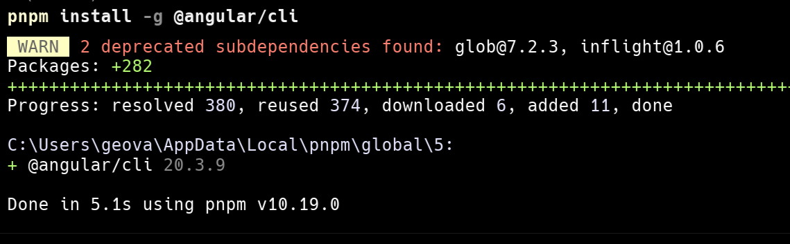
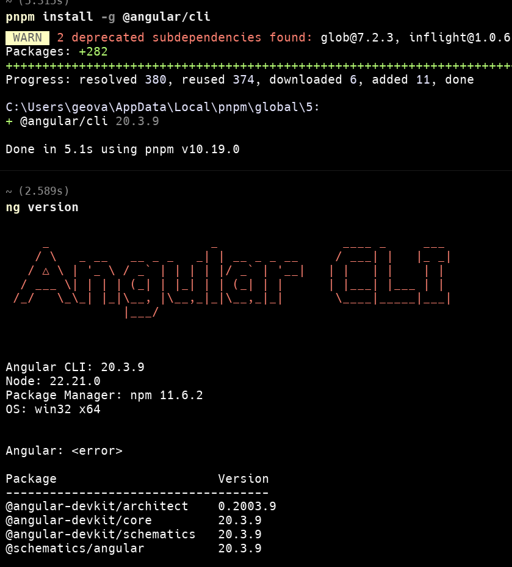
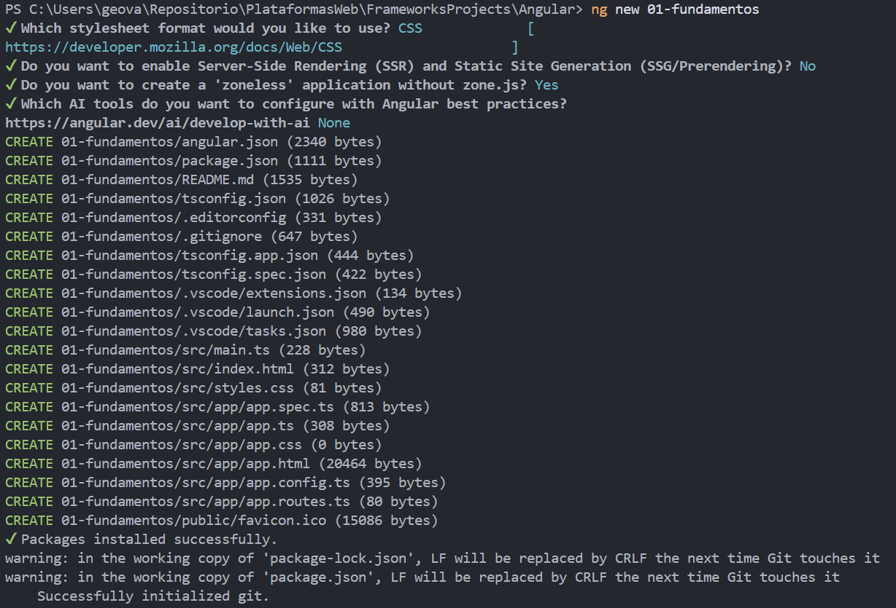
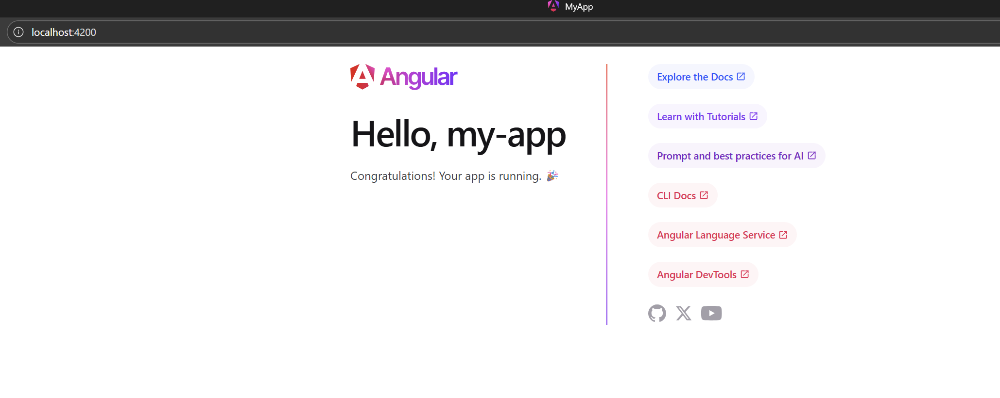

# Programación y Plataformas Web

## Frameworks Web: Angular

<div align="center">
  

</div>

## Practica 1: Instalación y Configuración de Angular

### Autores

**Geovanni Zúñiga**
📧 gzunigag@est.ups.edu.ec  
💻 GitHub: [Geovanni](https://github.com/nnyez)

## Resultados

Capturas de pantalla como evidencia del proceso de instalación y configuración de Angular, así como explicaciones detalladas de los componentes y formularios utilizados en la práctica.

### 1. Instalación de Angular CLI y creación del proyecto



**Descripción de la imagen:**

En esta captura se muestra el proceso de instalación de Angular CLI versión 20.3.9 mediante el gestor de paquetes ppnpm (Node Package Manager). Los pasos realizados fueron:

- **Comando ejecutado:** `pnpm install -g @angular/cli`

  - El flag `-g` indica una instalación global, permitiendo usar Angular CLI desde cualquier ubicación del sistema.

- **Proceso de instalación:** Se observa la descarga de dependencias necesarias y la configuración del paquete en el sistema.

- **Verificación:** Una vez completada la instalación, se puede verificar ejecutando:

  ```bash
  ng version
  ```

  Este comando muestra la versión instalada de Angular CLI y las dependencias del proyecto.

### 2. Revision de configuracion de angular



**Descripción de la imagen:**
En esta captura se muestra la salida del comando `ng version`, que proporciona información detallada sobre la configuración del entorno Angular.

```bash

Angular CLI: 20.3.9
Node: 22.21.0
Package Manager: npm 11.6.2
OS: win32 x64
```

### 3. Creación del proyecto Angular

Se crea un nuevo proyecto Angular llamado `01-fundamentos` utilizando el comando `ng new 01-fundamentos`. y lo levantamos con `ng serve -o`

```bash
ng new 01-fundamentos

```

Configuración inicial del proyecto:

- Escojer CSS como preprocesador de estilos.

- Escojemos que no use Server Side Rendering (SSR).
- En la pregunta si queremos usar `zoneless` respondemos que si, ya que Angular recomienda usar `zoneless` para mejorar el rendimiento en aplicaciones modernas y trabaja con señales asincrónicas de manera más eficiente.



### 4. Proyecto corriendo en el navegador



### 5. Explicación de la estructura del proyecto

```bash
└── 📁my-app
    └── 📁public
    └── 📁src
        └── 📁app
            ├── app.config.ts
            ├── app.css
            ├── app.html
            ├── app.routes.ts
            ├── app.spec.ts
            ├── app.ts
        ├── index.html
        ├── main.ts
        ├── styles.css
    ├── .editorconfig
    ├── .gitignore
    ├── angular.json
    ├── package-lock.json
    ├── package.json
    ├── README.md
    ├── tsconfig.app.json
    ├── tsconfig.json
    └── tsconfig.spec.json
```

#### Carpetas y archivos principales

- `public`: Contiene archivos estáticos accesibles públicamente.
- `src`: Carpeta que contiene el código fuente de la aplicación.
- `node_modules`: Carpeta que contiene las dependencias del proyecto.
- `pnpm-lock.yaml`: Archivo de bloqueo de versiones para pnpm.
- `angular.json`: Archivo de configuración de Angular.
- `package.json`: Archivo de configuración de npm.
- `tsconfig.json`: Archivo de configuración de TypeScript.
- `tsconfig.app.json`: Archivo de configuración de TypeScript para la aplicación.
- `tsconfig.spec.json`: Archivo de configuración de TypeScript para las pruebas.

### Carpeta de código SRC

Dentro de la carpeta `src`, encontramos las siguientes subcarpetas y archivos importantes:

- `app`: Contiene el código principal de la aplicación, incluyendo componentes, servicios y módulos.
- `index.html`: Archivo HTML principal de la aplicación.
- `main.ts`: Punto de entrada de la aplicación.
- `styles.css`: Archivo de estilos globales.

### Carpeta APP

Dentro de la carpeta `app`, encontramos la siguiente estructura de archivos:

- `app.config.ts`: Archivo de configuración de la aplicación.
- `app.css`: Archivo de estilos específicos de la aplicación.
- `app.html`: Archivo HTML principal de la aplicación.
- `app.routes.ts`: Archivo de definición de rutas de la aplicación.
- `app.spec.ts`: Archivo de pruebas unitarias de la aplicación.
- `app.ts`: Archivo principal de la aplicación.
