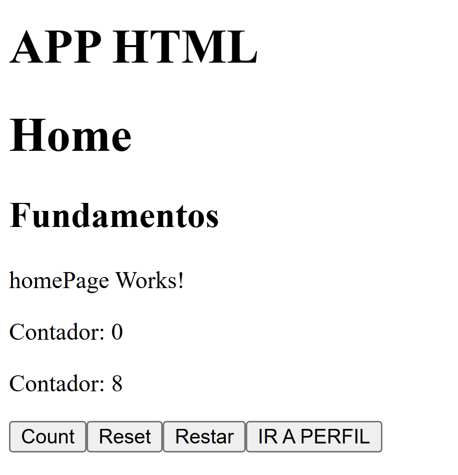
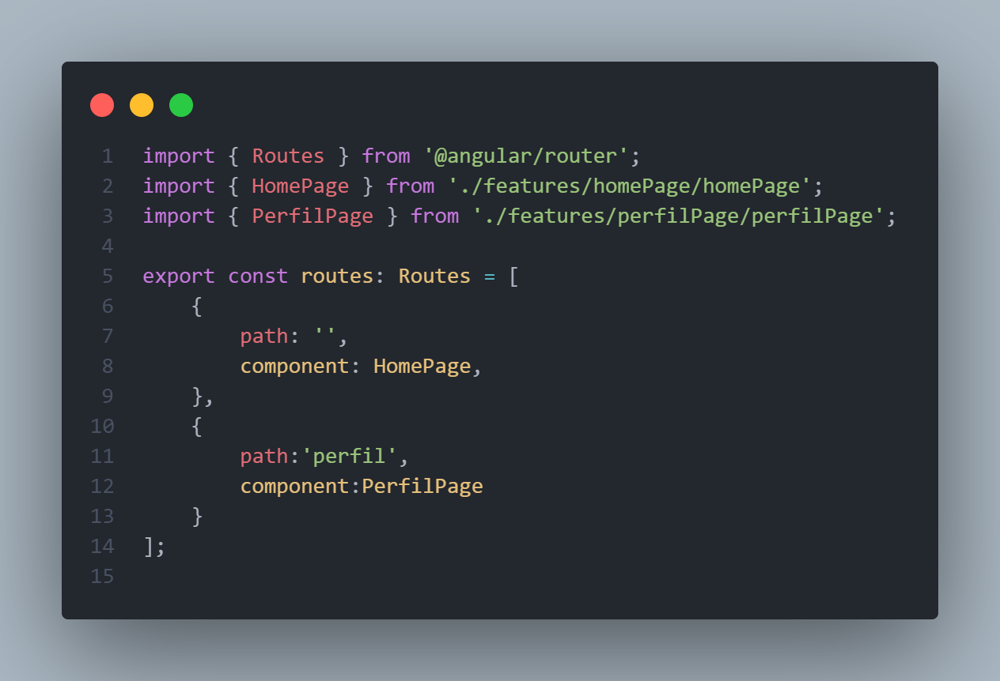
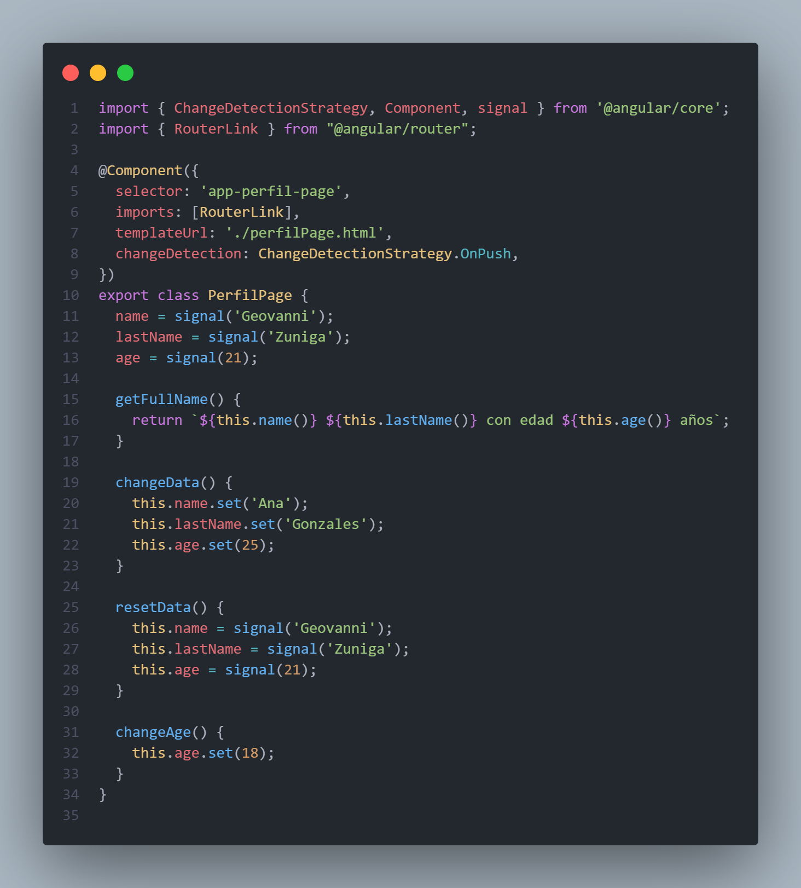
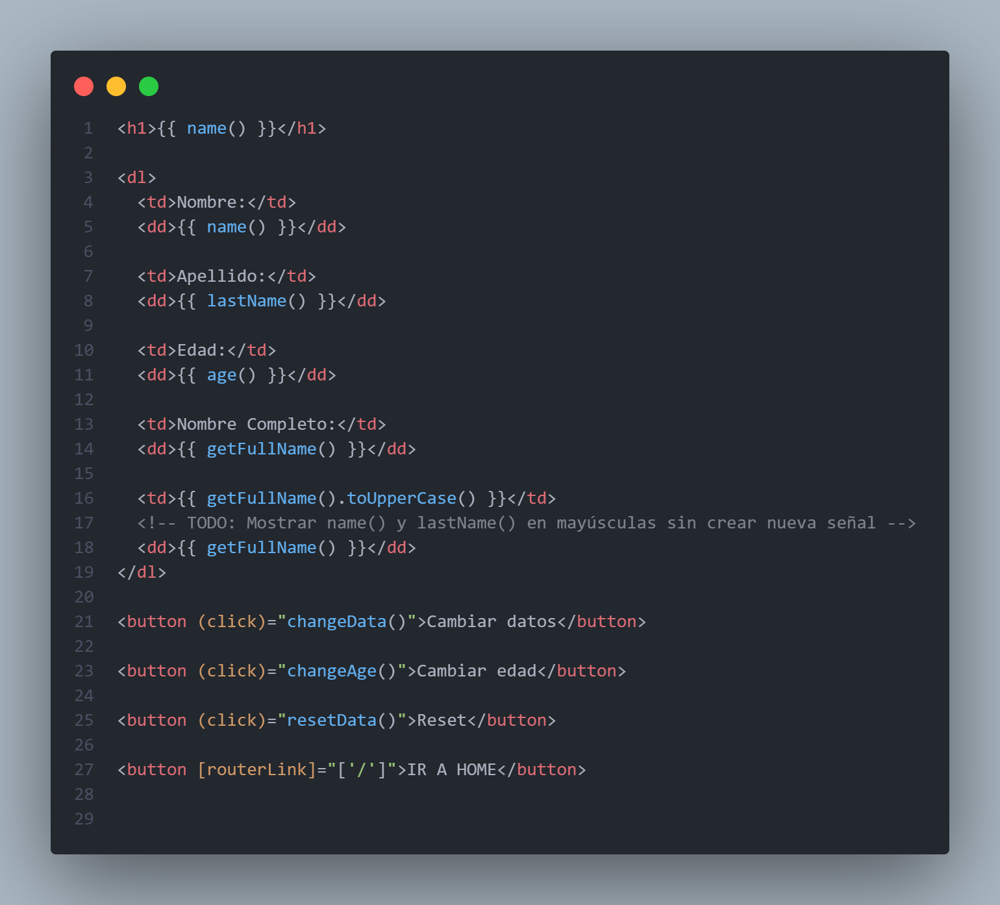
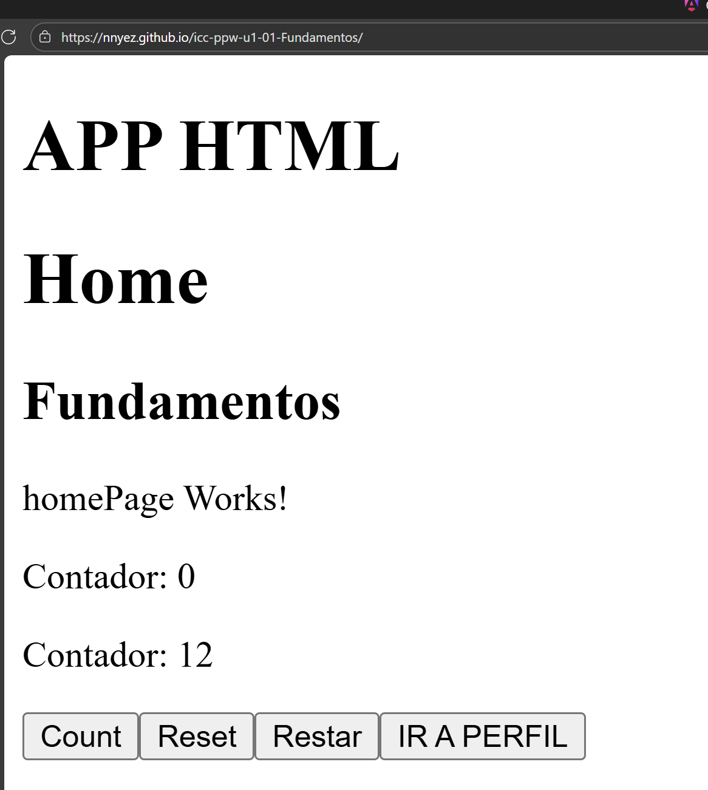

# Programación y Plataformas Web

## Frameworks Web: Angular

  

## Practica 2: Fundamentos

### Autores

**Geovanni Zúñiga**
📧 gzunigag@est.ups.edu.ec  
💻 GitHub: [Geovanni](https://github.com/nnyez)

## Resultados

### Creacion de un componente

Uso el comando `ng generate component` para crear un nuevo componente en Angular. Este comando genera automáticamente los archivos necesarios y actualiza el módulo correspondiente.

Componentes generados: HomePage, el cual le coloco en la carpeta `src/app/home/pages/homePage`.

### Resolucion tarea

#### 1. Captura de `app.routes.ts`

Este archivo controla las rutas de la aplicacion, se tiene que registrar la ruta que desea usarse y adjunto el componente que se mostrara en dicha ruta.

#### 2. Captura de `perfilPage.ts`

Este codigo pertenece a la creacion de variables `Signal` y ejemplos de la su aplicacion en un proyecto.

#### 3. Captura de `perfilPage.html`

Como se estructura la parte visual de la pagina donde ademas se usa variables `Signal` para obtener datos, metodos y cambios en tiempo real.

#### 4. Captura de la pagina desplegada

Una vez terminado el proyecto, se procede a subir al repositorio github para desplegar y tener acceso.