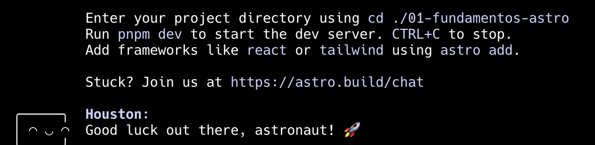
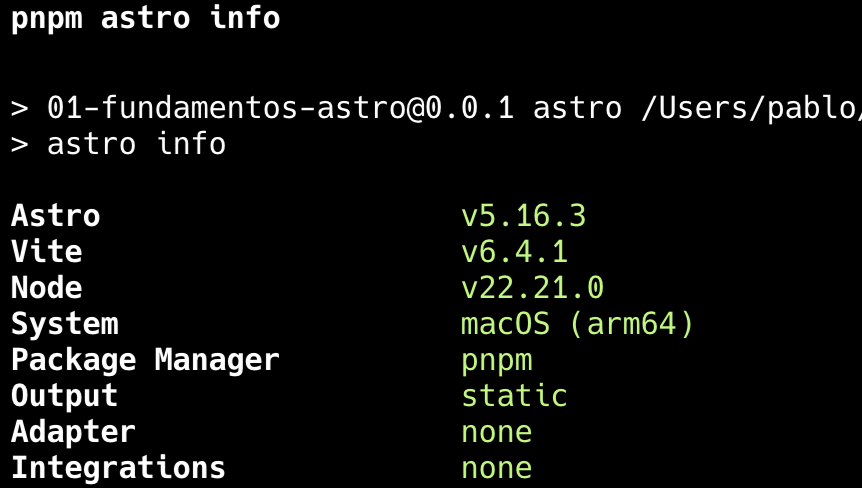

# Programación y Plataformas Web 

# Frameworks Web: Astro

<div align="center">
  

</div>


          

## Práctica 1: Instalación y Configuración de Astro

### Autores

**Pablo Torres**  
📧 ptorresp@ups.edu.ec  
💻 GitHub: [PabloT18](https://github.com/PabloT18)


## Instalación de Astro

Astro ofrece varias formas de crear un nuevo proyecto. La más recomendada es usando el comando `create astro`:

```bash
pnpm create astro@latest
```

Alternativamente, puedes usar npm o yarn:

```bash
npm create astro@latest
# o
yarn create astro@latest
```

Navegar al directorio del proyecto e instalar dependencias:

```bash
cd my-astro-app
pnpm install
```

Ejecutar la aplicación en modo desarrollo:

```bash
pnpm dev
```

Ejecutar la aplicación para que sea accesible desde otras máquinas en la red local:
```bash
pnpm dev --host 0.0.0.0 --port 4321
```

Compilar para producción:
```bash
pnpm build
```

Previsualizar el build de producción:
```bash
pnpm preview
```

---

## Extensiones recomendadas para VSCode (Astro)

Estas extensiones potencian el desarrollo con Astro:

* **[Astro](https://marketplace.visualstudio.com/items?itemName=astro-build.astro-vscode)** – Soporte oficial de Astro para VSCode con sintaxis highlighting, IntelliSense y más.
* **[Prettier - Code Formatter](https://marketplace.visualstudio.com/items?itemName=esbenp.prettier-vscode)** – Formato automático del código compatible con Astro.
* **[ESLint](https://marketplace.visualstudio.com/items?itemName=dbaeumer.vscode-eslint)** – Linting para JavaScript/TypeScript en proyectos Astro.
* **[Tailwind CSS IntelliSense](https://marketplace.visualstudio.com/items?itemName=bradlc.vscode-tailwindcss)** – Autocompletado y soporte para Tailwind CSS.
* **[Auto Close Tag](https://marketplace.visualstudio.com/items?itemName=formulahendry.auto-close-tag)** – Cierre automático de etiquetas HTML.
* **[Auto Rename Tag](https://marketplace.visualstudio.com/items?itemName=formulahendry.auto-rename-tag)** – Renombrado automático de etiquetas en pares.
* **[Material Icon Theme](https://marketplace.visualstudio.com/items?itemName=PKief.material-icon-theme)** – Iconos personalizados para archivos del proyecto.
* **[TypeScript Importer](https://marketplace.visualstudio.com/items?itemName=pmneo.tsimporter)** – Importación automática de módulos TypeScript.
* **[DotENV](https://marketplace.visualstudio.com/items?itemName=mikestead.dotenv)** – Soporte para archivos `.env`.
* **[Astro Snippets](https://marketplace.visualstudio.com/items?itemName=astro-build.astro-vscode)** – Fragmentos de código para componentes Astro.

---

## Hoja de Atajos – Astro CLI

### Comandos básicos

```bash
pnpm create astro@latest        # Crear un nuevo proyecto
pnpm dev                        # Iniciar servidor de desarrollo
pnpm build                      # Compilar para producción
pnpm preview                    # Previsualizar build de producción
pnpm astro --help               # Ayuda general
pnpm astro info                 # Información del proyecto
```

### Comandos avanzados

```bash
pnpm astro add tailwind         # Agregar integración de Tailwind CSS
pnpm astro add react            # Agregar integración de React
pnpm astro add vue              # Agregar integración de Vue
pnpm astro add svelte           # Agregar integración de Svelte
pnpm astro add solid            # Agregar integración de Solid.js
pnpm astro add lit              # Agregar integración de Lit
pnpm astro add alpinejs         # Agregar integración de Alpine.js
pnpm astro add mdx              # Agregar soporte para MDX
pnpm astro add sitemap          # Agregar generación de sitemap
pnpm astro add partytown        # Agregar Partytown para scripts de terceros
```

### Parámetros útiles para creación de proyecto:

- `--template minimal` → Proyecto mínimo sin contenido de ejemplo
- `--template blog` → Proyecto con estructura de blog
- `--template portfolio` → Proyecto tipo portafolio
- `--template docs` → Proyecto de documentación
- `--typescript strict` → TypeScript con configuración estricta
- `--no-install` → No instalar dependencias automáticamente
- `--dry-run` → Mostrar lo que se haría sin ejecutar

### Estructura creada automáticamente

- `src/` → Carpeta principal del código fuente
- `src/components/` → Componentes reutilizables
- `src/layouts/` → Layouts para páginas
- `src/pages/` → Páginas del sitio (enrutamiento automático)
- `public/` → Archivos estáticos (imágenes, favicon, etc.)
- `astro.config.mjs` → Configuración principal de Astro
- `tsconfig.json` → Configuración de TypeScript
- `package.json` → Dependencias y scripts del proyecto

### Integraciones comunes

```bash
# CSS y estilos
pnpm astro add tailwind
pnpm astro add sass

# Frameworks de UI
pnpm astro add react
pnpm astro add vue
pnpm astro add svelte

# Herramientas de desarrollo
pnpm astro add prettier
pnpm astro add eslint

# SEO y utilidades
pnpm astro add sitemap
pnpm astro add robots-txt
pnpm astro add compress
```

### Variables de entorno

Crear archivo `.env` en la raíz del proyecto:

```bash
# Variables públicas (prefijo PUBLIC_)
PUBLIC_API_URL=https://api.example.com

# Variables privadas (solo en servidor)
SECRET_API_KEY=your-secret-key
```

### Ayuda y documentación

```bash
pnpm astro --help           # Ayuda general
pnpm astro add --help       # Ayuda para integraciones
pnpm astro build --help     # Ayuda para build
```

---

## Parte Práctica:

Capturas de pantalla como evidencia del proceso de instalación y configuración de Astro, así como explicaciones detalladas de los componentes y estructura utilizados en la práctica.

### 1. Creación del proyecto Astro:

**Comando ejecutado:**
```bash
pnpm create astro@latest
```

**Proceso de configuración inicial:**

Durante la creación del proyecto, Astro nos presenta varias opciones de configuración:

1. **Nombre del proyecto:** `01-fundamentos-astro`

```bash
Where should we create your new project?
./01-fundamentos-astro
```


2. **Template:** Se puede elegir entre:
       
    - ○ A basic, helpful starter project → Proyecto básico con ejemplos útiles
    - ○ Use blog template → Proyecto con estructura de blog
    - ○ Use docs (Starlight) template → Proyecto de documentación
    - ● Use minimal (empty) template → Proyecto mínimo sin contenido de ejemplo


```bash
 How would you like to start your new project?
    ○ A basic, helpful starter project → 
    ○ Use blog template →
    ○ Use docs (Starlight) template →
    ● Use minimal (empty) template →
```

3. Install dependencies? (recommended) si seleccionas "Yes", se instalarán automáticamente las dependencias necesarias para el proyecto. `pnpm install` 

```bash
 Install dependencies? (recommended)
 ● Yes  ○ No 
 ```

 ```bash
 ██  Project initializing...
         ■ Template copied
         ▶ Dependencies installing with pnpm...
         □ Git
```

Proyecto de ASTRO creado exitosamente con pnpm




### 2. Verificación de la instalación:

**Comandos de verificación:**
```bash
cd 01-fundamentos-astro
pnpm astro info
```




Este comando muestra información detallada sobre:
- Versión de Astro instalada
- Versión de Node.js
- Sistema operativo
- Integraciones activas
- Configuración del proyecto

### 3. Estructura del proyecto creado:

```
01-fundamentos-astro/
├── public/
│   └── favicon.svg
├── src/
│   └── index.astro
├── astro.config.mjs
├── package.json
├── README.md
├── tsconfig.json
└── pnpm-lock.yaml
```

### 4. Proyecto corriendo en el navegador:

**Comando para ejecutar:**
```bash
pnpm dev
```

El servidor de desarrollo se ejecuta por defecto en `http://localhost:4321`

**Características del servidor de desarrollo:**
- **Hot reload** automático
- **Fast refresh** para cambios instantáneos
- Soporte para múltiples frameworks simultáneamente
- **Island Architecture** para hidratación selectiva

### 5. Explicación de la estructura del proyecto:

#### Carpetas y archivos principales:

- **`public/`**: Contiene archivos estáticos que se copian tal como están al build final
- **`src/`**: Carpeta que contiene el código fuente de la aplicación
- **`node_modules/`**: Dependencias del proyecto (generado por pnpm)
- **`pnpm-lock.yaml`**: Archivo de bloqueo de versiones para pnpm
- **`astro.config.mjs`**: Configuración principal de Astro
- **`package.json`**: Dependencias y scripts del proyecto
- **`tsconfig.json`**: Configuración de TypeScript

#### Carpeta de código SRC

Dentro de `src/`, encontramos:

- **`components/`**: Componentes Astro reutilizables (.astro, .tsx, .vue, etc.)
- **`layouts/`**: Plantillas base para páginas
- **`pages/`**: Páginas del sitio (enrutamiento basado en archivos)
- **`styles/`**: Archivos de estilos globales (opcional)
- **`content/`**: Colecciones de contenido (blogs, productos, etc.) - opcional

#### Archivos especiales de Astro

- **`.astro`**: Componentes nativos de Astro con sintaxis similar a JSX
- **`astro.config.mjs`**: Configuración de integraciones, plugins y opciones de build
- **Enrutamiento automático**: Archivos en `pages/` se convierten automáticamente en rutas

#### Ventajas clave de Astro:

1. **Zero JS por defecto**: Genera HTML estático sin JavaScript innecesario
2. **Island Architecture**: Hidrata solo los componentes interactivos
3. **Framework agnóstic**: Soporta React, Vue, Svelte, Solid, etc. en el mismo proyecto
4. **Performance superior**: Sitios web extremadamente rápidos
5. **SEO optimizado**: Renderizado estático por defecto


#### Comparativas

##### 1. ¿Por qué **React se crea con Vite**, pero **Astro no**, si ambos usan Vite internamente?

 **React**

React es solo una **librería de UI**, no es un framework completo.
Entonces necesitas una herramienta externa para:

* empaquetar
* procesar CSS
* levantar servidor de desarrollo
* recargar en vivo
* compilar todo

Por eso existe:

```
npm create vite@latest
```

Vite es quien arma todo el proyecto React.

---

**Astro**

Astro NO es solo una librería.
Es un **framework completo**, que ya incluye:

* routing
* server-side rendering
* build
* optimizaciones
* integraciones
* adaptadores
* loaders
* manejo de assets

Astro **internamente usa Vite**, pero **Astro controla Vite**, no al revés.

Por eso el comando es:

```
npm create astro@latest
```

Astro ya usa Vite por debajo, pero tú no necesitas crear un proyecto Vite manualmente porque Astro es más completo.

---
