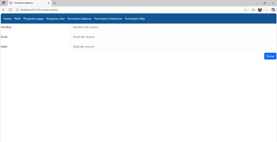

# Programación y Plataformas Web 

# Frameworks Web: Angular

<div align="center">
  
</div>

## Práctica 3: Navegación en Angular

### Autores

**Juan Alvarez- David Villa**  
---

## 🧭 Navegación en Angular

La navegación en Angular es fundamentalmente diferente a la navegación tradicional en HTML. Mientras que en HTML usamos etiquetas `<a href="">`, en Angular utilizamos la directiva `routerLink` para crear aplicaciones de una sola página (SPA) que no requieren recargar la página completa.

## �️ Implementación Práctica
### Paso 1: Crear las Páginas Principales
### 1.1: Crear ProyectosPage
### Código: Proyectos-page.ts

```typescript
import { ChangeDetectionStrategy, Component, signal } from '@angular/core';
import { FormsModule } from '@angular/forms';
import{ ProyectoInt } from './interfaces/Proyecto-int';
import { ProyectoListados } from "./components/proyecto-listados/proyecto-listados";

@Component({
  selector: 'app-proyectos-page',
  standalone: true,
  imports: [FormsModule, ProyectoListados],
  templateUrl: './Proyectos-page.html',
  changeDetection: ChangeDetectionStrategy.OnPush,
})
export class ProyectosPage {

  name = signal('');
  descripcion = signal('');


  proyectos = signal<ProyectoInt[]>([
    {
      id: 1,
      nombre: 'Proyecto A',
      descripcion: 'Descripcion'
    }
  ]);

  agregarProyecto() {
    const nombre = this.name().trim();
    const descripcion = this.descripcion().trim();

    if (!nombre || !descripcion) return; 

    const nuevoProyecto: ProyectoInt = {
      id: this.proyectos().length + 1,
      nombre,
      descripcion
    };

    this.proyectos.update(lista => [...lista, nuevoProyecto]);

    this.name.set('');
    this.descripcion.set('');
  }
}
```
### 1.2 Crear ProyectosDosPage
### Código: Proyectos-dos.ts

```typescript
import { ChangeDetectionStrategy, Component, inject } from '@angular/core';
import { ProyectosService } from './services/proyectos-service';
import { ProyectoListados } from "../Proyectos-page/components/proyecto-listados/proyecto-listados";
import { AddProyecto } from '../Proyectos-page/components/add-proyecto/add-proyecto';

@Component({
  selector: 'proyectos-dos',
  standalone: true,
  imports: [ProyectoListados, AddProyecto],
  templateUrl: './Proyectos-dos.html',
  changeDetection: ChangeDetectionStrategy.OnPush,
})
export class ProyectosDos { 
  proyectosService = inject(ProyectosService);

  onProyectoAgregado(nuevoProyecto: any) {
    this.proyectosService.addProyecto(nuevoProyecto);
  }

  proyectos = this.proyectosService.proyectos;
}
```
### Paso 2: Configurar las Rutas
### Código: app.routes.ts

```typescript
import { Routes } from '@angular/router';
import { HomePage } from './features/homePage/homePage';
import { PerfilPage } from './features/PerfilPage/PerfilPage';
import { ProyectosPage } from './features/Proyectos-page/Proyectos-page';
import { ProyectosDos } from './features/Proyectos-dos/Proyectos-dos'; 
import { FormularioPage } from './features/Formulario-page/Formulario-page';   


export const routes: Routes = [
  { path: '', redirectTo: 'home', pathMatch: 'full' }, 
  { path: 'home', component: HomePage },
  { path: 'perfil', component: PerfilPage },
  { path: 'proyectos-page', component: ProyectosPage },
  { path: 'proyectos-dos', component: ProyectosDos },
  { path: 'formulario-page', component: FormularioPage }

];
```
### Paso 3: Agregar al Navbar
### Código: nav-bar.html

```html
<nav>
  <a 
    routerLink="/home"
    routerLinkActive="active"
    [routerLinkActiveOptions]="{exact:true}"
  > Home</a>
  
  <a 
    routerLink="/perfil"
    routerLinkActive="active"
    [routerLinkActiveOptions]="{exact:true}"
  > Perfil</a>
  <a 
    routerLink="/proyectos-page"
    routerLinkActive="active"
    [routerLinkActiveOptions]="{exact:true}"
  > Proyectos-page</a>

  <a 
    routerLink="/proyectos-dos"
    routerLinkActive="active"
    [routerLinkActiveOptions]="{exact:true}"
  > Proyectos-dos</a>

  <a 
    routerLink="/formulario-page"
    routerLinkActive="active"
    [routerLinkActiveOptions]="{exact:true}"
  > Formulario-page</a>

</nav>
```
### Código: nav-bar.ts

```TypeScript
import { ChangeDetectionStrategy, Component } from '@angular/core';
import { RouterLink, RouterLinkActive } from '@angular/router';

@Component({
  selector: 'app-nav-bar',
  standalone: true,
  imports: [RouterLink, RouterLinkActive],
  templateUrl: './nav-bar.html',
  styles: [`
    nav {
      background-color: #159;
      padding: 1rem;
    }
    a {
      color: white;
      margin-right: 1rem;
      text-decoration: none;
    }
    a:hover {
      text-decoration: underline;
    }
    .active {
      font-weight: bold;
      text-decoration: underline;
    }
  `],
  changeDetection: ChangeDetectionStrategy.OnPush,
})
export class NavBar { }
```
### Paso 4: Crear Componentes Individuales
### 4.1 Componente para Agregar Proyectos
### Código: add-proyecto.ts

```TypeScript
import { ChangeDetectionStrategy, Component, inject, output, signal } from '@angular/core';
import { ProyectoInt } from '../../interfaces/Proyecto-int';
import { ProyectosService } from '../../../Proyectos-dos/services/proyectos-service';

@Component({
  selector: 'add-proyecto',
  standalone: true,
  templateUrl: './add-proyecto.html',
  changeDetection: ChangeDetectionStrategy.OnPush,
})
export class AddProyecto {
  // Inyectamos el servicio
  private proyectosService = inject(ProyectosService);

  name = signal('');
  description = signal('');
  newProyecto = output<ProyectoInt>();

  addProyecto() {
    const newProyecto: ProyectoInt = {
      id: Math.floor(Math.random() * 1000),
      nombre: this.name(),
      descripcion: this.description(),
    };

    this.newProyecto.emit(newProyecto); 
    this.name.set('');
    this.description.set('');
  }

  deleteProyecto() {
    this.proyectosService.deleteFirstProyecto();
  }

  changeName(value: string) {
    this.name.set(value);
  }

  changeDescription(value: string) {
    this.description.set(value);
  }
}
```
### 4.2 Componente para Lista de Proyectos
### Código: proyecto-listados.ts

```TypeScript
import { ChangeDetectionStrategy, Component, input } from '@angular/core';
import { CommonModule } from '@angular/common';
import { ProyectoInt } from '../../interfaces/Proyecto-int';

@Component({
  selector: 'proyecto-listados',
  standalone: true,
  imports: [CommonModule],
  templateUrl: './proyecto-listados.html',
  changeDetection: ChangeDetectionStrategy.OnPush,
})
export class ProyectoListados {
  // nombre del listado (texto del título)
  listName = input.required<string>();

  // listado de proyectos recibido desde el componente padre
  proyectos = input.required<ProyectoInt[]>();
}
```

### Paso 5: Implementar la Página de Proyectos
### Código: Proyectos-page.html

```html
<h1>Proyectos-page works!</h1>

<section>
  <div>
    <h3>Agregar Proyecto</h3>
    <h4>Proyecto a Agregar: {{ name() }}</h4>

    <input
      type="text"
      placeholder="Nombre del proyecto"
      [ngModel]="name()"
      (ngModelChange)="name.set($event)"
    >

    <input
      type="text"
      placeholder="Descripción del proyecto"
      [ngModel]="descripcion()"
      (ngModelChange)="descripcion.set($event)"
    >

    <button (click)="agregarProyecto()">Agregar</button>
  </div>

  <div>
    <h3>Listado</h3>
    <ul>
      @for (proyecto of proyectos(); track proyecto.id) {
        <li>{{ proyecto.nombre }} - {{ proyecto.descripcion }}</li>
      }
    </ul>
  </div>
  <proyecto-listados 
  [listName]="'Listado de Proyectos'" 
  [proyectos]="proyectos()">
</proyecto-listados>
</section>
```
### Paso 6: Implementar la Página ProyectosDos
### Código: Proyectos-dos.html

```html
<h2>Proyecto Dos</h2>

<add-proyecto (newProyecto)="onProyectoAgregado($event)"></add-proyecto>

<h3>Listado</h3>
<ul>
  @for(proyecto of proyectos(); track $index) {
    <li>{{ proyecto.nombre }} - {{ proyecto.descripcion }}</li>
  }
</ul>
```
### 📸 CAPTURAS DE IMPLEMENTACIÓN
### 1. Configuración de Rutas
Código completo de app.routes.ts (ya mostrado arriba)

### 2. Navegación con RouterLink
Código completo de nav-bar.html (ya mostrado arriba)

### 🔧 3. Componente con Navegación
 ### Código de Navegación Programática

```TypeScript
// En ProyectosPage
irAProyectosDos() {
  this.router.navigate(['/proyectos-dos']);
}

// En ProyectosDosPage  
volverAProyectos() {
  this.router.navigate(['/proyectos']);
}
```
Estos métodos permiten cambiar de ruta mediante eventos de usuario, 
como clics en botones, demostrando una alternativa a routerLink.

### 4. Aplicación Funcionando
### Captura 1: Página de inicio con navbar


Muestra la página principal de la aplicación con el navbar completamente 
funcional. Se observa la estructura base de la aplicación con todos los enlaces de 
navegación disponibles, estableciendo una base sólida para la experiencia de usuario.
### Captura 2: Página de proyectos con formulario y lista

 Aqui se visualiza la página de gestión de proyectos con el mensaje 
"Proyectos-page works!" confirmando que el componente se carga correctamente. 
La interfaz incluye:

• Sección "Agregar Proyecto" con tabla para entrada de datos

• Campos para "Nombre del proyecto" y "Descripción del proyecto"

• Botón "Agregar" para enviar el formulario

• Sección "Listado" que muestra proyectos existentes

• Proyectos ejemplo: "Proyecto A - Descripcion" y "WEB - MATERIA"

Esta implementación demuestra la integración exitosa de formularios y listas.
 ### Captura 3: Página ProyectosDos con botones de navegación

La captura presenta la página secundaria "Proyecto Dos" que incluye:

• Título principal "Proyecto Dos"

• Tabla estructurada para agregar proyectos con columnas definidas

• Botones de acción "Agregar Proyecto" y "Eliminar Proyecto"

• Lista de proyectos existentes con formato claro

• Proyectos ejemplo: "Proyecto A - Descripción inicial" y "WEB - MATERIA"

Esta página muestra una implementación alternativa de la gestión de proyectos.

## 🔗 Enlaces del Proyecto
- **Repositorio GitHub**: https://github.com/Juanfernando518/PRACTICA-2.git
- **GitHub Pages**: https://juanfernando518.github.io/PRACTICA-2/


