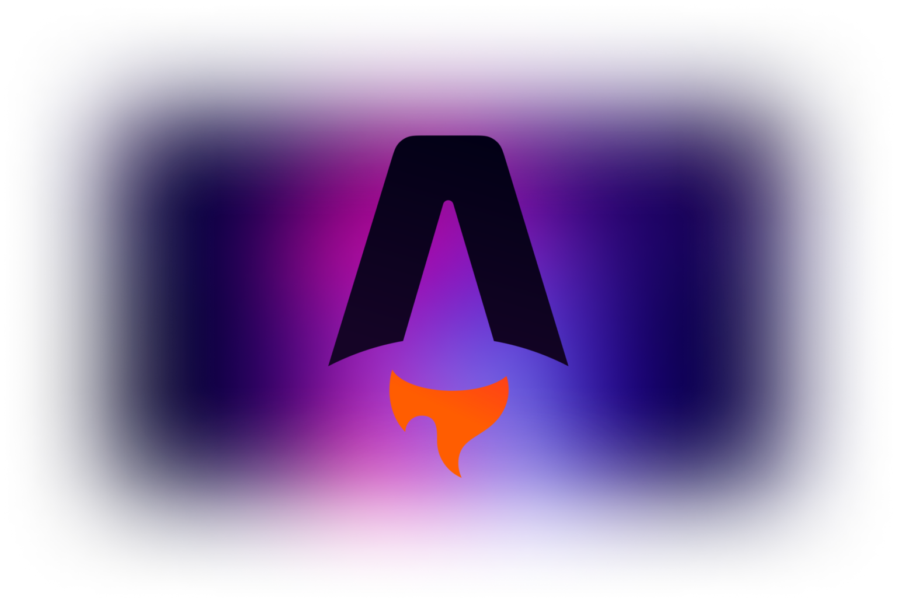
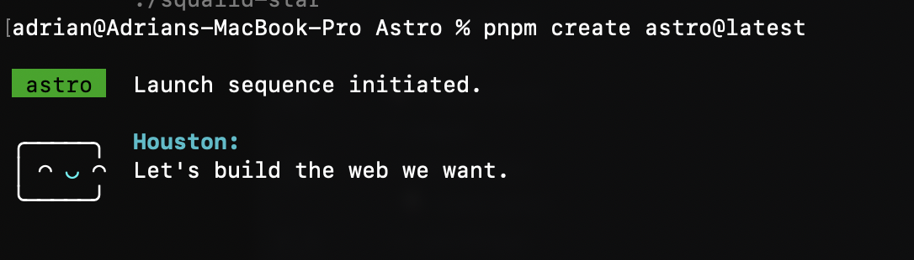
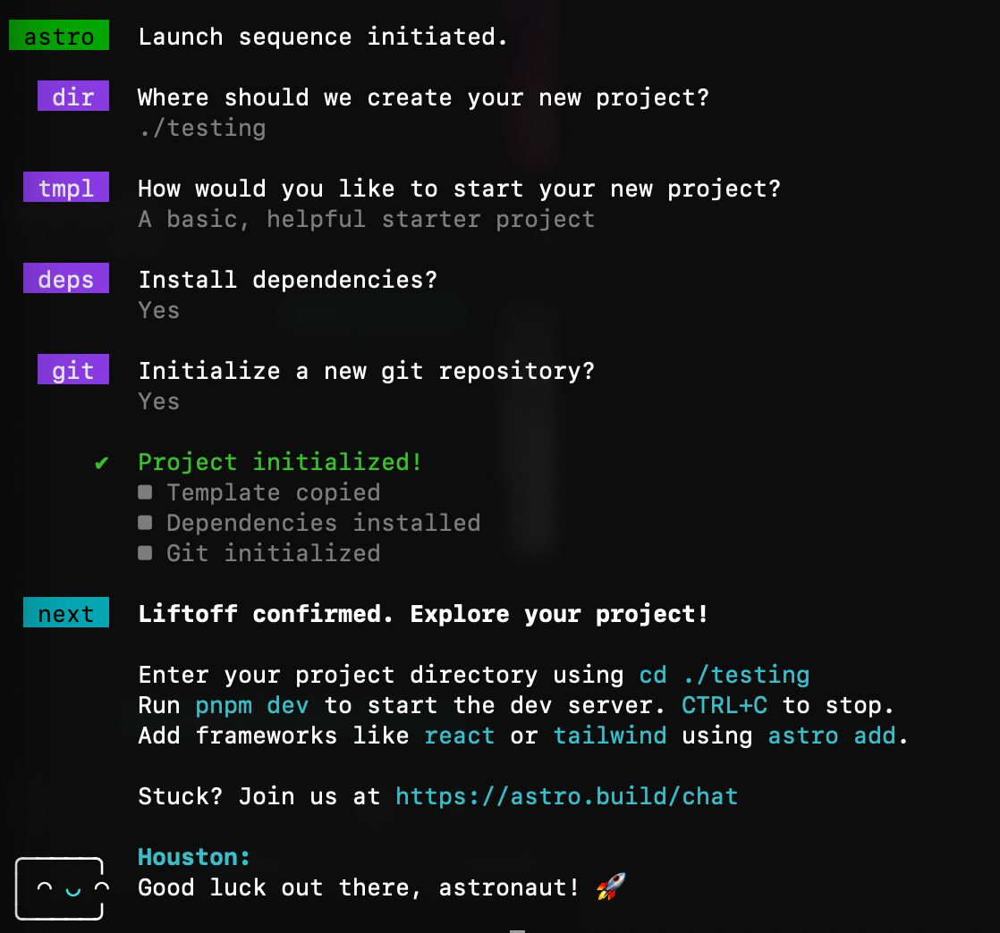
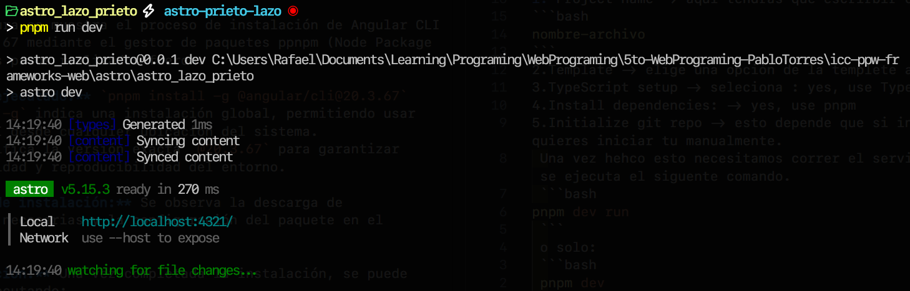
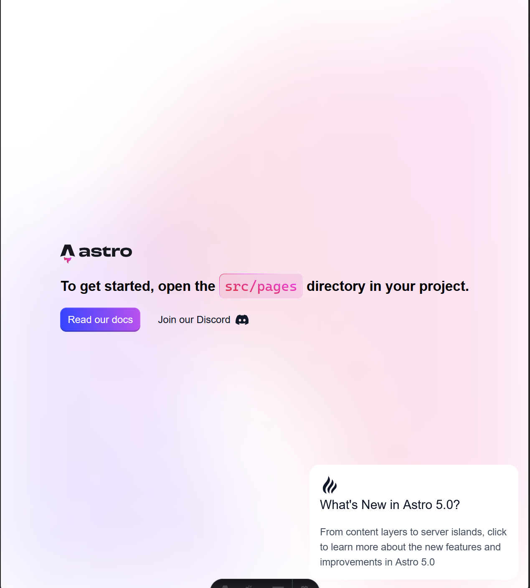
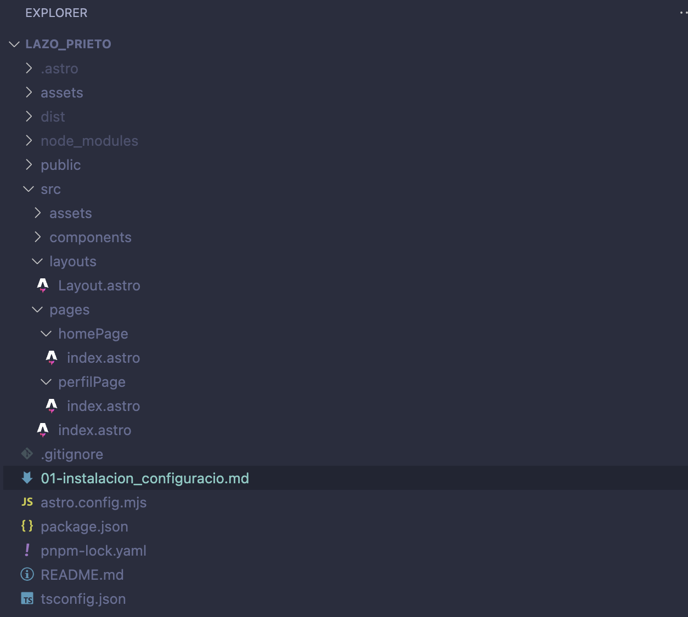

# Programación y Plataformas Web

# Frameworks Web: Astro

<div align="center">
  
</div>


## Práctica 1: Instalación y Configuración de Astro

### Autores

**Rafael Prieto**
📧 pprietos@est.ups.edu.ec
💻 GitHub: [Raet0](https://github.com/Raet0)

**Adrian Lazo**
📧 blazoc@est.ups.edu.ec
💻 GitHub: [scomygod](https://github.com/scomygod)

### Introducción

En clase hemos aprendido Angular, un framework muy potente para crear aplicaciones web interactivas de una sola página (SPA). Paralelamente, estamos explorando Astro por nuestra cuenta, un framework moderno enfocado en la construcción de sitios web rápidos y optimizados para contenido, con un enfoque de **Island Architecture** que permite cargar interactividad solo donde es necesaria.

A continuación, presentamos una comparación resumida entre Angular y Astro:

| Característica        | Angular (SPA Framework)                                           | Astro (Island Architecture)                                                |
|-----------------------|-----------------------------------------------------------------|---------------------------------------------------------------------------|
| Propósito             | Aplicaciones Interactivas de Una Sola Página (SPA)              | Sitios Web enfocados en Contenido (SSG/SSR) con interactividad selectiva  |
| Renderizado Predeterminado | CSR (Client-Side Rendering). Gran carga de JavaScript inicial | SSG/SSR. Envía HTML puro (Zero JavaScript por defecto)                    |
| Archivos TypeScript   | La lógica TS (ej. Signals) se ejecuta en el cliente para la interactividad | La lógica TS entre --- se ejecuta sólo en el servidor (o en compilación). La interactividad requiere componentes de UI (client:) |

### 1. Instalación de Astro CLI

Antes de iniciar, es necesario verificar que tenemos **pnpm** instalado.
Para verificarlo:

```bash
pnpm -v
```

si dice que no existe el comando, instálalo ejecutando:

```bash
npm install -g pnpm
```
---

### 2. Creación (e instalación) de un Proyecto en Astro 

Primero ubícate en la carpeta donde quieras trabajar y vamos a ejecutar el siguente comando:
```bash
pnpm create astro@latest
```

<div align="center">
  
</div>

Esto iniciará el asistente interactivo
1. **dir**, Project name -> aquí tendras que especificar el nombre del proyecto

`nombre-archivo`

2. **tmpl**, Template -> elige una opción, será la plantilla que quieras usar en el proyecto
3. **ts** TypeScript setup -> seleciona : yes, probablemente esta opción no aparezca porque ya tenemos **ts** instalado
4. **deps**, Install dependencies: -> yes
5. **git**, Initialize git repo -> esto depende que si inicializa ahi o lo quieres iniciar tu manualmente.


<div align="center">
  
</div>

---
<div align="center">

</div>
 
Una vez hecho esto, necesitamos correr el servidor, para lograr esto se ejecuta el siguente comando:
 ```bash
pnpm dev run
 ```
 o solo:
 ```bash
 pnpm dev
 ```

<div align="center">
  
</div>

---

### 3. Visualización del proyecto en el navegador

Una vez iniciado el servidor, podemos acceder a la aplicación desde el navegador ingresando a la dirección:

**http://localhost:4321/**

Aquí podremos ver la interfaz inicial del proyecto recién creado con Astro.

<div align="center">
  
</div>

### 4. Explicación de la estructura del proyecto

<div align="center">
  
</div>

#### Carpetas y archivos principales:

	•	public: Archivos estáticos accesibles públicamente (imágenes, favicon, etc.).
	•	src: Carpeta principal con el código fuente del proyecto.
	•	node_modules: Contiene las dependencias del proyecto.
	•	package.json: Archivo de configuración de npm/pnpm con dependencias y scripts.
	•	tsconfig.json: Configuración de TypeScript.
	•	astro.config.mjs: Archivo de configuración de Astro, donde se puede modificar rutas, integraciones y otros parámetros.

#### Carpeta src/

Dentro de src/:
	•	components/: Componentes reutilizables (UI).
	•	layouts/: Plantillas de páginas (layouts).
	•	pages/: Páginas del proyecto (.astro o .md).
	•	styles/: Archivos CSS/SCSS globales o específicos.

#### Carpeta pages/

Dentro de pages/ se crean las rutas del sitio:
	•	index.astro: Página principal.
	•	about.astro: Página “Acerca de” (si aplica).

#### Flujo de Astro
	1.	Astro genera HTML estático por defecto.
	2.	La interactividad se carga solo en los componentes con client:.
	3.	TypeScript se puede usar en componentes y scripts del proyecto.
	4.	La arquitectura permite optimizar la velocidad del sitio, enviando cero JavaScript por defecto al navegador.

