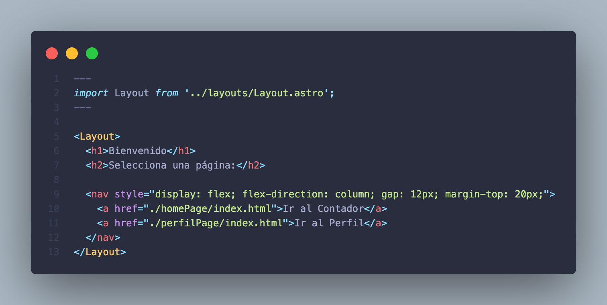
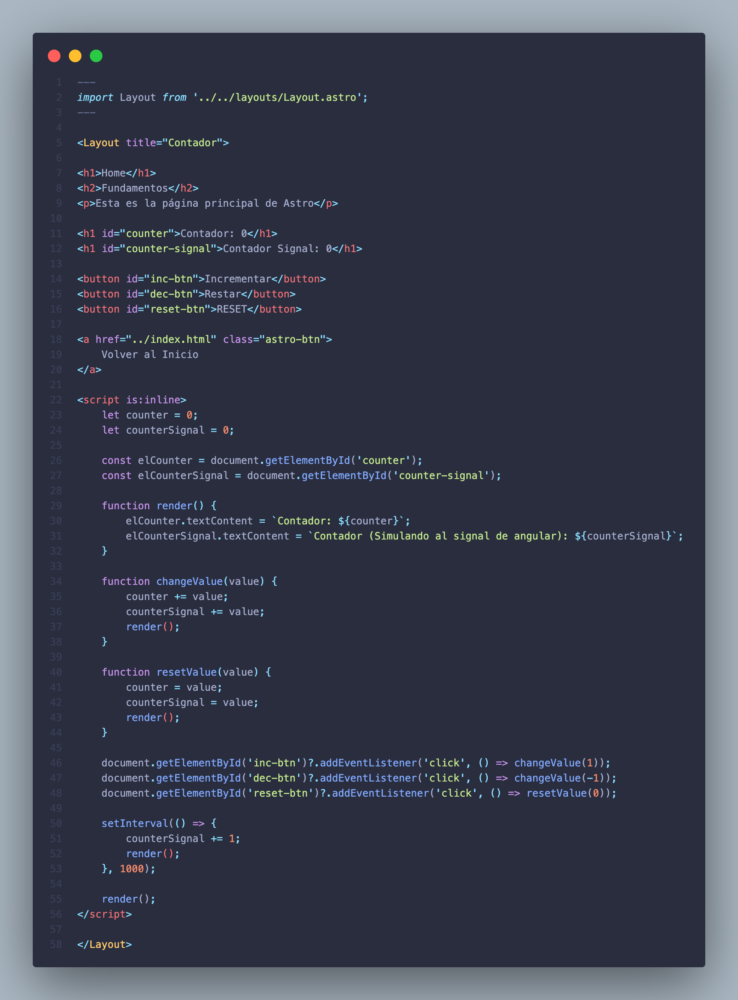
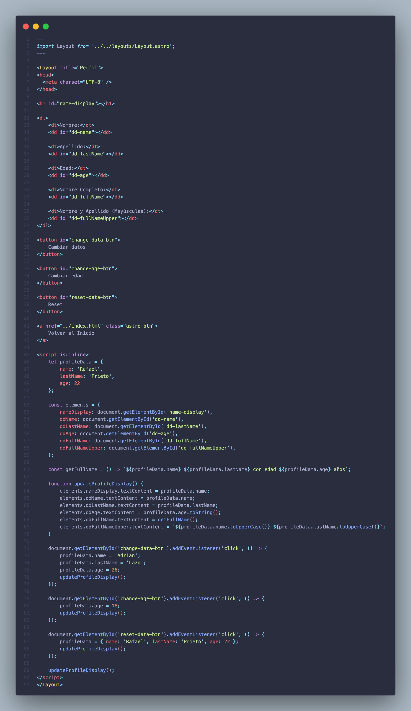
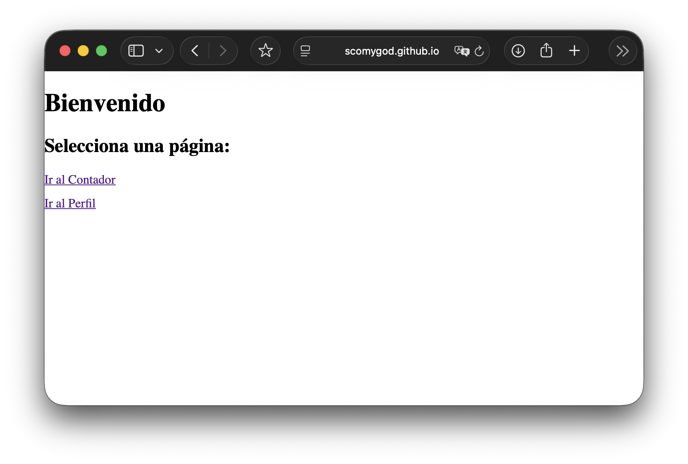
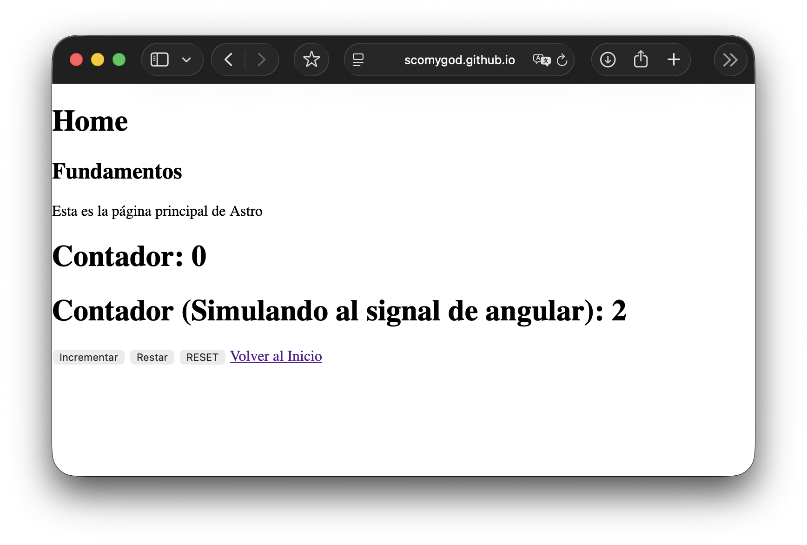
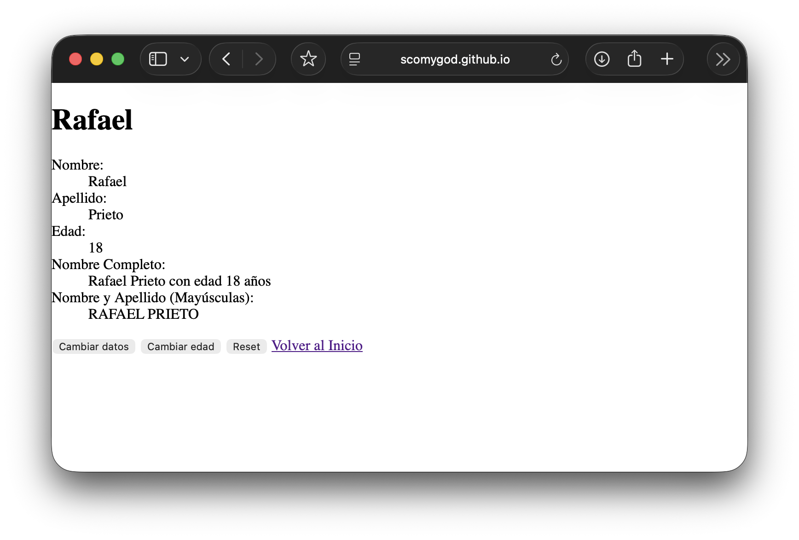

# Programación y Plataformas Web 

# Frameworks Web: Astro

<div align="center">
  
</div>

## Practica 2: Fundamentos 

### Autoress

**Rafael Prieto**  
📧 pprietos@est.ups.edu.ec  
💻 GitHub: [Raet0](https://github.com/Raet0)

**Adrian Lazo**  
📧 blazoc@est.ups.edu.ec  
💻 GitHub: [scomygod](https://github.com/scomygod)

## Fundamentos de Astro

## ¿Qué es Astro?

Astro es un framework moderno para construir sitios web rápidos y optimizados. Permite combinar múltiples frameworks de UI (React, Vue, Svelte, etc.) en un mismo proyecto y genera páginas estáticas por defecto, lo que mejora significativamente el rendimiento. Astro usa un enfoque basado en componentes y permite renderizar solo lo necesario en el cliente.

## Características principales de Astro

1. **Componentes**: Astro permite crear componentes reutilizables que pueden estar escritos en diferentes frameworks de UI (React, Vue, Svelte, etc.) o en Astro Components (.astro).

2. **Rendering Estático**: Astro genera HTML estático durante la compilación, lo que mejora el tiempo de carga y SEO.

3. **Islas de Interactividad**: Solo los componentes interactivos se cargan en el cliente, mientras que el resto permanece estático.

4. **Integraciones**: Astro facilita integrar librerías, frameworks y servicios mediante integraciones oficiales o personalizadas.

5. **Ruteo Automático**: Las rutas en Astro se generan automáticamente según la estructura de carpetas en `src/pages`.

6. **Markdown y Contenido**: Astro permite usar Markdown y MDX para generar páginas de contenido de forma sencilla.

## Rutas

En Astro, cada archivo `.astro` dentro de `src/pages` se convierte en una ruta de la web. Por ejemplo, `src/pages/about.astro` genera la ruta `/about`. Las rutas son automáticas y no requieren configuración adicional.

## Componentes de Astro

Los componentes en Astro se definen en archivos `.astro` y pueden incluir:

1. **Script**: Código JavaScript o TypeScript para la lógica del componente.
```ts
---
const title = "Hola desde Astro";
---
```

2. **Markup HTML**: Define la estructura de la UI del componente en Astro. Puedes usar HTML directamente y también incrustar variables y props definidas en el script del componente.
```html
<h1>{title}</h1>
```

3.	Estilos: Se pueden aplicar estilos CSS dentro del componente o mediante archivos externos.
```css
<style>
  h1 {
    color: blue;
    font-family: Arial, sans-serif;
  }

  p {
    font-size: 16px;
    color: #333;
  }
</style>
```

#### Props
Los componentes de Astro pueden recibir props para personalizar su contenido. Por ejemplo:

```ts
---
const { message } = Astro.props;
---
<p>{message}</p>
```
Esto permite que un mismo componente se reutilice con distintos contenidos según las props que se le pasen.

## Resultados

### Creación de un componente

Para crear un componente en Astro, se puede simplemente crear un archivo `.astro` dentro de `src/components`. No es necesario un CLI como Angular.  

Ejemplo: creamos el componente `HomePage.astro` en la carpeta `src/components/HomePage.astro`.

```ts
---
const title = "Página de Inicio";
---
```
```html
<section>
  <h1>{title}</h1>
  <p>Bienvenido a mi proyecto en Astro</p>
</section>

<style>
```
```css
  section {
    padding: 20px;
    background-color: #f9f9f9;
  }

  h1 {
    color: #1e90ff;
  }

  p {
    font-size: 16px;
    color: #333;
  }
</style>
```

### Resolución tarea

Seguir las instrucciones del siguiente GIST: [GIST](https://gist.github.com/PabloT18/f15f92224806731541d48027df336497)

1. Captura de `src/pages/index.astro`  


2. Captura de `HomePage.astro`  


3. Captura de `perfilPage.astro`  


3. Captura de la página desplegada  




4. Enlace a la página de GitHub Pages  
[Página desplegada](https://scomygod.github.io/astro_lazo_prieto/)

5. Enlace al repositorio de GitHub del proyecto  
[Repositorio](https://github.com/scomygod/astro_lazo_prieto)