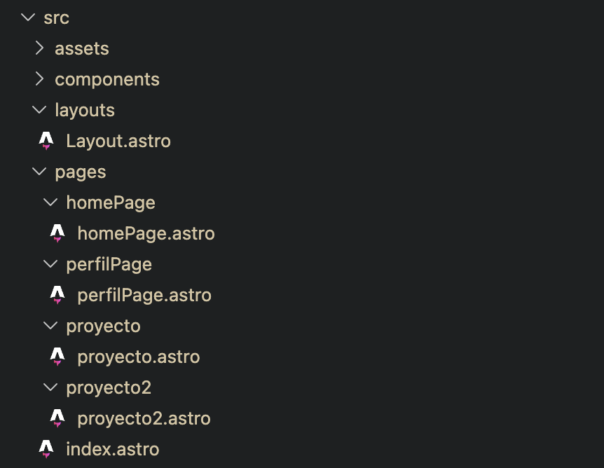
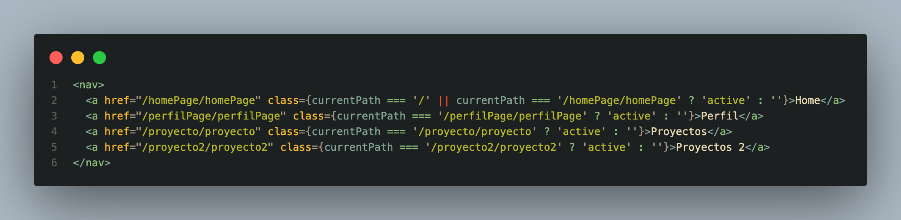
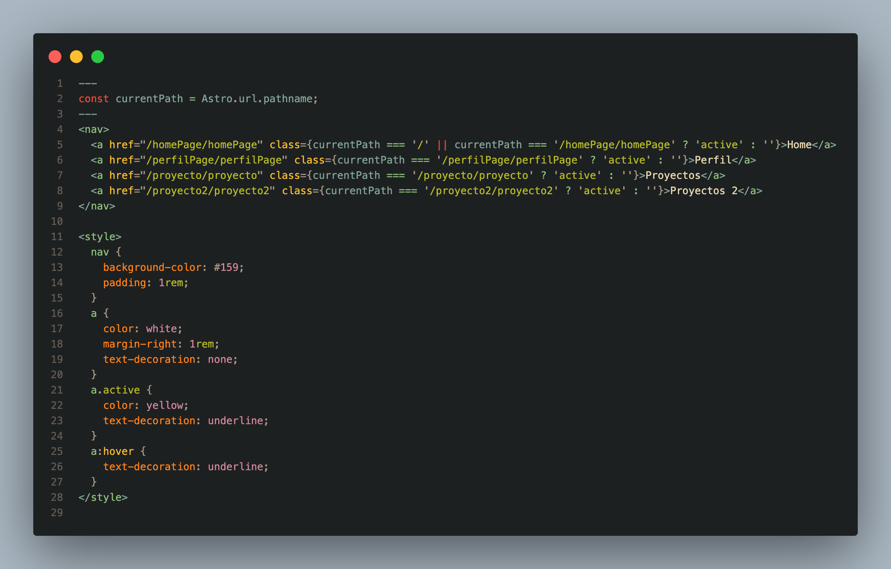
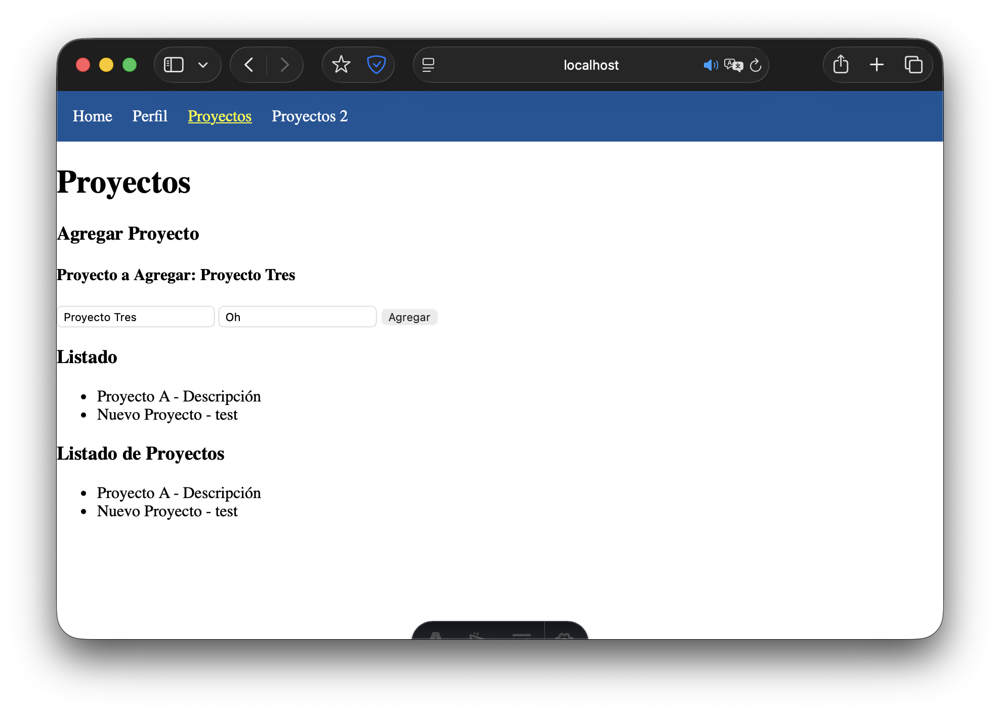
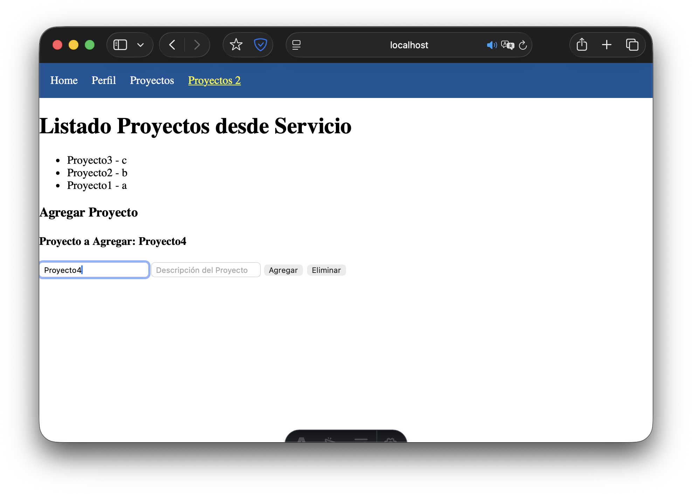
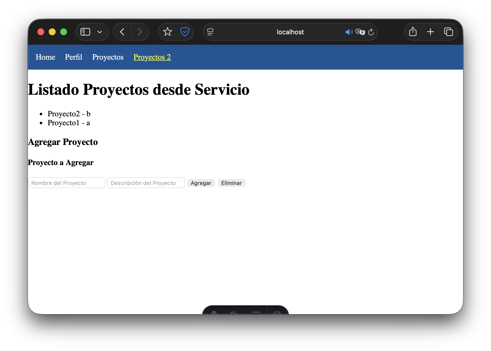

# Programación y Plataformas Web 

# Frameworks Web: Astro

<div align="center">
  
</div>

## Práctica 3: Navegación en Astro

### Autores

**Rafael Prieto**  
📧 pprietos@est.ups.edu.ec  
💻 GitHub: [Raet0](https://github.com/Raet0)

**Adrian Lazo**  
📧 blazoc@est.ups.edu.ec  
💻 GitHub: [scomygod](https://github.com/scomygod)

---

## Navegación en Astro

En Astro, la navegación se basa en rutas de archivos dentro de `src/pages`. Cada archivo `.astro` genera una página. Aunque no hay SPA como en Angular, podemos:

- Crear componentes reutilizables (Navbar, cards, formularios, etc.)  
- Marcar enlaces activos con `useLocation()`  
- Usar rutas dinámicas con `[param].astro`  
- Agregar interactividad con `client:*`  

Esto permite mantener una experiencia de usuario fluida, aunque cada navegación recargue la página.

### Diferencias con Angular

| Concepto | Angular | Astro |
|----------|---------|-------|
| Navegación SPA | `routerLink` | `<a href="">` (recarga página o parcial con `client:*`) |
| Enlace activo | `routerLinkActive` | `useLocation()` + clase condicional |
| Rutas dinámicas | `[routerLink]="['/producto', id]"` | `[id].astro` + `Astro.params.id` |
| Navegación programática | `router.navigate(['/ruta'])` | `window.location.href = '/ruta'` |
| Iteraciones dinámicas | `*ngFor` | `{array.map(item => <Componente />)}` |

---

### Navegación básica con enlaces `<a>`

```html
<!-- src/components/Navbar.astro -->
---
import { useLocation } from 'astro';
const location = useLocation();
---

<nav>
  <a href="/" class={location.pathname === '/' ? 'active' : ''}>Inicio</a>
  <a href="/proyectos" class={location.pathname === '/proyectos' ? 'active' : ''}>Proyectos</a>
  <a href="/proyectosDos" class={location.pathname === '/proyectosDos' ? 'active' : ''}>Proyectos 2</a>
</nav>

<style>
a.active {
  color: yellow;
  text-decoration: underline;
  font-weight: bold;
}
</style>
```
**Ventajas**:
	- ✓ Fácil de implementar
	- ✓ Compatible con SEO
	- ✓ Permite marcar enlace activo

## Rutas dinámicas en Astro

Archivo: `src/pages/proyecto/[id].astro`

```js
---
const { id } = Astro.params;
const proyectos = [
  { id: '1', nombre: 'Proyecto 1', descripcion: 'Descripción 1' },
  { id: '2', nombre: 'Proyecto 2', descripcion: 'Descripción 2' }
];
const proyecto = proyectos.find(p => p.id === id);
---

<h1>Detalle del Proyecto</h1>
<p>Nombre: {proyecto?.nombre}</p>
<p>Descripción: {proyecto?.descripcion}</p>
<a href="/proyectos">🔙 Volver a Proyectos</a>
```
	- Astro.params contiene los parámetros de la URL (id en este caso).
	- Podemos filtrar nuestro array de proyectos para obtener el proyecto correcto.
	- Esto permite mostrar contenido dinámico por URL sin necesidad de un SPA completo.

## Interactividad con `client:*`

```js
---
import Contador from '../components/Contador.astro';
---

<Contador client:load />
---
// Contador.astro
let count = 0;
---

<button on:click={() => count++}>
  Contador: {count}
</button>
```
Directivas client:*:
	- client:load → ejecuta JS al cargar la página
	- client:idle → ejecuta JS cuando el navegador está inactivo
	- client:visible → ejecuta JS cuando el componente se vuelve visible en pantalla

## Listados dinámicos

```js
---
const proyectos = [
  { id: '1', nombre: 'Proyecto 1' },
  { id: '2', nombre: 'Proyecto 2' }
];
---

<h2>Lista de Proyectos</h2>
{proyectos.map(proyecto => (
  <div class="proyecto-card">
    <h3>{proyecto.nombre}</h3>
    <a href={`/proyecto/${proyecto.id}`}>Ver Detalles</a>
  </div>
))}

<style>
.proyecto-card {
  border: 1px solid #dee2e6;
  padding: 1rem;
  margin: 1rem 0;
  border-radius: 8px;
}

.proyecto-card a {
  background: #007bff;
  color: white;
  padding: 0.5rem 1rem;
  text-decoration: none;
  border-radius: 4px;
}

.proyecto-card a:hover {
  background: #0056b3;
}
</style>
```

    - {array.map(...)} permite iterar elementos y renderizar componentes dinámicamente.
	- Cada proyecto genera su propia tarjeta con enlace al detalle.
	- Esto reemplaza el uso de *ngFor de Angular en Astro.

## Navegación Programática
```js
<button on:click={() => window.location.href = '/proyectos'}>
  Ir a Proyectos
</button>
<button on:click={() => window.location.href = '/proyecto/1'}>
  Ver Proyecto 1
</button>
```
    - window.location.href permite cambiar de página mediante código.
	- Aunque recarga la página, se puede usar para navegación dinámica en Astro.

## Resumen
	1.	Cada archivo .astro en src/pages genera automáticamente una ruta.
	2.	<a href=""> se usa para enlaces; SPA parcial con client:*.
	3.	[param].astro + Astro.params permite rutas dinámicas.
	4.	useLocation() permite marcar enlaces activos.
	5.	client:* permite interactividad tipo SPA.

Astro combina simplicidad en rutas con flexibilidad para componentes interactivos, manteniendo SEO y carga rápida.

## Implementación Práctica

Sigue estos pasos para implementar la navegación en tu proyecto Angular:

### Paso 1: Crear las Páginas Principales

#### 1.1 Crear ProyectosPage

#### 1.2 Crear ProyectosDosPage


### Paso 2: Configurar las Rutas


### Paso 3: Agregar al Navbar

### Paso 4: Crear Componentes para Proyectos y separarlos en componentes indivuduals

#### 4.1 Crear Componente para Agregar Proyectos

#### 4.2 Crear Componente para Lista de Proyectos


### Paso 5: Implementar la Página de Proyectos

### Paso 6: Implementar la Página ProyectosDos


## Capturas de Implementación

### 1. Configuración de Rutas (app.routes.ts)
En Astro, cada archivo .astro dentro de src/pages genera automáticamente una ruta, por lo que podemos mostrar la estructura de carpetas como “configuración de rutas”:

<div style="text-align: center;">
  
</div>

### 2. Navegación con RouterLink
El `<nav>` define la barra de navegación de la aplicación. Cada enlace apunta a una página de Astro (Home, Perfil, Proyectos, Proyectos 2) y la condición class={currentPath === '...' ? 'active' : ''} resalta el enlace de la página actual.

<div style="text-align: center;">
  
</div>

### 3. Componente con Navegación
<div style="text-align: center;">
  
</div>

### 4. Aplicación Funcionando

<div style="text-align: center;">
  
</div>

<div style="text-align: center;">
  
</div>

<div style="text-align: center;">
  
</div>


## Enlaces del Proyecto

**Repositorio Github**
[Repositorio](https://github.com/scomygod/astro_lazo_prieto)

**Github Pages**
[Página desplegada](https://scomygod.github.io/astro_lazo_prieto/)


## Notas de Implementación

- Usé **Astro 5+** con componentes y TypeScript.
- Implementé navegación estática y componentes reutilizables (`NavBar`, `ListadoProyectos`, `AddProyecto`).
- Agregué estilos para mejorar la experiencia de usuario y mantener consistencia visual.
- Utilicé un **store en JavaScript** para manejar el estado de los proyectos de forma compartida entre componentes.
- La lista de proyectos se renderiza dinámicamente desde el store, similar a un manejo de estado reactivo.
- Apliqué buenas prácticas de Astro: separación de layout, componentes y lógica de estado.


