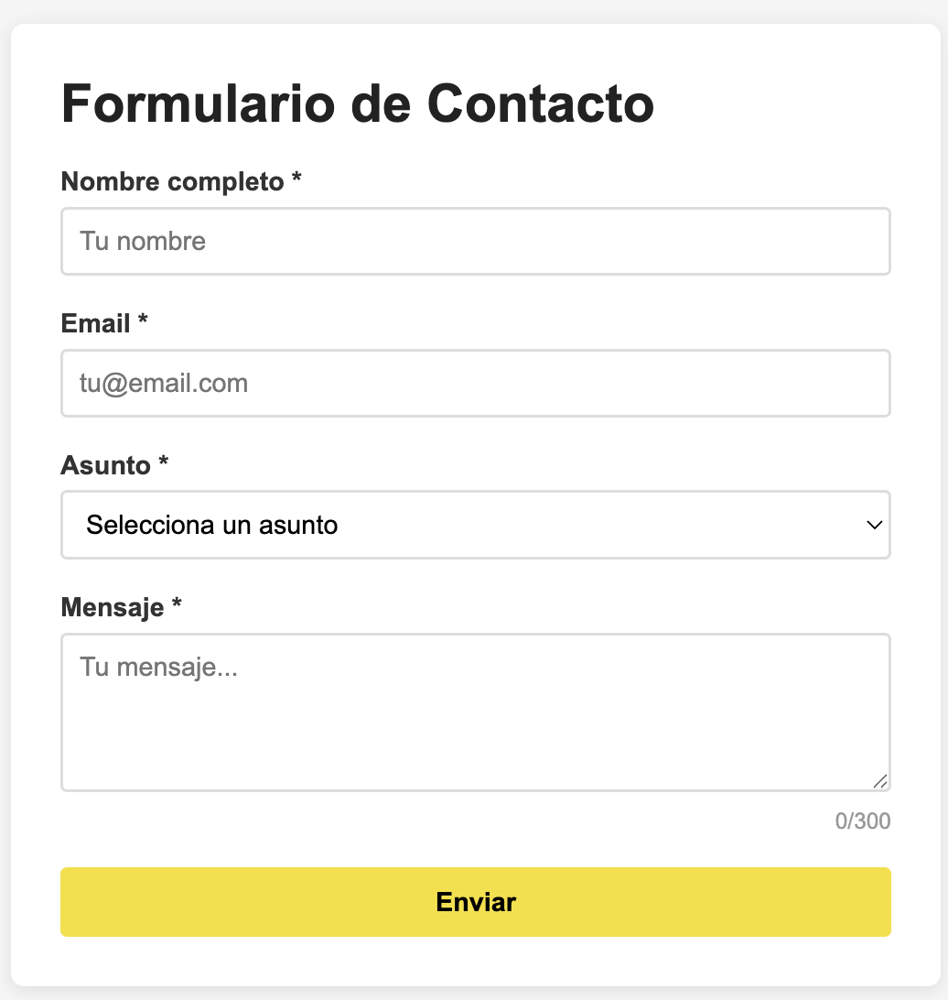
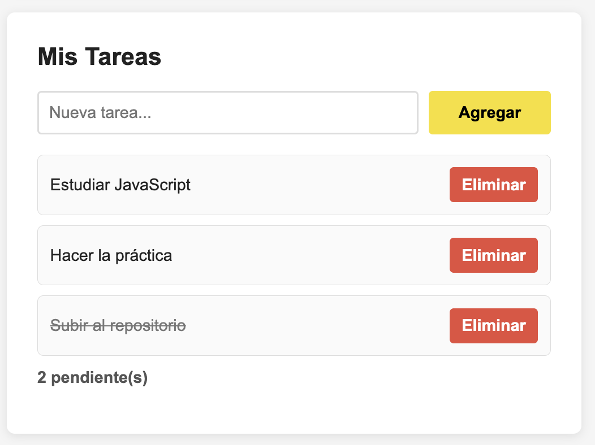

# Programacion y Plataformas Web

# JavaScript para Desarrollo Web

<div align="center">
  
</div>

## Practica 3: Eventos en JavaScript

### Autores

**Pablo Torres**  
ptorersp@ups.edu.ec  
GitHub: [PabloT18](https://github.com/PabloT18)

---

## 1. Introduccion

Los **eventos** son la base de la interactividad en la web. Un evento es cualquier accion que ocurre en el navegador: un click, una tecla presionada, el envio de un formulario, el movimiento del mouse, el scroll de la pagina. JavaScript permite "escuchar" estos eventos y ejecutar codigo en respuesta.

### Formas de manejar eventos

| Metodo | Sintaxis | Recomendado | Razon |
|--------|----------|:-----------:|-------|
| HTML inline | `onclick="funcion()"` | No | Mezcla HTML con JS |
| Propiedad DOM | `elemento.onclick = fn` | No | Solo un handler por evento |
| `addEventListener` | `elemento.addEventListener('click', fn)` | **Si** | Multiples handlers, mas control |

```javascript
// HTML inline (EVITAR)
// <button onclick="saludar()">Click</button>

// Propiedad DOM (EVITAR)
boton.onclick = function() {
  console.log('Click');
};

// addEventListener (USAR SIEMPRE)
boton.addEventListener('click', function() {
  console.log('Click');
});

// addEventListener con arrow function
boton.addEventListener('click', () => {
  console.log('Click');
});

// addEventListener con funcion nombrada (para poder remover)
function manejarClick() {
  console.log('Click');
}
boton.addEventListener('click', manejarClick);
boton.removeEventListener('click', manejarClick);
```

---

## 2. Conceptos Clave

### Tipos de eventos principales

| Categoria | Eventos | Descripcion |
|-----------|---------|-------------|
| **Mouse** | `click`, `dblclick`, `mouseenter`, `mouseleave`, `mouseover`, `mouseout`, `mousemove` | Interacciones con el mouse |
| **Teclado** | `keydown`, `keyup`, `keypress` (deprecated) | Teclas presionadas |
| **Formulario** | `submit`, `reset`, `change`, `input`, `focus`, `blur` | Interaccion con formularios |
| **Ventana** | `load`, `DOMContentLoaded`, `resize`, `scroll`, `unload` | Eventos del navegador |
| **Touch** | `touchstart`, `touchmove`, `touchend` | Dispositivos tactiles |
| **Drag** | `dragstart`, `drag`, `dragend`, `drop`, `dragover` | Arrastrar y soltar |
| **Clipboard** | `copy`, `cut`, `paste` | Portapapeles |

### El objeto Event

Cada vez que se dispara un evento, JavaScript crea un objeto `Event` con informacion detallada:

```javascript
boton.addEventListener('click', (event) => {
  // Propiedades comunes
  console.log(event.type);       // "click"
  console.log(event.target);     // elemento que origino el evento
  console.log(event.currentTarget); // elemento que tiene el listener
  console.log(event.timeStamp);  // cuando ocurrio

  // Propiedades de mouse
  console.log(event.clientX);    // posicion X en la ventana
  console.log(event.clientY);    // posicion Y en la ventana
  console.log(event.button);     // 0=izq, 1=medio, 2=der

  // Teclas modificadoras
  console.log(event.altKey);     // true si Alt estaba presionado
  console.log(event.ctrlKey);    // true si Ctrl estaba presionado
  console.log(event.shiftKey);   // true si Shift estaba presionado
});
```

### Eventos de teclado

```javascript
document.addEventListener('keydown', (event) => {
  console.log(event.key);     // "Enter", "a", "ArrowUp", "Escape"
  console.log(event.code);    // "Enter", "KeyA", "ArrowUp", "Escape"
  console.log(event.keyCode); // DEPRECATED, no usar

  // Combinaciones de teclas
  if (event.ctrlKey && event.key === 's') {
    event.preventDefault(); // evitar guardar la pagina
    console.log('Ctrl+S presionado');
  }

  if (event.key === 'Escape') {
    console.log('Escape presionado');
  }
});
```

---

## 3. Explicacion Tecnica Detallada

### preventDefault()

Evita el comportamiento por defecto del navegador. Casos comunes:

```javascript
// Evitar que un formulario se envie (recargue la pagina)
const formulario = document.querySelector('form');
formulario.addEventListener('submit', (e) => {
  e.preventDefault();
  console.log('Formulario procesado con JS');
  // Procesar datos aqui
});

// Evitar que un enlace navegue
const enlace = document.querySelector('a');
enlace.addEventListener('click', (e) => {
  e.preventDefault();
  console.log('Enlace interceptado');
});

// Evitar click derecho (menu contextual)
document.addEventListener('contextmenu', (e) => {
  e.preventDefault();
  console.log('Menu contextual bloqueado');
});
```

### stopPropagation()

Detiene la propagacion del evento hacia los elementos padre:

```javascript
// Sin stopPropagation: click en hijo tambien dispara click en padre
const padre = document.querySelector('.padre');
const hijo = document.querySelector('.hijo');

padre.addEventListener('click', () => {
  console.log('Click en padre');
});

hijo.addEventListener('click', (e) => {
  e.stopPropagation(); // Solo se ejecuta este handler
  console.log('Click en hijo');
});
```

### Event Delegation (Delegacion de eventos)

En lugar de agregar eventos a cada elemento individual, se agrega un solo evento al padre y se usa `event.target` para identificar quien lo disparo. Es mas eficiente y funciona con elementos creados dinamicamente.

```javascript
// SIN delegacion (ineficiente, no funciona con nuevos elementos)
const botones = document.querySelectorAll('.btn');
botones.forEach(btn => {
  btn.addEventListener('click', () => {
    console.log('Click en boton');
  });
});

// CON delegacion (eficiente, funciona con nuevos elementos)
const contenedor = document.querySelector('#contenedor');
contenedor.addEventListener('click', (e) => {
  // Verificar si el click fue en un boton
  if (e.target.matches('.btn')) {
    console.log('Click en boton:', e.target.textContent);
  }

  // Verificar si fue en un boton de eliminar
  if (e.target.matches('.btn-eliminar')) {
    const card = e.target.closest('.card');
    card.remove();
  }
});
```

**Cuando usar delegacion:**

| Escenario | Sin delegacion | Con delegacion |
|-----------|:-:|:-:|
| Lista fija de 5 items | Valido | Valido |
| Lista dinamica (items se agregan/eliminan) | No funciona | **Funciona** |
| 100+ elementos con el mismo evento | 100 listeners | **1 listener** |
| Performance | Mas memoria | **Menos memoria** |

### Fases de propagacion

Los eventos se propagan en tres fases:

1. **Captura** (de arriba hacia abajo): `document > html > body > div > button`
2. **Target**: el elemento que recibio el evento
3. **Burbujeo** (de abajo hacia arriba): `button > div > body > html > document`

```javascript
// Por defecto, los listeners se ejecutan en fase de burbujeo
elemento.addEventListener('click', handler);

// Para escuchar en fase de captura, pasar true como tercer parametro
elemento.addEventListener('click', handler, true);

// Con opciones
elemento.addEventListener('click', handler, {
  capture: false,  // fase de burbujeo (defecto)
  once: true,      // se ejecuta una sola vez, luego se remueve
  passive: true    // no llamara preventDefault (mejor scroll performance)
});
```

---

## 4. Ejemplos de Codigo

### Ejemplo 1: Formulario interactivo

```html
<!DOCTYPE html>
<html lang="es">
<head>
  <meta charset="UTF-8">
  <meta name="viewport" content="width=device-width, initial-scale=1.0">
  <title>Formulario Interactivo</title>
  <style>
    body { font-family: Arial, sans-serif; max-width: 500px; margin: 50px auto; padding: 0 20px; }
    .form-group { margin-bottom: 15px; }
    label { display: block; margin-bottom: 5px; font-weight: bold; }
    input, textarea { width: 100%; padding: 10px; border: 2px solid #ddd; border-radius: 4px; font-size: 1rem; }
    input:focus, textarea:focus { border-color: #F7DF1E; outline: none; }
    .error { border-color: #e74c3c !important; }
    .error-msg { color: #e74c3c; font-size: 0.85rem; margin-top: 4px; display: none; }
    .error-msg.visible { display: block; }
    button { padding: 12px 24px; background: #F7DF1E; border: none; border-radius: 4px; font-size: 1rem; cursor: pointer; font-weight: bold; }
    button:hover { background: #e6cf1a; }
    .char-count { text-align: right; color: #999; font-size: 0.85rem; }
    #resultado { margin-top: 20px; padding: 15px; background: #f5f5f5; border-radius: 4px; display: none; }
  </style>
</head>
<body>
  <h1>Registro</h1>
  <form id="formulario">
    <div class="form-group">
      <label for="nombre">Nombre completo</label>
      <input type="text" id="nombre" placeholder="Tu nombre">
      <p class="error-msg" id="error-nombre">El nombre es obligatorio (min 3 caracteres)</p>
    </div>
    <div class="form-group">
      <label for="email">Email</label>
      <input type="email" id="email" placeholder="tu@email.com">
      <p class="error-msg" id="error-email">Ingresa un email valido</p>
    </div>
    <div class="form-group">
      <label for="mensaje">Mensaje</label>
      <textarea id="mensaje" rows="4" maxlength="200" placeholder="Tu mensaje..."></textarea>
      <p class="char-count"><span id="chars">0</span>/200</p>
    </div>
    <button type="submit">Enviar</button>
  </form>
  <div id="resultado"></div>

  <script src="app.js"></script>
</body>
</html>
```

```javascript
// app.js
'use strict';

const formulario = document.querySelector('#formulario');
const inputNombre = document.querySelector('#nombre');
const inputEmail = document.querySelector('#email');
const textMensaje = document.querySelector('#mensaje');
const charCount = document.querySelector('#chars');
const resultado = document.querySelector('#resultado');

// Contador de caracteres en tiempo real
textMensaje.addEventListener('input', (e) => {
  const longitud = e.target.value.length;
  charCount.textContent = longitud;
  charCount.style.color = longitud > 180 ? '#e74c3c' : '#999';
});

// Validacion en tiempo real al salir del campo
inputNombre.addEventListener('blur', () => {
  validarCampo(inputNombre, inputNombre.value.trim().length >= 3, 'error-nombre');
});

inputEmail.addEventListener('blur', () => {
  const emailRegex = /^[^\s@]+@[^\s@]+\.[^\s@]+$/;
  validarCampo(inputEmail, emailRegex.test(inputEmail.value), 'error-email');
});

// Funcion de validacion visual
function validarCampo(input, esValido, errorId) {
  const errorMsg = document.getElementById(errorId);
  if (esValido) {
    input.classList.remove('error');
    errorMsg.classList.remove('visible');
  } else {
    input.classList.add('error');
    errorMsg.classList.add('visible');
  }
  return esValido;
}

// Envio del formulario
formulario.addEventListener('submit', (e) => {
  e.preventDefault();

  const nombreValido = validarCampo(inputNombre, inputNombre.value.trim().length >= 3, 'error-nombre');
  const emailRegex = /^[^\s@]+@[^\s@]+\.[^\s@]+$/;
  const emailValido = validarCampo(inputEmail, emailRegex.test(inputEmail.value), 'error-email');

  if (nombreValido && emailValido) {
    resultado.style.display = 'block';
    resultado.innerHTML = `
      <strong>Datos recibidos:</strong><br>
      Nombre: ${inputNombre.value.trim()}<br>
      Email: ${inputEmail.value.trim()}<br>
      Mensaje: ${textMensaje.value.trim() || '(sin mensaje)'}
    `;
    formulario.reset();
    charCount.textContent = '0';
  }
});

// Limpiar errores al escribir
inputNombre.addEventListener('input', () => {
  inputNombre.classList.remove('error');
  document.getElementById('error-nombre').classList.remove('visible');
});

inputEmail.addEventListener('input', () => {
  inputEmail.classList.remove('error');
  document.getElementById('error-email').classList.remove('visible');
});
```

### Ejemplo 2: Event Delegation con lista dinamica

```javascript
// delegacion.js
'use strict';

const app = document.querySelector('#app');

// Datos
let tareas = [
  { id: 1, texto: 'Estudiar JavaScript', completada: false },
  { id: 2, texto: 'Hacer la practica', completada: false },
  { id: 3, texto: 'Subir al repositorio', completada: true }
];

// Renderizar
function renderizar() {
  app.innerHTML = `
    <h2>Mis Tareas</h2>
    <div class="input-group">
      <input type="text" id="nueva-tarea" placeholder="Nueva tarea...">
      <button data-action="agregar">Agregar</button>
    </div>
    <ul class="lista-tareas">
      ${tareas.map(t => `
        <li class="${t.completada ? 'completada' : ''}" data-id="${t.id}">
          <span data-action="toggle">${t.texto}</span>
          <button data-action="eliminar">X</button>
        </li>
      `).join('')}
    </ul>
    <p>${tareas.filter(t => !t.completada).length} pendiente(s)</p>
  `;
}

// UN SOLO event listener para todo (delegacion)
app.addEventListener('click', (e) => {
  const action = e.target.dataset.action;

  if (action === 'agregar') {
    const input = document.querySelector('#nueva-tarea');
    const texto = input.value.trim();
    if (texto) {
      tareas.push({ id: Date.now(), texto, completada: false });
      renderizar();
    }
  }

  if (action === 'eliminar') {
    const id = Number(e.target.closest('li').dataset.id);
    tareas = tareas.filter(t => t.id !== id);
    renderizar();
  }

  if (action === 'toggle') {
    const id = Number(e.target.closest('li').dataset.id);
    const tarea = tareas.find(t => t.id === id);
    if (tarea) tarea.completada = !tarea.completada;
    renderizar();
  }
});

// Tambien escuchar Enter en el input (delegacion con keydown)
app.addEventListener('keydown', (e) => {
  if (e.target.id === 'nueva-tarea' && e.key === 'Enter') {
    const texto = e.target.value.trim();
    if (texto) {
      tareas.push({ id: Date.now(), texto, completada: false });
      renderizar();
    }
  }
});

renderizar();
```

---

## 5. Comparaciones / Tablas

### target vs currentTarget

| Propiedad | Descripcion | Uso comun |
|-----------|-------------|-----------|
| `event.target` | Elemento que **origino** el evento (donde se hizo click) | Delegacion de eventos |
| `event.currentTarget` | Elemento que **tiene** el `addEventListener` | Dentro del handler |

```javascript
// Si tenemos: <div id="padre"><button>Click</button></div>
padre.addEventListener('click', (e) => {
  console.log(e.target);        // <button> (donde se hizo click)
  console.log(e.currentTarget); // <div#padre> (donde esta el listener)
});
```

### Eventos de input

| Evento | Se dispara cuando... | Uso tipico |
|--------|----------------------|------------|
| `input` | El valor cambia (cada tecla) | Busqueda en tiempo real |
| `change` | El valor cambia Y pierde focus | Selects, checkboxes |
| `focus` | El campo recibe focus | Mostrar ayuda |
| `blur` | El campo pierde focus | Validar campo |
| `keydown` | Se presiona una tecla | Atajos de teclado |
| `keyup` | Se suelta una tecla | Detectar tecla final |
| `submit` | Se envia el formulario | Validar y procesar |

### matches() vs closest()

| Metodo | Descripcion | Ejemplo |
|--------|-------------|---------|
| `element.matches(selector)` | Verifica si el elemento coincide con el selector | `e.target.matches('.btn')` |
| `element.closest(selector)` | Busca el ancestro mas cercano (o si mismo) que coincida | `e.target.closest('.card')` |

---

## 6. Funcionalidades Complementarias

### Eventos personalizados (Custom Events)

```javascript
// Crear un evento personalizado
const eventoExito = new CustomEvent('operacion-exitosa', {
  detail: { mensaje: 'Se guardo correctamente', timestamp: Date.now() }
});

// Escuchar el evento personalizado
document.addEventListener('operacion-exitosa', (e) => {
  console.log(e.detail.mensaje);
});

// Disparar el evento
document.dispatchEvent(eventoExito);
```

### Remover event listeners

```javascript
// Funcion nombrada (necesaria para remover)
function handleClick() {
  console.log('Click');
}

boton.addEventListener('click', handleClick);
boton.removeEventListener('click', handleClick);

// Con once: true (se remueve automaticamente despues de la primera ejecucion)
boton.addEventListener('click', handleClick, { once: true });

// AbortController (moderno, para remover multiples listeners)
const controller = new AbortController();

boton.addEventListener('click', handleClick, { signal: controller.signal });
input.addEventListener('input', handleInput, { signal: controller.signal });

// Remover todos los listeners asociados al controller
controller.abort();
```

### Errores comunes

```javascript
// ERROR: Arrow function no se puede remover (es anonima)
boton.addEventListener('click', () => console.log('click'));
// boton.removeEventListener('click', ???); // No hay referencia

// ERROR: Olvidar preventDefault en formularios
form.addEventListener('submit', (e) => {
  // Si no se llama e.preventDefault(), la pagina se recarga
  procesarFormulario();
});

// ERROR: Agregar listeners dentro de un loop sin delegacion
items.forEach(item => {
  item.addEventListener('click', handler); // N listeners
});
// MEJOR: usar delegacion con un solo listener en el padre
```

---

## 7. Parte Practica (Implementacion)

### Paso 1: Configurar el proyecto

Crear la estructura:

```
practica-03/
  index.html
  css/
    styles.css
  js/
    app.js
```

### Paso 2: HTML completo (copiar)

**¿Qué hace este paso?** Proporciona toda la estructura HTML necesaria para la práctica. El HTML incluye un formulario de contacto con validación y una sección de tareas. Copiar exactamente este código en `index.html`.

En `index.html`, copiar la estructura completa:

```html
 <section class="container">
      <h1>Formulario de Contacto</h1>

      <form id="formulario" novalidate>
        <div class="form-group">
          <label for="nombre">Nombre completo *</label>
          <input type="text" id="nombre" placeholder="Tu nombre">
          <p class="error-msg" id="error-nombre">El nombre es obligatorio y debe tener al menos 3 caracteres</p>
        </div>

        <div class="form-group">
          <label for="email">Email *</label>
          <input type="email" id="email" placeholder="tu@email.com">
          <p class="error-msg" id="error-email">Ingresa un email válido</p>
        </div>

        <div class="form-group">
          <label for="asunto">Asunto *</label>
          <select id="asunto">
            <option value="">Selecciona un asunto</option>
            <option value="consulta">Consulta general</option>
            <option value="soporte">Soporte técnico</option>
            <option value="sugerencia">Sugerencia</option>
          </select>
          <p class="error-msg" id="error-asunto">Selecciona un asunto</p>
        </div>

        <div class="form-group">
          <label for="mensaje">Mensaje *</label>
          <textarea id="mensaje" rows="4" maxlength="300" placeholder="Tu mensaje..."></textarea>
          <p class="char-count"><span id="chars">0</span>/300</p>
          <p class="error-msg" id="error-mensaje">El mensaje debe tener al menos 10 caracteres</p>
        </div>

        <button type="submit">Enviar</button>
      </form>

      <div id="resultado"></div>
    </section>

    <!-- SECCIÓN 2: TAREAS -->
    <section class="container">
      <h2>Mis Tareas</h2>

      <div class="input-group">
        <input type="text" id="nueva-tarea" placeholder="Nueva tarea...">
        <button type="button" id="btn-agregar" data-action="agregar">Agregar</button>
      </div>

      <ul id="lista-tareas"></ul>
      <p id="contador-tareas">0 pendiente(s)</p>
    </section>
```

### Paso 3: CSS completo (copiar)

En `css/styles.css`, copiar todos los estilos:

Tomar de `solver/03-eventos/css//styles.css`

### Paso 4: JavaScript Parte 1 - Validación básica (copiar y completar)

En `js/app.js`, empezar con la estructura base:

#### 4.1 Selección de elementos y constantes (copiar)

**¿Qué hace este código?** Selecciona todos los elementos HTML del formulario con `querySelector()` y los almacena en constantes para poder trabajar con ellos. También define una expresión regular para validar emails.

```javascript
'use strict';

/* =========================
   FORMULARIO
========================= */

const formulario = document.querySelector('#formulario');
const inputNombre = document.querySelector('#nombre');
const inputEmail = document.querySelector('#email');
const selectAsunto = document.querySelector('#asunto');
const textMensaje = document.querySelector('#mensaje');
const charCount = document.querySelector('#chars');
const resultado = document.querySelector('#resultado');

const EMAIL_REGEX = /^[^\s@]+@[^\s@]+\.[^\s@]+$/;
```

#### 4.2 Función de validación base (copiar)

**¿Qué hace este código?** Esta función reutilizable maneja la lógica visual de validación: si un campo es válido, quita las clases de error; si es inválido, las agrega. Esto evita repetir código en cada validador.

```javascript
function validarCampo(input, esValido, errorId) {
  const errorMsg = document.getElementById(errorId);

  if (esValido) {
    input.classList.remove('error');
    errorMsg.classList.remove('visible');
  } else {
    input.classList.add('error');
    errorMsg.classList.add('visible');
  }

  return esValido;
}
```

#### 4.3 Funciones validadoras (copiar)

**¿Qué hace este código?** Cada función valida un campo específico usando reglas diferentes: `validarNombre()` verifica que tenga al menos 3 caracteres, `validarEmail()` usa regex para verificar formato válido, `validarAsunto()` verifica que no esté vacío, y `validarMensaje()` verifica mínimo 10 caracteres.

```javascript
function validarNombre() {
  return validarCampo(
    inputNombre,
    inputNombre.value.trim().length >= 3,
    'error-nombre'
  );
}

function validarEmail() {
  return validarCampo(
    inputEmail,
    EMAIL_REGEX.test(inputEmail.value.trim()),
    'error-email'
  );
}

function validarAsunto() {
  return validarCampo(
    selectAsunto,
    selectAsunto.value.trim() !== '',
    'error-asunto'
  );
}

function validarMensaje() {
  return validarCampo(
    textMensaje,
    textMensaje.value.trim().length >= 10,
    'error-mensaje'
  );
}
```

#### 4.4 Contador de caracteres (completar)

**¿Qué hace este código?** Actualiza en tiempo real el contador de caracteres del textarea y cambia su color a rojo cuando se acerca al límite de 300 caracteres.

```javascript
function actualizarContador(e) {
  // TODO 4.4.1: Crear una constante 'longitud' y asignarle e.target.value.length
  //   Ejemplo: const longitud = e.target.value.length;
  
  // TODO 4.4.2: Actualizar el texto del contador con charCount.textContent = longitud;
  
  // TODO 4.4.3: Cambiar el color del contador:
  //   Si longitud > 270, usar charCount.style.color = '#e74c3c' (rojo)
  //   Si no, usar charCount.style.color = '#999' (gris)
  //   Usa un operador ternario: longitud > 270 ? '#e74c3c' : '#999'
}

// TODO 4.4.4: Conectar el evento 'input' del textMensaje a la función actualizarContador
//   textMensaje.addEventListener('input', actualizarContador);
```

#### 4.5 Eventos blur para validar (completar)

**¿Qué hace este código?** Conecta el evento `blur` (cuando el usuario sale del campo) a cada validador, permitiendo validación en tiempo real al terminar de escribir en cada campo.

```javascript
// TODO 4.5.1: Agregar evento 'blur' a inputNombre que llame a validarNombre
//   inputNombre.addEventListener('blur', validarNombre);

// TODO 4.5.2: Agregar evento 'blur' a inputEmail que llame a validarEmail
//   inputEmail.addEventListener('blur', validarEmail);

// TODO 4.5.3: Agregar evento 'blur' a selectAsunto que llame a validarAsunto
//   selectAsunto.addEventListener('blur', validarAsunto);

// TODO 4.5.4: Agregar evento 'blur' a textMensaje que llame a validarMensaje
//   textMensaje.addEventListener('blur', validarMensaje);
```

### Paso 5: JavaScript Parte 2 - Limpiar errores y envío (completar)

#### 5.1 Función para limpiar errores (copiar)

**¿Qué hace este código?** Esta función remueve las clases de error de un campo cuando el usuario comienza a escribir, proporcionando feedback inmediato de que está corrigiendo el error.

```javascript
function limpiarError(input, errorId) {
  input.classList.remove('error');
  document.getElementById(errorId).classList.remove('visible');
}
```

#### 5.2 Eventos input para limpiar errores (completar)

**¿Qué hace este código?** Conecta el evento `input` (mientras escribe) y `change` (para select) a cada campo para limpiar errores automáticamente cuando el usuario empieza a corregir.

```javascript
// TODO 5.2.1: Agregar evento 'input' a inputNombre para limpiar su error
//   inputNombre.addEventListener('input', () => limpiarError(inputNombre, 'error-nombre'));
//   Nota: Usamos arrow function para poder pasar los parámetros correctos

// TODO 5.2.2: Agregar evento 'input' a inputEmail para limpiar su error
//   inputEmail.addEventListener('input', () => limpiarError(inputEmail, 'error-email'));

// TODO 5.2.3: Agregar evento 'change' a selectAsunto para limpiar su error
//   selectAsunto.addEventListener('change', () => limpiarError(selectAsunto, 'error-asunto'));
//   Nota: Para <select> usamos 'change' en lugar de 'input'

// TODO 5.2.4: Agregar evento 'input' a textMensaje para limpiar su error
//   textMensaje.addEventListener('input', () => limpiarError(textMensaje, 'error-mensaje'));
```

#### 5.3 Función para mostrar resultado (copiar)

**¿Qué hace este código?** Crea elementos del DOM dinámicamente usando `createElement` y `textContent` (método seguro) para mostrar los datos del formulario cuando es válido. Evita usar `innerHTML` con datos del usuario por seguridad (prevención de XSS).

```javascript
function mostrarResultado() {
  resultado.innerHTML = '';

  const titulo = document.createElement('strong');
  titulo.textContent = 'Datos recibidos:';

  const pNombre = document.createElement('p');
  pNombre.textContent = `Nombre: ${inputNombre.value.trim()}`;

  const pEmail = document.createElement('p');
  pEmail.textContent = `Email: ${inputEmail.value.trim()}`;

  const pAsunto = document.createElement('p');
  pAsunto.textContent = `Asunto: ${selectAsunto.options[selectAsunto.selectedIndex].text}`;

  const pMensaje = document.createElement('p');
  pMensaje.textContent = `Mensaje: ${textMensaje.value.trim()}`;

  resultado.appendChild(titulo);
  resultado.appendChild(pNombre);
  resultado.appendChild(pEmail);
  resultado.appendChild(pAsunto);
  resultado.appendChild(pMensaje);

  resultado.classList.add('visible');
}
```

#### 5.4 Función para resetear formulario (copiar)

**¿Qué hace este código?** Limpia completamente el formulario después de enviarlo: resetea los valores, restaura el contador de caracteres a 0, y quita todas las clases de error usando `forEach` para iterar sobre arrays de elementos.

```javascript
function resetearFormulario() {
  formulario.reset();
  charCount.textContent = '0';
  charCount.style.color = '#999';

  [inputNombre, inputEmail, selectAsunto, textMensaje].forEach((campo) => {
    campo.classList.remove('error');
  });

  document.querySelectorAll('.error-msg').forEach((msg) => {
    msg.classList.remove('visible');
  });
}
```

#### 5.5 Evento submit del formulario (completar)

**¿Qué hace este código?** Maneja el envío del formulario: previene la recarga de la página, valida todos los campos, y si todo es correcto muestra el resultado; si no, hace focus en el primer campo con error.

```javascript
formulario.addEventListener('submit', (e) => {
  e.preventDefault();

  // TODO 5.5.1: Llamar a las 4 funciones validadoras y guardar los resultados en constantes
  //   const nombreValido = validarNombre();
  //   const emailValido = validarEmail();
  //   const asuntoValido = validarAsunto();
  //   const mensajeValido = validarMensaje();

  // TODO 5.5.2: Si TODOS son válidos, procesar el formulario
  //   Verificar con: if (nombreValido && emailValido && asuntoValido && mensajeValido) {
  //     mostrarResultado();
  //     resetearFormulario();
  //     return;  // Importante: salir de la función aquí
  //   }

  // TODO 5.5.3: Si hay errores, hacer focus en el PRIMER campo inválido
  //   if (!nombreValido) {
  //     inputNombre.focus();
  //     return;
  //   }
  //   if (!emailValido) {
  //     inputEmail.focus();
  //     return;
  //   }
  //   if (!asuntoValido) {
  //     selectAsunto.focus();
  //     return;
  //   }
  //   textMensaje.focus();  // Si llegamos aquí, el mensaje es el inválido
});
```

### Paso 6: JavaScript Parte 3 - Atajo de teclado (completar)

**¿Qué hace este código?** Implementa un atajo de teclado (Ctrl+Enter) para enviar el formulario sin hacer clic en el botón. Usa `requestSubmit()` que dispara el evento submit correctamente (a diferencia de `submit()` que no ejecuta los listeners).

```javascript
/* =========================
   ATAJO DE TECLADO
========================= */

// TODO 6.1: Agregar evento 'keydown' al document que capture todas las teclas presionadas
//   document.addEventListener('keydown', (e) => {

// TODO 6.2: Dentro del listener, verificar si se presionó Ctrl+Enter
//   Condición: if (e.ctrlKey && e.key === 'Enter') {
//     e.ctrlKey es true cuando Ctrl está presionado
//     e.key === 'Enter' verifica si la tecla es Enter

// TODO 6.3: Si la condición es verdadera:
//   - Llamar e.preventDefault() para evitar comportamiento por defecto
//   - Llamar formulario.requestSubmit() para disparar el evento submit
//     Nota: requestSubmit() ejecuta los event listeners, submit() NO lo hace
//   }
// });
```




### Paso 7: JavaScript Parte 4 - Sistema de tareas con event delegation (completar)

#### 7.1 Variables y datos iniciales (copiar)

**¿Qué hace este código?** Selecciona los elementos del DOM para la sección de tareas e inicializa un array con 3 tareas de ejemplo. Cada tarea es un objeto con `id`, `texto` y `completada`.

```javascript
/* =========================
   TAREAS CON DELEGACIÓN
========================= */

const inputNuevaTarea = document.querySelector('#nueva-tarea');
const btnAgregar = document.querySelector('#btn-agregar');
const listaTareas = document.querySelector('#lista-tareas');
const contadorTareas = document.querySelector('#contador-tareas');

let tareas = [
  { id: 1, texto: 'Estudiar JavaScript', completada: false },
  { id: 2, texto: 'Hacer la práctica', completada: false },
  { id: 3, texto: 'Subir al repositorio', completada: true }
];
```

#### 7.2 Funciones helper para crear elementos (copiar)

**¿Qué hace este código?** Define funciones auxiliares para crear elementos del DOM de forma modular y reutilizable. Cada función crea un elemento específico (botón, texto, item completo) usando `createElement` y `data-*` attributes para event delegation.

```javascript
function crearBotonEliminar() {
  const boton = document.createElement('button');
  boton.type = 'button';
  boton.textContent = 'Eliminar';
  boton.className = 'btn-eliminar';
  boton.dataset.action = 'eliminar';
  return boton;
}

function crearTextoTarea(tarea) {
  const span = document.createElement('span');
  span.textContent = tarea.texto;
  span.className = 'tarea-texto';
  span.dataset.action = 'toggle';
  return span;
}

function crearItemTarea(tarea) {
  const li = document.createElement('li');
  li.className = `tarea-item${tarea.completada ? ' completada' : ''}`;
  li.dataset.id = tarea.id;

  const texto = crearTextoTarea(tarea);
  const botonEliminar = crearBotonEliminar();

  li.appendChild(texto);
  li.appendChild(botonEliminar);

  return li;
}
```

#### 7.3 Función para actualizar contador (copiar)

**¿Qué hace este código?** Calcula cuántas tareas están pendientes (no completadas) usando `filter()` y actualiza el texto del contador en el DOM.

```javascript
function actualizarContadorTareas() {
  const pendientes = tareas.filter((tarea) => !tarea.completada).length;
  contadorTareas.textContent = `${pendientes} pendiente(s)`;
}
```

#### 7.4 Función renderizar (completar)

**¿Qué hace este código?** Dibuja todas las tareas en el DOM. Si no hay tareas, muestra un mensaje vacío; si hay, las recorre con `forEach` y crea cada elemento con las funciones helper.

```javascript
function renderizarTareas() {
  listaTareas.innerHTML = '';

  // TODO 7.4.1: Manejar el caso cuando no hay tareas
  //   if (tareas.length === 0) {
  //     const itemVacio = document.createElement('li');
  //     itemVacio.className = 'estado-vacio';
  //     itemVacio.textContent = 'No hay tareas registradas';
  //     listaTareas.appendChild(itemVacio);
  //     contadorTareas.textContent = '0 pendiente(s)';
  //     return;  // Salir de la función
  //   }

  // TODO 7.4.2: Renderizar cada tarea usando forEach
  //   tareas.forEach((tarea) => {
  //     const item = crearItemTarea(tarea);
  //     listaTareas.appendChild(item);
  //   });

  // TODO 7.4.3: Actualizar el contador de pendientes
  //   actualizarContadorTareas();
}
```

#### 7.5 Función agregar tarea (completar)

**¿Qué hace este código?** Agrega una nueva tarea al array: valida que no esté vacía, la agrega con un ID único (timestamp), limpia el input, re-renderiza la lista y vuelve a hacer focus para una mejor UX.

```javascript
function agregarTarea() {
  // TODO 7.5.1: Obtener el texto del input y quitarle espacios
  //   const texto = inputNuevaTarea.value.trim();

  // TODO 7.5.2: Validar que no esté vacío
  //   if (texto === '') {
  //     inputNuevaTarea.focus();  // Mejorar UX
  //     return;  // No hacer nada si está vacío
  //   }

  // TODO 7.5.3: Agregar la nueva tarea al array usando push()
  //   tareas.push({
  //     id: Date.now(),  // ID único basado en timestamp
  //     texto,           // Shorthand property (equivale a texto: texto)
  //     completada: false
  //   });

  // TODO 7.5.4: Limpiar el input
  //   inputNuevaTarea.value = '';

  // TODO 7.5.5: Re-renderizar la lista para mostrar la nueva tarea
  //   renderizarTareas();

  // TODO 7.5.6: Volver a hacer focus en el input para mejor UX
  //   inputNuevaTarea.focus();
}
```

#### 7.6 Eventos del botón y Enter (completar)

**¿Qué hace este código?** Conecta dos formas de agregar tareas: haciendo clic en el botón o presionando Enter en el input. Ambos llaman a la misma función `agregarTarea()`.

```javascript
// TODO 7.6.1: Conectar el botón de agregar
//   btnAgregar.addEventListener('click', agregarTarea);

// TODO 7.6.2: Permitir agregar con Enter en el input
//   inputNuevaTarea.addEventListener('keydown', (e) => {
//     if (e.key === 'Enter') {
//       e.preventDefault();  // Evitar comportamiento por defecto
//       agregarTarea();
//     }
//   });
```

#### 7.7 Event delegation (completar)

**¿Qué hace este código?** Implementa event delegation: UN SOLO listener en el contenedor padre maneja todos los clicks de todos los botones y textos. Usa `data-action` para identificar qué acción ejecutar (toggle o eliminar) y `closest()` para encontrar el elemento padre.

```javascript
listaTareas.addEventListener('click', (e) => {
  const action = e.target.dataset.action;

  // TODO 7.7.1: Verificar si el elemento clickeado tiene data-action
  //   if (!action) {
  //     return;  // Si no tiene action, no es un elemento interactivo
  //   }

  // TODO 7.7.2: Obtener el <li> más cercano que contiene el elemento clickeado
  //   const item = e.target.closest('li');
  //   if (!item || !item.dataset.id) {
  //     return;  // Si no encontramos el <li> o no tiene id, salir
  //   }

  // TODO 7.7.3: Convertir el id de string a número
  //   const id = Number(item.dataset.id);

  // TODO 7.7.4: Manejar acción de eliminar
  //   if (action === 'eliminar') {
  //     tareas = tareas.filter((tarea) => tarea.id !== id);
  //     renderizarTareas();
  //     return;  // Salir después de eliminar
  //   }

  // TODO 7.7.5: Manejar acción de toggle (marcar como completada/pendiente)
  //   if (action === 'toggle') {
  //     const tarea = tareas.find((itemTarea) => itemTarea.id === id);
  //     if (tarea) {
  //       tarea.completada = !tarea.completada;  // Invertir el estado
  //       renderizarTareas();
  //     }
  //   }
});
```

#### 7.8 Renderizado inicial (copiar)

**¿Qué hace este código?** Ejecuta la primera renderización para mostrar las 3 tareas precargadas cuando se carga la página.

```javascript
renderizarTareas();
```



### Paso 8: Pruebas

Verificar que todo funcione correctamente:

1. **Validación del formulario:**
   - Los campos muestran error al salir sin completar
   - Los errores desaparecen al escribir
   - El contador de caracteres funciona
   - El formulario se envía solo si todo es válido

2. **Atajo de teclado:**
   - Ctrl+Enter envía el formulario

3. **Sistema de tareas:**
   - Se pueden agregar tareas
   - Click en el texto marca/desmarca como completada
   - El botón eliminar funciona
   - El contador se actualiza correctamente
   - Enter en el input agrega la tarea

---


## 8. Entregables

### 8.1 Estructura del repositorio

El estudiante deberá subir su solución en GitHub respetando la siguiente estructura:

```
/03-eventos
  ├── index.html
  ├── css/
  │     └── styles.css
  ├── js/
  │     └── app.js
  ├── assets/
  │     ├── 01-validacion.png
  │     ├── 02-formulario-enviado.png
  │     ├── 03-delegacion.png
  │     └── ...
  └── README.md
```

### 8.2 README (informe)

Debe incluir:

- **Descripción breve** de la solución implementada
- **Fragmentos de código** de las funciones principales
- **Imágenes** insertadas correctamente desde `/assets`

#### 8.2.1 Código destacado

Ejemplos de las funciones principales:
- Validación de formulario con `preventDefault()`
- Event delegation en la lista de tareas
- Atajo de teclado con Ctrl+Enter

#### 8.2.2 Capturas

1. Validación en acción
2. Formulario procesado
3. Event delegation funcionando
4. Contador de tareas actualizado
5. Tareas completadas


