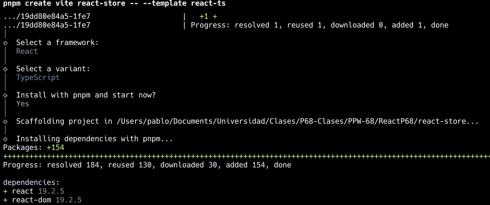
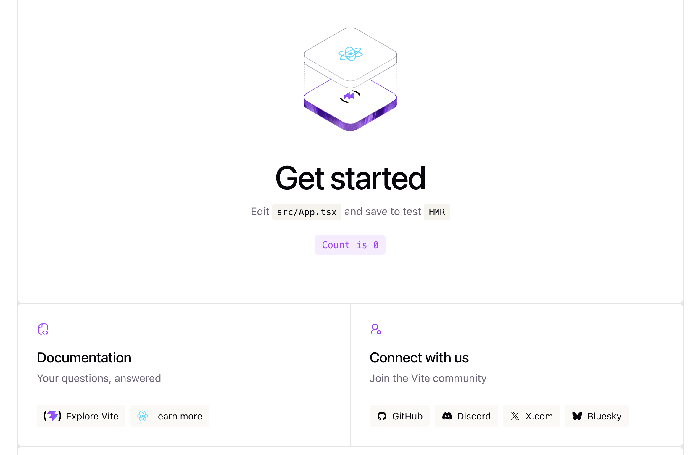
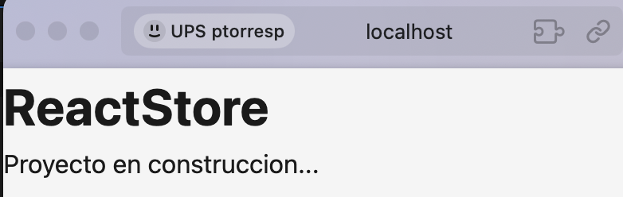

# Programacion y Plataformas Web

# React para Desarrollo Web

<div align="center">
  
</div>

## Practica 1: Instalacion y Configuracion del Entorno

### Autores

**Pablo Torres**  
ptorersp@ups.edu.ec  
GitHub: [PabloT18](https://github.com/PabloT18)

---

## Objetivo Practico

Crear y configurar el proyecto React base que se usara durante todos los modulos del curso. Al final de esta practica, el estudiante tendra un proyecto Vite + React + TypeScript corriendo localmente, con el boilerplate limpio y listo para comenzar el desarrollo incremental.

---

## Contexto de la Practica

Este proyecto se llamara **`react-store`** y sera una tienda de productos construida progresivamente. Cada modulo agrega funcionalidad sobre el mismo proyecto, sin crear proyectos nuevos.

**API que se usara:** [DummyJSON](https://dummyjson.com/products) — publica, sin API key, con endpoints de productos, categorias y autenticacion simulada.

---

## Archivos que se van a crear en esta practica

```
react-store/
├── index.html               (modificado: title y lang)
├── src/
│   ├── main.tsx             (sin cambios)
│   ├── index.css            (limpiado)
│   ├── App.tsx              (reemplazado con version minima)
│   └── App.css              (limpiado)
└── vite.config.ts           (alias @ configurado)
```

---

## Paso 1: Verificar herramientas instaladas

**(verificar)**

Abrir la terminal y ejecutar:

```bash
node --version
```

Debe mostrar `v18.x.x` o superior. Si no:
- Descargar desde [nodejs.org](https://nodejs.org) la version LTS.

```bash
pnpm --version
```

Debe mostrar `9.x.x` o superior. Si no esta instalado:

```bash
npm install -g pnpm
```

```bash
git --version
```


---

## Paso 2: Crear el proyecto con Vite

**(copiar)**

Desde la carpeta de trabajo del curso, ejecutar:

```bash
pnpm create vite react-store
```

El comando mostrara un menu interactivo. Seleccionar:

1. **Select a framework:** `React`
2. **Select a variant:** `TypeScript`
3. **Install with pnpm and start now?** Yes

**¿Que hace este comando?**
- `pnpm create vite` invoca el scaffolding oficial de Vite
- `react-store` es el nombre del proyecto y la carpeta que se creara
- En versiones recientes de Vite, el menu interactivo reemplaza al flag `--template`




Ya deja ejecutando el proyecto por lo que se debe cancelca con `Ctrl +C`

Al terminar, entrar a la carpeta e instalar dependencias:

```bash
cd react-store
```

Levantar el servidor de desarrollo para verificar que funciona:

```bash
pnpm dev
```

Abrir el navegador en `http://localhost:5173`. Debe aparecer la pagina de bienvenida de Vite + React.



Detener el servidor con `Ctrl + C`.

---

## Paso 3: Explorar la estructura inicial

**(leer y entender)**

Abrir el proyecto en VS Code:

```bash
code .
```

Revisar estos archivos en orden:

1. `index.html` — el unico HTML de la SPA, contiene `<div id="root">`
2. `src/main.tsx` — punto de entrada, monta `<App />` sobre `#root`
3. `src/App.tsx` — componente raiz con el ejemplo de Vite
4. `package.json` — scripts disponibles y dependencias

**Extensiones recomendadas para VS Code:**
- ES7+ React/Redux/React-Native snippets
- Prettier - Code formatter
- ESLint

---

## Paso 4: Configurar alias de rutas

**(copiar)**

Instalar el tipo de Node para usar `path` en TypeScript:

```bash
pnpm add -D @types/node
```

Reemplazar el contenido de `vite.config.ts` con:

```ts
import { defineConfig } from 'vite'
import react from '@vitejs/plugin-react'
import path from 'path'

export default defineConfig({
  plugins: [react()],
  resolve: {
    alias: {
      '@': path.resolve(__dirname, './src'),
    },
  },
})
```

**¿Que hace este codigo?**
El alias `@` apunta a la carpeta `src/`. Esto permite importar con `import Button from '@/components/Button'` en lugar de rutas relativas largas como `../../components/Button`.

Agregar la configuracion de paths en `tsconfig.app.json`. Dentro de `"compilerOptions"` agregar:

```json
"baseUrl": ".",
"paths": {
  "@/*": ["./src/*"]
}
```

---

## Paso 5: Limpiar el boilerplate de Vite

**(copiar)**

### 5.1 Actualizar `index.html`

Cambiar el `<title>` y el `lang`:

```html
<!doctype html>
<html lang="es">
  <head>
    <meta charset="UTF-8" />
    <link rel="icon" type="image/svg+xml" href="/vite.svg" />
    <meta name="viewport" content="width=device-width, initial-scale=1.0" />
    <title>ReactStore</title>
  </head>
  <body>
    <div id="root"></div>
    <script type="module" src="/src/main.tsx"></script>
  </body>
</html>
```

### 5.2 Limpiar `src/index.css`

Reemplazar todo el contenido con estilos globales minimos:

```css
*, *::before, *::after {
  box-sizing: border-box;
  margin: 0;
  padding: 0;
}

body {
  font-family: system-ui, -apple-system, sans-serif;
  line-height: 1.5;
  color: #1a1a1a;
  background-color: #f5f5f5;
}

img {
  max-width: 100%;
  display: block;
}

a {
  color: inherit;
  text-decoration: none;
}
```

### 5.3 Limpiar `src/App.css`

Reemplazar todo con:

```css
.app {
  min-height: 100vh;
}
```

### 5.4 Reemplazar `src/App.tsx`

```tsx
function App() {
  return (
    <div className="app">
      <h1>ReactStore</h1>
      <p>Proyecto en construccion...</p>
    </div>
  )
}

export default App
```

**¿Que hace este codigo?**
- `function App()` es un componente funcional de React — una funcion que retorna JSX
- El `return` devuelve lo que se renderiza en pantalla
- `className` es el equivalente de `class` en JSX (no se puede usar `class` porque es palabra reservada en JavaScript)
- `export default App` exporta el componente para que `main.tsx` lo pueda importar

---

## Paso 6: Verificar el proyecto limpio

**(verificar)**

Levantar el servidor:

```bash
pnpm dev
```

El navegador debe mostrar:
- Titulo de la pestana: "ReactStore"
- Fondo gris claro
- Texto "ReactStore" y "Proyecto en construccion..."



Verificar que no hay errores en la consola del navegador (`F12` → Console).

---

## Paso 7: Primer commit

**(copiar)**

```bash
git init
git add .
git commit -m "chore: configuracion inicial del proyecto ReactStore con Vite + React + TS"
```

Si el proyecto es parte de un repositorio existente (como el del curso), omitir `git init` y hacer solo `add` y `commit`.

---

## Entregables

- Proyecto `react-store` creado con Vite + React + TypeScript
- Servidor de desarrollo corriendo sin errores en `http://localhost:5173`
- Boilerplate de Vite reemplazado por el componente `App` limpio
- Alias `@` configurado en Vite y TypeScript
- Primer commit realizado

---

## Commits Sugeridos

```bash
git commit -m "chore: inicializar proyecto react-store con Vite react-ts template"
git commit -m "chore: configurar alias @ para src en vite.config.ts y tsconfig"
git commit -m "chore: limpiar boilerplate de Vite y configurar estilos globales"
```
