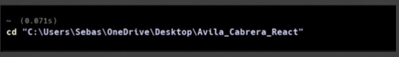
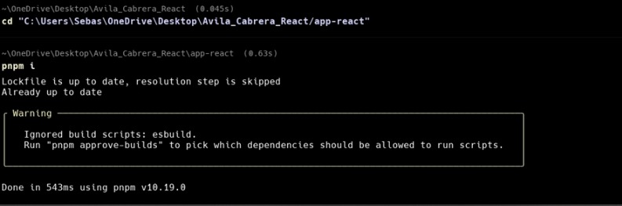
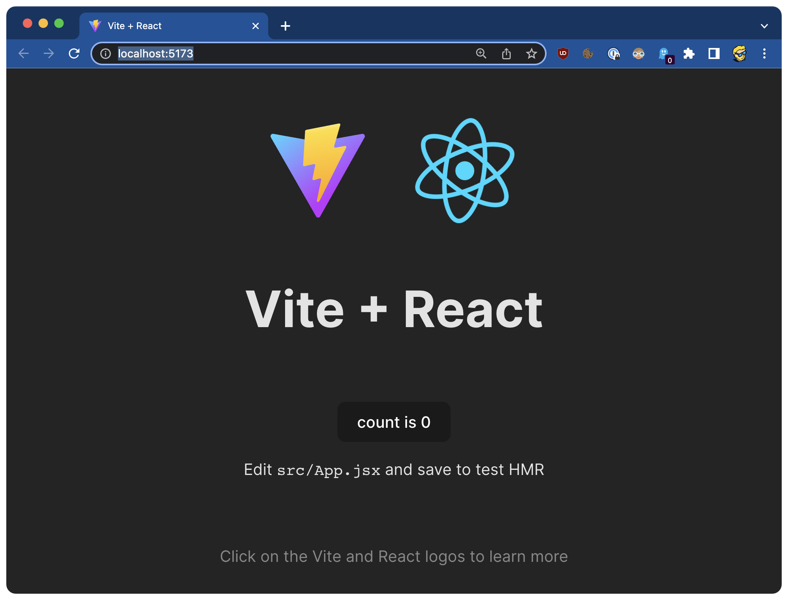
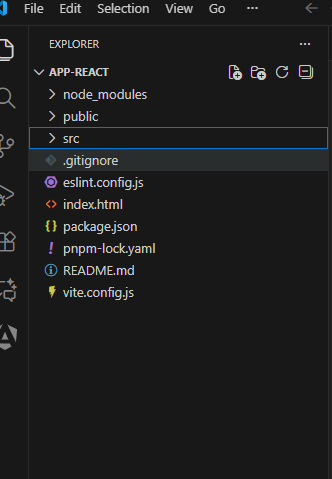

# Programación y Plataformas Web 

# Frameworks Web: React

<div align="center">
  

</div>


## Practica 1: Instalación y Configuración de React

### Autores

*Diana Avila* 
📧 davilam3@est.ups.edu.ec 
💻 GitHub: [Diana Avila](https://github.com/davilam3)
*Sebastian Cabrera*
📧 ccabreram1@est.ups.edu.ec 
💻 GitHub: [Sebastian Cabrera](https://github.com/Ccabreram1)

---

## Configuración de React
Para crear y configurar una aplicación en React, utilizamos el gestor de paquetes pnpm, que permite una instalación más rápida y eficiente.

**Instalar React con PNPM**

Abrimos una terminal (Warp) y navegamos hasta la carpeta donde deseamos crear nuestro proyecto.

```bash
cd ":\User\Sebas\OneDrive\Desktop\Avila_Cabrera_React\"
```

Creamos nuestro proyecto

```bash
pnpm create vite
```

**Opciones de creación**

* Nombre del proyecto: Escribe el nombre de tu aplicación (por ejemplo: react-app).
* Framework: Selecciona React.
* Variante: Elige JavaScript o TypeScript según prefieras.
* Rolldown-vite: No
* Install pnpm and start now?: Yes

Luego, Vite generará automáticamente la estructura base del proyecto.

* Para ingresar en el localhost
```bash
pnpm create vite
```
Ingresar al Local: (http://localhost:5173) de cada proyecto.

**Entrar al proyecto e instalar dependencias**

Una vez creado el proyecto, ingresamos al directorio generado en warp:

```bash
cd react-app
pnpm install
```

Esto descarga todas las dependencias necesarias indicadas en el archivo package.json.

**Ejecutar la aplicación**

Para iniciar el servidor:

```bash
pnpm run dev
```

El comando mostrará una URL similar a:

```bash
http://localhost:5173/
```
Abre ese enlace en el navegador para ver tu aplicación React funcionando.

---

## Limpieza del Proyecto Inicial

Antes de comenzar a desarrollar, se recomienda limpiar la plantilla predeterminada para trabajar con una página en blanco:

1. Abre el archivo App.jsx y elimina todo el contenido, dejando solo:

```bash
function App() {
  return <></>;
}

export default App;
```

2. Limpia los archivos de estilos:

* Deja App.css e index.css vacíos.

3. En la carpeta assets, elimina cualquier imagen (por ejemplo, react.svg).

* Esto dejará el proyecto listo para personalizarlo desde cero.

---

## Instalación de React Router

Para manejar la navegación entre diferentes páginas o componentes:

```bash
pnpm install react-router-dom
```

## Extensiones recomendadas para VSCode (React)
Estas extensiones mejoran la productividad y la calidad del código en proyectos React:

ES7+ React/Redux/React-Native snippets
 * Fragmentos rápidos para crear componentes, hooks, etc. https://marketplace.visualstudio.com/items?itemName=dsznajder.es7-react-js-snippets

Prettier - Code Formatter
 * Formateo automático del código.
 https://marketplace.visualstudio.com/items?itemName=esbenp.prettier-vscode

Auto Import
  * Importa automáticamente módulos usados. https://marketplace.visualstudio.com/items?itemName=steoates.autoimport

Auto Rename Tag
 * Renombrado automático de etiquetas JSX. https://marketplace.visualstudio.com/items?itemName=formulahendry.auto-rename-tag

Error Lens
 * Muestra errores y advertencias directamente en el código. https://marketplace.visualstudio.com/items?itemName=usernamehw.errorlens


###  Hoja de Atajos – React con Vite
Comandos más comunes en el desarrollo con React:

```bash
pnpm create vite      # Crear nuevo proyecto
pnpm install          # Instalar dependencias
pnpm run dev          # Iniciar servidor local
pnpm run build        # Compilar para producción
pnpm run preview      # Previsualizar la app compilada
```

---
Capturas de pantalla como evidencia del proceso de instalación y configuración de Angular, así como explicaciones detalladas de los componentes y formularios utilizados en la práctica.

## Resultados:

Capturas de pantalla como evidencia del proceso configuración de React, así como explicaciones detalladas de los componentes.

### 1. Configuracion y creación del proyecto FALTA:



*Descripción de la imagen:*
Se muestra el proceso de creación del proyecto usando el comando pnpm create vite, seleccionando React como framework y JavaScript como lenguaje.

```bash
pnpm create vite
```

### 2. Instalación de dependencias: 



Después de ingresar al proyecto con cd react-app, se ejecuta pnpm i para instalar todas las dependencias necesarias.

```bash
pnpm i
```

### 3. Proyecto corriendo en el navegador:



Descripción:
Al ejecutar pnpm run dev, la aplicación se inicia en http://localhost:5173/, mostrando la interfaz inicial de Vite + React en el navegador.

```bash
pnpm run dev
```

###  4. Explicación de la estructura del proyecto:




##### Carpetas y archivos principales:

* public: Contiene archivos estáticos accesibles públicamente.
* src: Carpeta que contiene el código fuente de la aplicación.
* node_modules: Carpeta que contiene las dependencias del proyecto.
* pnpm-lock.yaml: Archivo de bloqueo de versiones para pnpm.
* angular.json: Archivo de configuración de Angular.
* package.json: Archivo de configuración de npm.
* tsconfig.json: Archivo de configuración de TypeScript.
* tsconfig.app.json: Archivo de configuración de TypeScript para la aplicación.
* tsconfig.spec.json: Archivo de configuración de TypeScript para las pruebas.

### Carpeta de código SRC

Dentro de la carpeta src, encontramos las siguientes subcarpetas y archivos importantes:

* app: Contiene el código principal de la aplicación, incluyendo componentes, servicios y módulos.
* index.html: Archivo HTML principal de la aplicación.
* main.ts: Punto de entrada de la aplicación.
* styles.css: Archivo de estilos globales.

### Carpeta APP

Dentro de la carpeta app, encontramos la siguiente estructura de archivos:

* app.config.ts: Archivo de configuración de la aplicación.
* app.css: Archivo de estilos específicos de la aplicación.
* app.html: Archivo HTML principal de la aplicación.
* app.routes.ts: Archivo de definición de rutas de la aplicación.
* app.spec.ts: Archivo de pruebas unitarias de la aplicación.
* app.ts: Archivo principal de la aplicación.