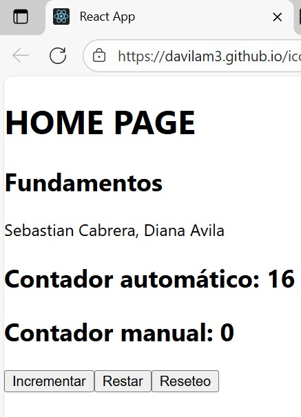
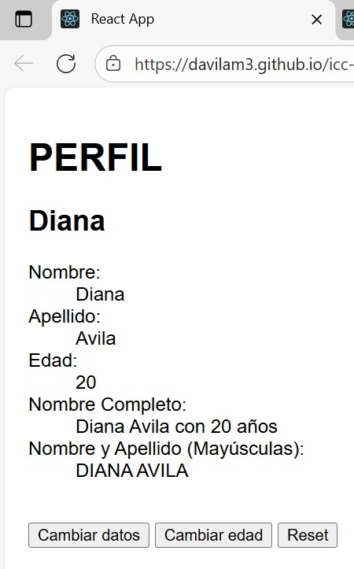

# Programación y Plataformas Web 

# Frameworks Web: REACT

<div align="center">
  

</div>

## Practica 2: Fundamentos 

### Autores

*Diana Avila* 
📧 davilam3@est.ups.edu.ec 
💻 GitHub: [Diana Avila](https://github.com/davilam3)
*Sebastian Cabrera* 
📧 ccabreram1@est.ups.edu.ec 
💻 GitHub: [Sebastian Cabrera](https://github.com/Ccabreram1)

---

## Fudamentos de React

## ¿Qué es React?

React es una biblioteca de JavaScript desarrollada por Meta (Facebook) para crear interfaces de usuario interactivas.
Está basada en el concepto de componentes reutilizables, que permiten construir aplicaciones web dinámicas y eficientes.

React se enfoca en la capa de vista (View) dentro del patrón MVC y utiliza un DOM virtual que mejora el rendimiento de la aplicación.

## Características principales de React

1. **Componentes**
React se basa en componentes que representan partes reutilizables de la interfaz. Cada componente puede tener su propia lógica, estilo y estado.

2. **JSX (JavaScript XML)**
React utiliza una sintaxis llamada JSX, que combina JavaScript con HTML, facilitando la creación de interfaces de usuario.

3. **Props y State**

* Props: son los parámetros que se pasan a los componentes (como argumentos).

* State: es el estado interno del componente que puede cambiar con las interacciones del usuario.

4. **Unidirectional Data Flow**
El flujo de datos en React es unidireccional, lo que facilita el control y la depuración del código.

5. **Hooks**
Son funciones especiales que permiten utilizar características de React, como el estado (useState) o los efectos (useEffect), en componentes funcionales.

6. **React Router**
Permite manejar rutas y navegación dentro de una aplicación de una sola página (SPA), cargando componentes dinámicamente según la URL.

## Rutas

En React, las rutas se gestionan mediante la librería React Router DOM.
Ejemplo básico de configuración:

```html
import { BrowserRouter, Routes, Route } from "react-router-dom";
import Home from "./componentes/Home";
import Perfil from "./componentes/Perfil";

function App() {
  return (
    <BrowserRouter>
      <Routes>
        <Route path="/" element={<Home />} />
        <Route path="/perfil" element={<Perfil />} />
      </Routes>
    </BrowserRouter>
  );
}

export default App;
```

## Componentes de React

Los componentes en React son las unidades fundamentales. Pueden ser funcionales o basados en clases (los funcionales son los más usados actualmente).

1. Cada componente puede tener:
2. Lógica y estado (JavaScript/TypeScript)
3. Vista (JSX)

Estilos (CSS, Tailwind, SCSS, etc.)

Ejemplo de un componente simple:

```html
function Home() {
  return (
    <div>
      <h1>Bienvenido a React</h1>
      <p>Este es un componente funcional.</p>
    </div>
  );
}
```

## Resultados

### HomePage
[HomePage](https://davilam3.github.io/icc-ppw-u2-react_home/)


### PerfilPage
[PerfilPage](https://davilam3.github.io/icc-ppw-u2-react_perfil/)

