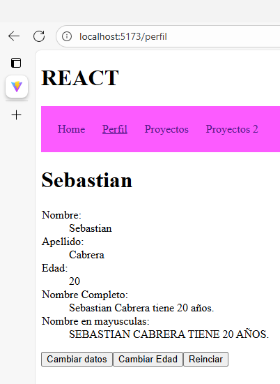
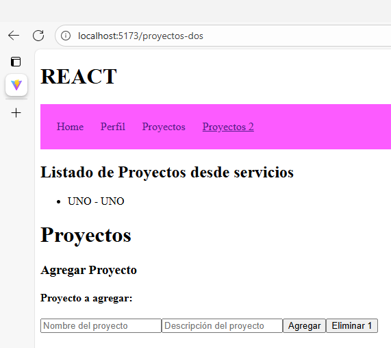

  # Programación y Plataformas Web 

# Frameworks Web: React

<div align="center">
  
</div>

## Práctica 3: Navegación en React

### Autores

*Diana Avila* 
📧 davilam3@est.ups.edu.ec 
💻 GitHub: [Diana Avila](https://github.com/davilam3)
*Sebastian Cabrera*
📧 ccabreram1@est.ups.edu.ec 
💻 GitHub: [Sebastian Cabrera](https://github.com/Ccabreram1)

---

## 🧭 Navegación en React

La navegación en React funciona de forma diferente a HTML tradicional. En lugar de usar `<a href="">`, utilizamos los componentes de React Router, como `<Link>` y `<NavLink>`.

React, al igual que Angular, crea Single Page Applications (SPA) donde no recargamos la página.

## 🔄 ¿Por qué NO usar `href` con `<a>` en React?

### ❌ Navegación con etiquetas `<a href="">`
```html
<!-- Esto RECARGA toda la página -->
<a href="/perfil">Perfil</a>
```

**Problemas:**
- ✗ Recarga completa de la página
- ✗ Pérdida del estado de la aplicación
- ✗ Es mas lento
- ✗ Experiencia de usuario interrumpida

### ✅ Navegación con `routerLink`:
```html
<!-- Esto SOLO cambia el contenido, sin recargar -->
<NavLink className={({isActive}) => isActive ? "active" : "navlin"} to="/">Home</NavLink>
<NavLink className={({isActive}) => isActive ? "active" : "navlin"} to="/perfil">Perfil</NavLink>
<NavLink className={({isActive}) => isActive ? "active" : "navlin"} to="/proyectos">Proyectos</NavLink>
<NavLink className={({isActive}) => isActive ? "active" : "navlin"} to="/proyectos-dos">Proyectos 2</NavLink
```

**Ventajas:**
- ✓ Navegación instantánea
- ✓ Preserva el estado de la aplicación
- ✓ Mejor experiencia de usuario
- ✓ Aplicación de una sola página (SPA)

## 📚 Qué son los Componentes y Hooks en React

React no usa “directivas” como Angular. En su lugar tenemos:


### 1. **Componentes**
Son funciones que retornan JSX.
```typescript
function Home() {
  return <h1>Inicio</h1>;
}

```
### 2. **Hooks (equivalente a directivas lógicas)**

React usa hooks como:

* useState()

* useEffect()

* useNavigate()

* useParams()

Ejemplo:
```typescript
const [user, setUser] = useState(null);
```


## 🔗 React Router: Tipos de Navegación

React Router ofrece dos formas principales:

### 1. **Navegación declarativa**
Usando `<Link>` o `<NavLink>`:
```typescript
<Link to="/perfil">Perfil</Link>
```
### 2. **Navegación programática**

Usando `useNavigate()`:
```typescript
const navigate = useNavigate();
navigate("/perfil");
```
## 📌 Diferencia entre Link y NavLink
`<Link>`

Navega sin estilos especiales.

```typescript
<Link to="/productos">Productos</Link>
```
`<NavLink>`

Agrega clases automáticas cuando la ruta está activa.

```typescript
<NavLink to="/productos" className={({ isActive }) => isActive ? "active" : ""}>
  Productos
</NavLink>
```

## 🚀 Configuración de Rutas en React

📁 Main.tsx

```typescript
import { StrictMode } from 'react'
import { createRoot } from 'react-dom/client'
import "./index.css";

import { createBrowserRouter, createHashRouter, RouterProvider } from "react-router";//Importa las funciones necesarias para el enrutamiento

import App from "./App.tsx";//Importa el componente principal de la aplicacion
import Perfil from "./perfilpage/perfilpage.tsx";//Importa el componente del perfil
import MainLayout from "./layout.tsx";//Importa el layout principal de la aplicacion
import { NavLink } from 'react-router';
import Proyectos from './components/proyectos/proyectos.tsx';
import Proyectos2 from './components/proyectos/proyectos-dos.tsx';

const router = createBrowserRouter([//Definicion de rutas 
  {
    path: "/", //Ruta principal
    Component: MainLayout,//Componente de layout principal
    children: [//Rutas hijas
      {
        index: true,//Ruta principal
        Component: App,//Ruta a la que apunta
      },
      {
        path: 'perfil',//Ruta del perfil
        Component: Perfil,//Ruta a la que apunta
      },

      {
        path: '/proyectos',//Ruta por defecto para rutas no definidas
        Component: Proyectos,//Ruta a la que apunta
      },
      {
        path: '/proyectos-dos',//Ruta por defecto para rutas no definidas
        Component: Proyectos2//Ruta a la que apunta
      },

    ],
  },
]);

createRoot(document.getElementById("root")!).render(//Renderiza la aplicacion en el elemento con id "root "
  <StrictMode>
    <RouterProvider router={router} />
  </StrictMode>
);
```
## 🧭 Navbar con Link y NavLink

📁 Navbar.tsx

```typescript
import { NavLink } from "react-router"; 
import "./navbar.css";

export function Navbar() {
    return(
        <nav>
            <NavLink className={({isActive}) => isActive ? "active" : "navlin"} to="/">Home</NavLink>
            <NavLink className={({isActive}) => isActive ? "active" : "navlin"} to="/perfil">Perfil</NavLink>
            <NavLink className={({isActive}) => isActive ? "active" : "navlin"} to="/proyectos">Proyectos</NavLink>
            <NavLink className={({isActive}) => isActive ? "active" : "navlin"} to="/proyectos-dos">Proyectos 2</NavLink>
        </nav>
    );
}
```
📁 navbar.css

```typescript
nav{
    background-color: #fc5bffff;
    padding: 1.5rem;
    display: flex;
    gap: 25px;
}

.navlin{
    padding: 1rem
    color: black;
    font-weight: 500;
    text-decoration: none;
    transition: color 0.3s, font-weight 0.3s    ;
}

.navlin:hover{
    color: white;
    font-weight: 700;
}

.navlin.active{
    color: white;
    font-weight: 900;
    text-decoration: underline;
    
}
```


## 💡 Ejemplos Prácticos

### Ejemplo 1: Navegación Básica
```typescript
// app.component.ts
import { Component } from '@angular/core';
import { RouterModule } from '@angular/router';
import { CommonModule } from '@angular/common';

@Component({
  selector: 'app-root',
  standalone: true,
  imports: [RouterModule, CommonModule],
  template: `
    <nav>
      <h2>Mi Aplicación Angular</h2>
      <ul>
        <li><a routerLink="/">🏠 Inicio</a></li>
        <li><a routerLink="/productos">📦 Productos</a></li>
        <li><a routerLink="/contacto">📞 Contacto</a></li>
      </ul>
    </nav>
    
    <!-- Aquí se renderizan los componentes según la ruta -->
    <router-outlet></router-outlet>
  `,
  styles: [`
    nav {
      background: #f0f0f0;
      padding: 1rem;
      margin-bottom: 2rem;
    }
    
    ul {
      list-style: none;
      display: flex;
      gap: 1rem;
    }
    
    a {
      text-decoration: none;
      color: #007bff;
      padding: 0.5rem 1rem;
      border-radius: 4px;
    }
    
    a:hover {
      background: #e9ecef;
    }
  `]
})
export class AppComponent {
  title = 'navegacion-ejemplo';
}
```

### Ejemplo 2: Navegación con Parámetros
```typescript
// productos.component.ts
import { Component, signal } from '@angular/core';
import { RouterModule } from '@angular/router';
import { CommonModule } from '@angular/common';

@Component({
  selector: 'app-productos',
  standalone: true,
  imports: [RouterModule, CommonModule],
  template: `
    <h2>Lista de Productos</h2>
    
    @for (producto of productos(); track producto.id) {
      <div class="producto-card">
        <h3>{{ producto.nombre }}</h3>
        <p>{{ producto.descripcion }}</p>
        <p><strong>Precio: ${{ producto.precio }}</strong></p>
        
        <!-- Navegación con parámetros usando sintaxis de array -->
        <a [routerLink]="['/producto', producto.id]">
          👁️ Ver Detalles
        </a>
      </div>
    }
  `,
  styles: [`
    .producto-card {
      border: 1px solid #dee2e6;
      padding: 1rem;
      margin: 1rem 0;
      border-radius: 8px;
    }
    
    .producto-card a {
      background: #007bff;
      color: white;
      padding: 0.5rem 1rem;
      text-decoration: none;
      border-radius: 4px;
      display: inline-block;
      margin-top: 0.5rem;
    }
    
    .producto-card a:hover {
      background: #0056b3;
    }
  `]
})
export class ProductosComponent {
  productos = signal([
    { id: 1, nombre: 'Laptop', descripcion: 'Laptop Gaming', precio: 1200 },
    { id: 2, nombre: 'Mouse', descripcion: 'Mouse Inalámbrico', precio: 25 },
    { id: 3, nombre: 'Teclado', descripcion: 'Teclado Mecánico', precio: 80 }
  ]);
}
```

## 🎓 Resumen – Navegación en React
🔗 React Router es la librería estándar para manejar la navegación en aplicaciones SPA hechas con React.
❌ No usar `<a href="">`

* Recarga toda la página
* Pierde el estado de React
* No funciona como SPA
* Es lento y rompe la experiencia del usuario

✅ Usar `<Link>` para rutas fijas
`<Link to="/inicio">Inicio</Link>`

* Navegación instantánea
* SPA sin recarga
* Simple para rutas estáticas

🔧 Usar `<NavLink~` para resaltar enlaces activos
`<NavLink to="/perfil" className={({ isActive }) => isActive ? "active" : ""}>
  Perfil
</NavLink>`


* Permite aplicar estilos cuando la ruta está activa
* Similar a routerLinkActive de Angular

## 📦 Navegación con parámetros
`<Link to={/usuario/${id}}>Ver Usuario</Link>`

* Flexible
* Soporta variables dinámicas
* Ideal para rutas con IDs

## �️ Implementación Práctica

Sigue estos pasos para implementar la navegación en tu proyecto Angular:

### Paso 1: Crear las Páginas Principales

#### 1.1 Crear ProyectosPage

#### 1.2 Crear ProyectosDosPage


### Paso 2: Configurar las Rutas


### Paso 3: Agregar al Navbar

### Paso 4: Crear Componentes para Proyectos y separarlos en componentes indivuduals

#### 4.1 Crear Componente para Agregar Proyectos

#### 4.2 Crear Componente para Lista de Proyectos


### Paso 5: Implementar la Página de Proyectos

### Paso 6: Implementar la Página ProyectosDos


## �📸 Capturas de Implementación

### 1. Configuración de Rutas (main.tsx)

```bash
import { StrictMode } from 'react'
import { createRoot } from 'react-dom/client'
import "./index.css";

import { createBrowserRouter, createHashRouter, RouterProvider } from "react-router";//Importa las funciones necesarias para el enrutamiento

import App from "./App.tsx";//Importa el componente principal de la aplicacion
import Perfil from "./perfilpage/perfilpage.tsx";//Importa el componente del perfil
import MainLayout from "./layout.tsx";//Importa el layout principal de la aplicacion
import { NavLink } from 'react-router';
import Proyectos from './components/proyectos/proyectos.tsx';
import Proyectos2 from './components/proyectos/proyectos-dos.tsx';

const router = createBrowserRouter([//Definicion de rutas 
  {
    path: "/", //Ruta principal
    Component: MainLayout,//Componente de layout principal
    children: [//Rutas hijas
      {
        index: true,//Ruta principal
        Component: App,//Ruta a la que apunta
      },
      {
        path: 'perfil',//Ruta del perfil
        Component: Perfil,//Ruta a la que apunta
      },

      {
        path: '/proyectos',//Ruta por defecto para rutas no definidas
        Component: Proyectos,//Ruta a la que apunta
      },
      {
        path: '/proyectos-dos',//Ruta por defecto para rutas no definidas
        Component: Proyectos2//Ruta a la que apunta
      },

    ],
  },
]);
```

### 4. Aplicación Funcionando

**HomePage**

**Perfil**

**Proyectos**

**Proyetos Dos**



## 🔗 Enlaces del Proyecto

- **Repositorio GitHub**: 
* [GitHub Sebastian Cabrera](https://github.com/Ccabreram1/icc-ppw-u2-01Fundamentos.git)
* [GitHub Diana Avila]( https://github.com/davilam3/icc-pww-u1-01_fundamentos.git )
- **GitHub Pages**: 
* [Page Diana Avila](https://davilam3.github.io/icc-pww-u1-01_fundamentos/)
* [Page Sebastian Cabrera](https://ccabreram1.github.io/icc-ppw-u2-01Fundamentos/)


## 📝 Notas de Implementación

- Usé Angular 20+ con sintaxis moderna
- Implementé tanto navegación estática como dinámica
- Agregué estilos para mejorar la experiencia de usuario
- Utilicé signals para el manejo de estado moderno
- Apliqué las mejores prácticas de navegación SPA 

