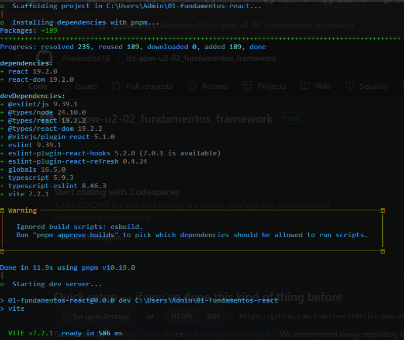
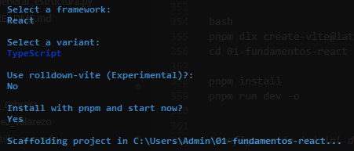
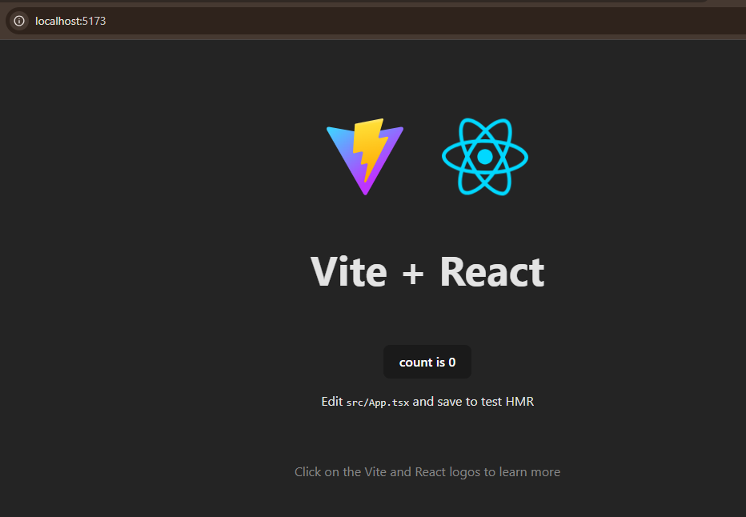
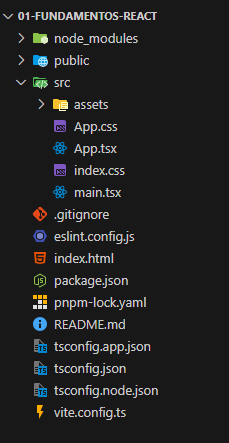

# Programación y Plataformas Web

# Frameworks Web: React

<div align="center">
  
</div>

## Práctica 1: Instalación y Configuración de React

### Autores

*Valeria Mantilla*
📧 [amantillac3@est.ups.edu.ec](mailto:amantillac3@est.ups.edu.ec)
💻 GitHub: [Alanissette16](https://github.com/Alanissette16)

*Claudia Quevedo*
📧 [cquevedor@ups.edu.ec](mailto:cquevedor@ups.edu.ec)
💻 GitHub: [clcmono](https://github.com/clcmono)
---

## Instalación de la libreria de react (Vite + React)

La forma recomendada para iniciar proyectos React modernos es *Vite. Usaremos **pnpm* como gestor de paquetes.

Crear un nuevo proyecto React con TypeScript:

```bash
pnpm dlx create-vite@latest 01-fundamentos-react
```

Entrar al proyecto e instalar dependencias (si el asistente no lo hizo):

```bash
cd 01-fundamentos-react
code .
```

Ejecutar la aplicación en modo desarrollo y abrir en el navegador:

```bash
pnpm run dev -o
```

Hacer que la app sea accesible desde otras máquinas de la red local:

```bash
pnpm run dev -- --host 0.0.0.0 --port 5173
```

Compilar para producción:

```bash
pnpm run build
```

Previsualizar el build localmente:

```bash
pnpm run preview
```
---

## Extensiones recomendadas para VSCode (React)

* **[ESLint](https://marketplace.visualstudio.com/items?itemName=dbaeumer.vscode-eslint)** – Linter para código consistente.
* **[Prettier - Code Formatter](https://marketplace.visualstudio.com/items?itemName=esbenp.prettier-vscode)** – Formato automático del código.
* **[ES7+ React/Redux/React-Native snippets](https://marketplace.visualstudio.com/items?itemName=dsznajder.es7-react-js-snippets)** – Snippets para componentes y hooks.
* **[Tailwind CSS IntelliSense](https://marketplace.visualstudio.com/items?itemName=bradlc.vscode-tailwindcss)** – Autocompletado para Tailwind (si lo usas).
* **[DotENV](https://marketplace.visualstudio.com/items?itemName=mikestead.dotenv)** – Soporte para archivos .env.
* **[Auto Close Tag](https://marketplace.visualstudio.com/items?itemName=formulahendry.auto-close-tag)** – Cierra etiquetas HTML automáticamente.
* **[Auto Rename Tag](https://marketplace.visualstudio.com/items?itemName=formulahendry.auto-rename-tag)** – Renombrado en pares para etiquetas.
* **[Path Intellisense](https://marketplace.visualstudio.com/items?itemName=christian-kohler.path-intellisense)** – Autocompletado de rutas.
* **[Material Icon Theme](https://marketplace.visualstudio.com/items?itemName=PKief.material-icon-theme)** – Iconos de archivos.

---

## Hoja de Atajos – Vite/React

### Comandos básicos

```bash
pnpm dlx create-vite@latest nombre-app -- --template react-ts  # Crear proyecto React TS
pnpm run dev -o                                               # Iniciar servidor y abrir
pnpm run build                                                # Compilar para producción
pnpm run preview                                              # Servir el build localmente
```

*Scripts útiles (en package.json):*

* dev → levanta el servidor de desarrollo.
* build → genera la carpeta dist/ para deploy.
* preview → sirve el contenido de dist/ en local.

### Parámetros útiles

* --host 0.0.0.0 → expone el servidor a la red local.
* --port 5173 → cambia el puerto por defecto.

---

## Estructura creada automáticamente (Vite + React)

* src/ → Código fuente de la aplicación.
* src/main.tsx → Punto de entrada (monta el árbol de React).
* src/App.tsx → Componente raíz.
* index.html → HTML base servido por Vite.
* public/ → Archivos estáticos públicos.
* vite.config.ts → Configuración de Vite.
* tsconfig.json → Configuración de TypeScript.
* package.json → Scripts y dependencias.
* pnpm-lock.yaml → Bloqueo de versiones.

---

## Entornos

Vite usa variables de entorno prefijadas con VITE_.

Crea archivos:

* .env (común)
* .env.development
* .env.production

---

## Ayuda y documentación

bash
pnpm dlx create-vite@latest --help

# Dentro del proyecto
pnpm run dev -- --help         # Ayuda del servidor (Vite)


---

## Resultados:

Capturas de pantalla como evidencia del proceso de instalación y configuración de *React + Vite*, así como explicaciones detalladas de los componentes y formularios utilizados en la práctica.

### 1. Creación del proyecto React:


**Descripción de la imagen:**
En esta captura se muestra la terminal de Windows durante el proceso de instalación y configuración del proyecto React con Vite utilizando el comando:

```bash
pnpm dlx create-vite@latest 01-fundamentos-react 
```
* En la imagen se observa:

La creación del proyecto en la ruta C:\Users\Admin\01-fundamentos-react.

La instalación automática de dependencias mediante pnpm.

* Paquetes principales instalados:

react 19.2.0
react-dom 19.2.0

* Dependencias de desarrollo como:

@vitejs/plugin-react, typescript, eslint, entre otras.

Un mensaje de advertencia (Warning: Ignored build scripts: esbuild) que indica que algunos scripts de construcción fueron ignorados por seguridad, sugiriendo usar el comando pnpm approve-builds si se desea permitirlos.

Al final, se muestra que el servidor de desarrollo de Vite se inicia correctamente, mostrando el mensaje:

VITE v7.2.1  ready in 586 ms

### 2. Configuracion del Proyecto:

Configuración inicial del proyecto:

* Escojer React como framework.

* Escoje TypeScript como variante estándar.

* Use rolldown-vite (Experimental)?: No
Rolldown es un nuevo bundler experimental que Vite está probando.

* Install with pnpm and start now? Yes
Este comando instalará las dependencias con pnpm.



### 3. Proyecto corriendo en el navegador:



### 4. Explicación de la estructura del proyecto:



##### Carpetas y archivos principales:

* public: Contiene archivos estáticos accesibles públicamente.
* src: Código fuente de la aplicación.
* node_modules: Dependencias del proyecto.
* pnpm-lock.yaml: Bloqueo de versiones para reproducibilidad.
* vite.config.ts: Configuración de Vite.
* package.json: Scripts y dependencias.
* tsconfig.json: Configuración de TypeScript.
* index.html: Archivo HTML base que Vite utiliza.

### Carpeta de código SRC

- `main.tsx`: Punto de entrada de la aplicación.
- `App.tsx`: Componente principal de React, contiene la estructura y el contenido inicial.
- `index.css`: Estilos globales aplicados a toda la aplicación.
- `App.css`: Archivo de estilos aplicados al componente App.
- `assets`: Carpeta donde se guardan imágenes, íconos u otros recursos.
