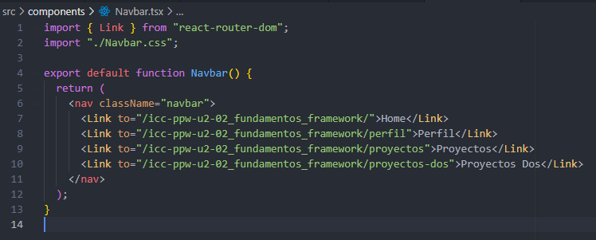
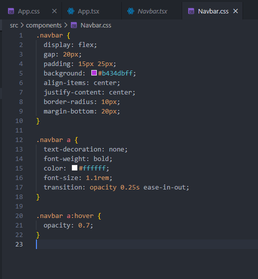
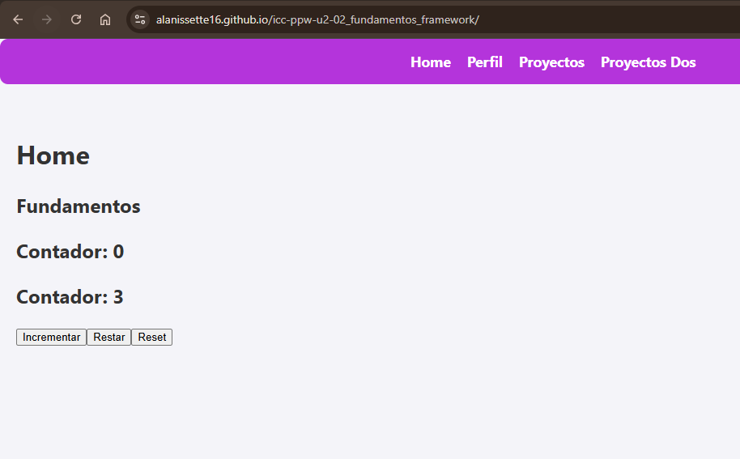
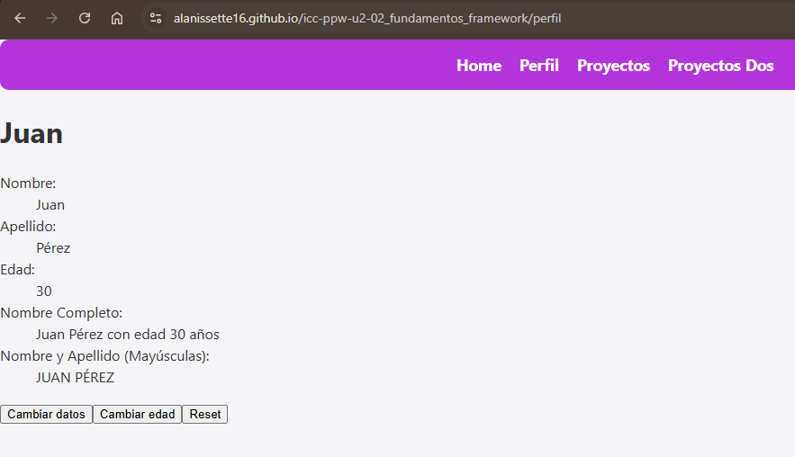
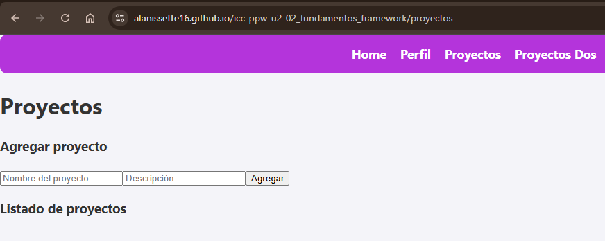
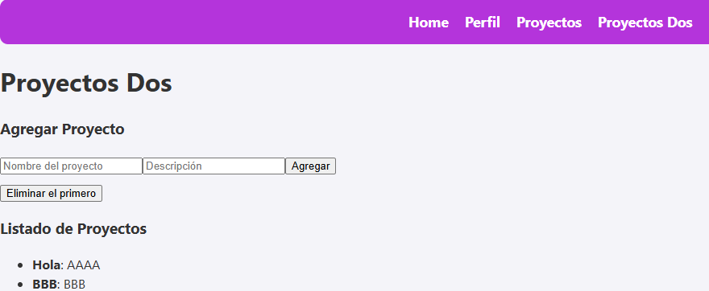

# Programación y Plataformas Web 

# Frameworks Web: React

<div align="center">
  
</div>

## Práctica 3: Navegación en Angular

### Autores


*Valeria Mantilla*
📧 [amantillac3@est.ups.edu.ec](mailto:amantillac3@est.ups.edu.ec)
💻 GitHub: [Alanissette16](https://github.com/Alanissette16)

*Claudia Quevedo*
📧 [cquevedor@ups.edu.ec](mailto:cquevedor@ups.edu.ec)
💻 GitHub: [clcmono](https://github.com/clcmono)
---


---

## 🧭 Navegación en React

React, a diferencia de HTML tradicional, no recarga la página completa cuando navegas entre secciones.
Para lograr esto utiliza bibliotecas como React Router, que permiten crear Single Page Applications (SPA).

Esto significa:
  -No hay recargas completas
  -La experiencia es fluida
  -La URL cambia sin perder el estado
  -Solo cambia el contenido central de la pantalla

## 🔄 ¿Por qué NO usar `href` tradicional?

### ❌ Navegación Tradicional con `href`:
```html
<a href="/perfil">Ir a Perfil</a>

**Problemas:**
- ✗ Recarga completa de la página
- ✗ Pérdida del estado de la aplicación
- ✗ Mayor tiempo de carga
- ✗ Experiencia de usuario interrumpida
- ✗ No funciona con SPA


### ✅ Navegación con `routerLink`:
```html

<a routerLink="/perfil">Perfil</a>

```

**Ventajas:**
- ✓ Navegación instantánea
- ✓ Preserva el estado de la aplicación
- ✓ Mejor experiencia de usuario
- ✓ Aplicación de una sola página (SPA)

## 📚 ¿Qué es React Router?

React Router es una librería que permite:

  -Crear rutas
  -Mostrar componentes según la URL
  -Navegar sin recargar
  -Pasar parámetros
  -Usar navegación programática
 En este proyecto se usó:
```typescript
import { createBrowserRouter } from "react-router-dom";
```

### 🌐 Configuración de Rutas (React Router)

Archivo: Routes/routes.tsx
```typescript
export const router = createBrowserRouter([
  {
    path: "/icc-ppw-u2-02_fundamentos_framework/",
    element: (
      <>
        <Navbar />
        <HomePage />
      </>
    ),
  },
  {
    path: "/icc-ppw-u2-02_fundamentos_framework/perfil",
    element: (
      <>
        <Navbar />
        <Perfil />
      </>
    ),
  },
  {
    path: "/icc-ppw-u2-02_fundamentos_framework/proyectos",
    element: (
      <>
        <Navbar />
        <ProyectosPage />
      </>
    ),
  },
  {
    path: "/icc-ppw-u2-02_fundamentos_framework/proyectos-dos",
    element: (
      <>
        <Navbar />
        <ProyectosDosPage />
      </>
    ),
  },
]);

```
Esta configuración permite que React Router reemplace el contenido sin recargar.

### 🧩 Componentes Principales del Proyecto
1️⃣ Navbar (Navegación)

Archivo: components/Navbar.tsx
```typescript
<Link to="/icc-ppw-u2-02_fundamentos_framework/">Home</Link>
<Link to="/icc-ppw-u2-02_fundamentos_framework/perfil">Perfil</Link>
<Link to="/icc-ppw-u2-02_fundamentos_framework/proyectos">Proyectos</Link>
<Link to="/icc-ppw-u2-02_fundamentos_framework/proyectos-dos">Proyectos Dos</Link>

```
✔ Usa <Link> en vez de <a>
✔ Navegación instantánea
✔ No recarga la página

2️⃣ HomePage
-Dos contadores
-Uso de useState
-Uso de useEffect para intervalo automático

Conceptos usados:
-Estado
-Efectos con limpieza
-Eventos (onClick)

3️⃣ PerfilPage
  -Estado local para nombre, apellido y edad
  -Funciones internas para modificar la información
  -Render dinámico

Conceptos usados:
  -Múltiples estados
  -Funciones internas
  -Transformaciones de strings (uppercase)


4️⃣ ProyectosPage

-Manejo de proyectos usando estado local:
```typescript
setProyectos([...proyectos, nuevoProyecto]);
```

Incluye:
  -Formulario simple
  -Listado de proyectos
  -Componentización (ListadoProyecto)


5️⃣ ProyectosDosPage
Versión con Context API:
  -Estado global
  -ProyectosProvider
  -useProyectos() hook personalizado
  -Métodos globales:
    ✓ addProyecto
    ✓ removeFirstProyecto

Se utiliza:
```typescript
<ProyectosProvider>
   ...
</ProyectosProvider>

```

## 🎛️ Componentes Reutilizables
✔ AddProyecto
Formulario conectado al contexto global.
✔ ListadoProyecto
Lista de proyectos utilizando props.
✔ Proyecto Interface
Archivo: interfaces/Proyecto.ts

```typescript
export interface Proyecto {
  id: number;
  nombre: string;
  descripcion: string;
}

```
## 🔧 Servicios (Context API)

Archivo: services/ProyectosService.tsx

Incluye:
  -Creación del contexto
  -Proveedor global
  -Hook useProyectos
  -Métodos globales de actualización

Esto permite compartir datos entre múltiples componentes sin usar props manualmente.

## 📁 Estilos Utilizados

**Navbar.css** → estilos morados del menú

**App.css**→ tarjetas, inputs, botones

**index.css** → estilos globales

Se mantiene una identidad visual coherente:
  -Bordes redondeados
  -Fondo suave
  -Sombra ligera
  -Layout centrado


## 🚀 Navegación Programática en React

React también soporta navegación desde código:
```typescript
import { useNavigate } from "react-router-dom";

const navigate = useNavigate();
navigate("/perfil");


```


## 🎓 Resumen

1. **React Router** permite navegación SPA sin recargar la página.
2. **No usar href** tradicional, ya que recarga la página completa y rompe el comportamiento SPA.
3. **<Link>** es la alternativa correcta para navegación interna.
4. Las rutas se definen con **createBrowserRouter** y se renderizan con **<RouterProvider>.**
5. Cada ruta muestra un componente distinto según la URL.
6. Puedes navegar programáticamente usando el hook **useNavigate().**

La navegación en React es fluida, optimizada y ofrece una experiencia mucho más moderna que la navegación HTML tradicional.ciente y proporciona una mejor experiencia de usuario comparada con la navegación tradicional HTML.

##  ️ Implementación Práctica

Sigue estos pasos para implementar la navegación en tu proyecto React:

### Paso 1: Crear las Páginas Principales

#### 1.1 Crear ProyectosPage

#### 1.2 Crear ProyectosDosPage


### Paso 2: Configurar las Rutas


### Paso 3: Agregar al Navbar

### Paso 4: Crear Componentes para Proyectos y separarlos en componentes indivuduals

#### 4.1 Crear Componente para Agregar Proyectos

#### 4.2 Crear Componente para Lista de Proyectos


### Paso 5: Implementar la Página de Proyectos

### Paso 6: Implementar la Página ProyectosDos


##  📸 Capturas de Implementación

### 1. Configuración de Rutas (app.routes.ts)
*[Insertar código del archivo app.routes.ts mostrando la configuración de rutas]*
import { createBrowserRouter } from "react-router-dom";
import Navbar from "../components/Navbar";
import HomePage from "../homePage/HomePage";
import Perfil from "../perfilPage/Perfil";
import ProyectosDosPage from "../proyectosDosPage/ProyectosDosPage";
import ProyectosPage from "../proyectosPage/ProyectosPage";

export const router = createBrowserRouter([
  {
    path: "/icc-ppw-u2-02_fundamentos_framework/",
    element: (
      <>
        <Navbar />
        <HomePage />
      </>
    ),
  },
  {
    path: "/icc-ppw-u2-02_fundamentos_framework/perfil",
    element: (
      <>
        <Navbar />
        <Perfil />
      </>
    ),
  },
  {
    path: "/icc-ppw-u2-02_fundamentos_framework/proyectos",
    element: (
      <>
        <Navbar />
        <ProyectosPage />
      </>
    ),
  },
  {
    path: "/icc-ppw-u2-02_fundamentos_framework/proyectos-dos",
    element: (
      <>
        <Navbar />
        <ProyectosDosPage />
      </>
    ),
  },
]);

### 2. Navegación con Link
*[Insertar código del template HTML mostrando ambos tipos de sintaxis de Link]*
import { Link } from "react-router-dom";
import "./Navbar.css";

export default function Navbar() {
  return (
    <nav className="navbar">
      <Link to="/icc-ppw-u2-02_fundamentos_framework/">Home</Link>
      <Link to="/icc-ppw-u2-02_fundamentos_framework/perfil">Perfil</Link>
      <Link to="/icc-ppw-u2-02_fundamentos_framework/proyectos">Proyectos</Link>
      <Link to="/icc-ppw-u2-02_fundamentos_framework/proyectos-dos">Proyectos Dos</Link>
    </nav>
  );
}


### 3. Componente con Navegación
*[Insertar código del código css del componente con navegación]*
.navbar {
  display: flex;
  gap: 20px;
  padding: 15px 25px;
  background: #b434dbff;
  align-items: center;
  justify-content: center;
  border-radius: 10px;
  margin-bottom: 20px;
}

.navbar a {
  text-decoration: none;
  font-weight: bold;
  color: #ffffff;
  font-size: 1.1rem;
  transition: opacity 0.25s ease-in-out;
}

.navbar a:hover {
  opacity: 0.7;
}



### 4. Aplicación Funcionando
*[Insertar captura de la aplicación en el navegador mostrando la navegación entre diferentes vistas]*





## 🔗 Enlaces del Proyecto

- **Repositorio GitHub**:(https://github.com/Alanissette16/icc-ppw-u2-02_fundamentos_framework/tree/valeria_mantilla)
- **GitHub Pages**: https://alanissette16.github.io/icc-ppw-u2-02_fundamentos_framework/


## 📝 Notas de Implementación

 -Proyecto realizado con React + Vite
 -Navegación con React Router (createBrowserRouter)
 -Manejo de estado:
    ✓ useState
    ✓ useEffect
    ✓ Context API
  -Componentes reutilizables
  -Estilos personalizados
  -Rutas configuradas para GitHub Pages