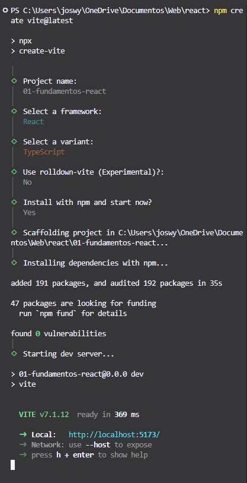
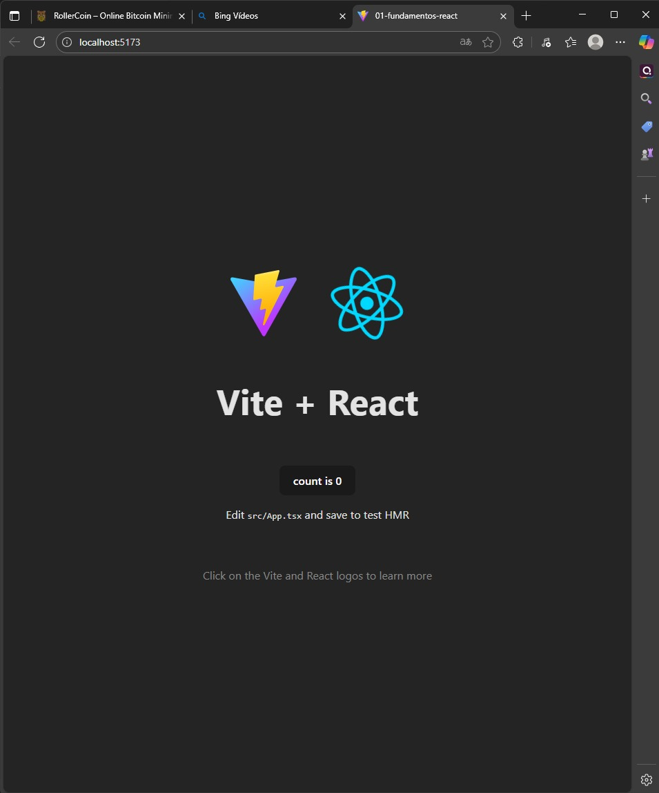
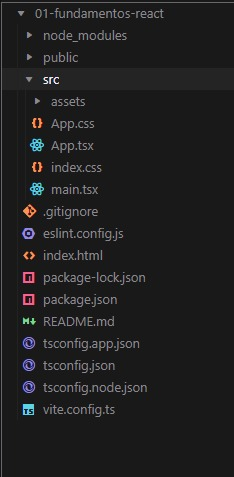

# Programación y Plataformas Web
# Frameworks Web: React

<div align="center">  </div>


## Práctica 1: Instalación y Configuración de React
### Autores 

**Miguel Ángel Vanegas**   
📧 mvanegasp@est.ups.edu.ec  
💻 GitHub: [MiguelV145](https://github.com/MiguelV145)  
**Jose Vanegas**  
📧 jvanegasp1@est.ups.edu.ec   
💻 GitHub: [josevac1](https://github.com/josevac1) 

## Instalación de la libreria de react (con Vite)

React es una librería de JavaScript para crear interfaces dinámicas, y Node.js es el entorno que permite ejecutar JavaScript fuera del navegador y gestionar dependencias con npm.React se puede crear fácilmente utilizando Vite, un entorno de desarrollo rápido y moderno.

Creacion del proyecto 
```bash
npm create vite@latest
```

nombramos a nuestro proyecto 
```bash
Proyect name;
01-fundamentos-react
```

Entramos a nuestro proyecto

```bash
cd 01-fundamentps-react
```

Ejecutar nuetro react
```bash
npm star
```
npx start
Esto abrirá React en tu navegador en http://localhost:5173/.


Abre tu carpeta en VS Code con:

```bash
code .
```

## Extenciones recomndadas para VSCode (React)

Esta extensiones potencian el desarrollo con React 
* **[ES7+ React/Redux/React-Native snippets](https://marketplace.visualstudio.com/items?itemName=dsznajder.es7-react-js-snippets)**  
Permite crear componentes y hooks de React rapidamente con atajos como `rfc`, `rafce`, `usf`, etc.
* **[Simple React Snippets](https://marketplace.visualstudio.com/items?itemName=burkeholland.simple-react-snippets)**  
Ofrece fragmentos de código útiles para componentes funcionales, props y estados.
* **[Auto Rename Tag](https://marketplace.visualstudio.com/items?itemName=formulahendry.auto-rename-tag)**  
Renombra simultaneamente las etiquetas JSX de apertura y cierre.
* **[Auto Import](https://marketplace.visualstudio.com/items?itemName=steoates.autoimport)**  
Importa automaticamnete modulos o componetes cuando los usas en el código.
* **[Path Intellisense](https://marketplace.visualstudio.com/items?itemName=christian-kohler.path-intellisense)**  
Autocompleta ruras de archivos, facilitando las inspeccionar componetes,props y estados  en tiempo real.

## Hoja de Atajos-React + Vite
### Comnadoas basicos
```bash
pnpm create vite my-app --template react
pnpm install          # Instala dependencias
pnpm run dev          # Ejecuta en modo desarrollo
pnpm run build        # Compila para producción
pnpm run preview      # Previsualiza build

```
### Estructura creada automáticamente

- `--index.html` → Archivo HTML base donde se monta la app.

- `--main.tsx / main.jsx` → Punto de entrada de la aplicación React.

- `--App.tsx / App.jsx` → Componente raíz.

- `--vite.config.ts` → Configuración del entorno Vite.

- `--tsconfig.json` → Configuración de TypeScript (si aplica).

### Parametros útiles
Parámetros útiles

- `--template typescript` → Crea el proyecto con soporte para TypeScript.
- `--use-npm`→	Fuerza el uso de npm en lugar de pnpm o yarn.
- `--use-pnpm` →	Fuerza el uso de pnpm (recomendado por su velocidad).
- `--info` →	Muestra información sobre el entorno actual (Node, React, Vite, etc.).
-- `--scripts-version [versión]`→ Permite especificar una versión personalizada de los scripts de configuración (solo para Create React App).


### Generacion de entornos

````bash
# Crear un componente funcional
rfce    →  Crea un componente funcional con exportación por defecto
rfc     →  Crea un componente funcional sin exportación por defecto
rafce   →  Crea un componente arrow function con exportación por defecto
rafc    →  Crea un componente arrow function sin exportación por defecto

# Crear hooks personalizados o integrados
useState →  Hook para manejar estados locales
useEffect → Hook para efectos secundarios
useContext → Hook para usar contexto global
useRef → Hook para referencias a elementos del DOM
````

### Entornos 

React utiliza archivos .env para manejar configuraciones según el entorno:
- `--.env` →  Variables comunes a todos los entornos.
- `--.env.development` → Configuración para desarrollo

- `--.env.production `→ Configuración para producción

### Ayuda y documentacion 
 ```bash
 npx create-react-app --help   # Ver opciones disponibles en Create React App
pnpm create vite --help       # Ver ayuda general de Vite
npm help                      # Ayuda general del gestor npm
pnpm -v                       # Ver versión de pnpm
vite --version                # Ver versión de Vite
 ```


## Resultados:

Capturas de pantalla como evidencia del proceso de instalación y configuración de react, así como explicaciones detalladas de los componentes y formularios utilizados en la práctica.


## 1. Creación del proyecto react:
Se crea un nuevo proyecto react llamado `01-fundamentos-react` utilizando el comando `npx create-react-app 01-fundamentos-react`. y lo levantamos con `ng serve -o`

```bash
npm create vite@latest
```

Configuración inicial del proyecto:

Te pide la autorizacion de descargar paquetes adicionales lo que inclueyen herraminetas oficial.

-  Escojer nuestro Framework react
-  Selecionar la variante TypeSricpt
-  Preguntara si quieres instalar una funcion de vite llamada : `Rolldown-vite` que todavia no esta funcionando correctamente podria causar problemas a nuestro proyectio entonces le daremos que no 
- Preguntara si quiere instalar un vpn si es necesario y comenzar a iniciar el servidor 

<div align="center">
  
</div>!

## 2. Proyecto corriendo en el navegador:
<div align="center">
  
</div>

## 3. 🧩 Estructura creada del proyecto

<div align="center">
  
</div>

### carpetas y archivos principales 

* **`node_modules`**: Carpeta donde se instalan todas las dependencias del proyecto (React, React DOM, Vite, TypeScript, entre otros).
* **`public`**: Contiene los archivos estáticos que se copian tal cual al build final. Estos archivos pueden ser accedidos directamente desde el navegador.
* **`src`**: Carpeta principal donde se encuentra el código fuente de la aplicación React.
* **`package.json`**: Archivo que contiene la configuración del proyecto, incluyendo dependencias, scripts y metadatos.
* **`package-lock.json`**: Archivo generado automáticamente para bloquear versiones exactas de las dependencias.
* **`vite.config.ts`**: Archivo de configuración del entorno de Vite, donde se definen plugins y parámetros del servidor de desarrollo.
* **`tsconfig.json`**: Archivo de configuración principal de TypeScript.
* **`tsconfig.app.json`**: Configuración de TypeScript específica para el código fuente de la aplicación.
* **`tsconfig.node.json`**: Configuración de TypeScript orientada a módulos y utilidades del entorno Node.js.
* **`.gitignore`**: Indica qué archivos y carpetas deben ignorarse en el control de versiones (por ejemplo, *node_modules/*).
* **`eslint.config.js`**: Configuración para el analizador estático de código (ESLint), que ayuda a mantener buenas prácticas y estilo en el código.
* **`README.md`**: Documento inicial con instrucciones y descripción general del proyecto.
* **`index.html`**: Archivo HTML base donde se monta la aplicación React mediante el punto de entrada `main.tsx`.

---

### Carpeta de código **SRC**

Dentro de la carpeta `src`, se encuentra el núcleo del proyecto React, incluyendo componentes, estilos y recursos:

* **`assets/`**: Carpeta que almacena imágenes, íconos, y otros recursos estáticos utilizados dentro del proyecto.
* **`App.tsx`**: Componente raíz de la aplicación React. Contiene la estructura principal y renderiza los demás componentes.
* **`App.css`**: Archivo de estilos asociado al componente principal `App.tsx`.
* **`index.css`**: Archivo de estilos globales que se aplican en toda la aplicación.
* **`main.tsx`**: Punto de entrada principal de la aplicación React. Renderiza el componente `<App />` dentro del elemento con id `root` del archivo `index.html`.

---

### Descripción general

En conjunto, esta estructura facilita la organización modular del código, la separación de responsabilidades y la rápida compilación mediante **Vite**, un entorno de desarrollo moderno que mejora el rendimiento frente a herramientas más tradicionales como Webpack.
Toda la lógica y los componentes de React se desarrollan dentro de la carpeta **`src`**, mientras que las configuraciones, dependencias y recursos globales se administran en el nivel raíz del proyecto.
