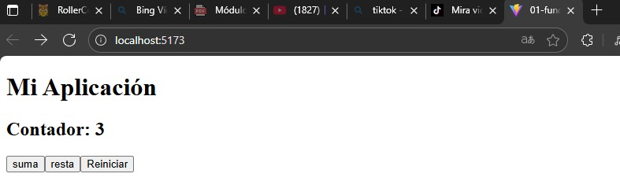
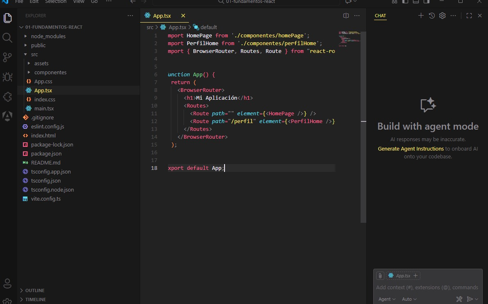
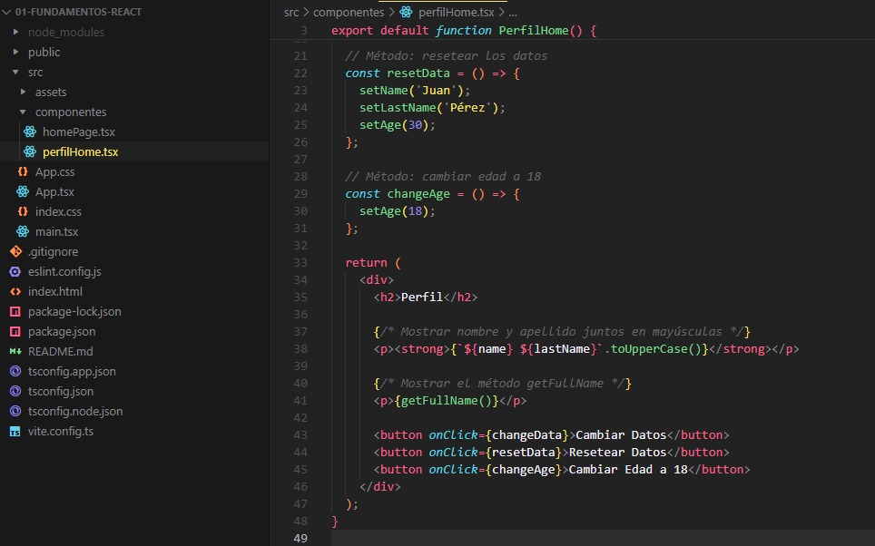
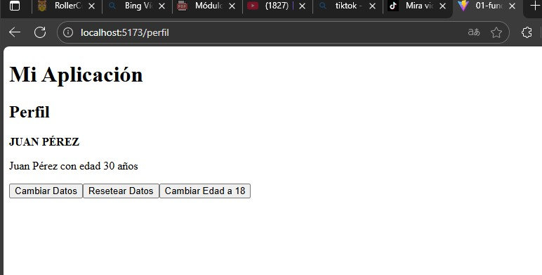

# Programación y Plataformas Web
# Frameworks Web: React

<div align="center">  </div>


## Práctica 1: Instalación y Configuración de React
### Autores 

**Miguel Ángel Vanegas**   
📧 mvanegasp@est.ups.edu.ec  
💻 GitHub: [MiguelV145](https://github.com/MiguelV145)  
**Jose Vanegas**  
📧 jvanegasp1@est.ups.edu.ec   
💻 GitHub: [josevac1](https://github.com/josevac1) 


## Fudamentos de react

## Fundamentos de React

## ¿Qué es React?

React es una biblioteca de JavaScript de código abierto desarrollada por **Facebook (Meta)** para construir interfaces de usuario interactivas y dinámicas. Se utiliza principalmente para desarrollar **aplicaciones web de una sola página (SPA)** y aplicaciones móviles mediante React Native.
React permite crear componentes reutilizables que representan partes de la interfaz, lo que facilita el mantenimiento y la escalabilidad de los proyectos.

## Características principales de React

1. **Arquitectura basada en Componentes**
   React utiliza componentes como bloques de construcción de la interfaz. Cada componente maneja su propio estado y puede reutilizarse en distintas partes de la aplicación.

2. **Virtual DOM**
   React usa un DOM virtual para mejorar el rendimiento. Cuando los datos cambian, React actualiza solo los elementos necesarios del DOM real, optimizando la renderización.

3. **Unidireccionalidad de Datos (One-way Data Binding)**
   Los datos en React fluyen en una sola dirección: desde los componentes padres hacia los hijos. Esto facilita el control del flujo de información y la depuración.

4. **JSX (JavaScript XML)**
   JSX permite escribir código HTML dentro de JavaScript. Esto hace que la creación de componentes sea más intuitiva y legible.

5. **Hooks**
   Los Hooks (como `useState`, `useEffect`, etc.) permiten utilizar el estado y el ciclo de vida en componentes funcionales, sin necesidad de clases.

6. **React Router**
   Es la herramienta más común para manejar las rutas en React, permitiendo la navegación entre diferentes páginas o vistas dentro de una aplicación SPA.

7. **Compatibilidad con TypeScript**
   React puede usarse con TypeScript para añadir tipado estático, lo que mejora la calidad del código y evita errores en tiempo de ejecución.

---


---

## Componentes

Los componentes son funciones o clases que devuelven una interfaz visual.
Por ejemplo:

```jsx
function Saludo() {
  return <h1>¡Hola, React!</h1>;
}
```

Y se pueden usar en otros componentes como etiquetas HTML:

```jsx
<App>
  <Saludo />
</App>
```

---

## Props y Estado

* **Props**: Son propiedades que se envían de un componente padre a un hijo.
* **State**: Es el estado interno del componente, que puede cambiar durante la ejecución.

Ejemplo con **Hooks**:

```jsx
import { useState } from "react";

function Contador() {
  const [contador, setContador] = useState(0);

  return (
    <div>
      <p>Has hecho clic {contador} veces</p>
      <button onClick={() => setContador(contador + 1)}>Incrementar</button>
    </div>
  );
}
```

---

## Rutas en React

Con **React Router**, puedes definir rutas para navegar entre diferentes vistas:

```jsx
import { BrowserRouter, Routes, Route } from "react-router-dom";
import Home from "./pages/Home";
import Perfil from "./pages/Perfil";

function App() {
  return (
    <BrowserRouter>
      <Routes>
        <Route path="/" element={<Home />} />
        <Route path="/perfil" element={<Perfil />} />
      </Routes>
    </BrowserRouter>
  );
}
```

---

## Hooks más utilizados

1. `useState` → Maneja el estado interno de un componente.
2. `useEffect` → Ejecuta efectos secundarios (por ejemplo, llamadas a APIs).
3. `useContext` → Permite compartir datos entre componentes sin usar props.
4. `useRef` → Accede a elementos del DOM o mantiene valores persistentes.
5. `useNavigate` (React Router) → Navegación programática entre rutas.

---

## Ejemplo de Proyecto

### Creación de un componente

Para crear un nuevo componente en React:

1. Crear un archivo en `src/components/`, por ejemplo `homePage.jsx`.
2. Escribir el siguiente código:

```jsx
import { useState } from 'react';

export default function HomePage() {
  const [count, setCount] = useState(0);

  return (
    <div style={{ textAlign: "left" }}>
      <h2>Contador: {count}</h2>

      <button onClick={() => setCount(count + 1)}>suma</button>
      <button onClick={() => setCount(count - 1)}>resta</button>
      <button onClick={() => setCount(0)}>Reiniciar</button>
    </div>
    );
}
```

3. Importarlo en `App.tsx`:

```tsx
import HomePage from './componentes/homePage';
import PerfilHome from './componentes/perfilHome';
import { BrowserRouter, Routes, Route } from "react-router-dom";


function App() {
  return (
    <BrowserRouter>
      <h1>Mi Aplicación</h1>
      <Routes>
        <Route path="" element={<HomePage />} />
        <Route path="/perfil" element={<PerfilHome />} />
      </Routes>
    </BrowserRouter>
  );
}

export default App;
```

---

## Resultados

<div align="center">
  
</div>!


### Componentes generados:

* `HomePage` → Página principal del sitio.
* `PerfilPage` → Página del perfil del usuario.

Ejemplo de estructura:

```
src/
 ├── components/
 ├── pages/
 │    ├── HomePage.jsx
 │    └── PerfilPage.jsx
 └── App.tsx
```

### Publicación

1. **Construcción del proyecto**

   ```bash
   npm run build
   ```
2. **Subida a GitHub Pages** (con `gh-pages`)

   ```bash
   npm install gh-pages --save-dev
   npm run deploy
   ```

---

### Entrega de Evidencias

1. Captura de `App.tsx`

<div align="center">
  
</div>

### Exlpicación:

En el archivo perfilHome.tsx se crea un componente llamado PerfilHome, que representa la parte del perfil dentro de la aplicación. En este componente hay dos funciones principales: la primera se llama resetData y sirve para volver a poner los datos del usuario con valores predeterminados, por ejemplo el nombre “Juan”, el apellido “Pérez” y la edad “30”. La segunda función se llama changeAge y cambia la edad del usuario a 18 años. En la parte del return, el componente muestra en pantalla un título que dice “Perfil” y luego presenta el nombre y apellido del usuario en mayúsculas, además de mostrar el resultado de una función llamada getFullName(), que probablemente devuelve el nombre completo. Debajo hay tres botones: uno para cambiar los datos, otro para resetearlos, y un tercero que cambia la edad a 18. Cada botón está conectado a una función que se ejecuta cuando se hace clic. En resumen, este componente permite mostrar y modificar los datos del perfil de una persona de manera interactiva.    


       
2. Captura de `PerfilPage.tsx`

<div align="center">
  
</div>

### Exlpicación:

Por otro lado, en el archivo App.tsx está el componente principal de toda la aplicación. Aquí se importan los componentes HomePage y PerfilHome, además de las herramientas del paquete react-router-dom que sirven para manejar las rutas y moverse entre páginas sin recargar la aplicación. Dentro de la función App, se utiliza BrowserRouter para indicar que la aplicación tendrá navegación. Luego se muestra un título que dice “Mi Aplicación” y se definen las rutas con Routes y Route. En este caso hay dos rutas: una vacía (path="") que muestra el componente HomePage, y otra llamada /perfil que muestra el componente PerfilHome. Finalmente, el componente App se exporta para poder ser usado en el archivo principal main.tsx, que es el que se encarga de mostrar toda la aplicación. En resumen, App.tsx controla las páginas y permite navegar entre la página principal y la página del perfil.


3. Captura de la página desplegada

<div align="center">
  
</div>