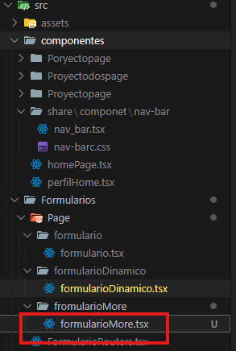
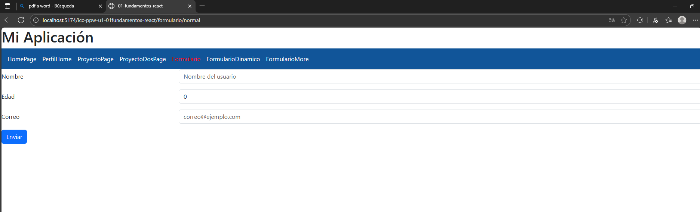
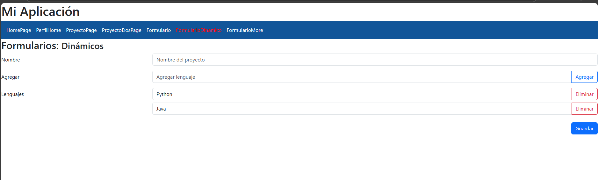
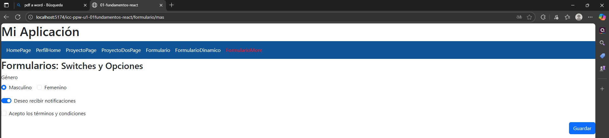
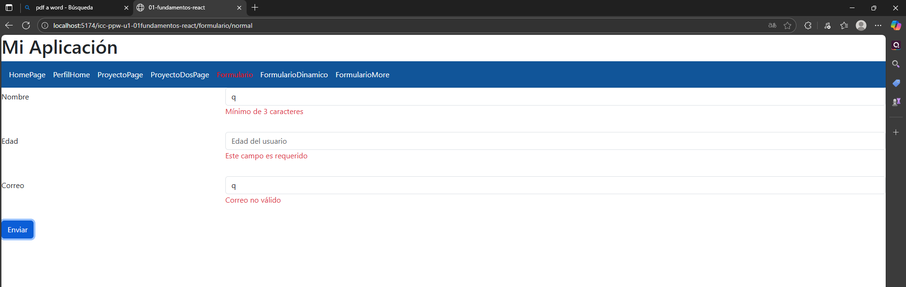
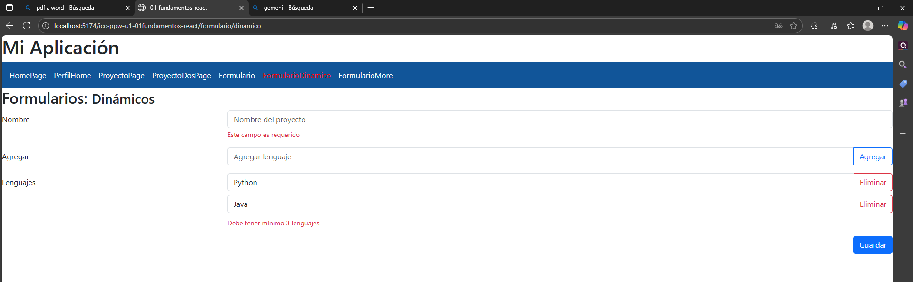
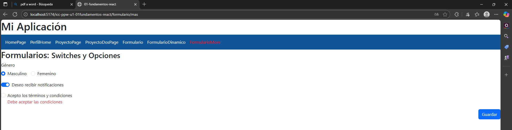
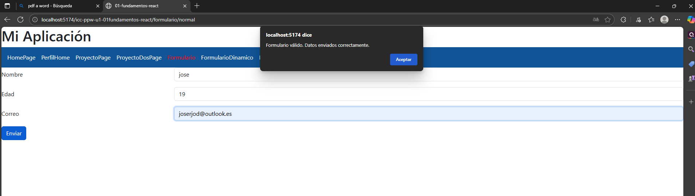
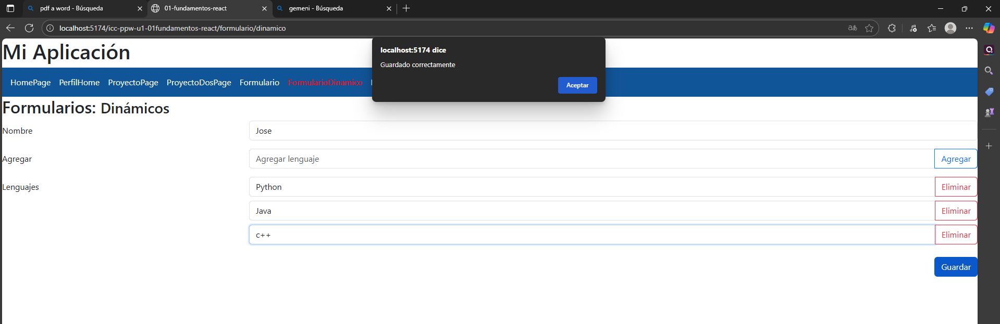
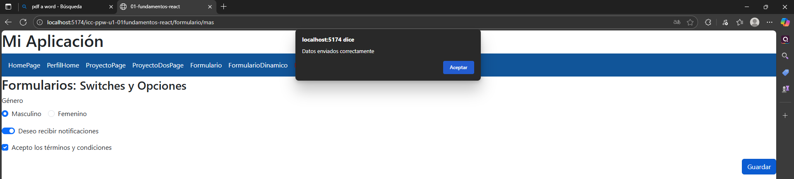

# Programación y Plataformas Web

## Frameworks Web: Angular

<div align="center">  </div>

## Práctica 4: Formularios Reactivos en React

### Autor

*Miguel Ángel Vanegas*   
📧 mvanegasp@est.ups.edu.ec  
💻 GitHub: [MiguelV145](https://github.com/MiguelV145)  
*Jose Vanegas*  
📧 jvanegasp1@est.ups.edu.ec   
💻 GitHub: [josevac1](https://github.com/josevac1)

---

# Introducción a los Formularios en React

En React, el manejo de formularios puede realizarse de dos formas principales: **Componentes Controlados** (usando `useState` para cada campo) o **Componentes No Controlados** (usando referencias).

Sin embargo, para formularios complejos, validados y escalables, el estándar de la industria es utilizar la librería **React Hook Form**. Esta librería es equivalente en potencia a los Reactive Forms de Angular, ofreciendo un rendimiento superior al minimizar los re-renderizados.

## Características principales

* **Rendimiento:** Reduce la cantidad de renderizados al no ligar cada tecla pulsada al estado global del componente.

* **Hooks:** Se basa en el hook `useForm` y `useFieldArray`.

* **Validación:** Soporta validación estándar de HTML y esquemas complejos (como Zod o Yup).

* **Menos código:** Reduce la necesidad de escribir manejadores `onChange` y `value` manualmente.


---

## Tipos de formularios en Angular

| Característica | Controlled Components                       | React Hook Form                                  |
|----------------|----------------------------------------------|--------------------------------------------------|
| Definición     | El estado del formulario vive en React (`useState`) | La librería controla los valores y refs del formulario |
| Control        | El desarrollador controla cada input         | El formulario se gestiona de forma automática y ligera |
| Escalabilidad  | Bueno para formularios pequeños              | Ideal para formularios medianos y grandes        |
| Sincronización | Two-way binding manual con `value` y `onChange` | Registro automático con `register()`             |
| Validaciones   | Se hacen manualmente en el componente        | Validaciones con reglas declarativas o resolvers |
| Performance    | Más renders por cada cambio de input         | Menos renders gracias al uso de refs             |
| Código         | Más verbose, más líneas                      | Más limpio y fácil de mantener                   |
| Manejo de arrays dinámicos | Requiere lógica manual             | `useFieldArray` lo hace muy sencillo            |

---

## Clases principales de los formularios reactivos

| Concepto / Hook        | Descripción                                                | Ejemplo en React                                      |
|------------------------|-------------------------------------------------------------|--------------------------------------------------------|
| **Input Controlado**   | Representa un campo individual usando `useState`.           | `const [nombre, setNombre] = useState('');`            |
| **Form State (useForm)** | Maneja todo el formulario con React Hook Form.             | `const { register, handleSubmit } = useForm();`        |
| **FormGroup → RHF Form State** | Agrupa varios campos dentro del formulario.          | `useForm({ defaultValues: { nombre: '', email: '' }})` |
| **FormArray (useFieldArray)** | Lista dinámica de inputs, similar a FormArray en Angular. | `const { fields, append } = useFieldArray({ name: 'emails' });` |


---

## Validaciones

### Validaciones Sincrónicas

Son validaciones que se ejecutan al momento en que el usuario escribe o intenta enviar el formulario.

Ejemplo en React Hook Form:
```typescript
<input {...register("nombre", {
    required: "Este campo es requerido",
    minLength: { value: 3, message: "Mínimo 3 caracteres" },
    min: { value: 18, message: "Debe ser mayor de edad" },
    pattern: { value: /regex/, message: "Formato inválido" }
})} />
```

### Validaciones Asincrónicas
En React Hook Form se hace mediante una validación personalizada que retorna una promesa.

```typescript
<input
  {...register("username", {
    required: "El usuario es obligatorio",
    validate: async (value) => {
      const existe = await verificarUsuario(value);
      return existe ? "El usuario ya está registrado" : true;
    }
  })}
/>
```

### Propiedades útiles de los controles


| Propiedad RHF        | Significado                                                          |
|----------------------|----------------------------------------------------------------------|
| `watch()`            | Obtiene el valor actual del campo                                   |
| `formState.isValid`  | Indica si el formulario es válido                                    |
| `formState.touchedFields` | Indica si el usuario interactuó con un campo                   |
| `formState.dirtyFields`   | Indica si un campo fue modificado                              |
| `formState.errors`   | Contiene los errores actuales del formulario  

---

## Ventajas de los Formularios Reactivos

1. Control total desde el código JavaScript/TypeScript
Permite manejar validaciones, valores, errores y eventos directamente desde el código, sin depender del HTML.

2. Mayor escalabilidad y mantenibilidad
Ideal para aplicaciones medianas o grandes, ya que separa claramente la lógica del formulario de la vista.

3. Más fáciles de probar y depurar
Al estar controlados por código, los formularios son más simples de testear usando Jest o React Testing Library.

4. Integración sencilla con APIs o servicios externos
Puedes consumir datos, validar en el backend o enviar formularios de manera sencilla.

5. Mejor rendimiento gracias a React Hook Form
React Hook Form evita renders innecesarios, logrando formularios más rápidos y eficientes.
---

##  Preparación del entorno

Antes de comenzar con las prácticas:

1. Asegúrate de tener **Bootstrap 5** agregado en el `index.html`:

   ```html
      <link
      href="https://cdn.jsdelivr.net/npm/bootstrap@5.3.5/dist/css/bootstrap.min.css"
      rel="stylesheet"
      crossorigin="anonymous"
      />
   ```
2. Importa el **ReactiveFormsModule** en cada componente standalone que lo necesite.

---

##  PRÁCTICA 1: Formularios Básicos

Creamos un formulario con campos nombre, edad y correo, aplicando validaciones y mostrando errores.

**Código del Componente** (`Formulario.jsx`)

En lugar de una clase `FormUtils`, en React es idiomático acceder directamente al estado del formulario (`formState: { errors, touchedFields }` ).

---


###  Código del componente

```typescript

export class FormulariosBasicosPage {
  private fb = inject(FormBuilder);
  formUtils = FormUtils;

  myForm: FormGroup = this.fb.group({
    nombre: ['', [Validators.required, Validators.minLength(3)]],
    edad: [0, [Validators.required, Validators.min(18)]],
    correo: ['', [Validators.required, Validators.email]],
  });

  onSubmit() {
    if (this.myForm.invalid) {
      this.myForm.markAllAsTouched();
      return;
    }
    console.log(this.myForm.value);
  }
}
```

#### Explicación

#### useForm

En React, el equivalente es **useForm()**, que inicializa el formulario, define valores por defecto y gestiona validaciones, errores y el envío.

```typescript
const {
  register,
  handleSubmit,
  formState: { errors, touchedFields },
  reset,
} = useForm<FormData>();
```

#### Estado interno del formulario en useForm

En React, `useForm` maneja este estado automáticamente y `register()` conecta cada input al formulario.

```typescript
defaultValues: {
  nombre: "",
  edad: 0,
  correo: ""
}
```
#### Mas funciones

* `<form onSubmit={handleSubmit(onSubmit)}>` → Vincula el formulario del HTML con la lógica del formulario creada en JavaScript/TypeScript mediante React Hook Form.
Todo lo que ocurre en el formulario (inputs, validaciones, errores, envío) queda sincronizado con el estado interno que maneja `useForm()`.

* `<form autoComplete="off">` →
 Evita que el navegador rellene automáticamente campos anteriores. Se usa mucho en formularios con validaciones personalizadas

* `<button type="submit">` →Este botón es el único que dispara handleSubmit ` (onSubmit)`

* El botón con type="submit" es el que activa el evento
(ngSubmit).
* Cualquier otro botón dentro del <form> no ejecutará la


---

### Código del HTML

```tsx
 <div className="row">
      <div className="col">
        <form autoComplete="off" onSubmit={handleSubmit(onSubmit)}>
          
          {/* Campo Nombre */}
          <div className="mb-3 row">
            <label className="col-sm-3 col-form-label">Nombre</label>
            <div className="col-sm-9">
              <input
                type="text"
                className="form-control"
                placeholder="Nombre del usuario"
                {...register("nombre", {
                  required: "Este campo es requerido",
                  minLength: { value: 3, message: "Mínimo de 3 caracteres" }
                })}
              />

              {errors.nombre && touchedFields.nombre && (
                <p className="text-danger">{errors.nombre.message}</p>
              )}
            </div>
          </div>

          {/* Campo Edad */}
          <div className="mb-3 row">
            <label className="col-sm-3 col-form-label">Edad</label>
            <div className="col-sm-9">
              <input
                type="number"
                className="form-control"
                placeholder="Edad del usuario"
                {...register("edad", {
                  required: "Este campo es requerido",
                  min: { value: 1, message: "Edad mínima 1" }
                })}
              />
              {errors.edad && touchedFields.edad && (
                <p className="text-danger">{errors.edad.message}</p>
              )}
            </div>
          </div>

          {/* Campo Correo */}
          <div className="mb-3 row">
            <label className="col-sm-3 col-form-label">Correo</label>
            <div className="col-sm-9">
              <input
                type="email"
                className="form-control"
                placeholder="correo@ejemplo.com"
                {...register("correo", {
                  required: "El correo es obligatorio",
                  pattern: {
                    value: /^[^\s@]+@[^\s@]+\.[^\s@]+$/,
                    message: "Correo no válido"
                  }
                })}
              />

              {errors.correo && touchedFields.correo && (
                <p className="text-danger">{errors.correo.message}</p>
              )}
            </div>
          </div>

          {/* Botón */}
          <button type="submit" className="btn btn-primary">
            Enviar
          </button>
        </form>
      </div>
    </div>
```

---

#### Explicación

En React, cuando escribes un formulario con `<form onSubmit={handleSubmit(onSubmit)}>`, estás conectando directamente el formulario HTML con la lógica que maneja React Hook Form. Esto significa que todo lo que ocurre dentro del formulario—los cambios en los inputs, las validaciones, los errores y el envío final—queda sincronizado con el estado interno que administra `useForm()`. El atributo `autocomplete="off"` evita que el navegador complete los campos automáticamente, manteniendo control total sobre la entrada del usuario. Dentro del `<form>`, solo el botón con type="submit" desencadena el envío, mientras que cualquier otro botón no ejecutará el formulario a menos que también tenga ese tipo. En conjunto, estos elementos permiten que React maneje formularios de manera controlada, ordenada y completamente sincronizada con tu lógica de JavaScript/TypeScript.

## Clase auxiliar FormUtils

En proyectos de Angular con múltiples formularios, es común repetir la misma lógica de validación:
verificar si un campo es válido, mostrar los mensajes de error y traducir los tipos de error a textos comprensibles.
Para evitar esta repetición y mantener el código limpio, se recomienda centralizar toda la lógica de validación en una clase utilitaria.


### ¿Por qué crear una clase `React hook `?

En React, especialmente cuando se trabaja con múltiples formularios usando React Hook Form, también es común repetir lógica como:

* revisar si un campo tiene error,

* obtener el mensaje correcto,

* convertir los tipos de error de las validaciones a textos entendibles.

Para evitar repetir estas funciones en cada formulario, también es recomendable crear una utilidad centralizada, igual que en Angular, pero adaptada al estilo de React.

```tsx
  {errors.nombre && touchedFields.nombre && (
                <p className="text-danger">{errors.nombre.message}</p>
              )}
```

---

### Código base de la clase `FormUtils`

```typescript
import { useForm } from "react-hook-form";

interface FormData {
  nombre: string;
  edad: number;
  correo: string;
}

export const Formulario = () => {
  const {
    register,
    handleSubmit,
    formState: { errors, touchedFields },
    reset
  } = useForm<FormData>({
    defaultValues: {
      nombre: "",
      edad: 0,
      correo: ""
    }
  });
    const onSubmit = (data: FormData) => {
    console.log("Datos del formulario:", data);
    alert("Formulario válido. Datos enviados correctamente.");
    reset();
  };

```

---

###  Beneficios directos en la práctica

| Beneficio          | Descripción                                                      |
| ------------------ | ---------------------------------------------------------------- |
| **Centralización** | Todos los mensajes de error se controlan desde una sola clase.   |
| **Reutilización**  | Se puede usar en cualquier componente importando la clase.       |
| **Escalabilidad**  | Facilita agregar validaciones personalizadas o asincrónicas.     |
| **Legibilidad**    | Simplifica el HTML y el código TypeScript.                       |
| **Mantenimiento**  | Un solo cambio afecta a toda la aplicación de forma consistente. |

---

###  En la plantilla del formulario

El uso de esta clase es simple y uniforme en todas las páginas:

```tsx
 {errors.correo && touchedFields.correo && (
 <p className="text-danger">{errors.correo.message}</p>
)}
}
```

Esto hace que los formularios sean **más expresivos, mantenibles y fáciles de extender** conforme crece el proyecto.


---

Perfecto — continuemos al estilo del material docente, **explicando la práctica 2 paso a paso**, con teoría y razonamiento detrás de cada bloque de código.
Esta sección se integrará directamente después de la práctica 1 en tu documento **04-Formularios.md**.

---

## PRÁCTICA 2: Formularios Dinámicos

En esta práctica aprenderás a crear formularios dinámicos en React, donde el usuario puede agregar y eliminar campos sin límites, utilizando el hook `useFieldArray()` de React Hook Form. Este hook funciona como el equivalente a `FormArray` en Angular y permite manejar listas de valores cuyo tamaño no es fijo. Este tipo de formularios es ideal cuando no sabemos cuántos datos ingresará el usuario, como listas de lenguajes, hobbies, teléfonos, tareas, correos adicionales, entre otros. Con `useFieldArray` puedes construir formularios flexibles, escalables y totalmente controlados desde JavaScript/TypeScript manteniendo una sintaxis limpia y eficiente.


### PASO 1 — Crear el formulario base

En el archivo TypeScript del componente comenzamos con el formulario principal y el campo fijo “nombre”.

```typescript
import { useState } from 'react';
import { useForm, useFieldArray } from 'react-hook-form';

export const FormularioDinamico = () => {
  const [newLenguaje, setNewLenguaje] = useState('');
  
  const { register, control, handleSubmit, formState: { errors } } = useForm({
    defaultValues: {
      name: '',
      lenguajes: [{ name: 'Python' }, { name: 'Java' }]
    }
  });

  const { fields, append, remove } = useFieldArray({
    control,
    name: "lenguajes",
    rules: {
      minLength: 3 
    }
  });

  const onSubmit = (data: unknown) => {
    console.log(data);
  };

  const onAddToLenguajes = () => {
    if (newLenguaje.trim().length < 3) return;
    append({ name: newLenguaje });
    setNewLenguaje('');
  };

  const handleKeyDown = (e: { key: string; preventDefault: () => void; }) => {

    if (e.key === 'Enter') {
      e.preventDefault();
      onAddToLenguajes();
    }
  };

  return (
    <div>
      <h2>Formularios: <small>Dinámicos</small></h2>
      
      <form autoComplete="off" onSubmit={handleSubmit(onSubmit)}>
        
        <div className="mb-3 row">
          <label className="col-sm-3 col-form-label">Nombre</label>
          <div className="col-sm-9">
            <input
              className="form-control"
              placeholder="Nombre del proyecto"
              {...register('name', { 
                required: 'Este campo es requerido', 
                minLength: { value: 3, message: 'Mínimo 3 caracteres' } 
              })}
            />
            {errors.name && (
              <span className="form-text text-danger">{errors.name.message}</span>
            )}
          </div>
        </div>

        <div className="mb-3 row">
          <label className="col-sm-3 col-form-label">Agregar</label>
          <div className="col-sm-9">
            <div className="input-group">
              <input
                className="form-control"
                placeholder="Agregar lenguaje"
                value={newLenguaje}
                onChange={(e) => setNewLenguaje(e.target.value)}
                onKeyDown={handleKeyDown}
              />
              <button
                className="btn btn-outline-primary"
                type="button"
                onClick={onAddToLenguajes}
              >
                Agregar
              </button>
            </div>
          </div>
        </div>

        <div className="mb-3 row">
          <label className="col-sm-3 col-form-label">Lenguajes</label>
          <div className="col-sm-9">
            {fields.map((item, index) => (
              <div key={item.id}>
                <div className="input-group mb-2">
                  <input 
                    className="form-control" 
                    {...register(`lenguajes.${index}.name`, { required: true })}
                  />
                  <button
                    className="btn btn-outline-danger"
                    type="button"
                    onClick={() => remove(index)}
                  >
                    Eliminar
                  </button>
                </div>
                {errors.lenguajes?.[index]?.name && (
                   <span className="form-text text-danger">Campo requerido</span>
                )}
              </div>
            ))}

            {errors.lenguajes && errors.lenguajes.root && (
               <span className="form-text text-danger">Debe tener mínimo 3 lenguajes</span>
            )}
            {errors.lenguajes && errors.lenguajes.type === "minLength" && (
               <span className="form-text text-danger">Debe tener mínimo 3 lenguajes</span>
            )}
          </div>
        </div>
        
        <div className="row">
            <div className="col">
                 <button type="submit" className="btn btn-primary float-end">Guardar</button>
            </div>
        </div>

      </form>
    </div>
  );
};
```

####  Explicación

Este componente implementa un **formulario dinámico** usando `React Hook Form` y `useFieldArray`, lo que permite agregar o eliminar campos sin definirlos de antemano. El formulario comienza con un nombre y una lista inicial de lenguajes, pero el usuario puede añadir más lenguajes escribiéndolos en un campo adicional y presionando un botón o Enter. Cada lenguaje aparece como un input editable con un botón para eliminarlo. Además, se aplican validaciones como mínimo de caracteres y un mínimo de elementos en la lista, mostrando mensajes de error cuando es necesario.
En resumen, este formulario permite manejar colecciones de datos que crecen o disminuyen dinámicamente, manteniendo validaciones, control del estado y una estructura limpia gracias a `React Hook Form`.

---

###  PASO 2 — Control independiente para agregar nuevos lenguajes
Ahora creamos un nuevo control para capturar el texto de un nuevo lenguaje antes de añadirlo al arreglo.

```typescript
className="form-control"
placeholder="Nombre del proyecto"
{...register('name', { 
 required: 'Este campo es requerido', 
minLength: { value: 3, message: 'Mínimo 3 caracteres' } 
})}
```

#### Explicación

El siguiente campo de formulario utiliza react-hook-form para registrar el input bajo el nombre name y aplicar validaciones de manera sencilla. El atributo `register()` conecta el input con el sistema de formularios y define reglas como `required`, que obliga a que el usuario ingrese un valor, y `minLength`, que exige que el texto tenga al menos 3 caracteres; si alguna validación falla, se muestra el mensaje correspondiente. Además, `className="form-control"` aplica los estilos del formulario y `placeholder="Nombre del proyecto"` indica al usuario qué debe escribir dentro del campo.

---

#### En el HTML

```tsx
 <div className="mb-3 row">
          <label className="col-sm-3 col-form-label">Agregar</label>
          <div className="col-sm-9">
            <div className="input-group">
              <input
                className="form-control"
                placeholder="Agregar lenguaje"
                value={newLenguaje}
                onChange={(e) => setNewLenguaje(e.target.value)}
                onKeyDown={handleKeyDown}
              />
              <button
                className="btn btn-outline-primary"
                type="button"
                onClick={onAddToLenguajes}
              >
                Agregar
              </button>
            </div>
          </div>
        </div>
```

####  Explicación html

Este bloque crea una sección del formulario que permite agregar elementos a una lista dinámica, como lenguajes, hobbies o tareas. El campo de texto captura el valor escrito mediante `value={newLenguaje}` y lo actualiza con `onChange`, mientras que `onKeyDown` permite agregar el elemento también presionando Enter. El botón “Agregar” ejecuta la función `onAddToLenguajes`, que incorpora el nuevo valor a la lista principal. Todo está organizado con clases de Bootstrap: el `input-group` alinea el campo y el botón, y las clases de columnas controlan la distribución responsiva del diseño.

---

#### Método que agrega el nuevo lenguaje

```typescript
// Agregar lenguaje dinámicamente
 const onAddToLenguajes = () => {
    if (newLenguaje.trim().length < 3) return;
    append({ name: newLenguaje });
    setNewLenguaje('');
  };
```

##### Explicación

1. Se verifica la validez: Se comprueba que el texto ingresado (`newLenguaje`) tenga al menos 3 caracteres útiles (usando  `.trim()` para ignorar espacios vacíos). Si no cumple, se detiene la ejecución.

2. Se agrega al array: Si es válido, se usa la función `append` (de `useFieldArray`) para insertar un nuevo objeto con el dato en el listado de lenguajes.

3. Se limpia el campo: Finalmente, se actualiza el estado local (`setNewLenguaje('')`) para borrar el texto del input temporal y dejarlo listo para el siguiente ingreso.

---

#### Getter para acceder al arreglo de lenguajes

```typescript
const { fields, append, remove } = useFieldArray({
  control,
  name: "lenguajes", // <--- Aquí le dices a qué parte del formulario conectarse
  rules: {
    minLength: 3 
  }
});
```

##### Explicación

La variable `fields` que obtienes de `useFieldArray`  contiene la lista actual y sincronizada de los elementos. Es la variable que utilizas en el HTML (TSX) para recorrer y pintar cada uno de los inputs en la pantalla.

---

### PASO 3 — Listado dinámico de lenguajes

Ahora agregamos la sección que muestra la lista actual de lenguajes y permite eliminarlos.

#### En el HTML
```html
 <div className="mb-3 row">
          <label className="col-sm-3 col-form-label">Lenguajes</label>
          <div className="col-sm-9">
            {fields.map((item, index) => (
              <div key={item.id}>
                <div className="input-group mb-2">
                  <input 
                    className="form-control" 
                    {...register(`lenguajes.${index}.name`, { required: true })}
                  />
                  <button
                    className="btn btn-outline-danger"
                    type="button"
                    onClick={() => remove(index)}
                  >
                    Eliminar
                  </button>
                </div>
                {errors.lenguajes?.[index]?.name && (
                   <span className="form-text text-danger">Campo requerido</span>
                )}
              </div>
            ))}

            {errors.lenguajes && errors.lenguajes.root && (
               <span className="form-text text-danger">Debe tener mínimo 3 lenguajes</span>
            )}
            {errors.lenguajes && errors.lenguajes.type === "minLength" && (
               <span className="form-text text-danger">Debe tener mínimo 3 lenguajes</span>
            )}
          </div>
        </div>
```

---

#### Explicación

1. `fields.map(...)` recorre el arreglo de controles (`fields`) obtenido del hook useFieldArray para renderizar la lista.

2. `key={item.id}` es obligatorio en React Hook Form; usa un ID interno único para rastrear cada fila correctamente (no se debe usar el índice aquí).

3. `register(...)` asocia cada input construyendo dinámicamente su nombre usando el índice (ej: `lenguajes.0.name`).

4. `onClick={() => remove(index)}` ejecuta la función `remove` del hook para eliminar el elemento en esa posición específica.

5. `{errors.lenguajes?.[index]?.name && ...}` verifica y muestra el error específico de ese input individual si existe.

6. Al final, `errors.lenguajes` (root o type) verifica si hay un error global en el arreglo (como no cumplir el mínimo de 3 elementos).

---

### PASO 4 — Métodos finales

```typescript
// Eliminar lenguaje
<button
  className="btn btn-outline-danger"
  type="button"
  onClick={() => remove(index)}  
>
  Eliminar
</button>

// Enviar
const onSubmit = (data) => {
  console.log(data); // <--- ESTO EQUIVALE AL console.log(this.myForm.value)
};

// En la etiqueta form
<form autoComplete="off" onSubmit={handleSubmit(onSubmit)}>
```

#### Explicación

* **`removeAt(index)`** elimina el elemento en la posición indicada del FormArray.
* **`markAllAsTouched()`** marca todos los campos como “tocados” para forzar la visualización de los errores antes del envío.
* El formulario completo se imprime en consola con `this.myForm.value`.

---

### PASO 5 — Métodos genéricos para FormArray

En React con React Hook Form, no necesitas crear métodos genéricos (`isValidFieldInArray` o `getFieldErrorInArray`) en una clase externa.

Toda esa lógica se reemplaza por el acceso directo al objeto de errores dentro de tu TSX (HTML).

```typescript
{errors.name && (
<span className="form-text text-danger">{errors.name.message}</span>
)}
```

#### Explicación

* `errors.name &&`: Comprueba si existe un error registrado para el campo name (lo que implica que falló la validación y el estado del formulario permite mostrarlo). Actúa como un condicional: si el error existe, permite que se renderice el elemento `<span>`.

* `errors.name.message`: Devuelve el texto del mensaje de error específico que se definió dentro de la función `register`, eliminando la necesidad de buscar o traducir el código de error manualmente.

---

### RESUMEN GENERAL
| Concepto | Descripción |
| :--- | :--- |
| **useFieldArray** | Hook que permite manejar listas dinámicas (agregar/eliminar filas). Equivalente a `FormArray`. |
| **useState** | Estado local temporal (`newLenguaje`) para capturar valores antes de insertarlos en el formulario. |
| **fields** | Variable obtenida de `useFieldArray` que contiene la lista actual para recorrerla en el JSX. |
| **.map() y &&** | Métodos nativos de JavaScript usados en JSX para iterar listas y mostrar contenido condicionalmente. |
| **Objeto errors** | Contiene directamente los mensajes de error definidos en `register`, eliminando la necesidad de utilidades externas. |
---


Perfecto.
Aquí tienes la nueva sección lista para integrarse a tu documento **04-Formularios.md**, justo después de la **Práctica 2: Formularios Dinámicos**, manteniendo el mismo estilo formal, sin emojis y con explicación paso a paso.

---

## PRÁCTICA 3: Formularios con Switches, Checkboxes y Radios

En esta práctica se desarrolla un formulario que utiliza controles booleanos y de selección: interruptores, casillas de verificación y botones de opción.
Estos tipos de campos permiten al usuario definir configuraciones o preferencias de manera sencilla.

---

### PASO 1. Crear el componente y definir el formulario

Se crea un nuevo archivo llamado `formularioMore.tsx` dentro de la carpeta de componentes.

Luego se configura el hook `useForm` definiendo los valores iniciales (`defaultValues`) para controlar el estado de los inputs desde el principio.

creamos un nuevo ponconente para `formularioMore`asi



Luego se configura el formulario reactivo en el archivo TypeScript.

```typescript
import { useState } from 'react';
import { useForm, useFieldArray } from 'react-hook-form';

export const FormularioDinamico = () => {
  const [newLenguaje, setNewLenguaje] = useState('');
  
  const { register, control, handleSubmit, formState: { errors } } = useForm({
    defaultValues: {
      name: '',
      lenguajes: [{ name: 'Python' }, { name: 'Java' }]
    }
  });

  const { fields, append, remove } = useFieldArray({
    control,
    name: "lenguajes",
    rules: {
      minLength: 3 
    }
  });

  const onSubmit = (data: unknown) => {
    console.log(data);
    alert("Guardado correctamente");
  };

  const onAddToLenguajes = () => {
    if (newLenguaje.trim().length < 3) return;
    append({ name: newLenguaje });
    setNewLenguaje('');
  };

  const handleKeyDown = (e: { key: string; preventDefault: () => void; }) => {
    if (e.key === 'Enter') {
      e.preventDefault();
      onAddToLenguajes();
    }
  };

```

#### Explicación
* **`genero`**: se inicializa en `"M"` para controlar el estado de los botones de opción (*radio buttons*).
* **`notificaciones`**: se inicializa en `true`, representando un interruptor o *switch* activado por defecto.
* **`condiciones`**: inicia en `false`; la lógica `!form.condiciones` actúa como validación obligatoria para exigir que esté marcada.
* El método **`handleSubmit()`** previene la recarga de la página, fuerza la visualización de errores (`setTouched`) y, si todo es válido, muestra los resultados.

---

### PASO 2. Crear la plantilla del formulario

lógica del formulario mediante la función `register` y muestra los mensajes de error utilizando renderizado condicional (`&&`).

```tsx
 <div>
      <h2>Formularios: <small>Dinámicos</small></h2>
      
      <form autoComplete="off" onSubmit={handleSubmit(onSubmit)}>
        
        <div className="mb-3 row">
          <label className="col-sm-3 col-form-label">Nombre</label>
          <div className="col-sm-9">
            <input
              className="form-control"
              placeholder="Nombre del proyecto"
              {...register('name', { 
                required: 'Este campo es requerido', 
                minLength: { value: 3, message: 'Mínimo 3 caracteres' } 
              })}
            />
            {errors.name && (
              <span className="form-text text-danger">{errors.name.message}</span>
            )}
          </div>
        </div>

        <div className="mb-3 row">
          <label className="col-sm-3 col-form-label">Agregar</label>
          <div className="col-sm-9">
            <div className="input-group">
              <input
                className="form-control"
                placeholder="Agregar lenguaje"
                value={newLenguaje}
                onChange={(e) => setNewLenguaje(e.target.value)}
                onKeyDown={handleKeyDown}
              />
              <button
                className="btn btn-outline-primary"
                type="button"
                onClick={onAddToLenguajes}
              >
                Agregar
              </button>
            </div>
          </div>
        </div>

        <div className="mb-3 row">
          <label className="col-sm-3 col-form-label">Lenguajes</label>
          <div className="col-sm-9">
            {fields.map((item, index) => (
              <div key={item.id}>
                <div className="input-group mb-2">
                  <input 
                    className="form-control" 
                    {...register(`lenguajes.${index}.name`, { required: true })}
                  />
                  <button
                    className="btn btn-outline-danger"
                    type="button"
                    onClick={() => remove(index)}
                  >
                    Eliminar
                  </button>
                </div>
                {errors.lenguajes?.[index]?.name && (
                   <span className="form-text text-danger">Campo requerido</span>
                )}
              </div>
            ))}

            {errors.lenguajes && (errors.lenguajes.root || errors.lenguajes.type === "minLength") && (
               <span className="form-text text-danger">Debe tener mínimo 3 lenguajes</span>
            )}
          </div>
        </div>
        
        <div className="row">
            <div className="col">
                 <button type="submit" className="btn btn-primary float-end">Guardar</button>
            </div>
        </div>

      </form>
    </div>

```

---

### PASO 3. Funcionamiento de cada control
**1. Botones de opción (`radio`)**
Se asegura que solo uno esté seleccionado mediante la propiedad `checked={form.genero === "VALOR"}`.
Al cambiar, el evento `onChange` actualiza el estado `form.genero` con el valor seleccionado ("M" o "F").

**2. Interruptor o switch (`form-switch`)**
Técnicamente es un *input* de tipo `checkbox` con estilos de Bootstrap.
Su valor es booleano y se controla accediendo a `e.target.checked` en el evento `onChange` para actualizar la propiedad `notificaciones`.

**3. Casilla de verificación (`checkbox`) con validación manual**
A diferencia de los validadores automáticos, aquí la validación se define en la constante `errors`: `!form.condiciones`.
Esto verifica manualmente si el valor es `false` para obligar al usuario a marcar la casilla antes de enviar.

**4. Método `handleSubmit()`**
Al intentar enviar:
1. Previene la recarga de la página (`e.preventDefault()`).
2. Marca todos los campos como "tocados" (`setTouched`) para forzar que aparezcan los mensajes de error rojos en la interfaz.
3. Verifica si existen errores en el objeto `errors`. Si hay alguno, detiene el envío (`return`).
4. Si todo es correcto, muestra la alerta y los datos en consola.

---

### PASO 4. Validación y Gestión de Errores Local

A diferencia de Angular donde usábamos una clase externa `FormUtils`, en este enfoque manual de React definimos la lógica de validación directamente dentro del componente para mantener el control total del estado.

Se crean dos elementos clave para gestionar los mensajes:

```typescript
 const errors = {
    genero: !form.genero ? "Seleccione un género" : null,
    condiciones: !form.condiciones ? "Debe aceptar las condiciones" : null,
  };

  const isInvalid = (field: string) =>
    Boolean(errors[field as keyof typeof errors] && touched[field as keyof typeof touched]);


  const handleSubmit = (e: React.FormEvent) => {
    e.preventDefault();

    setTouched({
      genero: true,
      condiciones: true,
    });

    if (errors.genero || errors.condiciones) return;

    alert("Datos enviados correctamente");
    console.log("Datos enviados:", form);
  };

```

Esta función auxiliar permite condicionar el renderizado de los mensajes de error de forma uniforme, evitando repetir la lógica de comprobación (`errors && touched`) en cada campo del JSX, lo que mantiene el código limpio y legible.

---

### PASO 5. Resultado final

El formulario presenta:

* Dos opciones de género (solo una seleccionable).
* Un interruptor opcional para recibir notificaciones.
* Una casilla obligatoria de aceptación de condiciones.
* Mensajes de error claros cuando los campos no cumplen los requisitos.

El uso de **estado controlado** (`useState`), junto con el renderizado condicional (`&&`) y la función auxiliar `isInvalid`, ofrece un flujo de validación transparente, robusto y coherente con los fundamentos de React.

# Resultados 

1. Tres capturas por cada pagina con los formularios  
  * Pagina formulario vacio

  formulario

  formulario dinamico

  formulario More

  * Pagina fomrualurio mostrar todos los errores
  
  formulario

  formulario dinamico

  formulario More

  * Página formulario enviado correctamente y muestra en listado

  formulario

  formulario dinamico

  formulario More



