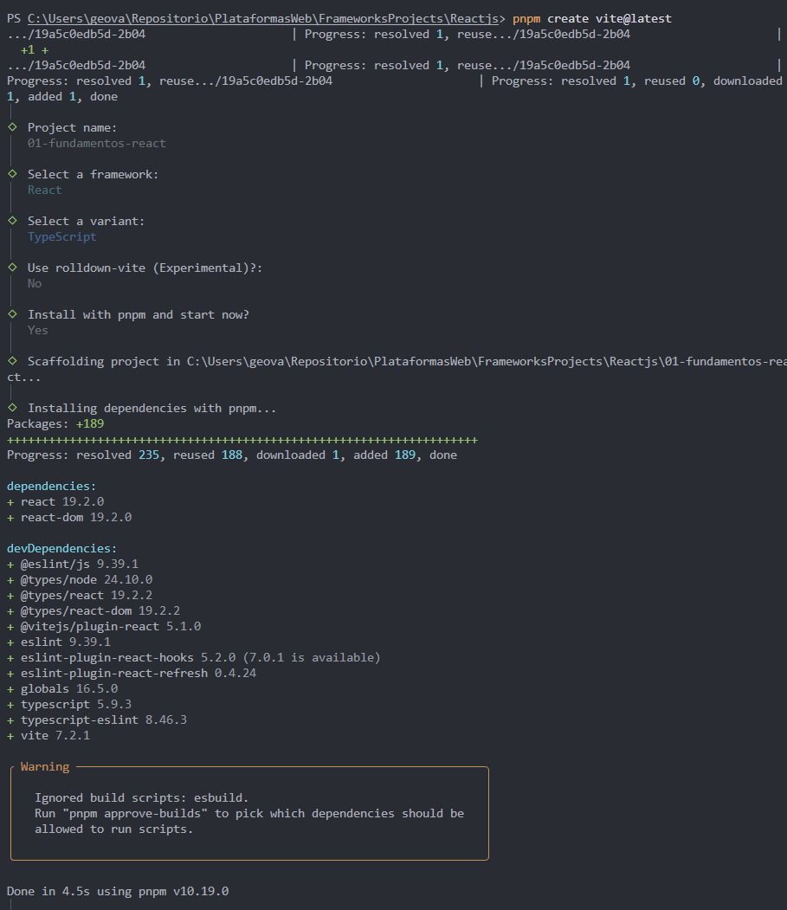
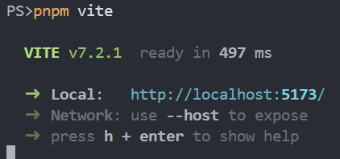
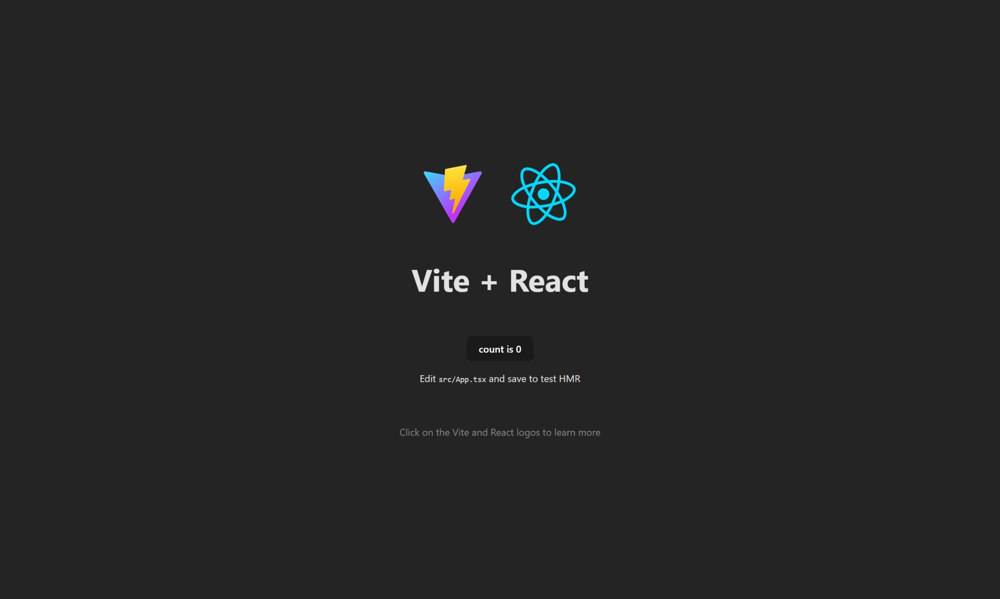
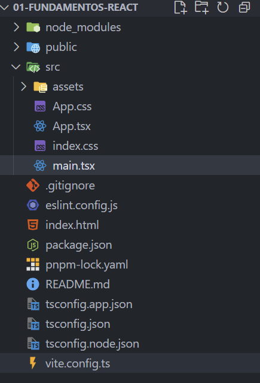

# Programación y Plataformas Web

## Frameworks Web: React JS

<div align="center">
  
</div>

## Practica 1: Instalación y Configuración de Angular

### Autores

**Geovanni Zúñiga**
📧 gzunigag@est.ups.edu.ec  
💻 GitHub: [Geovanni](https://github.com/nnyez)

## Creación de un Proyecto con React

Crear un nuevo proyecto react:

```bash
pnpm create vite@latest
```

Es necesario instalar los paquetes necesarios para ejecutar:

```bash
pnpm i
```

Para ejecutar la aplicación en modo desarrollo:

```bash
pnpm vite
```

Ejecutar la aplicación para que sea accesible desde otras máquinas en la red local:

```bash
pnpm run dev -- --host 0.0.0.0 --port 4200
```

---

## Extensiones recomendadas para VSCode (Angular)

Estas extensiones potencian el desarrollo con Angular:

* **[ES7 + React/Redux/React-Native snippets](https://marketplace.visualstudio.com/items?itemName=dsznajder.es7-react-js-snippets)** Fragmentos de código para React (componentes, servicios, etc.).

* **[Material Icon Theme](https://marketplace.visualstudio.com/items?itemName=PKief.material-icon-theme)** – Iconos personalizados para archivos Angular.

* **[Prettier - Code Formatter](https://marketplace.visualstudio.com/items?itemName=esbenp.prettier-vscode)** – Formato automático del código.

* **[ESLint](https://marketplace.visualstudio.com/items?itemName=dbaeumer.vscode-eslint)** – Estilo de código consistente con .

* **[Auto Close Tag](https://marketplace.visualstudio.com/items?itemName=formulahendry.auto-close-tag)** - Cierre automático de etiquetas HTML.

* **[Auto Rename Tag](https://marketplace.visualstudio.com/items?itemName=formulahendry.auto-rename-tag)** - Renombrado automático de etiquetas en pares.

* **[Paste JSON as Code](https://marketplace.visualstudio.com/items?itemName=quicktype.quicktype)** - Convierte JSON en interfaces TypeScript.

* **[TypeScript importer (opcional)](https://marketplace.visualstudio.com/items?itemName=pmneo.tsimporter)** - Importación automática de módulos.

---

## Hoja de Atajos – React/Vite

### Comandos básicos

 Atajo corto: `ng g c` = `ng generate component`

```bash
pnpm create vite@latest      # Crear un nuevo proyecto React con Vite
pnpm install                 # Instalar dependencias
pnpm vite                 # Iniciar servidor de desarrollo
pnpm build               # Compilar la aplicación para producción
pnpm preview             # Previsualizar el build en local
pnpm lint                # Revisar errores de estilo o sintaxis
```

#### Estructura creada automáticamente

```bash
📁01-fundamentos-react #carpeta raíz
└── 📁public #Carpeta de recursos estáticos
└── 📁src #Carpeta que contiene la aplicación
    └── 📁assets #Carpeta de recursos procesados en la aplicación
    ├── App.tsx #Componente raíz de la aplicación
    ├── index.css #Contiene los estilos globales
    ├── main.tsx #Archivo de inicialización de la aplicación
├── index.html #Plantilla inicial del proyecto
└── vite.config.ts #Configuración de Vite
```

### Entornos

En **Vite + React**, los entornos se manejan mediante **archivos `.env`** en lugar de los `environment.ts` de Angular.
Estos archivos permiten definir variables específicas para cada entorno (desarrollo, producción, pruebas, etc.).

#### 📄 Archivos comunes

* `.env` → Variables generales.
* `.env.development` → Variables solo para desarrollo.
* `.env.production` → Variables solo para producción.

### Ayuda y documentación

```bash
pnpm vite --help
pnpm run dev -- --help
```

---
Capturas de pantalla como evidencia del proceso de instalación y configuración de Angular, así como explicaciones detalladas de los componentes y formularios utilizados en la práctica.

## Resultados

Capturas de pantalla como evidencia del proceso de instalación y configuración de Angular, así como explicaciones detalladas de los componentes y formularios utilizados en la práctica.

### 1. Creación del proyecto React/Vite

Se crea un nuevo proyecto Angular llamado `01-fundamentos-react` utilizando el comando `pnpm create vite@latest`. y lo levantamos con `pnpm vite`

```bash
pnpm create vite@latest 
```

 Configuración inicial del proyecto:

* Ingresamos el nombre del proyecto.

* Seleccionamos Framework.

* Seleccionamos lenguaje de desarrollo.

* No aceptamos el uso de rolldown-vite, un empaquetador experimental.+

* Aceptamos la instalación de los módulos usando pnpm.



### 2. Proyecto corriendo en el navegador

utilizamos `pnpm vite` para iniciar el servidor de desarrollo.




### 4. Explicación de la estructura del proyecto



#### Carpetas y archivos principales

| 📁 / 📄 Archivo / Carpeta | Descripción breve                                                   |
| ------------------------- | ------------------------------------------------------------------- |
| **📁 public/**            | Archivos estáticos accesibles directamente (no pasan por el build). |
| **📁 node_modules/**      | Carpeta que contiene las dependencias del proyecto.                 |
| **📁 src/**               | Código fuente principal de la aplicación.                           |
| **eslint.config.js**      | Configuración de ESLint (revisión de código).                       |
| **index.html**            | Página base, plantilla donde React se monta.                        |
| **package.json**          | Información del proyecto y dependencias.                            |
| **pnpm-lock.yaml**        | Control de versiones exactas de dependencias.                       |
| **tsconfig.app.json**     | Configuración TypeScript específica para la app.                    |
| **tsconfig.json**         | Configuración principal de TypeScript.                              |
| **tsconfig.node.json**    | Configuración para scripts de Node.                                 |
| **vite.config.ts**        | Configuración de Vite (build, servidor, plugins, etc.).             |

### Carpeta de código SRC

Dentro de la carpeta `src`, encontramos las siguientes subcarpetas y archivos importantes:

| 📁 / 📄 Archivo / Carpeta | Descripción breve                                                   |
| -------------------------  | ------------------------------------------------------------------- |
| **📁 assets**             | Imágenes, íconos u otros recursos importados dentro del código.     |
| **App.css**               | Estilos del componente principal `App.tsx`.                         |
| **App.tsx**               | Componente raíz de la aplicación React.                             |
| **index.css**             | Estilos globales para toda la aplicación.                           |
| **main.tsx**              | Punto de entrada: renderiza `App` en el DOM.                        |
