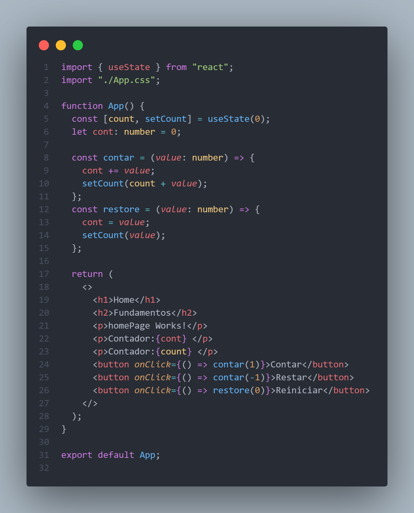
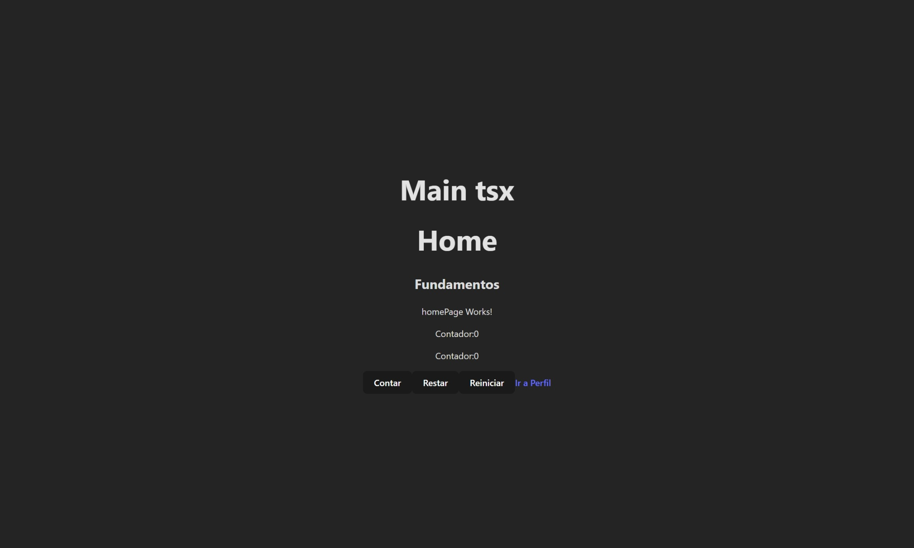
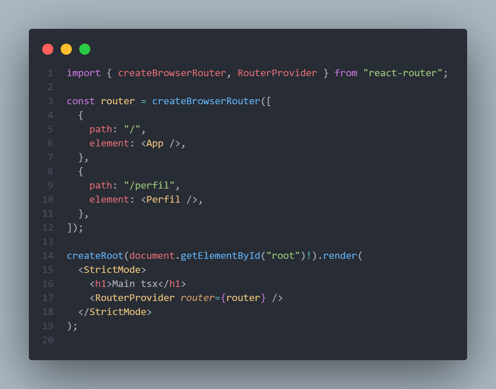
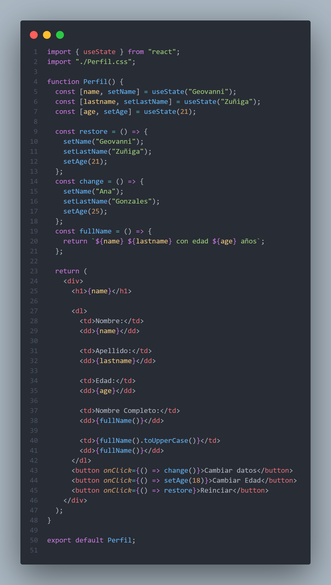

# Programación y Plataformas Web

## Frameworks Web: React JS

  

## Practica 1: Instalación y Configuración de Angular

### Autores

**Geovanni Zúñiga**
📧 gzunigag@est.ups.edu.ec  
💻 GitHub: [Geovanni](https://github.com/nnyez)

## Fundamentos de React

## ¿Qué es React?

React es una librería de JavaScript diseñada para construir interfaces de usuario de una forma modular. Inicialmente desarrollado por Facebook (Meta).

Permite crear aplicaciones mediante uso de componentes reutilizables lo que facilita el mantenimiento y escalabilidad del código.

React puede usarse solo o integrado con diferentes frameworks como puede ser Next.js, en esta práctica se utilizo vite para crear una aplicación React simple.

## Características principales de React

1. **Componentes**
   React organiza la interfaz en componentes reutilizables, cada uno con su lógica, estilos y estructura.

2. **JSX + TSX**
   Permite escribir código HTML dentro de JavaScript o TypeScript, facilitando la creación de interfaces dinámicas. Utilizando TypeScript mejora a la detección de errores gracias al tipado estático y su validación de tipos.

3. **Unidireccionalidad de datos**
   Los datos fluyen de padres a hijos (de arriba hacia abajo), lo que facilita el control y depuración del estado.

4. **Virtual DOM**
   React utiliza una copia virtual del DOM para aplicar solo los cambios necesarios, mejorando el rendimiento.

5. **Hooks**
   Son funciones especiales como `useState` o `useEffect` que son las más conocidas, que permiten manejar el estado y efectos secundarios sin clases.

6. **Ecosistema flexible**
   React no impone estructura, al ser una librería puede combinarse fácilmente con diferentes herramientas según las necesidades del proyecto.

---

## Rutas

React por si solo no contiene una manera de navegar a traves de rutas, por lo tanto es necesario instalar un paquete extra para poder manejarlas.

La librería mas utilizada es **React Router**.

para instalar se utiliza `pnpm i react-router`.

## Componentes de React

Un **componente** es una función que devuelve elementos TSX. Lo que permite crear varios independientes y ser reutilizables. También es posible usar un componente dentro de otro independientemente. Asimismo es posible dar estilo a cada componente individual.

1. **Archivo TSX**: Define la lógica y el comportamiento del componente utilizando TypeScript.

2. **Archivo CSS**: Define la apariencia visual del componente.

## Hooks

Existen una gran variedad de **Hooks** que permiten agregar funcionalidades a los componentes además de manejar el estado y el ciclo de vida de los componentes.

## Props (Properties)

Es la manera en que los componentes de React reciben datos desde su componente padre. Lo que permite la reutilización para diferentes datos.

## Resultados

### Creación de un componente

Para crear un componente se crea un archivo con extension `tsx`. En este caso el archivo App es un componente ya generado.

### Componentes 

#### 1. `app.routes.ts`

Luego de instalar la librería se tiene que crear el árbol de rutas, para eso se utiliza `createBrowserRouter` que contiene el `json` de las rutas disponibles. Luego agregar el componente `RouterProvider` y de parámetro pasar el `json` creado antes. Esto simplifica la navegación

#### 2. Captura de `perfilPage.ts`

Este codigo utiliza el `hook` mas comun, el `useState` utilizado para cambiar el estado de una variable, este tiene por definicion una funcion para cambiar el valor de la variable ademas de la variable ya utilizable.

#### 3. Captura de la pagina desplegada