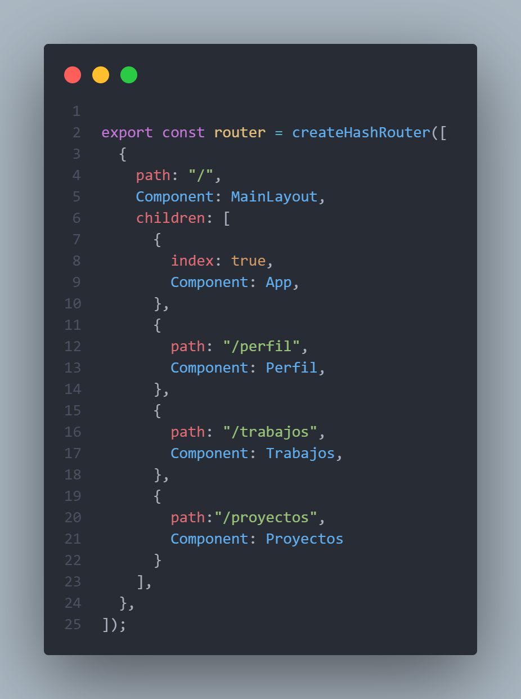
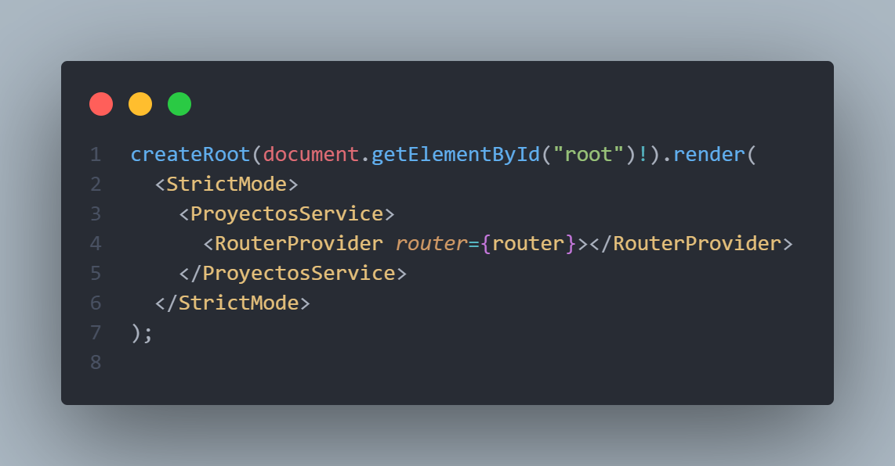
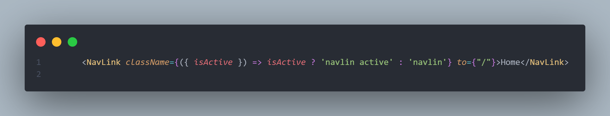
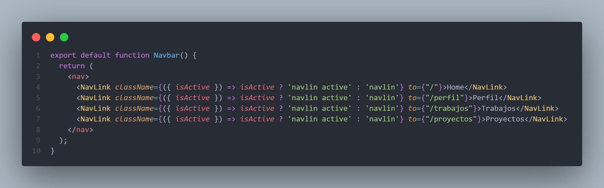
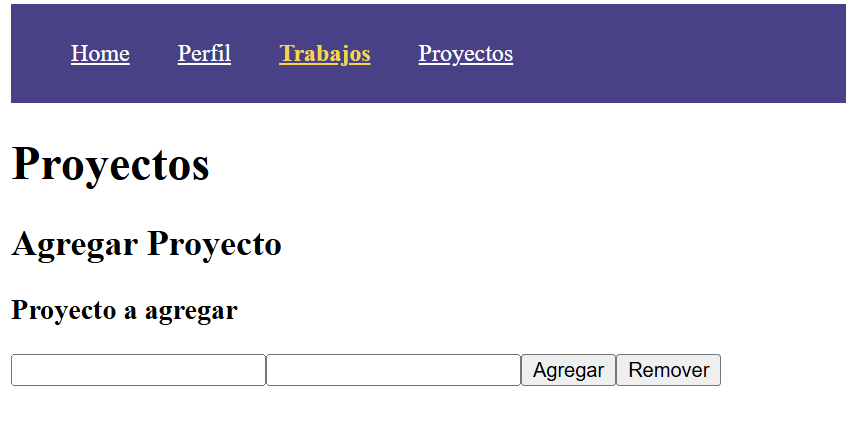
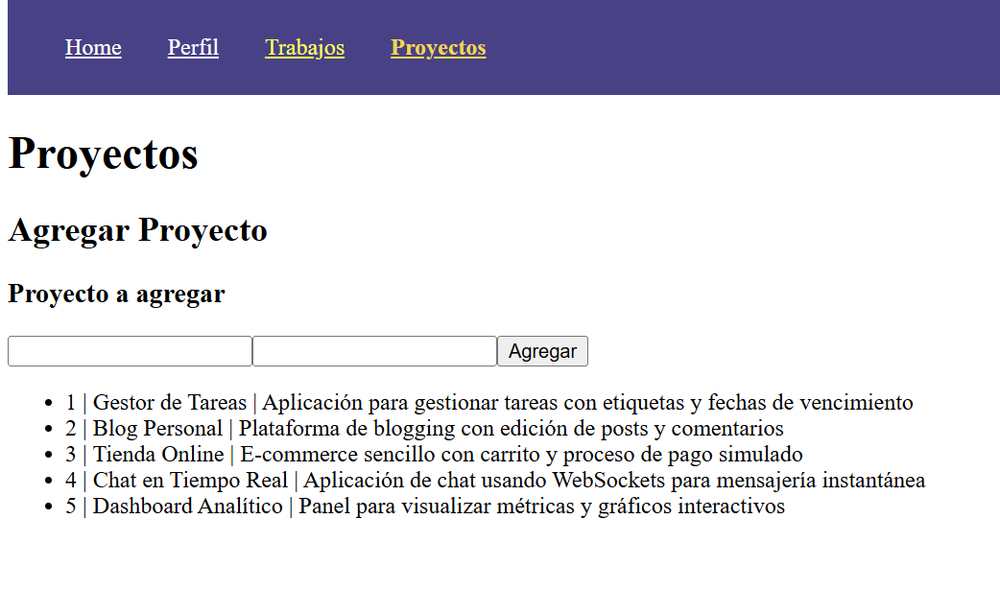

# Programación y Plataformas Web

## Frameworks Web: React JS

<div align="center">
  
</div>

## Practica 1: Instalación y Configuración de Angular

### Autores

**Geovanni Zúñiga**
📧 gzunigag@est.ups.edu.ec  
💻 GitHub: [Geovanni](https://github.com/nnyez)

## 🧭 Navegación en React

La navegación en React no utiliza etiquetas tradicionales `<a href="">`,
ya que éstas recargan toda la página. React emplea componentes como
`<Link>` y `<NavLink>` del paquete **react-router** para crear
aplicaciones SPA.

## 🔄 Por qué NO usar `href`

## ❌ Navegación Tradicional

```html
<a href="/perfil">Ir al Perfil</a> <a href="/productos">Ver Productos</a>
```

Problemas:

- Recarga completa

- Se pierde el estado

- No es SPA

## ✅ Navegación Correcta en React

```typescript
import { NavLink } from "react-router";

<NavLink to={"/perfil"}>Ir al Perfil</NavLink>
<NavLink to={"/productos"}>Ver Productos</NavLink>
```

Ventajas:

- Navegación sin recargar

- Mantiene el estado

- Fluida y rápida

## 📚 Componentes en React

React se basa únicamente en componentes.

### 1. Componente Funcional

```typescript
function Home() {
  return <h1>Bienvenido a React</h1>;
}
```

### 2. Componente con Props

Cuando se utiliza `typescript` es necesario crear una interface que contenga todos los datos que se piensa transportar.

```typescript
export interface ProductoProps {
  nombre: string;
}
```

```typescript
function Producto({ nombre }: ProductoProps) {
  return <p>{nombre}</p>;
}
```

### 3. Hooks

```typescript
import { useState } from "react";

const [contador, setContador] = useState(0);
```

## 🔗 React Router: Formas de Navegar

### 1. Usando `<NavLink>` {#usando-link .unnumbered}

```typescript
<NavLink to="/productos">Productos</NavLink>
```

### 2. Navegación Programática

```typescript
import { useNavigate } from "react-router";

export function useLogoutAfterInactivity() {
  let navigate = useNavigate();

  useFakeInactivityHook(() => {
    navigate("/logout");
  });
}
```

### 3. Enrutamiento con objetos

```typescript
import { createBrowserRouter, useLoaderData } from "react-router";

createBrowserRouter([
  {
    path: "/teams/:teamId",
    loader: async ({ params }) => {
      let team = await fetchTeam(params.teamId);
      return { name: team.name };
    },
    Component: Team,
  },
]);

function Team() {
  let data = useLoaderData();
  return <h1>{data.name}</h1>;
}
```

## Ejemplos Prácticos

Uso de `NavLink`, `Link` y Navegación con objetos.

```typescript
import { NavLink, Routes, Route, useNavigate } from "react-router-dom";
import Producto from "./Producto";

export default function App() {
  const navigate = useNavigate(); // Para navegación programática

  // Función que envía un objeto usando "state"
  const enviarObjeto = () => {
    navigate("/producto/10", {
      state: { nombre: "Laptop Lenovo", precio: 1200 },
    });
  };

  return (
    <div style={{ padding: 20 }}>
      <h1>Ejemplo React Router</h1>
      /// Navegación usando NavLink (resalta el link activo)
      <nav style={{ display: "flex", gap: 10 }}>
        <NavLink to="/">Home</NavLink>
        <NavLink to="/producto/5">Producto 5</NavLink>
      </nav>
      <h2>Home</h2>
      /// Navegación programática: usa navigate()
      <button onClick={() => navigate("/producto/99")}>
        Ir al producto 99
      </button>
      /// Se envía un objeto con "state"
      <button onClick={enviarObjeto}>Ir al producto 10 (con objeto)</button>
      /// Declaración de rutas
      <Routes>
        /// Ruta con parámetro dinámico :id
        <Route path="/producto/:id" element={<Producto />} />
      </Routes>
    </div>
  );
}
```

En el siguiente componente se indica como usar los parametros que pasamos a traves de la ruta.

```typescript
import { useParams, useLocation } from "react-router-dom";

export default function Producto() {
  // Lee el parámetro dinámico de la URL
  const { id } = useParams();

  // Lee el objeto enviado mediante "state" (opcional)
  const location = useLocation();
  const data = location.state as
    | { nombre?: string; precio?: number }
    | undefined;

  return (
    <div style={{ marginTop: 20 }}>
      <h2>Producto {id}</h2>
      // Si se pasó un objeto, se muestra; si no, mensaje
      {data ? (
        <div>
          <p>Nombre: {data.nombre}</p>
          <p>Precio: ${data.precio}</p>
        </div>
      ) : (
        <p>Sin datos extra…</p>
      )}
    </div>
  );
}
```

## 🎓 Resumen

- React usa `Link` en lugar de `a href`.

- React Router evita recargas de página.

- Parámetros dinámicos con `/ruta/:id`.

- Navegación programática con `useNavigate`.

- Enlaces activos con `NavLink`.

## �️ Implementación Práctica

Sigue estos pasos para implementar la navegación en tu proyecto Angular:

### Paso 1: Crear las Páginas Principales

Cada componente es un archivo `.tsx`, en este caso creamos carpetas para alojar cada componente y sus estilos.

#### 1.1 Crear ProyectosPage

```typescript
export function ProyectosPage() {
  return (
    <div>
      <h1>Proyectos</h1>
      <h2>Agregar Proyecto</h2>
      <h3>Proyecto a agregar {title}</h3>
    </div>
  );
}
```

#### 1.2 Crear ProyectosDosPage

```typescript
export default function ProyectosDosPage() {
  return (
    <div>
      <h1>ProyectosDos</h1>
      <h2>Agregar Proyecto</h2>
      <h3>Proyecto a agregar {title}</h3>
    </div>
  );
}
```

### Paso 2: Configurar las Rutas

Creamos un archivo `.ts` para guardar la configuración de las rutas.

Utilizando la librería `React-Router`, que nos permite configurar las rutas mediante formato `JSON`.

```typescript
import { createHashRouter } from "react-router";

export const router = createHashRouter([
  {
    index: "/",
    Component: App,
  },
  {
    path: "/perfil",
    Component: Perfil,
  },
  {
    path: "/trabajos",
    Component: Trabajos,
  },
  {
    path: "/proyectos",
    Component: Proyectos,
  },
]);
```

### Paso 3: Agregar al Navbar

Este componente siempre estará presente en todas las paginas, por lo tanto creamos una carpeta en la raíz llamado `ui`. Aquí guardaremos todos los componentes reutilizables. Dentro de esta creamos una carpeta contenedora para el `Navbar.tsx`.

```typescript
export default function Navbar() {
  return (
    <nav>
      <NavLink to={"/"}>Home</NavLink>
    </nav>
  );
}
```

### Paso 4: Crear Componentes para Proyectos y separarlos en componentes individuales

Al separar la lógica en distintos componentes podemos reutilizar las mismas en distintas partes de la aplicación.

#### 4.1 Crear Componente para Agregar Proyectos

```typescript
import { useState } from "react";
import type { ListManagerProps } from "../../lib/types/listManagerProps";
import type proyectoInt from "../../lib/types/proyecto";

export default function ListManager({
  addValue,
  removeValue,
}: ListManagerProps) {
  const [title, setTitle] = useState("");
  const [description, setDescription] = useState("");

  const handleAddValue = () => {
    if (!title || !description) return;
    const newPro: proyectoInt = {
      description: description,
      title: title,
      id: 0,
    };
    addValue(newPro);
    setTitle("");
    setDescription("");
  };

  const handleRemoveValue = () => {
    removeValue();
  };
  return (
    <div>
      <h1>Proyectos</h1>
      <h2>Agregar Proyecto</h2>
      <h3>Proyecto a agregar {title}</h3>
      <div>
        <input
          type="text"
          value={title}
          onChange={(e) => setTitle(e.target.value)}
        />
        <input
          type="text"
          value={description}
          onChange={(e) => setDescription(e.target.value)}
        />
        <button onClick={() => handleAddValue()}>Agregar</button>
        <button onClick={() => handleRemoveValue()}>Remover</button>
      </div>
    </div>
  );
}
```

#### 4.2 Crear Componente para Lista de Proyectos

```typescript
import type { ListDisplay } from "../../lib/types/listManagerProps";

export default function ListDisplay({ proyects }: ListDisplay) {
  return (
    <div>
      <ul>
        {proyects.map((p) => (
          <li key={p.id}>
            {p.id} | {p.title} | {p.description}
          </li>
        ))}
      </ul>
    </div>
  );
}
```

### Paso 5: Implementar la Página de Proyectos

```typescript
import { useState } from "react";
import type proyectoInt from "../lib/types/proyecto";

export default function Proyectos() {
  const proyectosList: proyectoInt[] = [
    {
      id: 1,
      title: "Gestor de Tareas",
      description:
        "Aplicación para gestionar tareas con etiquetas y fechas de vencimiento",
    },
    {
      id: 2,
      title: "Blog Personal",
      description: "Plataforma de blogging con edición de posts y comentarios",
    },
    {
      id: 3,
      title: "Tienda Online",
      description: "E-commerce sencillo con carrito y proceso de pago simulado",
    },
    {
      id: 4,
      title: "Chat en Tiempo Real",
      description:
        "Aplicación de chat usando WebSockets para mensajería instantánea",
    },
    {
      id: 5,
      title: "Dashboard Analítico",
      description: "Panel para visualizar métricas y gráficos interactivos",
    },
  ];
  const [proyecto, setProyecto] = useState(proyectosList);
  const [title, setTitle] = useState("");
  const [description, setDescription] = useState("");

  const addValue = () => {
    const pr: proyectoInt = {
      id: proyecto.length + 1,
      description: description,
      title: title,
    };
    setProyecto([...proyecto, pr]);
    setTitle("");
    setDescription("");
  };
  return (
    <div>
      <div>
        <h1>Proyectos</h1>
        <h2>Agregar Proyecto</h2>
        <h3>Proyecto a agregar {title}</h3>
        <div>
          <input
            type="text"
            value={title}
            onChange={(e) => setTitle(e.target.value)}
          />
          <input
            type="text"
            value={description}
            onChange={(e) => setDescription(e.target.value)}
          />
          <button onClick={() => addValue()}>Agregar</button>
        </div>
      </div>

      <div>
        <ul>
          {proyecto.map((p) => (
            <li>
              {p.id} | {p.title} | {p.description}
            </li>
          ))}
        </ul>
      </div>
    </div>
  );
}
```

### Paso 6: Implementar la Página ProyectosDos

```typescript
import ListDisplay from "../ui/ListDisplay/ListDisplay";
import ListManager from "../ui/ListManager/ListManager";
import { useProyectosService } from "../lib/useProyectosService";

export default function Trabajos() {
  const { proyectos, addValue, removeValue } = useProyectosService();

  return (
    <div>
      <ListManager addValue={addValue} removeValue={removeValue} />
      <ListDisplay proyects={proyectos} />
    </div>
  );
}
```

## �📸 Capturas de Implementación

### 1. Configuración de Rutas

Primero se establece las rutas en un archivo secundario y luego se establece en el archivo `main.tsx`.





### 2. Navegación con NavLink



### 3. Componente con Navegación



Este componente se inserta dentro del archivo `main.tsx`, mediante un prop pasaremos los componentes de las paginas respectivas al navegar.


### 4. Aplicación Funcionando




## 🔗 Enlaces del Proyecto

- **Repositorio GitHub**: https://github.com/nnyez/icc-ppw-u1-01-Fundamentos-react.git
- **GitHub Pages**: https://nnyez.github.io/icc-ppw-u1-01-Fundamentos-react/#/proyectos

## 📝 Notas de Implementación

- Usé React v 19.2 con sintaxis moderna
- Implementé tanto navegación estática como dinámica
- Agregué estilos para mejorar la experiencia de usuario
- Utilicé hooks para el manejo de estado moderno
- Apliqué las mejores prácticas de navegación SPA
