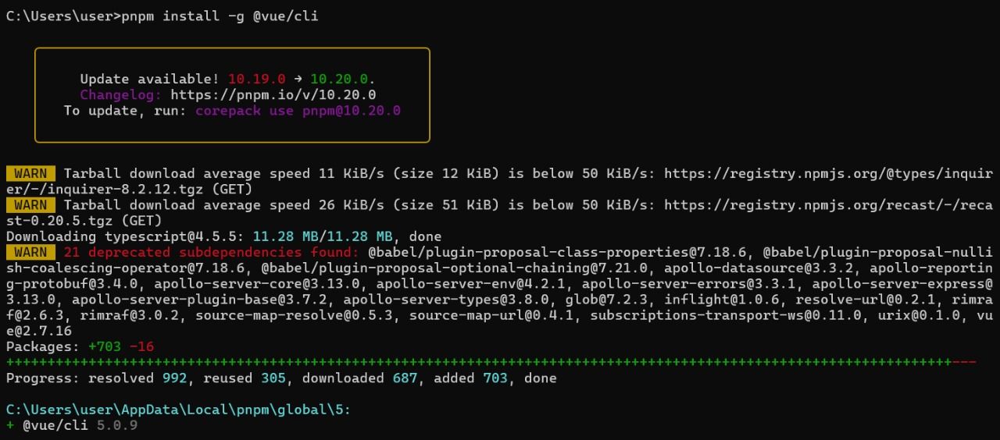
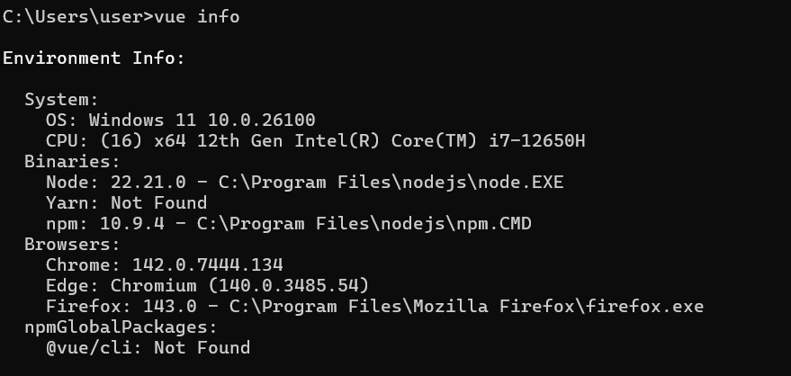
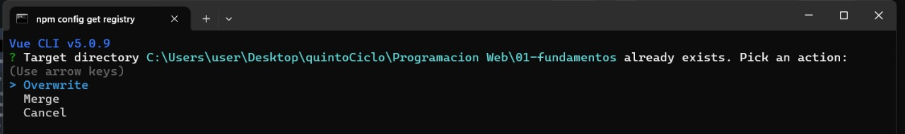
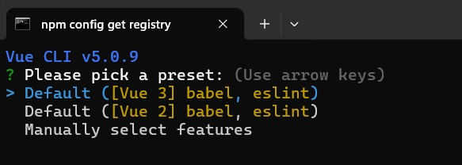
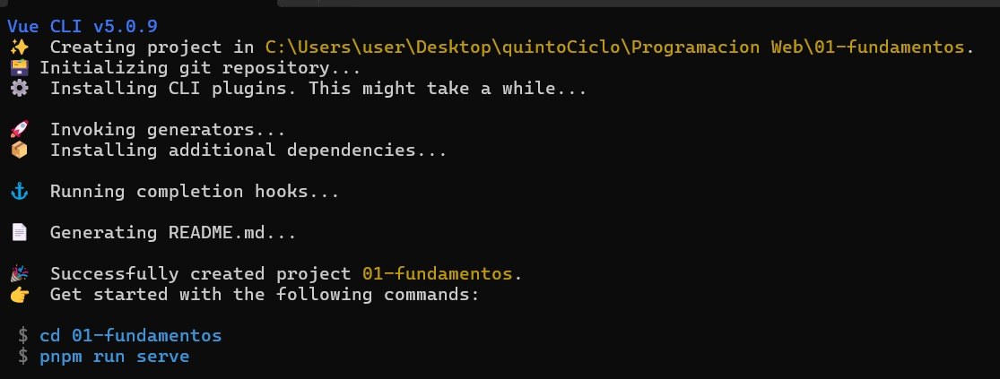
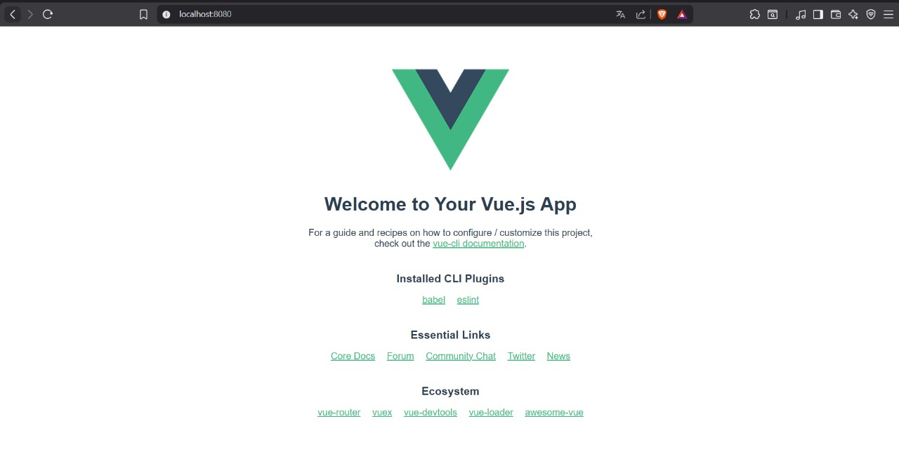
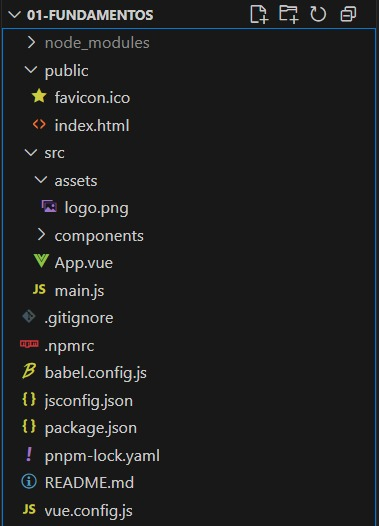

# Programación y Plataformas Web 

# Frameworks Web: Angular

<div align="center">
  

</div>


## Practica 1: Instalación y Configuración de Angular

### Autores

**Ariel Callle**  
📧 acalled1@est.ups.edu.ec
💻 GitHub: [ArielStevenCalleDumaguala](hhttps://github.com/ArielCalleSteven)


## Instalación de Vue

Primero instala el creador de proyectos de Vue (Vite + Vue) globalmente:

```bash
install -g @vue/cli
```

Crear un nuevo proyecto Vue:

```bash
vue create prueba
```

Ejecutar la aplicación en modo desarrollo:

```bash
npm run serve
```


Ejecutar la aplicación para que sea accesible desde otras máquinas en la red local:
```bash
npm run serve -- --host 0.0.0.0 --port 8080
```


---

## Extensiones recomendadas para VSCode (Angular)

Estas extensiones potencian el desarrollo con Angular:

* **[Vue](https://marketplace.visualstudio.com/items?itemName=Vue.volar)** – Extensión oficial de Vue 3. Ofrece autocompletado, IntelliSense, refactorización y diagnóstico para archivos .vue
* **[Vue VSCode Snippets](https://marketplace.visualstudio.com/items?itemName=sdras.vue-vscode-snippets)** – Fragmentos de código útiles para crear componentes, directivas y plantillas más rápido.
* **[Material Icon Theme](https://marketplace.visualstudio.com/items?itemName=PKief.material-icon-theme)** – Tema de íconos con soporte visual para archivos de Vue.
* **[Prettier - Code Formatter](https://marketplace.visualstudio.com/items?itemName=esbenp.prettier-vscode)** – Formato automático del código para mantener un estilo limpio y consistente.
* **[ESLint](https://marketplace.visualstudio.com/items?itemName=dbaeumer.vscode-eslint)** – Linter que garantiza buenas prácticas y detecta errores en tiempo real.

* **[Auto Close Tag](https://marketplace.visualstudio.com/items?itemName=formulahendry.auto-close-tag)** - Cierre automático de etiquetas HTML.

* **[Auto Rename Tag](https://marketplace.visualstudio.com/items?itemName=formulahendry.auto-rename-tag)** - Renombrado automático de etiquetas en pares.

* **[DotENV](https://marketplace.visualstudio.com/items?itemName=mikestead.dotenv)** - Soporte para archivos .env y variables de entorno en proyectos Vue.

* **[Tailwind CSS IntelliSense](https://marketplace.visualstudio.com/items?itemName=bradlc.vscode-tailwindcss)** - Autocompletado, vista previa y validación para clases de Tailwind CSS (perfecto si usas Tailwind con Vue).

* **[Path Intellisense](https://marketplace.visualstudio.com/items?itemName=christian-kohler.path-intellisense)** - Autocompleta rutas de archivos al importar componentes o imágenes.

* **[npm Intellisense](https://marketplace.visualstudio.com/items?itemName=christian-kohler.npm-intellisense)** - Autocompleta nombres de paquetes npm en los imports.


---

## Hoja de Atajos – VUE

###  Comandos básicos

Atajo corto: vue g c = vue generate component

```bash
vue help              # Muestra ayuda general
vue create app-name   # Crea un nuevo proyecto Vue
npm run serve         # Inicia el servidor de desarrollo
npm run build         # Compila el proyecto para producción
npm run lint          # Ejecuta el linter (verifica errores de estilo o sintaxis)

```

**Parámetros útiles:**

- `--default` → Crea el proyecto con la configuración por defecto (sin asistente interactivo).
- `--inlinePreset` → Usa un preset (configuración) directamente en línea.
- `--preset <nombre>` → Crea un proyecto con una configuración guardada previamente.
- `--packageManager <npm|yarn|pnpm>` → Especifica qué gestor de paquetes usar.


####  Estructura creada automáticamente (Vue CLI)

- `src/app` → Carpeta principal del código fuente del proyecto. 
    
    assets/ → Archivos estáticos como imágenes, íconos o estilos globales.

    components/ → Componentes Vue reutilizables.

    App.vue → Componente raíz del proyecto (estructura principal de la aplicación).

    main.js → Punto de entrada de la aplicación, donde se monta el componente App.vue en el DOM.

- `public/` → Archivos públicos que no pasan por el proceso de compilación (como index.html o favicon.ico).
- `node_modules/*` → Dependencias instaladas por npm o pnpm.
- `babel.config.js` → Configuración del compilador Babel (traduce JS moderno a compatible con navegadores).
- `jsconfig.json` → Configuración del entorno JavaScript (ayuda a VS Code con autocompletado y rutas).
- `package.json` → Archivo que contiene la información del proyecto y las dependencias instaladas.
- `pnpm-lock.yaml` → Archivo de bloqueo de dependencias (o package-lock.json si usas npm).
- `.gitignore` → Indica qué archivos deben ignorarse al usar Git.
- `vue.config.js` → Configuración personalizada para el proyecto Vue (opcional).

###  Generación de elementos

```bash
npm run make:component MiComponente    # Crear componente
vue generate view MiVista              # Crear vista
vue generate store MiStore             # Crear store
vue generate directive mi-directiva    # Crear directiva
vue generate plugin mi-plugin          # Crear plugin
```


### Entornos 
En Vue CLI, los entornos se manejan mediante archivos .env ubicados en la raíz del proyecto.
Estos archivos determinan configuraciones distintas para desarrollo, producción u otros entornos personalizados.

`.env` → Variables globales (para todos los entornos).

`.env.development` → Variables cuando ejecutas npm run serve.

`.env.production` → Variables cuando ejecutas npm run build.

Ejemplo de uso:

```bash
VUE_APP_API_URL=http://localhost:3000
```


### Ayuda y documentación

```bash
vue --help          # Muestra ayuda general de Vue CLI
vue create --help   # Muestra ayuda para crear proyectos
npm run --help      # Muestra scripts disponibles
```

---

## Resultados:

### 1. Instalación de VUE y creación del proyecto:



**Descripción de la imagen:**

En esta captura se muestra el proceso de instalación de VUE CLI versión 5.0.9 mediante el gestor de paquetes ppnpm (Node Package Manager). Los pasos realizados fueron:

- **Comando ejecutado:** `pnpm install -g @vue/cli@5.0.8`

  - El flag `-g` indica una instalación global, lo que permite usar el comando vue desde cualquier ubicación del sistema.
  - Se especifica la versión exacta `@5.0.9` para garantizar compatibilidad y reproducibilidad del entorno

- **Proceso de instalación:** Durante la instalación se descargan las dependencias necesarias y se configura el paquete Vue CLI dentro del sistema.

- **Verificación:** Una vez completada la instalación, se puede verificar ejecutando:
  ```bash
  vue --version
  ```
  Este comando muestra la versión instalada de Vue CLI y confirma que la instalación fue exitosa.


### 2. Revision de configuracion de angular: 



**Descripción de la imagen:**
En esta captura se muestra la salida del comando `vue info` , el cual proporciona información detallada sobre la configuración del entorno de desarrollo Vue.

```bash

Environment Info:

  System:
    OS: Windows 11 10.0.26100
    CPU: (16) x64 12th Gen Intel(R) Core(TM) i7-12650H
  Binaries:
    Node: 22.21.0 - C:\Program Files\nodejs\node.EXE
    Yarn: Not Found
    npm: 10.9.4 - C:\Program Files\nodejs\npm.CMD
  Browsers:
    Chrome: 142.0.7444.134
    Edge: Chromium (140.0.3485.54)
    Firefox: 143.0 - C:\Program Files\Mozilla Firefox\firefox.exe
  npmGlobalPackages:
    @vue/cli: Not Found

```

### 3. Creación del proyecto Angular:


Se crea un nuevo proyecto Vue llamado `01-fundamentos` utilizando el comando `vue create 01-fundamentos`. y lo levantamos con `pnpm run serve`

```bash
vue create 01-fundamentos
```

 Configuración inicial del proyecto:

* Durante la creación del proyecto con Vue CLI, se muestran una serie de opciones de configuración interactivas.
Se recomienda dejar todas las opciones por defecto (presionando Enter) o elegir según las necesidades del proyecto.







### 4. Proyecto corriendo en el navegador:



###  5. Explicación de la estructura del proyecto:




##### Carpetas y archivos principales:

- `node_modules`: Contiene todas las dependencias instaladas del proyecto Vue.
- `public`: Carpeta que almacena archivos estáticos visibles públicamente, como favicon.ico e index.html.
- `src`: Carpeta principal donde se encuentra el código fuente de la aplicación Vue.
- `.gitignore`: Define los archivos y carpetas que deben ignorarse en el control de versiones.
- `.npmrc`: Configuración específica para el gestor de paquetes PNPM/NPM.
- `babel.config.js`: Configuración de Babel para la compatibilidad del código JavaScript.
- `jsconfig.json` → Configuración del entorno JavaScript (ayuda a VS Code con autocompletado y rutas).
- `package.json` → Archivo que contiene la información del proyecto y las dependencias instaladas.
- `pnpm-lock.yaml` → Archivo de bloqueo de dependencias (o package-lock.json si usas npm).
- `vue.config.js` → Configuración personalizada para el proyecto Vue (opcional).

### Carpeta de código SRC

Dentro de la carpeta `src` se encuentran los archivos y subcarpetas principales que conforman la aplicación Vue:

- `assets`: Carpeta donde se almacenan recursos estáticos como imágenes, íconos o estilos globales.
- `components`: Carpeta que contiene los componentes reutilizables de la aplicación (por ejemplo, HelloWorld.vue).
- `App.vue`: Componente raíz de la aplicación; actúa como el contenedor principal del proyecto.
- `main.js`: Punto de entrada del proyecto Vue; se encarga de crear la instancia principal de Vue y montar la aplicación en el DOM.


