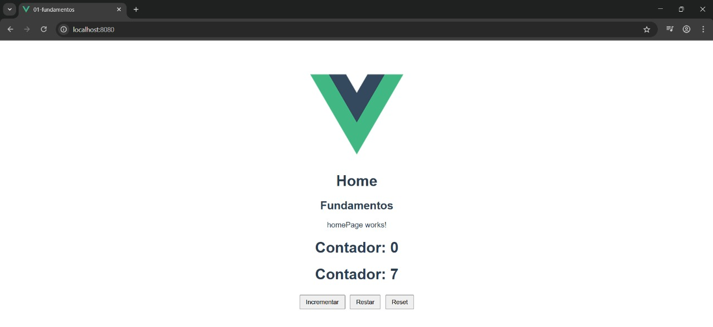
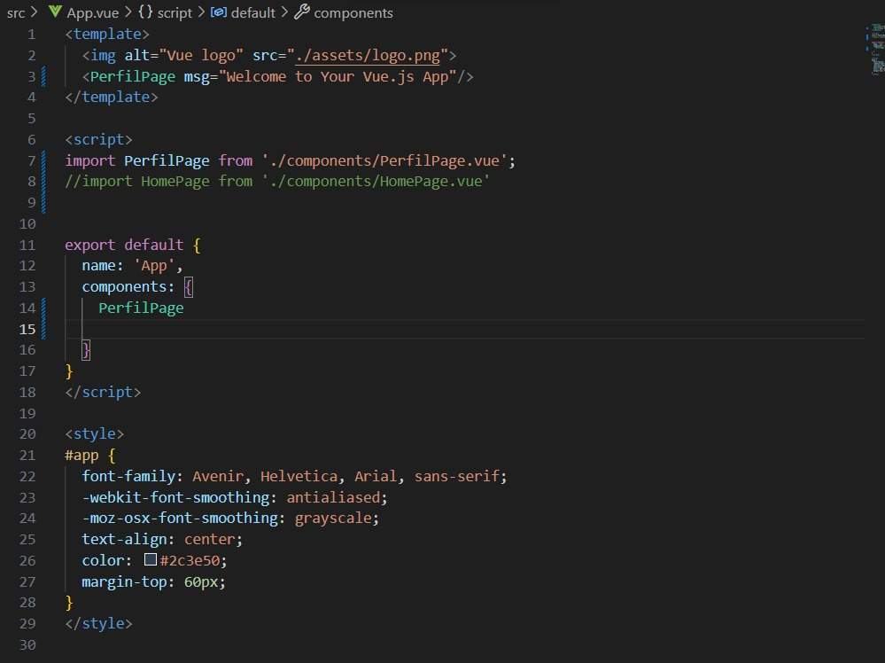
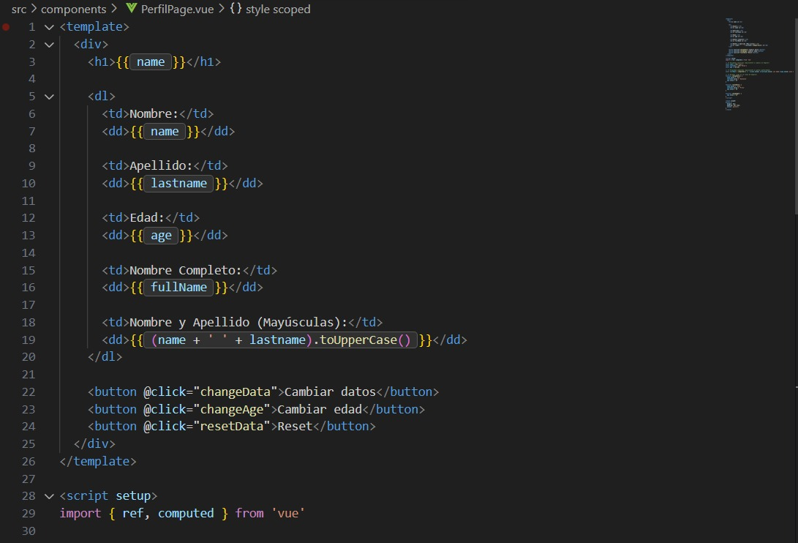
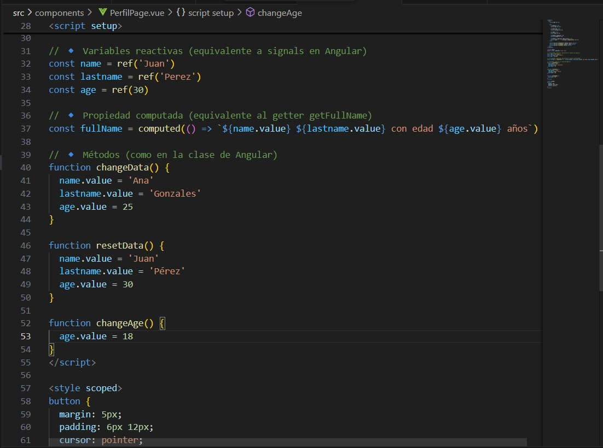
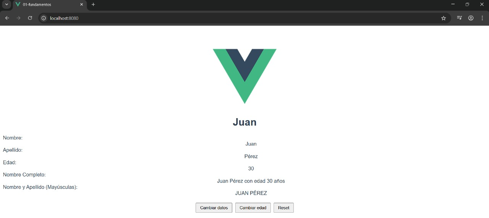

# Programación y Plataformas Web 

# Frameworks Web: Angular

  

## Practica 2: Fundamentos 

### Autores

**Ariel Calle**  
📧 acalled1@est.ups.edu.ec
💻 GitHub: [ArielStevenCalleDumaguala](hhttps://github.com/ArielCalleSteven)

## Fudamentos de VUE

## ¿Qué es VUE?

Vue.js es un framework progresivo de JavaScript que permite crear interfaces de usuario y aplicaciones web de manera sencilla y eficiente. Se basa en una arquitectura de componentes, donde cada parte de la interfaz se construye de forma modular y reutilizable. Vue destaca por su sistema reactivo, que actualiza automáticamente la vista cuando cambian los datos, y por su fácil integración con HTML, CSS y JavaScript. Es una herramienta ligera, flexible y fácil de aprender, ideal para desarrollar aplicaciones de una sola página (SPA) o mejorar proyectos web existentes.

## Características principales de VUE

1. **Framework progresivo** : Puede usarse desde pequeños componentes hasta aplicaciones completas.

2. **Arquitectura basada en componentes**: Permite dividir la interfaz en partes reutilizables y organizadas.

3. **Reactividad**: Actualiza automáticamente la vista cuando cambian los datos del modelo

4. **Componentes**: Estructura la aplicación en partes reutilizables, facilitando el mantenimiento.

5. **Data Binding (enlace de datos):**: Permite manipular el DOM con atributos como v-if, v-for o v-model.

6. **Facilidad de aprendizaje**: Su sintaxis es intuitiva y cercana a HTML, ideal para principiantes.

## Rutas

Angular utiliza un sistema de enrutamiento para gestionar la navegación entre diferentes vistas y componentes. Las rutas se definen en el módulo de enrutamiento de la aplicación y permiten cargar componentes específicos en función de la URL solicitada.

## Directivas

Las directivas en Vue.js son atributos especiales que se utilizan dentro del HTML para manipular el DOM de forma declarativa.Permiten aplicar comportamientos dinámicos, mostrar u ocultar elementos, repetir listas, enlazar datos y más

1. **Directivas estructurales** : Controlan la visualización o renderización de elementos en el DOM.

2. **Directivas de atributos** : Modifican el comportamiento o aspecto de un elemento existente.

3. **Directivas personalizadas** : Permiten crear tus propias directivas para reutilizar lógica o manipular el DOM directamente.

## Componentes de VUE

Los componentes son la base de toda aplicación en Vue.js. Cada componente encapsula su propia lógica, estructura y estilos, permitiendo construir interfaces modulares y reutilizables. Cada componente en Vue se compone de tres partes principales:

1. **Script**: Contiene la lógica del componente escrita en JavaScript (o TypeScript, si se configura). Aquí se definen los datos, métodos, propiedades y ciclos de vida del componente.

2. **Plantilla template**: Define la estructura HTML del componente, especificando cómo se mostrará la información en la interfaz de usuario.

3. **Estilos styles**: Define la apariencia visual del componente.Puede incluir estilos globales o locales (usando scoped), y soporta preprocesadores como CSS, SCSS o LESS.

## Resultados

### Creacion de un componente

Uso el comando `vue generate component` o, de forma manual, se crea un nuevo archivo .vue dentro de la carpeta correspondiente. En Vue 3, los componentes se componen en un solo archivo que contiene la plantilla, la lógica y los estilos.

Componente generado: HomePage, el cual se ubica en la ruta `src/home/pages/HomePage.vue`.

### Resolucion tarea

Seguir las instrucciones del siguiente GIST: [GIST](https://gist.github.com/PabloT18/f15f92224806731541d48027df336497)

1. Captura de `app.vue`

2. Captura de `perfilPage.vue`

3. Captura de la pagina desplegada

4. Enlace a la pagina de githubPages
5. Enlace la repositorio de github del proyecto.

