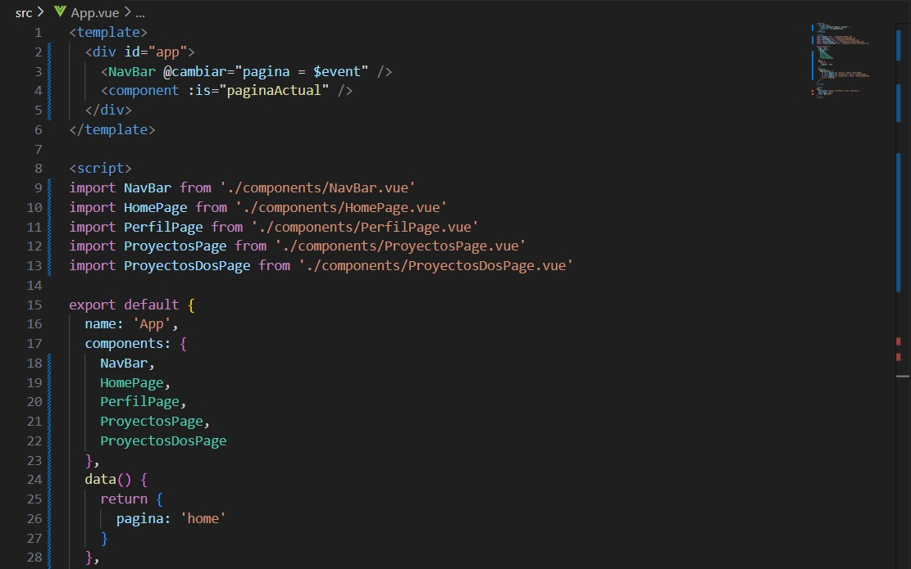
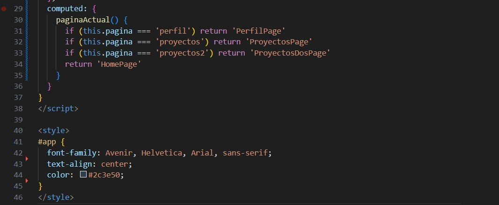
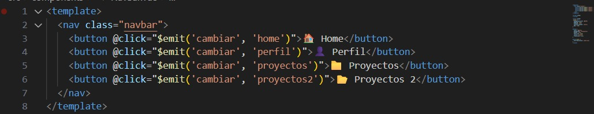
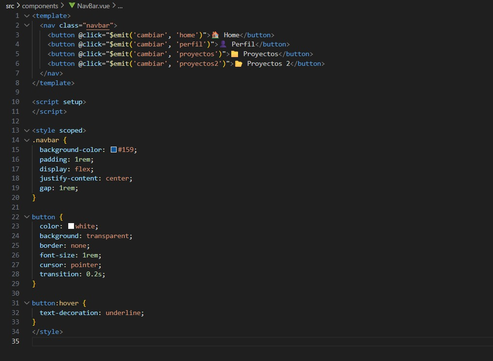

# Programación y Plataformas Web 

# Frameworks Web: Angular

<div align="center">
  
</div>

## Práctica 3: Navegación en Angular

### Autores

**Ariel Calle**  
📧 acalled1@est.ups.edu.ec
💻 GitHub: [ArielStevenCalleDumaguala](hhttps://github.com/ArielCalleSteven)

**Juan Diego Torres**  


---

## 🧭 Navegación en Angular

La navegación en Vue también se realiza dentro de una aplicación de una sola página (SPA), pero en lugar de usar etiquetas HTML tradicionales como `<a href="">`, se utiliza el componente especial `<RouterLink>` que proporciona Vue Router, el sistema de enrutamiento oficial de Vue. Esto permite cambiar de vista o componente sin recargar toda la página, manteniendo una experiencia fluida y rápida. Vue Router se encarga de renderizar dinámicamente los componentes asociados a cada ruta definida.

## 🔄 ¿Por qué NO usar `href` tradicional?

### ❌ Navegación Tradicional con `href`:
```html
<!-- Esto RECARGA toda la página -->
<a href="/perfil">Ir al Perfil</a>
<a href="/productos">Ver Productos</a>
```

**Problemas:**
- ✗ Recarga completa de la página
- ✗ Pérdida del estado de la aplicación
- ✗ Mayor tiempo de carga
- ✗ Experiencia de usuario interrumpida

### ✅ Navegación con `routerLink`:
```html
<!-- Esto SOLO cambia el contenido, sin recargar -->
<template>
  <nav>
    <RouterLink to="/">Inicio</RouterLink>
    <RouterLink to="/perfil">Perfil</RouterLink>
  </nav>

  <RouterView />
</template>
```

**Ventajas:**
- ✓ Navegación instantánea
- ✓ Preserva el estado de la aplicación
- ✓ Mejor experiencia de usuario
- ✓ Aplicación de una sola página (SPA)

## 📚 ¿Qué son las Directivas VUE?

Las directivas en Vue.js son atributos especiales que se añaden a los elementos HTML para modificar su comportamiento o el DOM de manera reactiva.
En Vue, todas las directivas comienzan con el prefijo v-.

### 1. **Directivas de Comportamiento**
```typescript
<!-- v-if / v-else: Control de flujo -->
<p v-if="usuario">Bienvenido {{ usuario }}</p>
<p v-else>Por favor, inicia sesión</p>

<!-- v-for: Renderizado de listas -->
<div v-for="(producto, index) in productos" :key="index">
  {{ producto.nombre }}
</div>

<!-- v-show: Muestra u oculta sin eliminar del DOM -->
<p v-show="visible">Este texto se puede ocultar</p>
```

### 2. **Directivas Personalizadas (Avanzado)
Vue también permite crear tus propias directivas personalizadas, para agregar comportamientos al DOM.

```html
// Ejemplo de directiva personalizada
app.directive('enfocar', {
  mounted(el) {
    el.focus()
  }
})
```

### 3. **Directivas de Atributo**
```html
<!-- v-bind: Enlaza dinámicamente un atributo -->


<!-- Forma corta con “:” -->


<!-- v-model: Enlace bidireccional con inputs -->
<input v-model="nombre" placeholder="Escribe tu nombre" />

<!-- v-on: Maneja eventos -->
<button v-on:click="saludar">Saludar</button>

<!-- Forma corta con “@” -->
<button @click="saludar">Saludar</button>
```

## 🔗 RouterLink: Tipos de Sintaxis

Angular ofrece dos formas principales de usar `routerLink`:

### 1. **Sintaxis de String Simple**
```html
<a routerLink="/">Home</a>
<a routerLink="/productos">Productos</a>
<a routerLink="/contacto">Contacto</a>
```

**Características:**
- ✓ Sintaxis más simple
- ✓ Ideal para rutas estáticas
- ✓ Fácil de leer y escribir

### 2. **Sintaxis de Array (Binding)**
```html
<a [routerLink]="['/perfil']">Perfil</a>
<a [routerLink]="['/usuario', usuarioId]">Ver Usuario</a>
<a [routerLink]="['/productos', 'categoria', categoriaId]">Categoría</a>
```

**Características:**
- ✓ Permite pasar parámetros dinámicos
- ✓ Más flexible para rutas complejas
- ✓ Ideal para rutas con variables

## 💡 Ejemplos Prácticos

### Ejemplo 1: Navegación Básica
```typescript
// app.component.ts
import { Component } from '@angular/core';
import { RouterModule } from '@angular/router';
import { CommonModule } from '@angular/common';

@Component({
  selector: 'app-root',
  standalone: true,
  imports: [RouterModule, CommonModule],
  template: `
    <nav>
      <h2>Mi Aplicación Angular</h2>
      <ul>
        <li><a routerLink="/">🏠 Inicio</a></li>
        <li><a routerLink="/productos">📦 Productos</a></li>
        <li><a routerLink="/contacto">📞 Contacto</a></li>
      </ul>
    </nav>
    
    <!-- Aquí se renderizan los componentes según la ruta -->
    <router-outlet></router-outlet>
  `,
  styles: [`
    nav {
      background: #f0f0f0;
      padding: 1rem;
      margin-bottom: 2rem;
    }
    
    ul {
      list-style: none;
      display: flex;
      gap: 1rem;
    }
    
    a {
      text-decoration: none;
      color: #007bff;
      padding: 0.5rem 1rem;
      border-radius: 4px;
    }
    
    a:hover {
      background: #e9ecef;
    }
  `]
})
export class AppComponent {
  title = 'navegacion-ejemplo';
}
```

### Ejemplo 2: Navegación con Parámetros
```typescript
// productos.component.ts
import { Component, signal } from '@angular/core';
import { RouterModule } from '@angular/router';
import { CommonModule } from '@angular/common';

@Component({
  selector: 'app-productos',
  standalone: true,
  imports: [RouterModule, CommonModule],
  template: `
    <h2>Lista de Productos</h2>
    
    @for (producto of productos(); track producto.id) {
      <div class="producto-card">
        <h3>{{ producto.nombre }}</h3>
        <p>{{ producto.descripcion }}</p>
        <p><strong>Precio: ${{ producto.precio }}</strong></p>
        
        <!-- Navegación con parámetros usando sintaxis de array -->
        <a [routerLink]="['/producto', producto.id]">
          👁️ Ver Detalles
        </a>
      </div>
    }
  `,
  styles: [`
    .producto-card {
      border: 1px solid #dee2e6;
      padding: 1rem;
      margin: 1rem 0;
      border-radius: 8px;
    }
    
    .producto-card a {
      background: #007bff;
      color: white;
      padding: 0.5rem 1rem;
      text-decoration: none;
      border-radius: 4px;
      display: inline-block;
      margin-top: 0.5rem;
    }
    
    .producto-card a:hover {
      background: #0056b3;
    }
  `]
})
export class ProductosComponent {
  productos = signal([
    { id: 1, nombre: 'Laptop', descripcion: 'Laptop Gaming', precio: 1200 },
    { id: 2, nombre: 'Mouse', descripcion: 'Mouse Inalámbrico', precio: 25 },
    { id: 3, nombre: 'Teclado', descripcion: 'Teclado Mecánico', precio: 80 }
  ]);
}
```

## 🎯 Diferencias Clave: String vs Array

| Aspecto | Sintaxis String | Sintaxis Array |
|---------|----------------|----------------|
| **Formato** | `routerLink="/ruta"` | `[routerLink]="['/ruta']"` |
| **Parámetros** | ❌ No soporta | ✅ `['/ruta', parametro]` |
| **Variables** | ❌ Solo texto fijo | ✅ Puede usar variables |
| **Complejidad** | Simple | Más flexible |

### Ejemplos Comparativos:

```html
<!-- ✅ String: Ideal para rutas fijas -->
<a routerLink="/">Inicio</a>
<a routerLink="/productos">Productos</a>
<a routerLink="/contacto">Contacto</a>

<!-- ✅ Array: Ideal para rutas dinámicas -->
<a [routerLink]="['/perfil']">Mi Perfil</a>
<a [routerLink]="['/usuario', usuario.id]">Ver Usuario: {{ usuario.nombre }}</a>
<a [routerLink]="['/producto', producto.id, 'reviews']">Reviews del Producto</a>

<!-- 🔍 Ejemplo con múltiples parámetros -->
<a [routerLink]="['/categoria', categoria.id, 'producto', producto.id]">
  Ver Producto en Categoría
</a>
```

## 🚀 RouterLink Activo

Para destacar el enlace activo, Angular proporciona `routerLinkActive`:

```html
<nav>
  <a routerLink="/" 
     routerLinkActive="active" 
     [routerLinkActiveOptions]="{exact: true}">
    Inicio
  </a>
  
  <a routerLink="/productos" 
     routerLinkActive="active">
    Productos
  </a>
  
  <a routerLink="/contacto" 
     routerLinkActive="active">
    Contacto
  </a>
</nav>

<style>
.active {
  background-color: #007bff;
  color: white;
  font-weight: bold;
}
</style>
```

## 📱 Navegación Programática

También podemos navegar desde el código TypeScript:

```typescript
import { Component, inject } from '@angular/core';
import { Router } from '@angular/router';

@Component({
  selector: 'app-ejemplo',
  template: `
    <button (click)="irAProductos()">Ver Productos</button>
    <button (click)="irAProducto(123)">Ver Producto 123</button>
  `
})
export class EjemploComponent {
  private router = inject(Router);
  
  irAProductos() {
    this.router.navigate(['/productos']);
  }
  
  irAProducto(id: number) {
    this.router.navigate(['/producto', id]);
  }
}
```


## 🎓 Resumen

1. **RouterLink** Es un componente especial de Vue Router que permite una navegación SPA (Single Page Application) sin recargar la página.

2. **No usar `href`** sino la propiedad to `(<RouterLink to="/inicio">)` , que evita la recarga completa del sitio.

3. **Sintaxis String**: Simple, para rutas fijas (`<RouterLink to="/perfil">Perfil</RouterLink>`)

4. **Sintaxis Array**: Flexible, para rutas con parámetros (`[routerLink]="['/perfil']"`)

5. **RouterLinkActive**: Vue agrega automáticamente la clase `router-link-active` al enlace actual.

6. **Navegación programática**: Se realiza con el router desde JavaScript.

La navegación en Vue es simple, fluida y totalmente reactiva, ofreciendo una experiencia de usuario moderna y sin recargas innecesarias.

## �️ Implementación Práctica

Sigue estos pasos para implementar la navegación en tu proyecto VUE:

### Paso 1: Crear las Páginas Principales

#### 1.1 Crear ProyectosPage

#### 1.2 Crear ProyectosDosPage


### Paso 2: Configurar las Rutas


### Paso 3: Agregar al Navbar

### Paso 4: Crear Componentes para Proyectos y separarlos en componentes indivuduals

#### 4.1 Crear Componente para Agregar Proyectos

#### 4.2 Crear Componente para Lista de Proyectos


### Paso 5: Implementar la Página de Proyectos

### Paso 6: Implementar la Página ProyectosDos


## �📸 Capturas de Implementación

### 1. Configuración de Rutas (app.routes.ts)
En este proyecto desarrollado con Vue.js no se utiliza Vue Router, por lo que no existe un archivo equivalente a app.routes.ts de Angular.
Las páginas (ProyectosPage.vue y ProyectosDosPage.vue) se importan y utilizan directamente en el componente principal (App.vue).


 



Este archivo es el punto de inicio de la aplicación. Aquí se cargan los componentes principales, incluyendo la barra de navegación (NavBar) y la página principal (ProyectosPage). En este caso, no se utilizan rutas, por lo que el componente App.vue controla directamente qué contenido se muestra en pantalla.


### 2. Navegación con RouterLink
En Angular se usa la directiva routerLink para navegar entre componentes.
En Vue.js se utiliza el componente `<RouterLink>`, o bien, se puede manejar la navegación manualmente mediante eventos con @click.
En este proyecto se aplicó la segunda opción.

 

### 3. Componente con Navegación
*[Insertar código del código TypeScript del componente con navegación]*

 

### 4. Aplicación Funcionando
En la siguiente figura se observa la aplicación en ejecución, mostrando la navegación entre las distintas vistas mediante el menú principal.


## 🔗 Enlaces del Proyecto

- **Repositorio GitHub**: [Enlace al repositorio]
- **GitHub Pages**: [Enlace a la aplicación desplegada]


## 📝 Notas de Implementación

- Usé Angular 20+ con sintaxis moderna
- Implementé tanto navegación estática como dinámica
- Agregué estilos para mejorar la experiencia de usuario
- Utilicé signals para el manejo de estado moderno
- Apliqué las mejores prácticas de navegación SPA 

