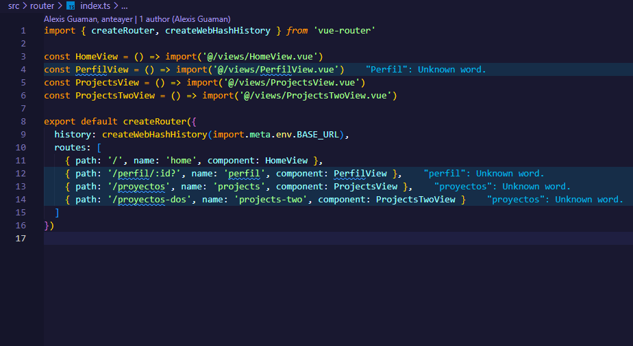
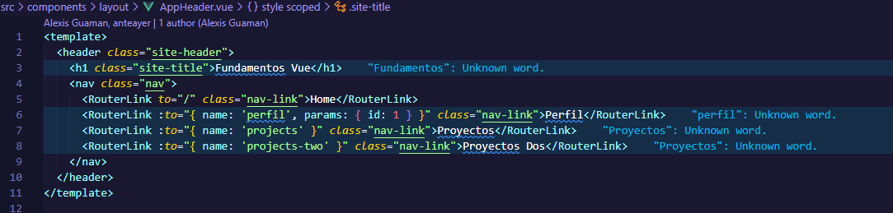
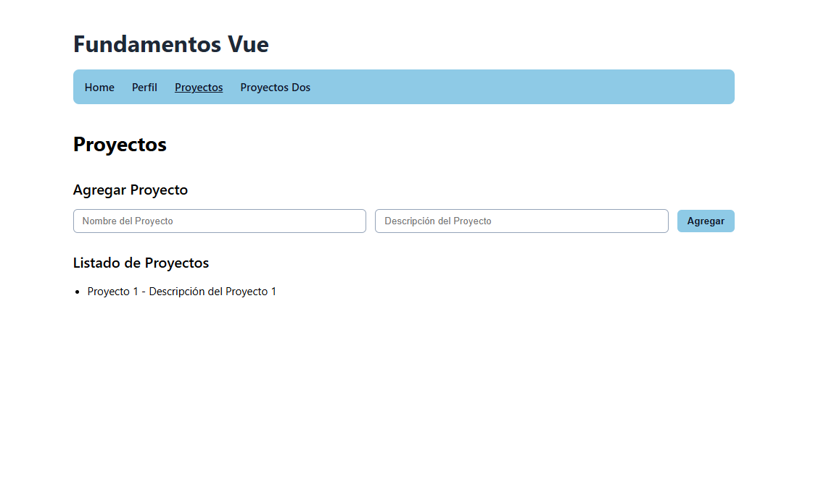

# Programación y Plataformas Web

# Frameworks Web: Vue 3
 <div align="center"> </div>

## Práctica 2: Navegación en Vue

### Autores
**Alex Guaman**  
**Daniel Guanga**

---

## 🧭 Navegación en Vue

La navegación en Vue es diferente a la navegación HTML tradicional. En lugar de `<a href="">`, se usa el componente `<RouterLink>` para construir **Single Page Applications (SPA)** sin recargar la página completa.

## 🔄 ¿Por qué NO usar `href` tradicional?

### ❌ Navegación tradicional con `href`:

```html
<!-- Esto RECARGA toda la página -->
<a href="/perfil">Ir al Perfil</a>
<a href="/proyectos">Ver Proyectos</a>
```

**Problemas:**

* ✗ Recarga completa de la página
* ✗ Pérdida del estado del componente
* ✗ Mayor tiempo de carga
* ✗ Experiencia de usuario interrumpida

### ✅ Navegación con `<RouterLink>`:

```vue
<!-- Esto SOLO cambia la vista activa, sin recargar -->
<RouterLink to="/perfil">Ir al Perfil</RouterLink>
<RouterLink to="/proyectos">Ver Proyectos</RouterLink>
```

**Ventajas:**

* ✓ Navegación instantánea
* ✓ Preserva el estado local y global
* ✓ Mejor experiencia de usuario
* ✓ Propia de una SPA

## 📚 ¿Qué son las Directivas en Vue?

Las **directivas** son atributos especiales que extienden el HTML (ej. `v-if`, `v-for`, `v-bind`). `<RouterLink>` es un **componente** que se usa de forma declarativa y cumple el rol de navegación.

### Directivas relevantes dentro del proyecto

```vue
<!-- src/components/layout/AppHeader.vue -->
<nav class="nav">
  <RouterLink to="/" class="nav-link">Home</RouterLink>
  <RouterLink :to="{ name: 'perfil', params: { id: 1 } }" class="nav-link">Perfil</RouterLink>
  <RouterLink :to="{ name: 'projects' }" class="nav-link">Proyectos</RouterLink>
  <RouterLink :to="{ name: 'projects-two' }" class="nav-link">Proyectos Dos</RouterLink>
</nav>
```

* `:to` usa **enlace reactivo** para pasar objetos con nombre de ruta y parámetros.
* Vue aplica las clases `router-link-active` y `router-link-exact-active` para marcar enlaces activos.

## 🔎 Navegación en el proyecto (estado actual)

El código actual usa navegación **declarativa** mediante `<RouterLink>` en el encabezado (`src/components/layout/AppHeader.vue`).  
No hay llamadas al `router` desde métodos ni uso de `useRouter()` para redirecciones programáticas.  
Una búsqueda en `src/` no muestra referencias a `useRouter` ni `router.push`; las únicas apariciones están en este README como ejemplos.

**Conclusión:** hoy toda la navegación se gestiona de forma declarativa con `<RouterLink>`.

## 🔗 `<RouterLink>`: Tipos de sintaxis

Vue Router ofrece dos formas principales de definir destinos.

### 1. **Sintaxis de string simple**

```vue
<RouterLink to="/">Home</RouterLink>
<RouterLink to="/proyectos">Proyectos</RouterLink>
<RouterLink to="/contacto">Contacto</RouterLink>
```

**Características:**

* ✓ Sintaxis más simple
* ✓ Ideal para rutas estáticas

### 2. **Sintaxis de objeto (binding)**

```vue
<RouterLink :to="{ name: 'perfil' }">Mi Perfil</RouterLink>
<RouterLink :to="{ name: 'perfil', params: { id: 5 } }">Ver Perfil 5</RouterLink>
<RouterLink :to="{ name: 'projects-two', query: { filter: 'recent' } }">Proyectos Recientes</RouterLink>
```

**Características:**

* ✓ Permite `params` y `query` dinámicos
* ✓ Basada en nombres de ruta
* ✓ Ideal para rutas reutilizables

## 💡 Ejemplos Prácticos

### Ejemplo 1: Navegación básica

```vue
<!-- src/App.vue -->
<template>
  <nav class="nav">
    <h2>Mi Aplicación Vue</h2>
    <ul>
      <li><RouterLink to="/">🏠 Inicio</RouterLink></li>
      <li><RouterLink to="/proyectos">📦 Proyectos</RouterLink></li>
      <li><RouterLink to="/contacto">📞 Contacto</RouterLink></li>
    </ul>
  </nav>

  <!-- Aquí se renderiza la vista según la ruta -->
  <RouterView />
</template>

<script setup lang="ts">
// No se requiere lógica aquí para la navegación básica
</script>

<style scoped>
.nav { background: #f0f0f0; padding: 1rem; margin-bottom: 2rem; }
ul { list-style: none; display: flex; gap: 1rem; }
a, .router-link-active { text-decoration: none; }
.router-link-active { font-weight: 600; }
.router-link-exact-active { border-bottom: 2px solid currentColor; }
</style>
```

### Ejemplo 2: Navegación con parámetros

```vue
<!-- src/views/ProjectsView.vue -->
<template>
  <h2>Lista de Proyectos</h2>
  <div v-for="p in proyectos" :key="p.id" class="project-card">
    <h3>{{ p.nombre }}</h3>
    <p>{{ p.descripcion }}</p>
    <p><strong>Prioridad: {{ p.prioridad }}</strong></p>

    <!-- Navegación con parámetros usando objeto -->
    <RouterLink :to="{ name: 'project-detail', params: { id: p.id } }">
      👁️ Ver Detalles
    </RouterLink>
  </div>
</template>

<script setup lang="ts">
const proyectos = [
  { id: 1, nombre: 'Sitio Web', descripcion: 'Landing corporativa', prioridad: 'Alta' },
  { id: 2, nombre: 'App Móvil', descripcion: 'MVP Ionic/Vue', prioridad: 'Media' },
  { id: 3, nombre: 'API', descripcion: 'Servicios REST', prioridad: 'Baja' }
]
</script>

<style scoped>
.project-card { border: 1px solid #dee2e6; padding: 1rem; margin: 1rem 0; border-radius: 8px; }
.project-card a { background: #42b883; color: #fff; padding: .5rem 1rem; text-decoration: none; border-radius: 4px; display: inline-block; margin-top: .5rem; }
.project-card a:hover { opacity: .85; }
</style>
```

> Ruta de detalle ejemplo: `{ path: '/proyecto/:id', name: 'project-detail', component: ProjectDetailView }`

## 🎯 Diferencias clave: String vs Objeto

| Aspecto     | Sintaxis String | Sintaxis Objeto                          |
| ----------- | --------------- | ---------------------------------------- |
| Formato     | `to="/ruta"`    | `:to="{ name: 'ruta' }"`                 |
| Parámetros  | No soporta      | `:to="{ name: 'ruta', params: { id } }"` |
| Variables   | Solo texto fijo | Permite variables y `query`              |
| Complejidad | Simple          | Más flexible                             |

Ejemplos comparativos:

```vue
<!-- ✅ Rutas fijas -->
<RouterLink to="/">Inicio</RouterLink>
<RouterLink to="/proyectos">Proyectos</RouterLink>
<RouterLink to="/contacto">Contacto</RouterLink>

<!-- ✅ Rutas dinámicas -->
<RouterLink :to="{ name: 'perfil' }">Mi Perfil</RouterLink>
<RouterLink :to="{ name: 'perfil', params: { id: usuario.id } }">Usuario: {{ usuario.nombre }}</RouterLink>
<RouterLink :to="{ name: 'project-detail', params: { id: p.id }, query: { tab: 'reviews' } }">Reviews</RouterLink>

<!-- 🔍 Varios parámetros -->
<RouterLink :to="{ name: 'category-project', params: { categoriaId: c.id, proyectoId: p.id } }">
  Ver en Categoría
</RouterLink>
```

## 🚀 Enlace activo en Vue

Para destacar la ruta activa, Vue Router expone clases y props en `<RouterLink>`.

```vue
<RouterLink to="/" active-class="is-active" exact-active-class="is-exact">Inicio</RouterLink>
```

CSS sugerido:

```css
.is-active { font-weight: bold; }
.is-exact { border-bottom: 2px solid currentColor; }
```

> Si no pasas props, se aplican por defecto `router-link-active` y `router-link-exact-active`.

## 📱 Navegación programática

```ts
// En un componente con <script setup>
import { useRouter } from 'vue-router'

const router = useRouter()

function irAProyectos() {
  router.push('/proyectos')
}

function irAProyecto(id: number) {
  router.push({ name: 'project-detail', params: { id } })
}
```

---

## 💡 ¿Cómo configuramos el router?

```ts
// src/router/index.ts
import { createRouter, createWebHashHistory } from 'vue-router'

const HomeView = () => import('@/views/HomeView.vue')
const ProjectsView = () => import('@/views/ProjectsView.vue')
const ProjectDetailView = () => import('@/views/ProjectDetailView.vue')
const ProjectsTwoView = () => import('@/views/ProjectsTwoView.vue')

export default createRouter({
  history: createWebHashHistory(import.meta.env.BASE_URL),
  routes: [
    { path: '/', name: 'home', component: HomeView },
    { path: '/proyectos', name: 'projects', component: ProjectsView },
    { path: '/proyecto/:id', name: 'project-detail', component: ProjectDetailView },
    { path: '/proyectos-dos', name: 'projects-two', component: ProjectsTwoView }
  ]
})
```

---

## 🛠️ Implementación Práctica

Sigue estos pasos para implementar la navegación en tu proyecto Vue:

### Paso 1: Crear las Vistas Principales

* `ProjectsView.vue`
* `ProjectsTwoView.vue`

### Paso 2: Configurar las Rutas

* Define `home`, `projects`, `project-detail/:id`, `projects-two`.

### Paso 3: Agregar al Navbar

* Usa `<RouterLink>` y personaliza `active-class` si lo necesitas.

### Paso 4: Componentizar Proyectos

* Separar en componentes: **AddProjectForm.vue** y **ProjectList.vue**.

### Paso 5: Implementar la Página de Proyectos

* Lista, detalle y navegación con `params` y `query`.

### Paso 6: Implementar la Página ProyectosDos

* Variaciones de filtros o layout.

---

## 📸 Capturas de Implementación

### 1. Configuración de Rutas (`src/router/index.ts`)


### 2. Navegación con `<RouterLink>`


### 3. Componente con Navegación Programática

```typescript
<script setup lang="ts">
import { useProjectStore } from '@/stores/project.store'
import { useRouter } from 'vue-router'

const { projects, form, addProject } = useProjectStore()
const router = useRouter()

function goToProject(i: number) {
  router.push({ name: 'project-detail', params: { id: i } })
}

function goToProjectsTwo() {
  router.push({ name: 'projects-two' })
}
</script>
```

### 4. Aplicación Funcionando



---

## 🔗 Enlaces del Proyecto

* **Repositorio GitHub**: <https://github.com/kennypallchizaca-coder/icc-ppw-u2-01_fundamentos-vue>
* **GitHub Pages / Deploy**: <https://kennypallchizaca-coder.github.io/icc-ppw-u2-01_fundamentos-vue/#/>

---

## 📝 Notas de Implementación

* Vue 3 + Vue Router 4 con `script setup`.
* Navegación estática y dinámica con `params` y `query`.
* Imports dinámicos para *code-splitting*.
* Estilos mínimos y clases activas personalizables.
* Buenas prácticas SPA: rutas con nombre, parámetros tipados y `RouterLink` declarativo.

---

## 🎓 Resumen

1. `<RouterLink>` habilita navegación SPA sin recargas.  
2. Evita `href` para no perder estado.  
3. String para rutas fijas, objeto para rutas con parámetros.  
4. Clases activas: `active-class` y `exact-active-class` o las clases por defecto.  
5. Navegación programática con `useRouter().push()`.
